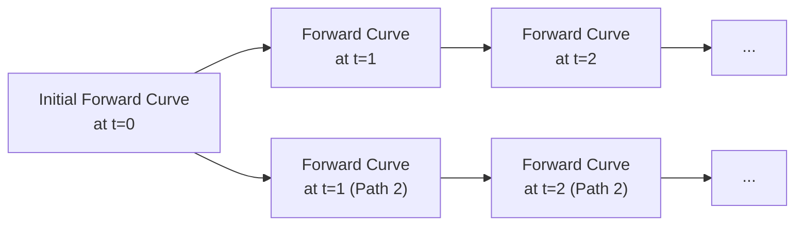
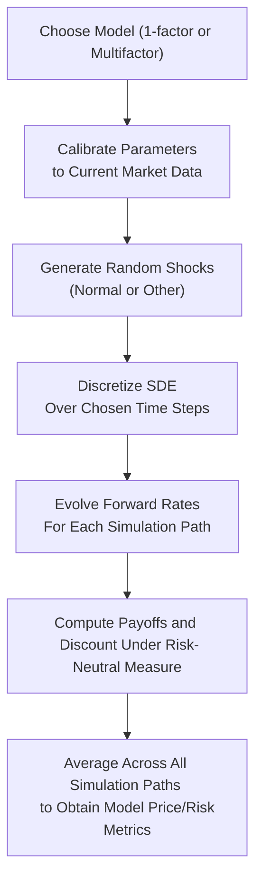

**Introduction and Motivation**

I remember my first deep dive into forward-rate simulations: It felt like stepping into a carnival house of mirrors—different yield curves, random shocks, mean reversion assumptions. And I thought, “Wow, do I really have to juggle all these factors at once?” But, as you dig in, there’s actually a systematic and fascinating approach that helps you navigate the entire forward-rate curve’s evolution over time, especially under the risk-neutral measure. This approach is immensely useful for pricing complex bonds, mortgage-backed securities, and interest rate derivatives.

At Level II, we build on basic Monte Carlo concepts from Level I but make them more robust. We’re now focusing more intently on the term structure of interest rates—specifically how forward rates can evolve in a multi-period setting. The big question is: Why bother with forward-rate simulations when we can value many fixed income instruments with simpler tree models or closed-form solutions? Well, the short answer is that not everything has a neat closed-form solution. Often, we want to incorporate flexible assumptions about interest rate volatility, jumps, or correlations across maturities. That’s where forward-rate simulation truly shines.

Below, we’ll explore key frameworks (like the Heath-Jarrow-Morton approach), practical steps for calibrating and simulating forward rates, how to incorporate complexities such as path dependency or time-varying volatilities, and the typical pitfalls you might encounter. Let’s roll up our sleeves.

  
**Foundations of Forward-Rate Simulation**

Forward-rate simulation, at its core, aims to evolve the zero-coupon yield curve forward in time and track how each forward rate for a given maturity changes. A forward rate is the interest rate implied for a future period starting at time \\( t_1 \\) and ending at time \\( t_2 \\). In the Heath-Jarrow-Morton (HJM) framework, each forward rate (for discrete maturities) is treated like a state variable that can wander around randomly according to a specified stochastic differential equation (SDE).

  
**Heath-Jarrow-Morton (HJM) in a Nutshell**

The HJM framework is considered a “forward measure” approach. Rather than modeling the short rate directly (like the Vasicek or Cox-Ingersoll-Ross models), it models the entire forward curve:


df(t,T) = \alpha(t,T) \, dt + \sigma(t,T) \, dW(t),


where \\( f(t,T) \\) is the instantaneous forward rate at time \\( t \\) for maturity \\( T \\). Then \\( \alpha(t,T) \\) is the drift term, and \\( \sigma(t,T) \\) is the volatility. The random increments come from \\( dW(t) \\), typically a Wiener process (or multiple Wiener processes, if you have multiple factors).

The advantage? It can potentially capture the richness of how each segment of the curve moves. You can calibrate the volatility structure \\(\sigma(t,T)\\) to reflect higher vol for short-end rates (for instance) and lower vol for long-end rates, or even let vol vary with time.

But the HJM framework can get complicated—especially if you have a large number of maturities, each with its own random flow. This complexity is why real-world practitioners (and exam takers) pay close attention to dimension reduction techniques (like using principal components) and simpler, factor-based versions of the HJM approach.

  
**Key Steps in Modeling and Simulation**

1. **Select a Model and Determine Parameters**  
   Maybe you want a one-factor model where all forward rates load onto a single volatility structure. Or you might go for a full-blown multi-factor approach. The parameters you consider typically include:
   - **Mean reversion speed**: how fast the process pulls rates back toward a long-term level.  
   - **Volatility**: could be constant or time-varying.  
   - **Correlation across maturities**: essential if you have multiple forward rates.  
   - **Initial forward-curve input**: from the current market yield curve.  

2. **Calibrate to Market Data**  
   Calibration is that dreaded but crucial step. We want the model to match current pricing of instruments that trade liquidly in the market. If the model can’t replicate the observed yield curve or known volatility structures (like implied volatilities from swaptions), it might not produce reliable results. This step often involves numerical optimization.

3. **Generate Random Draws**  
   We decide our time grid (e.g., monthly, quarterly) and generate random shocks, typically from a standard normal distribution if the model is Gaussian. But no one says it has to be normal. Sometimes, models incorporate fat-tailed distributions or jump processes to reflect real-world phenomena like sudden rate spikes.

4. **Evolve the Curve**  
   Using a discretization scheme (e.g., Euler-Maruyama or Milstein), we step the forward curve forward in time. For each time step:
   
   f(t + \Delta t, T) = f(t, T) + \alpha(t, T)\,\Delta t + \sigma(t, T)\,\Delta W(t),
   
   with \\(\Delta W(t) \sim \mathcal{N}(0, \Delta t)\\) in a simple case. Repeating this over thousands of simulated paths yields distributions of future interest rates.

5. **Price Instruments**  
   Under the (risk-neutral) measure, the expected discounted payoff of a bond or derivative is the fair price. We compute:
   
   \text{Price at } t=0 = \mathbb{E}^{\mathbb{Q}}\left[\mathrm{e}^{-\int_{0}^{T} r_s \, ds} \cdot \text{Payoff}\right],
   
   where \\( r_s \\) is the relevant short rate or discount rate, and \\(\mathbb{Q}\\) denotes the risk-neutral measure. The integral of \\( r_s \\) from \\(0\\) to \\(T\\) might be approximated by forward rates from our simulation.

  
**A Quick Look at a Mermaid Diagram**

Below is a conceptual depiction of how forward rates can evolve. Each node represents a snapshot of the forward curve at a particular time, driven by random shocks:

Over many simulations, you will end up with a broad panel of forward rate paths. Each path can be used to discount cash flows for a given bond or derivative. Then, you take an average across all paths to get the risk-neutral fair value.

  
**Discretization Schemes**

I used to think, “Aren’t we basically just taking a derivative formula and applying it in small steps?” And yes—that’s essentially it. But the choice of discretization matters. The simple **Euler-Maruyama** method is commonly used because it’s straightforward:


r_{t+\Delta t} = r_{t} + \alpha(r_t, t)\,\Delta t + \sigma(r_t, t)\sqrt{\Delta t} \, Z_t,


where \\(Z_t\\) is a draw from a standard normal distribution. For more accuracy, you might consider:
- **Milstein Scheme**: Reduces discretization bias (useful if volatility depends on the state).
- **Higher-order Schemes**: Overkill for many practical finance applications, but they can be helpful if your exam question specifically references them.

  
**Incorporating Mean Reversion**

A big difference between equity price modeling and interest rate modeling is that interest rates tend to revert to some long-run mean. A typical specification for short-rate models might be (for the short rate \\( r_t \\)):


dr_t = \kappa(\theta - r_t) \, dt + \sigma \sqrt{r_t} \, dW_t,


where:  
- \\(\kappa\\) is the speed of reversion.  
- \\(\theta\\) is the long-term mean.  
- \\(\sigma\\) is volatility.  
- \\( \sqrt{r_t} \\) ensures positivity if you’re in a Cox-Ingersoll-Ross style model.

For forward-rate models, you can embed mean reversion into \\(\alpha(t,T)\\) in the HJM equation.

  
**Correlations Across Maturities**

When you’re modeling dozens of forward rates, you’ll have a big correlation matrix. Typically, we might dimension-reduce by focusing on the top few principal components of yield curve movements (like parallel shift, slope shift, curvature shift). Let’s face it: If we tried to model every maturity from overnight to 30-year separately, we’d be drowning in random draws. So, exam questions might specifically mention factor-based approaches that are “factorizing” the volatility structure \\(\sigma(t,T)\\) in terms of a small number of factors.

  
**Practical Example**

Suppose we have a simplified 2-factor HJM. We calibrate it to:  
- Factor 1: a parallel shift factor (handles overall level changes).  
- Factor 2: a slope factor (allowing short and long maturities to diverge).  

We gather current yield curve data for maturities 1 year, 2 years, 5 years, 10 years, and 30 years. Then we collect implied vol data from the swaption market to get a sense of how the market prices interest rate volatility. The calibration process might involve a numeric “least squares” approach to minimize the difference between theoretical swaption prices (implied by the model) and actual market swaption prices.

After calibrating, we pick a monthly time step. For each month, we simulate the random draws and update each forward rate from \\( f(t, T) \\) to \\( f(t+\Delta t, T) \\). Over, say, 10 or 20 years, we get thousands of potential yield curve evolutions. We can then price a 10-year callable bond by seeing whether it gets called under each path, discounting the bond’s cash flows, and averaging the discounted payoffs.

  
**Path Dependency**

Some instruments, like mortgage-backed securities, have payoffs that depend on the path the interest rates took to get to the present, not just the final rate. (Prepayment rates, for instance, depend on how interest rates have evolved over time, and not simply on the spot rate at a single point.) Binomial trees (Chapter 8) can handle path dependencies to a degree, but can get quite large. Monte Carlo simulation is more flexible at capturing complex path effects. Each path is a unique evolution with its own intermediate rates. That’s a key reason we do forward-rate simulation in the first place.

  
**Types of Random Distributions**

While standard practice is to draw from a normal distribution (especially under the risk-neutral measure assumptions in Gaussian-based models), real-world yield movements can exhibit skew and kurtosis. If your exam question references advanced or “jump-diffusion” models, you need to incorporate the possibility of leaps in rates—maybe central bank announcements or credit events can cause abrupt movements. The steps remain conceptually the same; you just switch out the simple normal shock term \\(\sigma \sqrt{\Delta t}\, Z_t\\) for a process with jumps or heavier tails.

  
**Model Calibration Considerations**

Calibration is often more “art” than “science.” A robust approach might sequentially calibrate the volatility structure \\(\sigma(t,T)\\) to the implied vol surface from interest rate options. Then you calibrate drift features \\(\alpha(t,T)\\) so that your initial forward curve is an arbitrage-free representation that exactly matches the current market yield curve. If these calibrations mismatch, you’ll get “fantasy” forward rates that definitely won’t help with real pricing.

Some exam pitfalls:
- **Forgetting the drift adjustment for risk-neutral valuation.** If you’re used to real-world forecasting, you can’t simply toss that drift into a risk-neutral setting.  
- **Ignoring correlation** or incorrectly applying correlation data from an outdated period.  
- **Overfitting**: If you have too many parameters, you run the risk of precisely matching historical data or option prices but not generalizing well going forward.

  
**Implementation Tips and Common Pitfalls**

1. **Time Step Size**: Using a big time step saves computational effort, but it might cause discretization errors.  
2. **Number of Simulations**: If you do only 100 or 200 simulations, your results might be noisy. Thousands of paths are usually recommended, though your computational resources (like time constraints in an exam setting) factor in.  
3. **Volatility Smiles and Skews**: The real market often exhibits skew (different implied volatilities depending on moneyness). A simpler normal assumption might not capture that bit.  
4. **Speed**: Full-blown high-fidelity HJM can be slow. Sometimes, we pivot to a simpler 1-factor or 2-factor short-rate model for exam or practice contexts.  
5. **Risk Measures**: Once we have these simulations, we can also compute distribution-based risk measures (like VaR or expected shortfall) for a portfolio of fixed income instruments spanning multiple maturities.  

  
**Example Diagram: Process Flow**

  
**Real-World vs. Risk-Neutral**

It’s always worth repeating: for pricing, we shift to a risk-neutral measure, making the drift of the interest rate process effectively “the short rate” or “the forward rate” that aligns with a no-arbitrage condition. For forecasting or scenario analysis, we might keep real-world drift assumptions. In practice, you might run both calibrations: one set for risk-neutral pricing, another set for what you personally believe rates will do (the real-world measure a.k.a. “P-measure”).

  
**Conclusion and Next Steps**

Forward-rate simulation is a Swiss army knife for fixed-income modeling. It’s flexible, can handle path-dependent payoffs, and can incorporate practically any fancy volatility or correlation structure you can imagine. On the flip side, that flexibility often makes it more complex to implement and calibrate. If you’re new to this, it’s easy to get lost in the swirl of calibrations and correlated random draws.

My advice? Start small. Try a basic 1-factor model. Get comfortable with the numerical steps and parameter calibration. Then expand to multi-factor frameworks if you need them (and your exam or job requires it). Also, tip from personal experience: double-check your discounting logic. People sometimes forget that you need to discount each cash flow on each path to produce an accurate risk-neutral expectation. If that discount factor is even a bit off, your final valuations can be drastically incorrect.

As you progress to more advanced chapters (like mortgage-backed securities or embedded options valuations), you’ll see forward-rate simulation pop up repeatedly because it’s the robust approach to handle real-world complexities. Keep practicing, keep calibrating, and watch out for time constraints in exam scenarios.

  
**References and Further Reading**

- Fabozzi, F. J. (ed.). “Fixed Income Mathematics.”  
  Link: [Wiley](https://www.wiley.com)  
- Tuckman, B., & Serrat, A. “Fixed Income Securities: Tools for Today’s Markets.”  
  Link: [Wiley](https://www.wiley.com)  
- Hull, J. “Options, Futures and Other Derivatives.” (Excellent coverage of Monte Carlo methods in finance.)  
- Original Heath-Jarrow-Morton paper (for in-depth theory).

  

## Forward-Rate Simulation Techniques Knowledge Check



### In a forward-rate simulation under the HJM framework, why is calibration to current market instruments so critical?
- [ ] It ensures the real-world probability measure is used for pricing.  
- [ ] It simplifies the model by ignoring mean reversion.  
- [x] It helps align the model’s initial conditions and implied volatilities with observable market data.  
- [ ] It guarantees a normal distribution of incremental rate changes.  

> **Explanation:** Calibration ensures the model correctly reflects observed yield curves and volatilities. If the model’s inputs do not match market data (particularly implied volatilities and current forward curves), the resulting valuations will be unrealistic.

### Which of the following best describes a key weakness of Monte Carlo simulations for forward rates?
- [x] They can be computationally intensive due to the need for many simulations.
- [ ] They cannot handle path-dependent instruments.  
- [ ] They always assume constant volatility.  
- [ ] They do not allow for multi-factor interest rate models.  

> **Explanation:** The primary drawback is the computational load from running many scenarios, especially if you model numerous maturities and factors. Monte Carlo can indeed handle path dependencies and multiple factors; you just need more computing resources.

### In a risk-neutral valuation context, the drift of the interest rate process is typically adjusted such that:
- [ ] Rates always revert to a fixed mean equal to the current yield curve.  
- [ ] The drift is zero for all maturities.  
- [x] The expected return on all securities is the risk-free rate.  
- [ ] The model is driven only by historical average returns.  

> **Explanation:** Under risk-neutral valuation, all assets earn the risk-free rate in expectation. This mathematical shift is crucial for no-arbitrage pricing.

### When simulating forward rates for 20 different maturities, which technique commonly helps limit dimensionality?
- [ ] Ignoring correlation completely.  
- [x] Principal component analysis (PCA) or factor-based modeling.  
- [ ] Using only one simulation path.  
- [ ] Forcing all maturities to move in lockstep.  

> **Explanation:** PCA or factor-based approaches allow us to capture the primary drivers of yield curve movements (e.g., level, slope, curvature) without separately simulating each maturity as an independent random variable.

### A Milstein discretization scheme differs from Euler-Maruyama in that it:
- [x] Handles the stochastic term’s second-order effect to reduce bias in the presence of state-dependent volatility.
- [ ] Does not require a normal distribution for the random shocks.  
- [ ] Always forces rates to remain positive.  
- [ ] Is only applicable to a single maturity.  

> **Explanation:** The Milstein scheme adds a correction term reflecting how volatility depends on the state variable, thereby improving accuracy.

### Which of the following is a potential advantage of forward-rate simulation over short-rate tree models?
- [ ] It cannot incorporate interest rate volatility.  
- [ ] It restricts path dependency modeling.  
- [x] It more naturally models each point on the forward curve and can handle high-dimensional interest rate movements.  
- [ ] It cannot be used for callable bonds.  

> **Explanation:** Modeling forward rates allows direct simulation of the entire curve, making it easier to incorporate a full spectrum of maturities and any path dependencies that might arise.

### When simulating forward-rate curves, one reason we might use a jump-diffusion process instead of a pure diffusion process is:
- [ ] We prefer a simpler calibration procedure.  
- [x] Real-world interest rates sometimes exhibit large or abrupt changes (e.g., policy announcements).  
- [ ] We want the distribution of rate changes to always be symmetrical.  
- [ ] Jump-diffusion processes rule out negative yields.  

> **Explanation:** Jump-diffusion approaches capture large, sudden movements (jumps) in rates, which are sometimes observed in real markets.

### How does mean reversion in interest rate models affect the simulated paths?
- [ ] It decreases the likelihood of short-term volatility.  
- [ ] It forces the forward curve to always slope downward.  
- [ ] It eliminates the need to calibrate volatility.  
- [x] It pulls rates back toward a long-term equilibrium or average level.  

> **Explanation:** Mean reversion ensures that, over time, rates gravitate toward a certain level, which is characteristic of many interest rate processes.

### Which of the following best describes a “risk-neutral” measure in the context of forward-rate simulation?
- [x] A mathematical construct where all assets are assumed to grow at the risk-free rate, enabling arbitrage-free pricing.  
- [ ] A measure that perfectly matches historical average returns.  
- [ ] A measure that eliminates all volatility in forward rates.  
- [ ] A measure that requires multi-factor approaches to pricing.  

> **Explanation:** Under the risk-neutral measure (often denoted \\(\mathbb{Q}\\)), each asset’s drift is replaced by the risk-free rate, providing a framework to avoid arbitrage.  

### True or False: One of the biggest challenges in forward-rate Monte Carlo simulation is ensuring that the calibration accurately matches observed term-structure dynamics and market-implied volatilities.
- [x] True
- [ ] False  

> **Explanation:** That is indeed a key challenge. A forward-rate model is only as good as its calibration. If the calibration is off, the simulations will produce misleading results.


