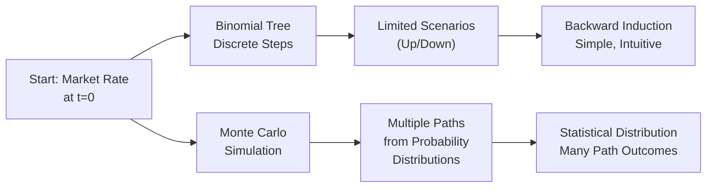

## Introduction

So you’ve probably been introduced to the idea of valuing bonds using binomial or trinomial trees back in Chapter 8. They’re neat, right? You build an interest rate tree, assume interest rates can move “up” or “down” (maybe also “middle” in a trinomial), and then use backward induction to figure out the price of a fixed income instrument. It’s almost like a step-by-step puzzle. But there’s another powerful approach: Monte Carlo simulation. Monte Carlo simulation uses random sampling from specified distributions to generate numerous interest rate paths. It’s a bit like letting a computer (or a particularly fast, caffeine-fueled friend) spin up thousands or even millions of possible “worlds” and showing you the outcome distribution for each. It may sound complicated, and sometimes it is, but it can also be super flexible.

In this section, we’ll explore why you might choose Monte Carlo simulation over a binomial (or trinomial) interest rate tree, particularly for certain complex fixed income problems. We’ll define the main advantages, consider key trade-offs (like computational cost), and highlight practical ways to leverage both methods. By the time you’re done reading, you should be able to pick the right method (and impress your colleagues or your exam grader) whenever a bond or derivatives valuation question arises.

## Quick Recap of Binomial and Trinomial Trees

Binomial and trinomial trees are among the simplest forms of discrete-time modeling. Each node in a binomial tree branches into two possible outcomes (e.g., up or down) over small time intervals. With a trinomial tree, there might be three possible outcomes (e.g., up, middle, or down). Trees are great for illustrating how interest rates evolve in a stepwise manner, and they’re friendly for “backward induction,” where you start at the final maturities and discount each possible cash flow back through the tree to the present.

However, as the number of time steps or risk factors grows, so does the size of the tree. This growth can get exponential (and exhausting). By the time you hit several factors over extended periods, you may be dealing with a forest of monstrous size—making binomial or trinomial trees cumbersome (and your CPU fans might get loud).

## Monte Carlo Simulation in Fixed Income

Monte Carlo simulation, on the other hand, allows us to generate multiple random paths of future interest rates (or yield curves) according to whatever statistical model we specify:

• Maybe you have a one-factor short-rate model (like Vasicek or Cox-Ingersoll-Ross).  
• Maybe you have multiple factors, such as short rate and spread changes, or you’re dealing with stochastic volatility.  
• Maybe you want to incorporate discrete jumps or path dependencies (like mortgage-based securities do when their cash flows depend heavily on prepayments).

You name it—Monte Carlo can probably handle it, albeit with enough computational horsepower and careful design. By simulating thousands of interest rate paths, you can measure not only an expected bond price but also the potential dispersion of results—i.e., the entire distribution of possible outcomes. That’s how you get a handle on probabilities of certain losses (or gains) for risk management tools such as Value at Risk (VaR).

## Key Advantages of Monte Carlo Simulation

### Flexibility in Modeling

One big advantage of Monte Carlo is that you can incorporate all sorts of fancy stuff that binomial or trinomial trees don’t handle well:

• Multiple risk factors: You can combine interest rates, yield curve shifts, foreign exchange rates, or default intensities all in one model.  
• Complex payoffs: Think about mortgage-backed securities that have path-dependent prepayments, or step-up coupon bonds with triggers after certain events.  
• Stochastic volatility or jumps: You can simulate random changes in volatility or even discontinuous jumps in rates that are really awkward to do in tree form.  
• Exotic instruments: If you’re dealing with exotic derivatives where payoff depends on the entire path (not just the end), it’s often easier to code up a simulation than build a specialized tree.

Let’s be honest: binomial trees can handle path dependency in some ways, but it quickly becomes unwieldy because you have to track separate states for each path detail. Monte Carlo can do it more organically, as long as you carefully define the path and the rules that govern it.

### Scalability for High-Dimensional Problems

Another advantage: big problems. If you’re modeling, say, a 30-year bond with monthly compounding or monthly optional redemption features, and you want multiple sources of risk, a binomial or trinomial tree can balloon out of control. Each time step doubles or triples your branching possibilities—yikes.

Monte Carlo simulation scales more gracefully. Sure, each simulation run can be expensive, but you can parallelize or distribute your computations. Also, adding additional risk factors in Monte Carlo doesn’t always blow up the size of your model in the same combinatorial way. If you’re working on advanced risk management tasks, you might even spin up a cluster of machines or cloud-based HPC (High-Performance Computing) resources. Monte Carlo is definitely your friend in that scenario.

### Rich Statistical Output

Monte Carlo simulation produces a full distribution of outcomes—like having thousands of mini-scenarios all condensed into descriptive statistics. Want to estimate VaR? No problem. Want to see the probability of your fixed income portfolio returning less than zero? Just count how many simulations produce negative returns. If you’re managing portfolio risk, this distribution-based approach is a lifesaver—whereas a binomial tree usually gives you a small set of discrete possible values.

In addition, once you have simulated paths, you can easily track path-dependent metrics:

• Average interest rate over time  
• Frequency of certain boundary events (e.g., hitting a call option boundary)  
• Stress analysis by focusing on the worst 1% tail  

It opens up loads of advanced analytics that help you speak confidently about the distribution of outcomes rather than just a single or limited set of them.

## Comparison Diagram: Binomial Tree vs. Monte Carlo

Here’s a little mermaid diagram illustrating, in broad strokes, how binomial trees compare to Monte Carlo in terms of branching and path generation.



Notice that binomial trees unfold in discrete states, whereas Monte Carlo draws from continuous distributions (or at least from a wide set of states) to generate many potential paths.

## Potential Pitfalls and Best Practices

### Computational Costs

We shouldn’t pretend it’s all sun and roses. Monte Carlo—with its possibly high-dimensional setups—can be computationally very expensive. You might need tens of thousands or even millions of simulated paths to get stable results in certain complex models. If your code or hardware isn’t optimized, you might be waiting a long time. Meanwhile, a simple binomial tree with just a few time steps might be quicker and easier if your problem is straightforward.

### Model Sensitivities and Convergence

Another tricky part is ensuring that your Monte Carlo simulation converges. In other words, how many paths do you need? 1,000? 10,000? 1,000,000? The more complicated your payoff structure or risk factor modeling, the more draws you need for good accuracy. Also, if you’re modeling path-dependent instruments, you must be sure your code accurately tracks the relevant state variables at each step.

### Implementation Complexity

Monte Carlo can be tricky to explain to a client or an exam grader if you don’t keep track of your assumptions: distribution selection, correlation assumptions among factors, time-step resolution, and so on. A binomial tree is arguably more transparent to demonstrate in a short, sketchy diagram.

### Hybrid Approaches

Some quants adopt hybrid approaches—for example, calibrating certain parameters using binomial trees for a simpler region of the problem or using trees for short maturities and switching to Monte Carlo for embedded option complexities. There’s no one-size-fits-all solution. Being comfortable with both methods helps you pick and choose.

## Simple Python Example: Simulating Short Rates

Let’s say we want to simulate short rates under a basic one-factor model (just to show how Monte Carlo might be coded). Below is a tiny snippet. Don’t worry if you don’t run Python daily—this is just to illustrate the idea.

```python
import numpy as np

def simulate_short_rates(r0, mu, sigma, dt, steps, sims):
    """
    Simulate short rates using a simple random walk model:
    r(t+dt) = r(t) + mu*dt + sigma * sqrt(dt) * Z,
    where Z ~ N(0,1).
    
    r0: initial short rate
    mu: drift
    sigma: volatility
    dt: time step
    steps: number of time steps
    sims: number of simulated paths
    """
    rates = np.zeros((steps, sims))
    rates[0, :] = r0
    
    for t in range(1, steps):
        Z = np.random.normal(0, 1, sims)
        rates[t, :] = rates[t-1, :] + mu*dt + sigma*np.sqrt(dt)*Z
    
    return rates

if __name__ == "__main__":
    short_rate_paths = simulate_short_rates(0.02, 0.0001, 0.01, 1/12, 240, 10000)
    # Now short_rate_paths holds 10,000 paths (columns), each with 240 monthly steps (rows).
    avg_final_rate = np.mean(short_rate_paths[-1, :])
    print("Average final short rate:", avg_final_rate)
```

• We generate an array of “sims” paths, each with “steps” time increments.  
• We used a basic random walk approach, but you could adapt it for Vasicek, CIR, or the Hull-White model.  
• After the simulation is done, we can compute any quantity of interest, including bond prices or average rates.

## Exam and Real-World Considerations

On the exam, you might see item sets that contrast these methods or ask you to recommend an approach. The correct choice often depends on instrument complexity, the presence of multiple risk factors, and the need for deeper statistical insights. If you’re dealing with a standard, single-factor short-rate model and a plain vanilla bond, a binomial approach might suffice (and might be easier to explain!). But if the question references path dependency (for instance, mortgages with uncertain prepayments), multiple sources of uncertainty, or the need to estimate something like VaR, you’re likely to plump for Monte Carlo as the better method.

In real-world practice, I once worked with a client who needed to model the potential distribution of returns on a portfolio of floating-rate notes that also had some embedded calls. Doing that with a binomial tree was straightforward if we only looked at interest rate changes. But the exact payoff also depended on how the credit spreads evolved over time (and at different speeds from interest rates). Monte Carlo was ultimately the better approach because we could simulate joint distributions of rates and spreads. It took more time to set up and compute, but the result was far more informative.

## Conclusion and References to Other Chapters

Monte Carlo simulation is one of the most powerful modeling techniques in finance—especially for fixed income analytics where multiple sources of randomness, complex path dependencies, or multi-factor models are at play. Yes, it’s more computationally demanding than a simple binomial tree, but that trade-off is often worth it for the richer set of statistical outcomes it delivers.

If you want a deeper dive into how interest rate trees work, check out Chapter 8: “Binomial Interest Rate Tree Models.” For more on building robust forward-rate simulations for Monte Carlo, see Section 9.1. And as always, remember that the choice between binomial trees and Monte Carlo isn’t binary—your exam questions might reward nuanced reasoning about which approach is best under given conditions.

## Recommended References

• Jarrow, R. & Turnbull, S., Derivative Securities – offers an excellent look at lattice methods vs. simulation methods in various chapters.  
• Wilmott, P., Paul Wilmott on Quantitative Finance – advanced numerical methods discussion, includes a wide array of examples on Monte Carlo.  
• Brigo, D. & Mercurio, F., Interest Rate Models – Theory and Practice – a thorough compendium of both tree-based and simulation-based approaches, from basic to highly advanced.  

Feel free to explore these for a hearty dose of theoretical underpinnings and practical techniques.

## Test Your Knowledge: Selecting Monte Carlo vs. Binomial Trees



### Which of the following is a key advantage of Monte Carlo simulation over binomial or trinomial trees?

- [ ] Lower computational requirements
- [x] Better ability to handle complex path dependencies
- [ ] Higher accuracy in all short-rate models
- [ ] Elimination of volatility assumptions

> **Explanation:** Monte Carlo’s flexibility with path-dependent payoffs is especially valuable, which is tough to do consistently in a simple binomial or trinomial tree.

### In which of the following scenarios would a binomial tree model be most likely preferred over Monte Carlo?

- [ ] When the instrument has significant path dependency and multiple risk factors
- [x] When the instrument is relatively simple, and time steps are not too large
- [ ] When you require a distribution of all possible outcomes
- [ ] When factoring in multiple currencies and uncertain correlation structures

> **Explanation:** A binomial tree is usually simpler and can work well for straightforward instruments with fewer time steps.

### One reason Monte Carlo simulation scales well for multiple risk factors is that:

- [ ] Each added risk factor greatly reduces the required number of simulations
- [x] Its computational complexity does not explode exponentially with additional factors
- [ ] Regulators forbid binomial trees for more than one factor
- [ ] Monte Carlo never needs more than 10 simulations for convergence

> **Explanation:** Monte Carlo typically grows linearly (or at worst polynomially) in complexity when you add more factors, while trees can grow exponentially in the number of nodes.

### What is a common downside of using Monte Carlo simulation for fixed income valuation?

- [x] It can require extensive computational resources 
- [ ] It is methodologically less flexible than a binomial tree
- [ ] It cannot incorporate path dependency
- [ ] It lacks the ability to generate distributions of outcomes

> **Explanation:** While Monte Carlo offers great flexibility, it often demands significant computational power, especially with large numbers of paths.

### When simulating multiple interest rate paths, which of the following best describes the process of determining the number of simulation runs?

- [x] Convergence tests must be performed to ensure accuracy
- [ ] The number of runs is fixed at 10,000 for all practical cases
- [ ] One run is sufficient for near-perfect estimates
- [ ] Regulators mandate exactly 100 runs for compliance

> **Explanation:** Determining the number of required paths usually involves testing for when results converge to stable values; that can vary significantly depending on the complexity of the model.

### In a client presentation regarding a callable bond valued with Monte Carlo, which aspect might be most convincing compared to a binomial approach?

- [ ] That the binomial method is more transparent
- [x] The ability to present a distribution of potential outcomes and highlight tail risks
- [ ] The shortened computational time
- [ ] The guaranteed precision of the estimate

> **Explanation:** Monte Carlo provides a wide range of outcomes (i.e., a distribution), which can help highlight how calls and potential interest rate scenarios might play out in the tails.

### Which statement is true regarding model assumptions in a Monte Carlo simulation?

- [x] Monte Carlo's accuracy hinges significantly on the validity of the underlying assumptions and distribution inputs
- [ ] In Monte Carlo, assumptions about volatility are unimportant
- [ ] Monte Carlo never allows for multiple volatility regimes
- [ ] Binomial trees generally have more flexible assumptions than Monte Carlo

> **Explanation:** Monte Carlo’s flexibility is a double-edged sword; you can model complex scenarios, but you must carefully specify all underlying assumptions.

### A trinomial tree might add which addition relative to a binomial tree?

- [x] An additional “middle” rate movement at each node
- [ ] Fewer possible states at each node
- [ ] Faster run times than the binomial approach
- [ ] No branching in the final period

> **Explanation:** A trinomial tree typically has up, down, and middle moves at each node, versus only up or down in the binomial setting.

### Why might one implement a hybrid approach combining both binomial trees and Monte Carlo?

- [x] To capture simple features with a tree while using simulation for complex path dependencies
- [ ] Because it is strictly required by GAAP for all fixed income instruments
- [ ] To cancel out the benefits of each method
- [ ] Because multiple models always yield contradictory results

> **Explanation:** Hybrid approaches allow you to leverage the simplicity of tree-based methods where possible and switch to Monte Carlo for more intricate path-dependent elements.

### True or False: Binomial trees can be less intuitive to illustrate compared to Monte Carlo when explaining interest rate evolution to beginners.

- [ ] True
- [x] False

> **Explanation:** Typically, binomial trees are considered more intuitive or at least more visual at an introductory level—you can literally sketch the branching nodes on a whiteboard.


