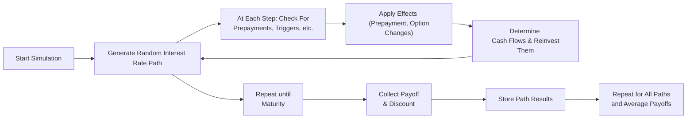

Introduction: Path-dependency can sometimes feel like a big riddle, right? I remember the first time I encountered path-dependency in mortgage-backed securities (MBS) valuation—I was absolutely amazed and mildly confused that the final payoff could be affected by every little twist in the path of interest rates. Unlike something simple (where all that ultimately matters might be the final interest rate on maturity), path-dependent cash flows demand that we track how interest rates evolve at each step along the way. In many real-world fixed-income scenarios—think MBS prepayments, knock-in or knock-out clauses, floating coupon resets, and reinvestment decisions—these evolving rate paths can drastically change projected future cash flows. 

Monte Carlo simulation is probably the best-known approach for handling all this complexity. Rather than trying to solve a single, monstrous equation, we produce lots and lots of possible future interest rate paths. Each path shows a unique sequence of interest rate changes, and, on each path, we track whether prepayments suddenly accelerate, or whether a particular embedded option gets triggered, or even how coupons are reinvested. When we do this a large number of times, we can average out the discounted payoffs across all the simulated paths to estimate a fair price. It’s a bit like flipping the coin many times—only here we’re “flipping” possible interest rate paths. 

Below, we’ll walk through the key details that make path-dependency so critical in fixed-income, how Monte Carlo helps us handle it, and some best practices to keep in mind when you’re building or interpreting these models.

## Understanding Path-Dependency in Fixed Income

Path-dependency basically means that the value of a security (or the payoff at a future time) depends not just on the final level of interest rates but on the entire journey those rates took. For instance, if you have a mortgage-backed security where homeowners can refinance their mortgage when interest rates drop, it matters when and how quickly rates cross that threshold in the future. A 1.5% interest rate in Year 3 might trigger prepayments that Year 5 might not (if rates first went up, then down, and so on). Hence, the final cash flow at maturity depends on what happened along the way.

### Key Drivers of Path-Dependency

• Mortgage-Backed Securities (MBS)  
MBS holders face prepayment risk because homeowners typically pay off or refinance their mortgages early if interest rates dip below their outstanding mortgage rate. Prepayments accelerate whenever it becomes advantageous for the borrower to lock in a lower interest cost, which affects the timing and quantity of cash flows that MBS investors receive.

• Structured Notes with Embedded Options  
Bonds with knock-in or knock-out features are path-dependent because the embedded option becomes activated (knock-in) or eliminated (knock-out) when interest rates (or sometimes other variables) cross a designated boundary. If that boundary is never crossed on a given simulated path, the option never kicks in—or possibly gets permanently canceled.

• Reinvestment Practices  
Even something as commonplace as reinvesting coupon payments can become path-dependent. If rates spike early in the life of the bond, you might earn a higher reinvestment return relative to a scenario where rates gradually creep upward only at the end.

## Monte Carlo Simulation for Path-Dependent Instruments

Since path-dependency cannot be captured simply by plugging in a terminal interest rate, Monte Carlo simulation steps in as a flexible tool. We can break the future into multiple time steps—monthly or quarterly are common for MBS modeling—and simulate random changes in interest rates at every step. Then we check:

• Did interest rates fall enough to trigger a prepayment spike?  
• Did they hit a boundary that knocks out a coupon step-up feature?  
• How does the reinvested coupon at this step affect future accumulated value?

As we repeat these simulations over thousands (and sometimes millions) of paths, we collect a distribution of potential cash flow outcomes that reflect all the twisting and turning that interest rates might do.

The final value is typically the average (under the risk-neutral measure) of all discounted payoffs across the many paths. Mathematically, one might write:


\text{Value} \approx \frac{1}{N} \sum_{i=1}^{N} e^{-r_{i} \cdot t} \times \left(\text{Payoff for path } i\right),


where N is the number of simulated paths, \\(r_{i}\\) is the effective discount rate for path i, and \\(t\\) is the relevant time horizon. The payoff for each path i is computed by factoring in all path-dependent triggers and changes (e.g., prepayment, call features).

## Modeling Prepayment Behavior

In most path-dependent modeling, MBS prepayment is the star of the show. For a typical MBS:

1. We simulate interest rates.  
2. At each time step, we compare the simulated mortgage rate to the homeowner’s contractual rate.  
3. If interest rates are sufficiently lower, we assume a certain fraction of borrowers refinance their loans.  

The fraction that refinance (or partially pay down the mortgage balance) depends on a prepayment model, sometimes based on historical data. That partial paydown reduces the amount of future interest you’ll receive from that cohort of borrowers.

In practice, you can incorporate “burnout” effects (the idea that borrowers who stay in their mortgages after multiple refinance opportunities are less likely to prepay in the future), and you might differentiate prepayment speeds by geographic region or borrower credit quality. Each path can yield a unique prepayment profile, which leads to a unique cash flow timeline.

## Knock-In and Knock-Out Structures

Another well-known path-dependent scenario is a structured bond with triggers. Imagine a coupon that increases by 100 basis points (bps) if the 10-year Treasury yield crosses below 1.5% and stays there for at least two consecutive quarters. Or maybe it’s a knock-out barrier that cancels a coupon step-up if rates climb too high at any point before maturity. 

Under each hypothetical path, you must track whether those triggers get hit, how often, and how conditions (like consecutive quarters) are satisfied. Miss the trigger on a single path? No special coupon. Hit it? Enjoy an extra yield bump—so that path’s total payoff is higher. 

## Reinvestment Considerations

Even though reinvestment risk can sneak under the radar, it’s a critical dimension of path-dependency. Let’s say you’re receiving quarterly coupons on a long-dated corporate bond. If interest rates follow a downward path early on, the coupons get reinvested at relatively lower yields, which changes your total return. By contrast, if rates spike initially, you could reinvest coupons at higher yields, thereby increasing your return. 

Monte Carlo helps capture that because, for each path, you can roll forward all the coupon cash flows as if they were reinvested at the short-term interest rates simulated in that scenario. This allows for a richer perspective on the total return distribution.

## Building a Path-Dependent Monte Carlo Model

While the actual implementation can look a bit messy in practice, the high-level process can be illustrated as follows:

The basic loop:
1. Generate a random path of interest rates for each time step.  
2. Use that path to decide whether prepayments, knock-in, or other triggers occur.  
3. Calculate and accumulate cash flows (reinvesting them at the new rates if applicable).  
4. Once you hit maturity, discount the final payoff for that path.  
5. Repeat (a lot).  
6. Average out your results (under the appropriate risk-neutral or real-world measure, depending on your valuation context).  

## Model Calibration and Behavioral Assumptions

One of the biggest challenges in path-dependent valuation is calibrating your assumptions to real data. For an MBS, that means capturing how actual borrowers behave when rates move. Are they quick to refinance? Does friction (like closing costs) slow them down a bit? Are there “burnout” effects for certain segments of the pool?

Similarly, for a structured note, you might need market-implied probabilities or historical data on how often certain barriers have been hit. If your calibration is off, your results could be very misleading—even if your Monte Carlo engine is top-of-the-line.

## Computational Considerations

Monte Carlo can be computationally intense. Path-dependency magnifies this. If you have monthly time steps across a 30-year horizon, that’s 360 time steps. Multiply that by thousands (or millions) of paths, and you could be crunching quite a lot of data. Some best practices to keep things efficient:

• Use variance reduction techniques (e.g., antithetic variates, quasi-random sequences) to improve convergence.  
• Parallelize computations if possible.  
• Keep your code efficient, and test whether you actually need so many time steps or so many simulations.  

Sometimes, you can approximate path-dependent features with simpler frameworks or binomial trees. However, the more complicated the path-dependent payoff, the more likely you’ll need a robust Monte Carlo approach.

## Tips for Exam Scenarios

In a CFA exam context, you definitely won’t be asked to code a Monte Carlo simulation from scratch, but you may be tested on:

• Whether you understand how to interpret simulation results for an MBS or other path-dependent bond.  
• How changes in behavioral assumptions (like faster or slower prepayment speeds) would alter outcomes.  
• How to read a question stem carefully to identify the path-dependent risk factor (maybe an interest rate crossing a boundary).  
• Using the risk-neutral valuation approach, discounting cash flows at each path’s appropriate rate.  

Focus on the conceptual elements: Does the final payoff incorporate all path triggers? Did we handle the timing of prepayments, calls, or coupon changes correctly? In practice item sets, watch out for partial triggers—maybe the option triggers only if rates remain below a threshold for a certain duration.

## Common Pitfalls and Best Practices

• Ignoring Trigger Conditions: Some amateurs just compare final rates versus a threshold. Remember that path-dependent features can be triggered early or mid-stream, which changes the subsequent path.  
• Overly Simplistic Prepayment Models: Using a single, constant prepayment speed is too naive. Real prepayments can speed up or slow down based on the interest rate path, seasonality factors, and borrower demographics.  
• Not Accounting for Reinvestment: If the exam question highlights that coupons are reinvested at the prevailing short-term rate, you have to model that.  
• Calibration Overlooked: A fancy model with poor calibration is essentially a fancy guess. Make sure to anchor your prepayment rates and triggers in empirical data or market-based assumptions.  

## Concluding Thoughts

Path-dependency can be super interesting (and occasionally a bit messy), but that’s the beauty of Monte Carlo simulation: it allows you to step through each possible scenario in detail. If you do it right, you capture the unique ways that an instrument can respond to changing rates at each step of the journey. For MBS, that might mean big refinancings when rates suddenly plummet in Year 2. For structured notes, maybe you get a coupon step-up if rates hover below a boundary for too long. And for reinvestment assumptions, your eventual portfolio value can look drastically different depending on the entire path of rates. 

The key is to respect the complexity: design your model with the correct triggers, incorporate relevant real-world data, and use enough simulations to get stable results. From an exam standpoint, keep your eyes peeled for how path-dependent instruments differ from standard bonds—and how to handle them correctly in a question scenario.

## References for Further Study

• Fabozzi, F. J. (ed.). The Handbook of Mortgage-Backed Securities. This is a gold mine for detailed discussions on MBS prepayment modeling.  
• Kalotay, A. “Callable Bonds: Structure and Valuation.” This reference dives into path-dependent call provisions and prepayment features in depth.  
• The Journal of Fixed Income. Many articles here explore forward-rate simulation and advanced path-dependent cash flow valuation.  

--------------------------------------------------------------------------------

## Test Your Knowledge: Path-Dependency in Cash Flows Quiz



### Which of the following best describes path-dependency in the context of fixed income cash flows?

- [x] Future cash flows depend on the entire sequence of interest rate movements, not just the terminal rate.
- [ ] Cash flows depend only on the coupon rate and yield to maturity at issuance.
- [ ] The bond’s coupon is unaffected by intermediate interest rate levels.
- [ ] Path-dependency occurs only when interest rates remain constant.

> **Explanation:** Path-dependency means each step’s interest rate affects future triggers, reinvestments, or prepayments, so a bond’s payoff is not determined solely by the final interest rate at maturity.

### A mortgage-backed security has a trigger that accelerates prepayment whenever interest rates drop below 3% for at least two consecutive quarters. Why is Monte Carlo simulation particularly well-suited for valuing such a security?

- [ ] Because Monte Carlo requires fewer computations than a closed-form approach.
- [ ] Because it ignores interest rate volatility.
- [x] Because it captures the security’s path-dependent prepayment triggers in each simulated path.
- [ ] Because prepayments are irrelevant for MBS valuation.

> **Explanation:** Monte Carlo simulates each possible path of interest rates through time, letting us check whether rates remain below 3% for two quarters along that path.

### Where is path-dependency most commonly seen in fixed income?

- [x] Mortgage-backed securities (MBS) with prepayment risk.
- [x] Structured notes with barrier or knock-in/knock-out features.
- [ ] Zero-coupon Treasury bills that only pay at maturity.
- [ ] Floating-rate notes that reset periodically based on LIBOR.

> **Explanation:** MBS and barrier-structured notes both exhibit payoffs highly sensitive to the sequence and timing of interest rate changes. Zero-coupon Treasuries and standard floaters have more straightforward cash flows.

### In a path-dependent Monte Carlo model, why might you track coupon reinvestment rates?

- [x] Reinvested coupons can earn different returns depending on the path of interest rates, affecting total payoff.
- [ ] Reinvested coupons can only be invested at zero interest.
- [ ] The reinvestment decision rarely impacts final proceeds.
- [ ] Coupons do not exist in a path-dependent context.

> **Explanation:** When interest rates fluctuate, the effective reinvestment rate for coupons also changes, leading to different total returns.

### Considering a structured note that knocks out a coupon step-up if rates exceed 5% at any point, what is a key modeling step?

- [x] Checking interest rates at each time period, since crossing the 5% threshold can eliminate future coupon increases.
- [ ] Waiting only until the end of the note’s life to see if 5% is reached.
- [ ] Ignoring interest rates altogether.
- [ ] Automatically assuming the coupon step-up is always lost.

> **Explanation:** For a knock-out feature, the entire interest rate path matters, as hitting the threshold at any point can cancel subsequent enhancements.

### Which of the following is a correct statement regarding the computational aspect of Monte Carlo for path-dependent securities?

- [ ] Path-dependency generally reduces computation time.
- [x] Path-dependency often increases complexity and simulation runs required.
- [ ] You can shortcut path-dependent calculations by looking only at final-year interest rates.
- [ ] The number of time steps is irrelevant.

> **Explanation:** Because path-dependency requires evaluating conditions at every time step, the computational burden increases significantly.

### When calibrating a prepayment model in Monte Carlo simulations for MBS, which factor might be most important?

- [x] Historical borrower behavior under different rate environments.
- [ ] The assumption of zero volatility in rates.
- [ ] Ignoring borrower credit quality differences.
- [ ] Simplifying prepayments to a single constant speed.

> **Explanation:** Empirical data on borrower refinancing tendencies (including friction and burnout effects) is crucial to obtaining realistic prepayment projections.

### Which of the following is a best practice to improve the convergence of path-dependent Monte Carlo simulations?

- [ ] Reducing the number of paths to less than 10.
- [ ] Eliminating mid-path triggers entirely.
- [ ] Using purely random number generation without checks.
- [x] Applying variance reduction techniques or quasi-random sequences.

> **Explanation:** Techniques like antithetic variates, low-discrepancy sequences, or control variates can enhance the efficiency of Monte Carlo simulations.

### In a path-dependent context, which statement is true regarding the discounting of cash flows?

- [x] Each simulated path’s cash flows are discounted appropriately, then averaged across all paths.
- [ ] Cash flows are always discounted at the same rate for every path.
- [ ] The discount rate is always the final interest rate observed at the last time step.
- [ ] Discounting doesn't apply when simulating path-dependent instruments.

> **Explanation:** With path-dependency, you typically discount each path’s cash flow sequence with rates consistent with that path or a risk-neutral approach, then average to get the fair value.

### True or False: If a bond has features that change its coupon after an interest rate threshold is reached, it is path-dependent by definition.

- [x] True
- [ ] False

> **Explanation:** When the bond’s payoff structure changes upon crossing a specific boundary during its life—rather than only at maturity—the bond exhibits path-dependent behavior.


