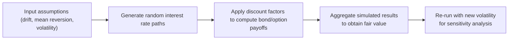

## Introduction

Monte Carlo simulations, as introduced earlier in Chapter 9, are a powerful tool for valuing fixed income instruments by generating thousands (or even millions) of potential future rate paths. These simulations incorporate assumptions about the drift, mean reversion, and (crucially) volatility of interest rates. Now, in this section, we’ll dive into one of the most important aspects of running these simulations—understanding how changes in volatility (σ) affect pricing outcomes.

Have you ever seen markets react dramatically to a sudden uptick in volatility? In my first year as a junior analyst, I remember a day when a new central bank announcement caused a spike in interest rate volatility, and it felt like the whole treasury desk had coffee spilled on their spreadsheets. Overnight, bond and swap valuations jumped, and suddenly, the entire portfolio needed re-valuation. The moral of the story? Volatility can shift valuations in ways that catch you by surprise if you’re not prepared. Monte Carlo sensitivity analysis is your friend in moments like these.

This vignette will illustrate how a simple change in volatility assumptions can cause potentially large swings in bond or derivative prices. From an exam standpoint, you’ll often see item sets asking you to compare a “base case” simulation with, say, a 10% or 20% higher volatility scenario. You’ll be tasked with explaining why bond prices and optionality values shift, and what this means for real-world risk management. Let’s explore.

## The Role of Volatility in Monte Carlo Simulations

In Section 9.1, we introduced forward-rate simulation techniques and touched on how volatility parameters directly influence the distribution of rates across different time steps. Here’s the short version of why volatility matters so much:

• Volatility determines how “spread out” or “dispersed” the simulated interest rate paths will be.  
• Higher volatility increases the range of possible future rates, which amplifies potential outcomes, especially for instruments with embedded options (e.g., callable, putable, or convertible bonds).  
• In many fixed income valuations, we discount future cash flows by rates that vary across simulated paths. If rates jump around more, the distribution of discounted cash flows widens—and so does the final fair valuation.  

Just think of it this way: with low volatility, your future interest rates might stay hovering around 3%–4%, producing a pretty narrow cluster of bond prices. But if volatility shoots up, you’re suddenly dealing with rates anywhere from 1% to 7%, and that might make your simulated bond or derivative worth a lot more or less—depending on the payoff structure.

## Mechanism of Sensitivity Analysis

Sensitivity analysis—sometimes referred to as “What-If Analysis”—quantifies how changing a single model input (in this case, volatility σ) impacts an output (here, the expected or average bond price). In exam vignettes, you’ll typically see two or three scenarios:

• Base Case: Often uses the “current market” volatility levels or the most recent implied volatility from the options market.  
• Increased Volatility Scenario: Could be +10%, +20%, or some larger shock to volatility.  
• Decreased Volatility Scenario: Here, you assume lower-than-normal volatility to see if valuations might decrease.  

After you run each scenario, you compare the resulting bond prices, yields, or embedded option values. The difference between these results highlights your portfolio’s sensitivity to changes in volatility. On the exam, you may be asked to interpret these differences and tie them back to real-world events, such as a “risk-off” environment where everyone braces for more yield curve fluctuations.

Below is a simple flowchart summarizing how we integrate volatility changes in a Monte Carlo simulation:



## Step-by-Step Vignette Illustration

Imagine you’re given the following scenario in your exam item set:

1. A fixed income analyst has built a Monte Carlo model that simulates short-term interest rates over a five-year horizon. The baseline assumptions are:  
   • Mean reversion: 2.5%  
   • Long-term drift: 3.0%  
   • Volatility: 1.5%  

2. The analyst values a callable bond with a face value of $1,000, a coupon of 4%, and a maturity of five years. Using the baseline assumptions, the model produces a fair value of $1,050.  

3. Next, the analyst is asked to re-run the model with either a +10% or –10% change in volatility. Let’s see how that might work:

   • Base Case (σ = 1.5%): The distribution of simulated rates is moderate. We get an expected bond price of $1,050.  
   • Higher Volatility (σ = 1.65%): Now the dispersion of rates is larger. There is a higher likelihood that rates could drop significantly (which benefits the callable bond holder if they can call the bond when rates are low) or spike upwards (making it less likely that the issuer will call). For a callable bond, higher volatility often increases the value of the call option to the issuer, which can slightly lower the bond’s total price to the investor. However, the interplay can be subtle—sometimes if rates can fall drastically, that might push the bond’s price up from an investor’s standpoint. You need to keep track of who owns or sells the option.  
   • Lower Volatility (σ = 1.35%): The rates cluster more tightly around the mean. The chance that interest rates will significantly deviate from 2.5%–3.0% is smaller, potentially reducing the embedded call option’s value to the issuer and raising the bond’s price.  

4. By comparing the bond prices under these scenarios, the analyst can comment on the bond’s volatility sensitivity, sometimes referred to as ‘Vega’ in option pricing contexts. On the exam, you may be asked for the net effect on the investor’s perspective or you might have to interpret the results from the issuer’s perspective.  

**Pro Tip**: In real life, if you’re dealing with a putable bond (instead of a callable one), the investor holds the option, and higher volatility typically benefits the investor. So the effect on total bond price would be strongly positive with higher volatility. Read the question carefully to see who benefits from the optionality.

## Dealing with Real-World Events

Volatility is more than a simple calibration parameter. In real markets, changes in volatility can stem from macroeconomic announcements, geopolitical tension, or changes in monetary policy. For instance, if a central bank signals that it might raise rates faster than expected, short-end volatility might spike, impacting your short-term instruments significantly. Meanwhile, if corporate credit conditions deteriorate (think credit spread volatility), you could see more significant swings in yield-based and spread-based models across the curve.

In practice, risk managers often run “stress tests” that go beyond ±10% changes in volatility. They might test a scenario reminiscent of the 2008 financial crisis or the COVID-19 shock, where volatility soared to extreme levels in a matter of days. Even though these events are (hopefully) rare, they highlight fragility and help in building robust hedging strategies.

## Example of Python-Based Sensitivity Analysis

If you’re curious to see how you might implement a simplified version of volatility stress testing, here’s a small Python snippet (just for illustration):

```python
import numpy as np

def simulate_short_rates(n_sims, n_steps, r0, drift, mean_reversion, vol):
    dt = 1.0  # e.g., 1 year per step for simplicity
    rates = np.zeros((n_sims, n_steps+1))
    rates[:, 0] = r0
    for t in range(1, n_steps+1):
        # standard short-rate mean-reversion model: dr = a(b - r)dt + sigma * sqrt(dt) * dW
        dW = np.random.normal(0, np.sqrt(dt), size=n_sims)
        rates[:, t] = rates[:, t-1] + mean_reversion*(drift - rates[:, t-1])*dt + vol*dW
    return rates

n_sims = 100000
n_steps = 5
r0 = 0.03
drift = 0.03
mean_reversion = 0.2
current_vol = 0.015

base_rates = simulate_short_rates(n_sims, n_steps, r0, drift, mean_reversion, current_vol)
base_mean_rate = np.mean(base_rates[:, -1])

vol_up = current_vol * 1.10
stress_up_rates = simulate_short_rates(n_sims, n_steps, r0, drift, mean_reversion, vol_up)
stress_up_mean_rate = np.mean(stress_up_rates[:, -1])

vol_down = current_vol * 0.90
stress_down_rates = simulate_short_rates(n_sims, n_steps, r0, drift, mean_reversion, vol_down)
stress_down_mean_rate = np.mean(stress_down_rates[:, -1])

print("Base Mean Rate:", base_mean_rate)
print("Stress Up Mean Rate:", stress_up_mean_rate)
print("Stress Down Mean Rate:", stress_down_mean_rate)
```

In a more involved model, we’d discount expected cash flows for each path to find a bond or derivative price. Then, we’d compare the results to see how volatility changes the final valuation. This snippet is just to illustrate how easy it is to run multiple simulations with different volatilities.

## Glossary Highlights

• **Sensitivity Analysis (What-If Analysis)**: Investigates how changes in inputs (like volatility) alter outputs (like a bond’s fair price).  
• **Base Case Simulation**: The initial simulation under prevailing market assumptions.  
• **Stress Test**: A scenario analysis introducing extreme parameter changes to gauge capital adequacy or portfolio resilience.  
• **Volatility Smile/Skew**: A phenomenon where implied volatility varies across strike prices or maturities, relevant for more advanced calibration of Monte Carlo simulations.  

## Pitfalls and Best Practices

1. **Forgetting Who Owns the Option**: Higher volatility benefits the holder of the option but not necessarily the issuer. So read your exam question carefully to identify whether the bond is callable (issuer has the embedded call) or putable (bondholder has the put).  
2. **Misinterpreting Mean Reversion**: Don’t ignore the interplay between mean reversion parameters and volatility. If your mean reversion is very high, short-rates might not deviate as much, even if volatility is increased.  
3. **Ignoring Correlations**: In multi-factor models (e.g., multi-curve simulations or credit spread + interest rate simulations), volatility in one factor may be correlated with volatility in another. Pay attention to these relationships in advanced scenarios.  
4. **Underestimating Tail Risk**: Standard models might assume normal distributions, but real market distributions can have fatter tails. If you ignore that, you might underprice risk in high-vol scenarios.  

## Practical Applications

Running these sensitivity analyses in real world contexts aids in:

• **Risk Management**: Understand how your fixed income portfolio might behave if central banks become more hawkish or if there are macro shocks.  
• **Regulatory Compliance**: Banks and large asset managers often need to demonstrate they can withstand stress scenarios for capital adequacy.  
• **Strategic Portfolio Decisions**: If you believe market volatility might rise, you might prefer certain instruments (e.g., long volatility strategies, protective options) over others.  

## References

• Hull, J. (2021). Risk Management and Financial Institutions. Wiley.  
• Black, F. & Scholes, M. (1973). The Pricing of Options and Corporate Liabilities. Journal of Political Economy.  
• Brigo, D. & Mercurio, F. (2006). Interest Rate Models – Theory and Practice. Springer.  

These resources provide deeper dives into volatility modeling, the origin of option pricing frameworks, and sophisticated interest rate model calibrations.

## Exam Tips and Conclusion

• **Double Check Your Direction**: On the exam, watch out for trick questions that test whether you realize a bond’s price might decrease under higher vol if the issuer holds the beneficial option.  
• **Focus on the “Why”**: It’s not enough to say, “Price changes.” You need to articulate that the distribution of payoffs broadens with higher volatility, raising (or lowering) the expected bond value depending on who holds the optionality.  
• **Be Ready for Numerics**: You might have to do a quick calculation under a new volatility scenario. Bring your calculator skills from Level I and Level II practice.  
• **Tie It to the Real World**: Cite real events or reasons for volatility spikes, which helps in explaining the results logically and scoring well on the item set.  

At the end of the day, Monte Carlo simulations for fixed income are all about “what might happen next.” Changing volatility is like turning the dial on how big those “what if” moves can be. So, keep that dial in mind, remember who profits from the changes, and you’re well on your way to acing this portion of the exam.

## Test Your Knowledge: Sensitivity to Volatility in Monte Carlo Simulations



### An analyst is running a Monte Carlo simulation to value a putable bond. How does increasing volatility by 10% typically affect its value for the bondholder?

- [ ] The bond’s value usually decreases because higher volatility benefits the issuer.
- [x] The bond’s value usually increases because the put option becomes more valuable to the investor.
- [ ] The bond’s value is unaffected by changes in volatility.
- [ ] The bond’s value is only affected by drift, not volatility.

> **Explanation:** A putable bond grants the investor the right to sell the bond back to the issuer. Higher volatility increases the potential benefit of exercising this put, thus generally raising the bond’s total value to the holder.

### In a Monte Carlo framework, which of the following best explains why higher volatility often leads to a wider dispersion of simulated bond prices?

- [x] Because the random shocks can move interest rates further away from their mean.
- [ ] Because the drift term dominates rate movements more than mean reversion.
- [ ] Because coupon payments are always correlated with volatility.
- [ ] Because discount factors become fixed in high-vol environments.

> **Explanation:** Increasing σ in the simulation means random shocks can be larger, causing a broader range of future rates and therefore a wider range of discounted cash flow outcomes.

### If a callable bond’s issuer holds the option to call, what is generally true about the bond’s price if interest rate volatility rises?

- [ ] It will definitely increase for the bondholder.
- [ ] It will definitely remain unchanged.
- [x] It may decrease or adjust downward, reflecting the higher value of the call option to the issuer.
- [ ] There is no relationship between volatility and a callable bond’s price.

> **Explanation:** When the issuer benefits from the call option, higher volatility increases the value of that option. Because the bondholder effectively sold that option, it decreases the overall value of the bond to the investor.

### What is the primary purpose of re-running Monte Carlo simulations with different volatility assumptions?

- [ ] To test the speed of the computer hardware.
- [ ] To prove that the model is perfectly calibrated.
- [ ] To reduce the complexity of the mean reversion factor.
- [x] To assess how sensitive the valuation is to changes in input uncertainty.

> **Explanation:** Sensitivity or stress testing is a best practice in risk management and valuation to see how changes in model inputs like volatility affect results.

### A portfolio manager is testing extreme scenarios equivalent to a historical crisis period. This exercise is considered:

- [ ] A base case simulation.
- [ ] A typical day-to-day estimate.
- [x] A stress test.
- [ ] A perfectly hedged scenario.

> **Explanation:** A stress test applies especially large or extreme parameter changes (or historically observed shocks) to assess portfolio resilience against major market events.

### How does an increase in volatility interact with mean reversion in a short-rate model?

- [x] Higher volatility may increase day-to-day fluctuations, but strong mean reversion can pull rates back toward the long-run drift.
- [ ] Mean reversion dominates completely, making volatility irrelevant.
- [ ] Volatility replaces mean reversion entirely if rates go negative.
- [ ] There is no such interaction.

> **Explanation:** Even if mean reversion is present, higher volatility leads to larger short-term fluctuations in rates. Over the long run, rates still tend to revert, but the path can be more turbulent.

### From a risk management perspective, why might a bank run simulations with volatilities far above recent historical averages?

- [ ] They do so only when they expect lower credit spreads.
- [ ] They are seeking to maximize profit in normal times.
- [x] They want to test capital adequacy and resilience against unexpected market shocks.
- [ ] They want to avoid regulatory scrutiny.

> **Explanation:** Regulators and prudent risk managers require stress testing with extreme parameters to ensure the institution can handle sudden, severe market shocks.

### In the context of Monte Carlo simulations for interest rates, which term describes how implied volatility changes with different strike prices or maturities?

- [ ] Mean reversion curve
- [x] Volatility smile/skew
- [ ] Credit spread dispersion
- [ ] Discount factor shift

> **Explanation:** A volatility smile or skew refers to the observed pattern in implied volatilities across strike prices or maturities.

### Why might a bond’s price under high volatility scenarios differ significantly from its price under base-case volatility, even if the average interest rate path remains similar?

- [ ] The discount factor does not change with interest rate fluctuations.
- [x] Greater volatility increases the dispersion of possible outcomes and the value of embedded options, altering the average of discounted payoffs.
- [ ] Monte Carlo models ignore coupon payments at higher volatilities.
- [ ] There is no difference because average rates are the same.

> **Explanation:** Even if the mean path is unchanged, wider swings can increase (or decrease) the present value of certain cash flows—especially when optionality is involved.

### In Monte Carlo simulations, is it possible for the value of a callable bond to stay the same when volatility increases?

- [x] True
- [ ] False

> **Explanation:** While generally higher volatility will reduce the callable bond’s value to the investor (due to the issuer’s call option becoming more expensive), there can be specific rate and call-structure interactions where the overall bond’s payoff pattern remains unchanged. This is rare but theoretically possible if key model parameters offset each other perfectly.


