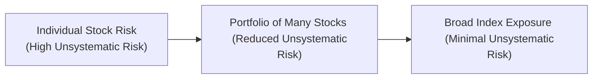
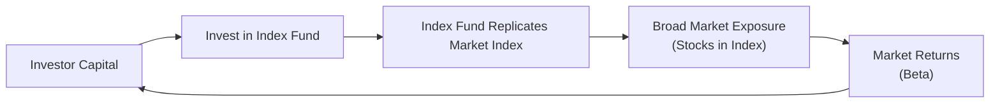

## Introduction and Key Motivations

Many years ago, I remember sitting at the kitchen table with my dad, flipping through a newspaper (yep, believe it or not, there was a time when stock quotes would come in print). He pointed to the long list of equity tickers and said, “You know, maybe I should just buy them all.” Back then, I thought he was joking. But actually, that’s pretty much index‑based investing in a nutshell—trying to get exposure to the whole market instead of hunting for the next big thing.

Index‑based equity investing, also called passive investing, is essentially about replicating the performance of a chosen market index rather than trying to outperform it. By tracking an index, investors can capture what’s called the “market return” or “beta.” In doing so, they let go of the often expensive search for alpha—manager skill that frequently fails to materialize consistently over the long term. 

For the CFA® Level III candidate, understanding index‑based equity strategies is crucial. This knowledge provides foundational insight when comparing passive approaches to active management, designing overall asset allocation, and measuring performance against benchmarks.

## Foundations in the Efficient Market Hypothesis

### The EMH at a Glance
The bedrock idea supporting index‑based equity investing is the Efficient Market Hypothesis (EMH). The EMH states that financial markets rapidly incorporate all publicly available information into security prices. According to this concept, it’s tough—some will say close to impossible—for an active manager to consistently beat the market on a risk‑adjusted basis once fees, taxes, and transaction costs are accounted for. 

In formal terms, if we denote P₀ as the current price of a security, then under the EMH:

P₀ = E[P₁ | Information Set]

This indicates the current price (P₀) is effectively the expected price at a future time (P₁) given the information set known today. Whenever new information appears, prices adjust so rapidly that capturing outsize returns before the price moves is extremely difficult. 

The EMH comes in several forms—weak, semi‑strong, and strong—each positing different levels of market efficiency. Regardless of form, these theories collectively suggest that outperforming markets by picking individual stocks or timing market swings is, at best, a challenging endeavor.

### Practical Outcome
Don’t let the fancy words fool you. The net result is that many folks believe simply tracking an index saves on cost, time, and energy while delivering returns inline with the overall market. Rather than chase alpha through stock picking, they opt to “buy the market” and accept the market’s return, minus minimal fees.

## Lower Costs: The Power of Simple

### Expense Ratios and Beyond
One of the biggest draws of index‑based equity investing is the low cost structure. Actively managed funds often hire large research teams, have higher turnover, and charge performance fees. All of this can significantly erode investors’ returns. In contrast, passive index fund management is largely rules‑based, requiring fewer staff and less trading activity. 

• Expense Ratio: This is the fund’s annual operating expenses expressed as a percentage of average net assets. Index‑tracking funds might feature expense ratios in the single‑digit basis points (e.g., 0.05%). Actively managed funds, however, often hover between 0.50% and 2.00% (or even higher). 

• Transaction Costs: With active management, frequent buying and selling can rack up trading fees and market impact. Because index‑based strategies have relatively low turnover, transaction costs remain modest. 

The difference of even 1.00% in annual fees can compound dramatically over two or three decades. You might have run across those online calculators that show a small difference in fees leading to thousands—or even millions—less in an investor’s final balance. And yeah, that’s real money we’re talking about.

### Impact on Investor Returns
It’s no secret that fees and costs directly reduce net performance. By slashing management and transaction costs, index investors can preserve a higher fraction of the gross return from the market. Over a long investment horizon (think retirement accounts or endowment funds), these lower fees can translate into significant extra accumulation.

## Diversification and Reduction of Unsystematic Risk

### Understanding Unsystematic Risk
When I was younger, I had a friend who wanted to put all her money into a single biotech company because it had an “incredible pipeline.” Now, maybe that was a perfect call, or maybe not. Either way, stock‑specific shocks (like an FDA rejection) can wreak havoc on a concentrated portfolio. That instability is referred to as unsystematic risk—the risk unique to a company or industry.

By investing in a broad market index, you inherently diversify across many companies, sectors, and sometimes geographies. As a result, you significantly reduce unsystematic risk. 

### Why Broad Market Exposure Matters
Consider a popular index, say the S&P 500. It includes large‑cap U.S. stocks across diverse sectors such as technology, healthcare, consumer staples, and energy. If a single company, or even an entire sector, hits a rough patch, other constituents within the index can offset part of that decline. 

In the following mermaid diagram, we show a simple illustration of risk sources. Notice how unsystematic risk is reduced through broad diversification:

Index‑based investing doesn’t eliminate systematic risk—i.e., the overall market’s ups and downs—but it lessens the blow from any single stock’s slump. 

## Transparency and Benchmark Alignment

### Visibility into Holdings
People love clarity. With index‑based strategies, you know exactly what you own. If a fund tracks the S&P 500, you can look up each constituent, their weightings, and rebalancing rules. You’re not guessing which new “hot pick” the portfolio manager is testing. That level of transparency helps set investor expectations and fosters confidence in the investment process.

### Monitoring Performance vs. Benchmark
Another sneaky benefit of index investing is that it’s very straightforward to compare your actual returns with the index itself. If you’re managing an S&P 500 index fund, your performance better be pretty close to the S&P 500. This clarity helps minimize what we call “style drift.” If an active manager claims to focus on large‑cap growth stocks but starts buying small‑cap tech startups and frontier emerging markets, the portfolio’s risk‑return profile can change dramatically. With an index strategy, style drift basically can’t happen, because you’re locked into replicating that particular index’s composition.

## Capturing Beta and Letting Go of Alpha

### Anatomy of Returns
The total return of a portfolio can be split into alpha and beta components:  
• Beta: The portion attributable to broad market movements.  
• Alpha: The portion attributable to a manager’s skill, security selection, or market timing.

By choosing an index‑based approach, we explicitly aim to capture beta. If the S&P 500 goes up 8% for the year, the fund (accounting for small fees) will produce somewhere near that return. You might say, “Sure, but I want alpha!” The tricky part is that alpha, net of fees, is often elusive. Many studies find that a large fraction of active managers underperform their benchmarks over the long haul.

### Real‑World Evidence
It’s not that no one ever beats the market. Some do. But it’s notoriously difficult to identify in advance who will keep delivering outperformance. To highlight this point, a frequently cited S&P Dow Jones Indices SPIVA (S&P Indices Versus Active) study has shown that, over five or ten‑year periods, the majority of active funds underperform their corresponding benchmarks. If you want to keep it simple, indexing ensures you’re always in line with the market’s returns, minus minimal expenses.

## Tax Efficiency and Low Turnover

### Why Taxation Matters
Taxes might not be front‑of‑mind for many exam candidates, but in the real world, capital gains taxes can chip away at returns. In jurisdictions that tax realized capital gains, funds that buy and sell more often can create taxable events for shareholders. This is particularly important for those in high tax brackets and for institutions with certain tax exposures.

### Index Funds’ Turnover Advantage
Passive funds generally have lower turnover (i.e., they trade less frequently) because they only buy or sell when changes occur in the underlying index (such as rebalancing or reconstitution). For many broad indexes, changes aren’t super frequent, which helps keep realized capital gains distributions to a minimum. 

If you’ve ever owned a mutual fund that announced a big year‑end capital gains distribution, you know exactly how frustrating that can be—especially when the fund’s performance wasn’t too stellar in the first place. Index funds help mitigate that because there’s less trading to trigger those gain recognitions.

## Implementation Across Multiple Markets

### Equities and Beyond
While we’re focusing on equity indexes, the concept of indexing extends well beyond stocks. There are index‑based strategies for fixed income (Chapter 4 explores liability‑driven and index‑based fixed income strategies), commodities, real estate, and more. In each market, indexing aims to deliver the market’s risk‑return profile, minus low fees.

### Convenient Building Blocks
For major institutional investors—like pension funds, endowments, or insurance companies—index vehicles (ETFs or index funds) provide an easy solution to gain immediate exposure to asset classes that align with strategic asset allocation targets. Need 10% in emerging markets equity? There’s likely an established index product that can slot in without the complexities of manager sourcing or monitoring. 

Meanwhile, smaller individual investors can also benefit from these vehicles, often using them to build balanced portfolios that incorporate a variety of indexes. If you want 60% in large‑cap U.S. equities, 20% in international developed, 10% in emerging markets, and 10% in fixed income, you might do it all with a handful of index ETFs. Quick, clean, and relatively cheap.

## Common Pitfalls and Challenges

### Tracking Error
Index funds aim to replicate the index as closely as possible, but occasionally the actual returns deviate by a small margin, known as tracking error. Factors contributing to tracking error include trading costs, management fees, or the timing of cash flows. For the most part, well‑run index funds keep that gap tight. But for narrower or more illiquid indexes (frontier markets, specialized sector indexes), tracking errors might be larger.

### Market Coverage and Concentration Overlap
Some broad indexes—especially those described as “all‑market” indexes—contain thousands of stocks, but a handful of very large companies could make up a disproportionate share of the index weighting. This can result in sector or style concentration risk. Yes, you’re diversified, but if the same handful of mega‑cap tech stocks drive 20% or more of the entire index, that’s a concentration you need to be aware of.

### Benchmark Risk (or Lack Thereof)
One reason many institutions adopt an index approach is to minimize benchmark risk, effectively ensuring they always closely track the defined benchmark. But this can become a challenge if the chosen index no longer represents the portfolio’s underlying goals. For instance, the investment committee might want to incorporate more ESG considerations, but the standard broad market index might not reflect those preferences. Over in Chapter 2.7, we look at how integrating ESG can sometimes involve factor or custom indexes rather than standard broad market indexes.

## Real‑World Example

Let’s say a large university endowment wants to invest in U.S. equities. They can either:
1. Hire an active manager with a 1% management fee and the possibility of outperformance (alpha) but no guarantees.  
2. Invest in an index fund with a 0.04% management fee that aims to track the S&P 500.  

After careful consideration of historical evidence, cost differences, tax implications, and the difficulty in identifying consistently successful active managers, many endowments lean heavily on index funds. Over multiple decades, that low fee structure and reliable exposure to the equity market can greatly impact the portfolio’s final value. This is precisely why it’s become so common for large institutions and retail investors alike to hold index funds at the core of their equity strategies.

## Putting Theory into Practice: A Brief Overview Diagram

Below is a simple Mermaid diagram illustrating how an investor’s capital flows into an index fund, which replicates a chosen market index. This, in turn, offers exposure to the broad market’s returns. 

In this diagram, the investor’s capital is allocated to a passive fund that systematically replicates an index. This process yields broad market returns, which flow back to the investor (minus minimal fees and transaction costs).

## Exam Tips and Best Practices

From a CFA® Level III exam standpoint, you should be prepared to:

• Discuss the rationale for choosing an index‑based strategy over an active one in various scenarios (e.g., cost considerations, tax efficiency, historical performance).  
• Evaluate the reasons for lower fees, pinpoint factors contributing to tracking error, and analyze how they impact overall returns.  
• Illustrate how indexing ties into the broader concept of strategic asset allocation and portfolio design (particularly relevant when we talk about risk budgeting in Chapter 3.3 and factor tilt management in Chapter 3.6).  
• Address questions about diversification, specifically regarding unsystematic vs. systematic risk, and the role indexing plays in mitigating unsystematic risk.

On exam day, a scenario might present you with a hypothetical client deciding between an active fund or an index fund. You could be asked to measure the difference in net returns after accounting for fees, turnover, or taxes. They may also provide a coverage ratio of a given index and ask you to articulate the cost‑benefit trade‑offs of using that index as a core holding.

Time management is key. If the exam question is a constructed response, focus on the conceptual logic of why indexing might be superior (or inferior) in specific client circumstances. If it’s a multiple‑choice or item set question, watch for distractors that highlight improbable or contradictory statements about index performance.

## Conclusion

Index‑based equity investing remains a cornerstone in modern portfolio construction. It appeals to many investors—from individual savers to multi‑billion‑dollar institutions—because of its transparency, diversification, and cost‑efficiency. Grounded in the Efficient Market Hypothesis, indexing recognizes that chasing alpha can be expensive and uncertain, whereas obtaining the market return is both straightforward and generally reliable. And if you ask me, there’s a comforting elegance in embracing a strategy that says, “I’ll just buy ’em all.” 

As we continue to explore equity strategies in subsequent sections, keep in mind that indexing isn’t an “all or nothing” approach. Many portfolios blend core index holdings with select active or factor‑based positions. In the upcoming 1.2 Market‑Cap Weighting vs. Factor‑Based Weighting Approaches, we’ll see how different weighting methodologies can shift a portfolio’s return profile. 

## References and Further Reading

• Bogle, John C. “Common Sense on Mutual Funds: New Imperatives for the Intelligent Investor.”  
• Bodie, Zvi, Alex Kane, and Alan J. Marcus. “Investments.” McGraw‑Hill.  
• CFA Institute: “Passive Investing and Indexing” (https://www.cfainstitute.org/)  
• S&P Dow Jones Indices: “Index Methodology” (https://www.spglobal.com/spdji/)  

If you want to dive further, consider exploring academic journals such as The Journal of Index Investing or reading through historical performance analyses by S&P Dow Jones Indices SPIVA Reports. They offer robust data on how active and passive strategies fare over multiple time horizons.

---

## Test Your Knowledge: Rationale for Index‑Based Equity Investing



### Which of the following best reflects the main insight provided by the Efficient Market Hypothesis?  
- [ ] Most investors can easily find mispriced securities to outperform the market.  
- [x] All publicly known information is quickly reflected in security prices, making persistent outperformance challenging.  
- [ ] Markets are never influenced by behavioral biases and irrationality.  
- [ ] Private information is widely distributed, ensuring quick corrections in prices.  

> **Explanation:** The EMH suggests that all publicly available information adjusts security prices swiftly, leaving less opportunity to exploit mispricing for sustained outperformance.

### What is one key advantage of index‑based funds over actively managed funds?  
- [ ] They always generate alpha by selecting the best stocks.  
- [x] They typically have much lower expense ratios.  
- [ ] They become more volatile when markets are efficient.  
- [ ] They guarantee higher returns in bear markets.  

> **Explanation:** One essential advantage of passive funds is their lower expense ratios because they do not require extensive research teams and incur less trading.

### By investing in a broad equity index, investors mainly reduce what type of risk?  
- [ ] Systematic risk  
- [ ] Regulatory risk  
- [ ] Political risk  
- [x] Unsystematic risk  

> **Explanation:** Index‑based investing helps lower company‑specific or industry‑specific risk, also known as unsystematic risk. Systematic risk, tied to the overall market, remains.

### Which term describes a fund’s fee structure as a percentage of its net asset value, often lower in index funds?  
- [x] Expense ratio  
- [ ] Transaction cost  
- [ ] Capitalization rate  
- [ ] Market impact fee  

> **Explanation:** The expense ratio is the primary way mutual funds and ETFs disclose management fees. Index funds usually keep this ratio lower than active counterparts.

### What is a primary driver of low turnover in index‑based portfolios?  
- [x] The fund only rebalances when the underlying index changes.  
- [ ] The fund attempts to time the market precisely.  
- [x] The portfolio managers must continuously buy and sell underperforming stocks.  
- [ ] The fund’s manager chooses stocks based on earnings forecasts.  

> **Explanation:** Index trackers simply adjust holdings to mirror index composition changes, usually resulting in far fewer trades than active strategies that continuously chase performance.

### In measuring the performance of an index fund, the small discrepancy between actual fund returns and the index returns is called:  
- [ ] Alpha spread  
- [ ] Beta variation  
- [x] Tracking error  
- [ ] Market drift  

> **Explanation:** Tracking error measures the difference between a fund’s actual returns and the benchmark index it tracks. A low tracking error signals a well‑managed index fund.

### Many academic studies cite that over longer horizons, the majority of active fund managers:  
- [x] Underperform their benchmarks net of fees.  
- [ ] Always outperform once risk‑adjusted returns are considered.  
- [x] Provide consistently higher alpha.  
- [ ] Deliver lower returns before expenses.  

> **Explanation:** Historical SPIVA analyses and related studies show that a large proportion of active managers underperform benchmarks, particularly over extended periods and after fees.

### A defining rationale for index-based equity strategies is that they aim to capture which portion of overall return?  
- [ ] Alpha  
- [x] Beta  
- [ ] Risk premium  
- [ ] Excess yield  

> **Explanation:** Indexing targets the market return or beta, rather than trying to generate alpha by outpacing the market.

### One potential drawback of investing in a market-cap-weighted index is:  
- [ ] Excessive style drift  
- [x] Concentration in a few large companies  
- [ ] Difficulty understanding how securities are selected  
- [ ] Inconsistent tracking of the market  

> **Explanation:** A market-cap-weighted index can become heavily skewed toward large-cap stocks, which may amplify company- or sector-specific exposures.

### True or False: Lower taxes and lower transaction costs are often associated with index‑based investing due to its low turnover.  
- [x] True  
- [ ] False  

> **Explanation:** Because index funds generally have fewer trades, they realize fewer taxable capital gains and incur lower transaction costs, thereby improving investors’ net returns.


