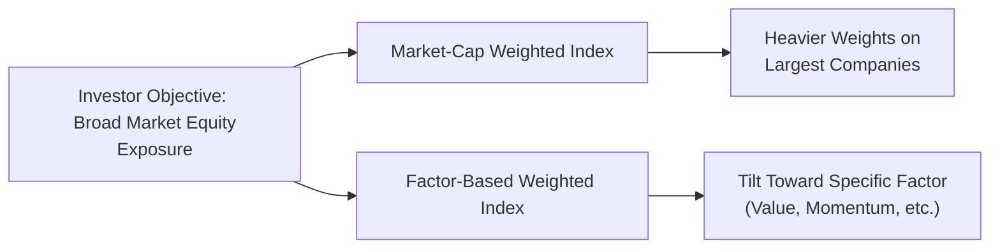

## Introduction

Investors often ask me, “Should I go with a standard market‑cap weighted index or dabble in one of those fancy factor‑based indices (sometimes called ‘smart beta’)?” And honestly, I can’t help but remember when I first realized that my own investment strategy—well, it kind of looked like I’d thrown darts at a newspaper listing. I had some big companies that dominated my returns while I mostly ignored other smaller but interesting opportunities. I discovered that this was exactly how a market‑cap weighted approach behaves: the bigger stocks get bigger slices of your portfolio pie. So, if you’re curious about what might happen if instead you tilted that pie in favor of certain “factors” (like value or momentum), that’s where factor‑based weighting enters the story.

In this section, we’ll evaluate the fundamentals of these two indexing approaches, explore the pros and cons, and provide insights into when (and why) each method might best fit an investor’s needs. We’ll also share some practical examples, a few personal anecdotes, and a bit of the underlying theory. By the end, you’ll see how these methodologies reflect different investment philosophies and how they might align with your own portfolio goals.

## Market‑Cap Weighting Basics

Market capitalization is basically the total value of a company’s outstanding shares in the market. Seriously, it’s the number of shares multiplied by the current share price. If you sum this up for a bunch of companies, the relative weights reflect their respective “size” in the overall market. Traditional large‑scale indices like the S&P 500, MSCI World, or FTSE 100 precisely follow this concept; bigger companies take a bigger percentage of the index.

Below is a rough diagram illustrating the typical flow of a market‑cap weighting process versus a factor‑based weighting process. Don’t worry, it’s not rocket science—it’s just a representation of how these index construction approaches differ in practice.

### Why Market‑Cap Weighting?

• Reflects Market Consensus: When you buy a market‑cap weighted index, you’re effectively adopting the collective wisdom of all market participants. The index adjusts automatically to price changes—when a company’s share price rises, so does its weight in the index.  
• Minimal Turnover: Because constituent weights adjust naturally with price fluctuations, there’s no need for frequent rebalancing. This can be a big deal for costs, as operational expenses in rebalancing (or so-called “churn”) are relatively low compared to more active strategies.  
• Broad Performance Alignment: Market‑cap weighted indices like the S&P 500 serve as benchmarks for the entire market, so aligning your portfolio with them often means you’re capturing a broad slice of the economy. If the market goes up, so does your portfolio (and vice versa).

### Potential Pitfalls of Market‑Cap Weighting

• Concentration in Large Stocks: If you’ve ever glanced at a major index, you might’ve noticed that a handful of mega‑cap tech or financial stocks can represent a sizeable fraction of your portfolio. If those companies stumble, it can drag down the whole index.  
• Momentum Bias: Stocks that rise in price accumulate a larger slice in a cap‑weighted index, possibly pushing the portfolio to overweight overvalued stocks. If those stocks correct, it can hurt performance.  
• Lack of Style Tilts: Since the index is market‑cap based, it won’t deliberately seek exposure to, say, value or small‑cap premiums. If you believe in certain factor premia, you won’t capture them directly this way.

## Factor‑Based Weighting: A Different Way to Slice the Pie

At some point, investors began thinking: “Okay, that’s nice (and easy) to just own bigger slices of Amazon or Apple. But I’ve heard that certain styles like value, momentum, or low volatility might yield outperformance without me having to micromanage a bunch of stocks.” That’s exactly the premise behind factor investing. Factor‑based (or “smart beta”) indices select and weight stocks differently—aiming to explicitly capture those factors.  

These factors typically include:  
• Value: Stocks trading at lower prices relative to fundamentals.  
• Momentum: Stocks with a track record of strong recent performance.  
• Quality: Companies with robust profitability, strong balance sheets, and stable earnings.  
• Low Volatility: Stocks exhibiting historically lower price swings.  
• Size: Tilt toward small‑ or mid‑cap relative to large‑caps.

### Why Consider Factor‑Based Weighting?

• Potential for Outperformance: Over the long term, academic research (including Fama and French) has identified “premia” associated with factors like value or size. By over‑ or underweighting these factors, a factor‑based index might outperform a standard cap‑weighted index (though this isn’t guaranteed).  
• Customizable Risk/Return Profile: Holding a low‑volatility index, for example, might reduce portfolio fluctuations. A small‑cap value tilt might increase potential returns—though you also face heightened risk.  
• Systematic Exposure Without Active Management: Factor investing can be seen as a rules‑based approach to tilt a portfolio in a systematic way. It’s “active” in that it deviates from a simple market‑cap weighting but “passive” in that it follows a set of transparent, rules‑driven criteria.

### Drawbacks to Keep in Mind

• Higher Turnover: Because factor‑based indices must rebalance periodically (e.g., to maintain a consistent exposure to value or momentum), turnover (and trading costs) can be higher than in a cap‑weighted index.  
• Periods of Underperformance: Factors can fall out of favor for extended stretches. You might experience frustrating underperformance relative to a plain‑vanilla index.  
• Tracking Error: A factor index will likely deviate more from the standard market index, causing periods of mismatch. This “tracking error” should be expected if the factor being sought is genuinely diverging from the market.

## Understanding the Key Differences: A Closer Look

Often, the real tension between these two approaches revolves around the interplay of simplicity (in the case of market‑cap weighting) and the desire to exploit certain risk premia (factor‑based). In practice, many investors blend the two. You might anchor your portfolio in a large, plain‑vanilla market index, then spice it up with a dash of small‑cap or value tilt.  

Let’s illustrate with a very simplified hypothetical scenario:

• Suppose you invest $100 in two stock index funds.  
• One is a traditional S&P 500 market‑cap weighted fund. It’ll have big allocations to mega‑cap names.  
• The other is a small‑cap value factor ETF, which systematically selects companies meeting “small market cap plus cheap fundamentals” criteria.  

Over a 10‑year period, your factor‑based small‑cap value fund might go through a few periods where it lags. Large‑cap growth might be on a tear (like many technology stocks). However, research suggests that smaller companies trading at low valuations have, over certain longer time horizons, outperformed the market. But there’s no guarantee, so you ride out the cyclical dips hoping that the small‑cap value premium will eventually kick in.

## Integrating Market‑Cap and Factor‑Based Approaches

Institutional investors, endowments, and even individual retail investors commonly adopt a hybrid approach. Why? Because whether you need broad market coverage (for instance, to track overall economic growth) or targeted exposure to certain risk premia, it might be wise not to go “all or nothing” on either end.  

Below is a simplified example of how an institutional investor might construct such a portfolio:

| Asset Class | Strategy                                 | Allocation |
|-------------|------------------------------------------|------------|
| US Equities | Core Market‑Cap Weighted Index           | 40%        |
| US Equities | Factor‑Based (e.g., Value & Momentum)    | 10%        |
| Int’l Equities | Market‑Cap Weighted (Developed Mkts)  | 20%        |
| Int’l Equities | Emerging Markets Factor Tilt (Value)  | 5%         |
| Fixed Income | Gov’t Bond Index                        | 20%        |
| Fixed Income | Corporate Bond (Credit Factor Tilt)     | 5%         |

The total equity component is partially anchored in the broad market, with some factor tilts. If the factor tilts do well, the portfolio outperforms a broad‑market benchmark. If not, the core weighting still delivers “market‑like” returns without drifting too far.

## Practical Considerations

Before jumping to factor investing, consider the following:  

• Cost: Factor indexing can involve higher expense ratios due to greater turnover, data analysis requirements, and complexity.  
• Liquidity: Some specialized factor ETFs might have wider bid‑ask spreads or lower daily trading volumes.  
• Factor Definitions Vary: Not all “value” or “quality” indices are created equal. Different index providers use slightly different metrics, so do a bit of homework.  
• Overlap and Unclear Exposure: If you hold multiple factor ETFs, you might unknowingly overlap exposures, diluting or even doubling down on certain factors.  
• Cyclicality of Factors: A factor that’s been super popular might become overpriced and underperform later. Factor investing is a long‑term strategy.

## A Personal Reflection

I vividly recall a time back in grad school when I was reading yet another academic paper praising the “small‑cap premium.” Excited, I allocated a good chunk of my meager savings to a small‑cap factor fund—right before a 24‑month window of small‑cap doldrums. Did I want to bail? Absolutely. But I decided to stay put, rebalanced a little along the way, and eventually saw better returns. That experience taught me the reality that factor investing can require real patience. It isn’t a free lunch—sometimes you might feel like you’re at the wrong restaurant entirely. But if you believe in that factor’s fundamental underpinnings and can handle the volatility, it may pay off over time.

## Best Practices

• Clarity of Objective: Understand whether you want the average market performance (and the associated convenience) or you believe in the long‑term story of specific factor premia.  
• Diversify Factors if Desired: Sometimes blending multiple factors (like value and momentum) helps reduce the cyclicality of any single factor.  
• Monitor Tracking Error: If you incorporate factor funds, be prepared for short‑term divergences from the broader market.  
• Ongoing Reassessment: Market‑cap weighting might shift sector concentrations over time (e.g., significant tilt towards technology if that sector grows significantly). Similarly, factor exposures can drift if the definitions or your holdings change. Regular reviews are key.  
• Implementation Details: Trading costs and taxes matter. Factor strategies typically have higher turnover, which might erode some of the benefit, especially where capital‑gains taxes are high or if the index methodology triggers frequent changes.

## Exam Relevance and Key Takeaways

• Market‑cap weighting and factor‑based weighting are two distinct philosophies of index construction, each with its own risk–return implications.  
• The CFA Level III exam might test your ability to identify the pros and cons, calculate the impact on performance or risk metrics, and argue for the suitability of one approach over the other given a hypothetical investor’s objectives.  
• Understanding tracking error, implementation costs, and factor cyclicality is critical, especially for portfolio managers who must defend or evaluate these strategies in real-life scenarios.  
• You may see scenario‑based questions on factor rotations, how market‑cap weighting leads to concentration, or how to combine these approaches in a broader portfolio context.

## References and Further Reading

• Philips, Christopher B. “The Case for Indexing.” Vanguard Research.  
• MSCI: “Factor Investing and MSCI Factor Indexes.” Available at: https://www.msci.com  
• Ang, Andrew. Asset Management: A Systematic Approach to Factor Investing. Oxford University Press.  
• Fama, Eugene F. and Kenneth R. French. “Common Risk Factors in the Returns on Stocks and Bonds.” Journal of Financial Economics.  

If you’d like to expand your understanding:
• Review Chapter 1.1 for the broader rationale behind index-based equity investing.  
• Check out Chapter 1.3 for methods of index replication—especially how full replication or optimization might differ in cost and tracking error.  
• Skim Chapter 6.6 for insights into how certain factor‑based approaches might apply to structured instruments, bridging the equity and credit worlds.

## Test Your Knowledge: Market‑Cap and Factor‑Based Weighting Quiz



### Which of the following is generally considered an advantage of market‑cap weighted indices compared to factor‑based indices?

- [ ] They focus heavily on small‑cap companies.  
- [ ] They offer guaranteed outperformance over the market.  
- [x] They typically have lower turnover and trading costs.  
- [ ] They eliminate concentration risk entirely.

> **Explanation:** Market‑cap weighted indices naturally adjust with price movements, so they involve lower turnover compared to most factor strategies, which frequently rebalance based on factor definitions.

### In a market‑cap weighted index, what happens when a stock’s price rises significantly?

- [x] Its weight in the index automatically increases.  
- [ ] Its weight in the index automatically decreases.  
- [ ] The index weighting stays the same but the factor exposure changes.  
- [ ] The stock is removed from the index.

> **Explanation:** Market‑cap weighting is based on share price × number of shares. If the price grows significantly, so does the company’s market cap, which increases its share of the index.

### A factor‑based (smart beta) strategy seeking undervalued companies typically focuses on which factor?

- [ ] Momentum  
- [ ] Low volatility  
- [ ] Quality  
- [x] Value  

> **Explanation:** A core principle of value investing is that undervalued companies (based on metrics like price/earnings, price/book, etc.) may outperform in the long run.

### Which of the following is a common criticism of market‑cap weighted indices?

- [ ] They produce higher tracking errors.  
- [ ] They require frequent rebalancing for factor exposures.  
- [x] They can become overly concentrated in a few large stocks.  
- [ ] They stray too far from the market consensus.

> **Explanation:** Market‑cap weighting can lead to concentrations in mega‑cap names, particularly if a few stocks represent a large chunk of the total market cap.

### When might a factor‑based index experience extended periods of underperformance relative to a market‑cap index?

- [ ] When the factor strategy matches the direction of the market.  
- [ ] When the factor has no correlation with the market.  
- [x] When the factor is temporarily out of favor or facing a cyclical downturn.  
- [ ] When volatility is very high across all asset classes.

> **Explanation:** Factor performance is often cyclical. If a particular factor (e.g., value, momentum) is out of style, the affected index may underperform the broader market.

### How does factor‑based indexing attempt to achieve outperformance versus a simple market‑cap strategy?

- [x] By systematically tilting toward risk premia or anomalies like value or low volatility.  
- [ ] By ignoring the fundamental metrics of companies.  
- [ ] By mirroring the exact composition of the market.  
- [ ] By avoiding all forms of rebalancing.

> **Explanation:** The idea behind factor‑based indexing (smart beta) is to exploit systematic risk premia or market anomalies using clear, rules‑based approaches.

### Which of the following commonly increases when adopting a factor‑based index?

- [x] Tracking error relative to a broad‑market index.  
- [ ] Index homogeneity.  
- [ ] Liquidity across the board.  
- [ ] Long‑term correlation with other alternative assets.

> **Explanation:** Factor‑based strategies deviate from the standard market‑cap weighting, leading to higher tracking error compared to a “vanilla” market benchmark.

### An investor chooses a factor‑based strategy focusing on small‑cap value stocks. Which potential problem might they face?

- [ ] Systematic overvaluation of large companies.  
- [ ] Zero turnover.  
- [x] Long periods of underperformance if small‑cap value is out of favor.  
- [ ] Elimination of volatility from the portfolio.

> **Explanation:** Small‑cap value stocks historically go through cyclical periods of out‑ and underperformance. In a slump, that factor tilt may lag significantly behind large‑cap or growth‑oriented funds.

### Which statement is true about blending market‑cap weighted and factor‑based indices?

- [ ] It eliminates all cyclical risk.  
- [ ] It prevents rebalancing costs entirely.  
- [ ] It should always be avoided.  
- [x] It can offer both broad‑market coverage and targeted factor exposure.  

> **Explanation:** Many investors use a “core‑satellite” approach with a broad, low‑cost, market‑cap exposure (core) and smaller allocations to one or more factor strategies (satellites) to target specific risk premia.

### A high tracking error in a factor‑based strategy indicates:

- [x] The portfolio returns differ substantially from its standard market benchmark.  
- [ ] The portfolio lacks exposure to any specific factor.  
- [ ] Low turnover for the factor index.  
- [ ] The factor index invests only in mega‑cap companies.

> **Explanation:** Tracking error measures the return differential between a portfolio and its benchmark. Factor strategies often deviate more from the benchmark, leading to higher tracking error.


