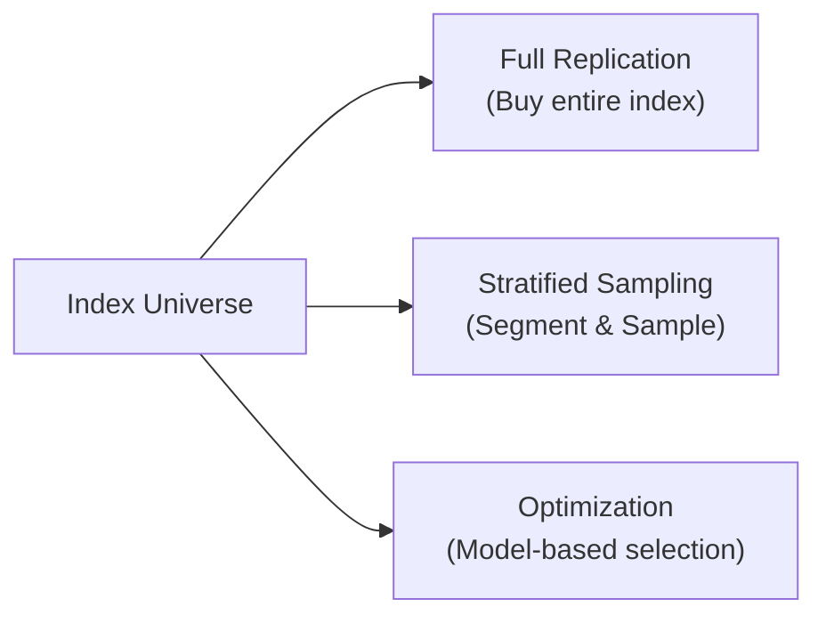

## Overview

If you’re managing a fund that’s supposed to track an index, you’ve basically got one big question: “How do I replicate this index so closely that my investors barely notice any performance difference—yet keep my costs under control?” In the next few sections, we’ll talk about three major approaches: full replication, stratified sampling, and optimization. Each has its quirks, each has its benefits, and—like a lot of things in finance—no single approach suits every situation. 

Before diving into particulars, let’s look at a quick overview diagram:

When I first started working at an asset management firm, I remember being amazed at how complicated it was just to track an index. I mean, you’d think “Just buy the same stocks!”—right? But with thousands of constituents, illiquid small-caps, daily inflows and outflows, and a million other logistical details, you see quickly that there's more to the puzzle than meets the eye. Let's explore.

## Full Replication

Full replication is the simplest—and in many ways the purest—method. You just buy every security in the index in the exact proportion the index dictates. If the index is 2.45% in Company A, your portfolio is 2.45% in Company A, and so on, across all index constituents.

### How It Works

• You identify the stocks in the index and each of their weights.  
• You purchase the exact same securities with matching weights.  
• You regularly rebalance to keep the fraction of each security in line with the index’s updates.

This method typically provides minimal sampling error—by definition, you're mirroring the index perfectly at every point in time (although day-to-day divergences can happen when there’s a slight lag in rebalancing or if you’re dealing with ongoing inflows/outflows).

### Advantages
• Minimum tracking error (in theory) since your holdings match the index.  
• Straightforward to understand: there’s no guesswork about which stocks to include or exclude.  

### Disadvantages 
• Potentially expensive, especially if the index contains many illiquid or small-cap names. Trading costs can pile up.  
• Capital-intensive if the index is large and widely diversified.  
• Can still face administrative complexity if you’re frequently adjusting small positions every time the index reconstitutes or experiences drift.

In my early days, I remember my portfolio manager complaining about the implementation shortfall from picking up obscenely small positions in micro-caps—just because the index had a 0.01% weighting in them. “We’re paying more in commissions than the total value of this stock!” he would lament. That’s the trade-off with full replication: top-notch fidelity, but not always a friendly cost structure.

## Stratified Sampling

Stratified sampling, sometimes called “representative sampling,” is a more nuanced approach. Instead of buying every single stock in the index, you divide the index into separate groups (or strata). These groups could be based on sectors, industries, size buckets, value vs. growth—whatever the manager deems relevant. Then you select a few representative stocks from each stratum.

### How It Works

1. Segment the index into homogenous groups (e.g., technology stocks, healthcare stocks, small-caps, large-caps, etc.).  
2. Target the same overall allocation to each segment as the index does.  
3. Within each segment, pick a smaller set of representative securities that are believed to capture the segment’s characteristics.  

You wind up with fewer overall holdings, which cuts trading costs. But you’re also skipping some names, so your portfolio might not track the index as tightly.

### Advantages

• Lower transaction and administrative costs (fewer names to buy or sell).  
• Easier to rebalance than a full replication portfolio—fewer holdings to adjust when money flows in or out.  
• Allows managers to incorporate some sector-level or style-level views if they wish.

### Disadvantages

• Potential for higher tracking error. Omitting certain stocks might cause the index to move differently than your (more limited) portfolio.  
• Requires skill to identify representative stocks in each stratum.  
• Changes in the market can blow up your “representative picks” if your chosen subset doesn’t keep pace with the broader strata.

An analogy: if the index is a huge buffet with every type of dish, stratified sampling is taking a few plates that best represent each cuisine style. You won’t sample every dish—so you might miss that spicy local favorite that’s a big mover in the market.  

## Optimization

Optimization uses advanced mathematical models—often some form of mean–variance optimization (MVO) or a factor-based approach—to select a (hopefully) smaller set of stocks that replicates the index’s overall behaviors. The idea is to minimize tracking error: the difference between your portfolio’s returns and the index’s returns.

### How It Works

1. Identify key risk factors and correlations between stocks using a factor model and/or historical covariance matrices.  
2. Use an optimization algorithm to find the portfolio weights that best replicate the index’s factor exposures, while respecting constraints (such as the total number of securities you want to hold).  
3. Solve for the “optimal” subset of securities that yields minimal expected deviation from the index over time.  

Mathematically, many managers define the portfolio to minimize a function like:


\text{Minimize} \quad \sum_{t=1}^{T} (R_{p,t} - R_{i,t})^2,


subject to constraints on the number of stocks, total investment, factor tilts, etc.

In a more formal notation, a popular approach is:


\displaystyle 
\text{Minimize } 
\left\| \mathbf{w}^\top \mathbf{F} - \mathbf{w}_i^\top \mathbf{F} \right\|^2 


where:
- \\(\mathbf{w}\\) is your portfolio weight vector,
- \\(\mathbf{w}_i\\) is the index weight vector,
- \\(\mathbf{F}\\) is a matrix of factor exposures.

### Advantages

• Can achieve close tracking with far fewer positions.  
• Potentially more flexible—managers can incorporate advanced risk constraints, liquidity constraints, and so on.  
• Often used as a cost-effective solution if done well.

### Disadvantages

• Relies heavily on the quality of the input data (factor loadings, correlations, and volatility estimates).  
• If the model is off—say, covariance estimates are stale or factor exposures are incorrectly measured—tracking error may blow up.  
• More complex to run. Requires skilled people, robust systems, and constant data updates.

One time, I saw an optimization-based replication go haywire because the risk model had stale correlation data for a small group of regional banks. The portfolio ended up overweight in a cluster of names that were assumed (wrongly) to be uncorrelated with the broader market. It was all good—until one of those banks had big credit issues that quickly spread to the others in the cluster. The system’s default correlation assumptions missed the real economic link, and performance took a hit. Moral of the story: fancy doesn’t always mean foolproof.

## Liquidity Considerations

Liquidity can make or break your replication strategy. If an index includes ample small-cap stocks, full replication exposes you to the hidden costs of trading illiquid shares. Stratified sampling and optimization can pare down those illiquid exposures, but they might also increase your tracking error if, ironically, those illiquid stocks surge or crash.

Even large-cap indexes may contain segments with lesser liquidity. As an index replicator, you need to consider the market impact of your trades, bid–ask spreads, and overall transaction costs.  
 
Managers frequently track the average daily volume and relative liquidity of each index constant to decide:  
• Which individual names to omit (in a sampling strategy)?  
• How to set constraints in the optimization?  
• How big each purchase or sale can be before market impact becomes an issue?

## Cost vs. Tracking Precision

There’s a clear tension between cost and how precisely you track the index. Full replication is the best at matching the index day after day, but it can be expensive when rebalancing, especially if you’re forced to trade small-lot or illiquid stocks. Meanwhile, stratified sampling and optimization can keep costs lower. Yet they might produce a bit more “wiggle” versus the index, especially in volatile markets or in cases where your chosen subset is less representative than expected.

Either way, tracking error is a key metric:


\displaystyle 
\text{Tracking Error (TE)} 
= \sqrt{\frac{1}{n-1}\sum_{t=1}^{n}\bigl(R_{p,t}-R_{i,t}\bigr)^2}. 


Minimizing TE is the golden standard for an index replicator. But remember: no strategy can eliminate TE entirely because you have frictional costs, rebalancing lags, and other real-world constraints.

## Rebalancing Frequency

Let’s say the index rebalances quarterly. How often should you rebalance your replication portfolio? Well, “it depends.” Rebalancing more frequently will likely minimize short-term drift from the index’s actual weights. However, it also racks up trading costs.  

• Full replication strategies might approximate the official rebalancing schedule more closely, possibly with monthly or even more frequent tune-ups to remain highly aligned.  
• Stratified sampling managers might prefer fewer rebalances, given that each rebalance can be time-consuming (selecting new representative stocks each time).  
• Optimization-based approaches often incorporate rebalancing triggers, such as tracking error thresholds, new information on factor exposures, or changes in liquidity conditions.  

A manager might wait until the TE hits a certain threshold or when actual weights drift from their target weights. The sweet spot usually balances cost and desired tracking accuracy.

## Practical Implementation and Blended Approaches

In real life, many managers choose not to be purists. They might do partial replication on the largest stocks (those that represent, say, 80–90% of the index’s market cap) and then apply an optimization or sampling method for the smaller holdings. This is a best-of-both-worlds approach:

- Large low-cost coverage of the high-capacity stocks.  
- Selective handling or factor-based modeling of smaller, less liquid names.  

It’s not unusual for an optimized strategy to incorporate a stratified sampling layer or constraints that replicate major sectors precisely while letting the model pick among smaller names.

## Manager Skill and Data Quality

You’d be surprised how often replication success hinges on the “softer” stuff: the manager’s skill, the analytics team’s savvy, the IT infrastructure, the timeliness of market data. 

• **Optimization approaches** can go astray with flawed factor models or out-of-date covariance matrices.  
• **Stratified sampling** can be less effective if the strata definitions are suboptimal (e.g., not capturing the real differences in the index).  
• **Full replication** can fail if there’s poor execution strategy for illiquid positions, resulting in high trading costs that degrade returns.

Good data is critical. If you suspect that correlation estimates are stale or that factor exposures are miscalculated, it’s probably better to adopt a simpler approach. The right strategy also depends on the size of your fund, your rebalancing budget, and your team’s capacity for managing sophisticated tools.

## Common Pitfalls and Best Practices

• **Pitfall - Over-Confidence in Models:** Don’t assume your factor or optimization model is the “truth.” Market relationships change, and so do correlations.  
• **Pitfall - Neglecting Execution Costs:** Even if you choose the right approach, sloppy trade execution can fuse away your advantage. Implementation shortfall is real.  
• **Pitfall - Over-Segmentation in Stratified Sampling:** Too many slices can lead to complexity and potentially higher trading costs than you anticipate.  
• **Best Practice - Testing & Simulation:** For any approach, run historical simulations. Evaluate how your strategy would have performed in past bull, bear, and sideways markets.  
• **Best Practice - Data Verification:** Double-check the reliability of data feeds, especially if you rely on them in real-time or if your portfolio frequently rebalances.  
• **Best Practice - Ongoing Process Review:** The market evolves, indexing methodologies evolve, and your approach might need to adapt to new circumstances or new data realities.

## Conclusion for CFA® Candidates

If you’re a CFA Level III candidate, you probably want to master these replication methods so you can confidently address exam questions about index-based investing. Expect scenario-based queries that ask you to compare cost, tracking error, liquidity, or rebalancing approaches anytime a portfolio manager chooses one method over another. Keep these points in mind:

• Understand that full replication is straightforward but expensive for large, diverse indexes.  
• Stratified sampling is common for mid- to large-cap indexes where partial coverage can still produce acceptable tracking.  
• Optimization can handle complex constraints and reduce the number of holdings significantly, but it’s only as good as your factor model and data.  

Keeping an eye on real-world constraints—liquidity, transaction costs, and data consistency—can significantly shape the final outcome.

## References & Further Reading

- Grinold, Richard C., and Ronald N. Kahn. “Active Portfolio Management: A Quantitative Approach.” McGraw‑Hill.  
- Roll, Richard. “A Mean/Variance Analysis of Tracking Error.” Journal of Portfolio Management.  
- CFA Institute. “Methods of Index Construction and Maintenance.”  
- Russell Indices. “Fundamentals of Replication Methodologies.”

---

## Test Your Knowledge: Index Replication Quiz



### Which method of index replication typically aims to purchase all the constituents of the benchmark in the exact same weights?

- [x] Full replication
- [ ] Stratified sampling
- [ ] Optimization
- [ ] Factor replication

> **Explanation:** Full replication involves holding every security in the index at the same proportion as the index, leading to minimal tracking error but potentially high transaction costs.

### In a stratified sampling approach, which of the following is most critical to ensure the portfolio adequately reflects the index?

- [ ] Including every single stock regardless of liquidity
- [x] Proper segmenting of the index into homogeneous groups
- [ ] Minimizing the number of securities in the portfolio
- [ ] Avoiding rebalancing to keep costs down

> **Explanation:** Stratified sampling hinges on segmenting the index (by sector, size, style, etc.), then selecting representative stocks from each segment. Without good segmentation, you risk higher tracking error.

### Which of the following best describes a key advantage of optimization-based index replication?

- [ ] It requires no trading costs at all
- [x] It allows you to minimize tracking error using a smaller number of positions
- [ ] It ensures zero tracking error by default
- [ ] It requires no rebalancing, saving costs

> **Explanation:** Optimization-based replication uses factor models and covariances to minimize tracking error relative to the index, even with fewer holdings. However, it does not inherently guarantee zero tracking error and certainly requires some rebalancing.

### Suppose a manager notices her optimized index replication strategy performs poorly after correlation estimates between certain stock groups become outdated. Which best explains what went wrong?

- [ ] She implemented too many rebalancings
- [ ] She used stratified sampling incorrectly
- [x] Her risk model inputs were stale, leading to faulty optimization
- [ ] She relied on too many actively managed positions

> **Explanation:** Optimization depends heavily on accurate estimates of correlations (covariances). When those inputs become stale or inaccurate, the resulting portfolio may deviate from the index significantly, increasing tracking error.

### In full replication, which of the following is a common challenge?

- [x] Illiquid stocks can be costly to trade and maintain
- [ ] The risk of not holding enough stocks
- [ ] High exposure to factor biases
- [ ] Over-dependence on advanced factor models

> **Explanation:** Buying every stock in the index, including illiquid ones, can drive up costs due to wide bid–ask spreads and market impact. Hence, illiquidity is a major concern.

### A portfolio manager breaks down an index into value, growth, and core categories, then selects five stocks from each category to match the overall index proportions. This is an example of:

- [ ] Factor-based optimization
- [x] Stratified sampling
- [ ] Full replication
- [ ] Synthetic replication

> **Explanation:** Stratified sampling involves segmenting the index into distinct categories (like value, growth, core) and picking representative stocks from each.

### What is a primary benefit of blending full replication on large-cap stocks with optimization on small-cap stocks?

- [ ] Eliminating the need to hold large-cap stocks  
- [x] Reducing costs while keeping overall tracking error in check  
- [ ] Guaranteeing zero transaction costs  
- [ ] Ensuring daily rebalancing is done automatically

> **Explanation:** Large-cap stocks are often liquid and can be replicated fully with less cost impact. For smaller, illiquid stocks, an optimization-based or sampling approach can reduce excessive trading costs. This blend can lower overall costs while maintaining reasonable tracking accuracy.

### How would frequent rebalancing most directly impact a full replication strategy?

- [ ] It significantly reduces trading costs
- [x] It helps keep the portfolio aligned with index weights
- [ ] It eliminates the need for illiquid holdings
- [ ] It automatically improves liquidity in small caps

> **Explanation:** More frequent rebalancing aligns the portfolio closer to the index’s updated weights, reducing short-term drift, albeit at higher trading costs.

### Which scenario is a best practice to mitigate potential stale data in an optimization approach?

- [x] Updating factor exposures and covariances frequently
- [ ] Waiting for index constituents to change first
- [ ] Using only the last two weeks of data
- [ ] Avoiding usage of a risk model altogether

> **Explanation:** Optimization heavily depends on the integrity and timeliness of factor exposures, volatilities, and correlations. Updating them frequently can mitigate the risk of relying on outdated assumptions.

### True or False: Full replication typically results in lower tracking error but higher transaction costs compared to stratified sampling or optimization.

- [x] True
- [ ] False

> **Explanation:** Full replication accurately follows the index (low tracking error) but can be costly due to increased trading in illiquid shares, frequent rebalancing, and the sheer number of positions.


