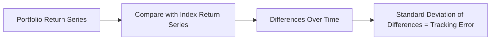
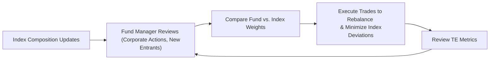

Introduction  
Sometimes, index-based investing can feel deceptively simple. You buy all the stocks in an index—et voilà, your return should match that index, right? Well, in theory, yes. But in practice, you usually end up just a tiny bit off from matching the index perfectly. That little gap between your fund’s return and the index return is what we call tracking error. Over my career, I’ve seen new analysts assume that tracking error is trivial. But get this: even a few basis points of slippage add up over time, especially when large amounts of money are at play. Minimizing that difference is where the craftsmanship of index management comes in.

Defining Tracking Error  
Tracking error (TE) is a key metric that measures how much a portfolio’s returns deviate from its benchmark over time. Usually, we quantify it as the standard deviation of the difference between the portfolio’s returns (Rp) and the index’s returns (Ri). Mathematically, we might say:

K_aTeX formula (for display):  
RDiffₜ = Rpₜ – Riₜ

Tracking Error = σ(RDiffₜ)

where RDiffₜ is the return difference at time t. The standard deviation of that difference over a specified time horizon is your TE. This metric is one of the first things institutional investors check to see if an index fund is “hugging” the index as closely as expected.

Below is a conceptual flowchart visualizing the relationship between portfolio returns and benchmark returns when we calculate tracking error:

Most folks actively using index funds want TE to be as low as possible—especially if the primary goal is to replicate the index rather than beat it.

Primary Drivers of Tracking Error  
If you ask any index manager about the main reasons for tracking error, you’ll usually hear a consistent list.

• Transaction Costs and Fees.  
Fund managers face brokerage fees, commissions, and bid-ask spreads. Even small costs can accumulate over the year, making net returns dip below the benchmark. Administrative and management fees also chip away at performance, causing the fund’s net returns to lag the index.  

• Cash Drag.  
Cash inflows or outflows slow your performance if that cash isn’t invested quickly or is temporarily left idle. When markets are rallying, any uninvested cash directly lowers returns, creating a performance gap. Similarly, if investors redeem shares, the fund might be forced to sell index constituents at imperfect times.  

• Sampling vs. Full Replication.  
Some index funds hold an optimized subset of securities rather than every single security in the index—this is common when the index has thousands of constituents. If the sampling doesn’t mimic the index well enough, any differences in security performance can push returns away from the benchmark.  

• Corporate Actions and Index Rebalancing Delays.  
Corporate actions—like stock splits, rights issues, or spin-offs—can create short-lived divergences. If an index rebalances but your fund doesn’t immediately adjust holdings, you can deviate from index returns. Timing is everything here.  

• Timing Differences in Dividend Reinvestments.  
The index might assume dividends are reinvested at the ex-dividend date, while real-world funds might only reinvest once the dividend is actually received. In a rising market, that short delay can cause performance lags.  

At first, these issues can seem like small nuisances. But I vividly recall, earlier in my career, working under a portfolio manager who was almost obsessively precise about dividend reinvestment timing. The difference of a few days sometimes shifted the entire monthly tracking error by several basis points. It was a lesson in how meticulous you have to be when tracking an index.

Sources of Return in Index Portfolios  
While the bulk of an index fund’s returns come from the market itself (that good old concept of beta), there are a couple of side benefits that can add incrementally to performance.

• Market Return (Beta).  
Index funds are designed primarily to capture the broad market return. By definition, if an index goes up by, say, 10%, a perfectly replicated index fund would—before fees—deliver right around 10%.  

• Securities Lending Revenue.  
In some cases, portfolio managers lend out securities to short sellers or other market participants in exchange for a fee. This revenue can help offset many of the operational expenses of the fund, effectively improving net returns. Using securities lending to reduce expenses has become a well-known best practice among large index fund providers.  

• Dividend Reinvestment Strategies.  
If dividends are reinvested quickly and efficiently, it can produce slightly higher returns than the official index if the index uses a slower or a different reinvestment assumption. Of course, this depends on precise execution and the timing mismatch can either add or subtract from your performance.  

Risk Characteristics of Index-Based Portfolios  
Like we discuss in other parts of Chapter 1, the goal of an index-based strategy is not to pick winners but to replicate an entire basket of securities. This approach carries systematic risk—the risk of the overall market. When the index sees a downturn, the fund will track right along with it. By design, passive strategies don’t employ significant tactical shifts to mitigate market drawdowns. They also concentrate risk within the composition of the benchmark. For instance, if the index is heavily weighted in technology stocks, your portfolio is, too, and that can be a bumpy ride during volatile times.  

Minimizing Unintended Risks  
To keep that tracking error as small as possible, index managers do lots of housekeeping behind the scenes:

• Staying Updated with Index Changes.  
Managers must monitor every announced rebalance or reconstitution so that newly added securities are purchased and outgoing constituents are sold promptly. Mis-timing these trades can result in performance drift.  

• Handling Cash Flows Efficiently.  
Managers strive to keep minimal cash on hand. Overnight sweeps and same-day settlement solutions can help reduce the drag from idle cash. Also, if large inflows or outflows are expected, managers can plan block trades or coordinate crossing networks to lower transaction costs.  

• Consistent Treatment of Corporate Actions.  
Each corporate action must be processed in the same manner the index provider expects. For instance, if a stock is spun off and the index provider includes the spinoff’s shares in the index at a certain ratio, the fund needs to do likewise almost instantaneously.  

• Careful Sampling Approaches.  
If full replication isn’t feasible (maybe because the index is huge or includes illiquid stocks), managers should systematically sample the index. The sampling process might rely on advanced optimization models to replicate factor exposures, sector weights, and liquidity constraints.  

Gross vs. Net Returns  
When evaluating the performance of an index fund, it’s crucial to look at gross vs. net returns. Gross returns are simply the returns before deducting expense ratios, transaction costs, taxes, and any other fees. Net returns are what investors actually take home. Both matter:

• Net returns for an investor reflect the real outcome, especially after fees, which can erode returns.  
• Gross returns help you gauge how well the index replication is working in principle—without the “cost drag.”  

In real-world performance reporting, you often see a difference of anywhere from a few basis points in large, well-run passive funds to several tens of basis points in smaller or more expensive index solutions.

Performance Evaluation  
Absolute returns and relative returns both matter in index-based investing. How close is your fund to matching the index? And how does your net performance compare to other possible investment routes that might aim at the same exposure?

• Absolute Returns.  
In bull markets, an S&P 500 fund’s absolute return might be fantastic if the index roars higher. In bear markets, the opposite is true.  

• Relative Returns.  
Sometimes referred to as “excess return” in an indexing context, it’s the difference between the fund’s returns and its benchmark. If an index manager says, “We outperformed by 4 basis points after fees,” that is a measure of relative return.  

• After-Fee Performance.  
From a fiduciary or client-centric perspective, after-fee performance is often the real number that matters. Maybe your manager invests in securities-lending revenue programs that often help offset fees. Then your after-fee performance might be close to the index’s gross returns.

Let’s consider a brief, simplified example:

• Suppose an index returns 10.00% this year.  
• Your fund achieves a gross return of 9.92%.  
• After a 0.10% expense ratio, that net return is 9.82%.  

In this example, the relative return compared to the index is –0.18%, and your tracking error (across multiple periods) will reflect how consistently that gap changes over time.

A Quick Numerical Touchpoint on TE  
Imagine a scenario where each month we calculate the difference between the fund and the benchmark. Over a year:

Month | Index Return (%) | Fund Return (%) | Difference (%)  
Jan   |  2.0             |   1.9           |  –0.1  
Feb   |  1.0             |   1.0           |   0.0  
Mar   |  2.5             |   2.4           |  –0.1  
Apr   |  0.0             |   0.1           |   0.1  
… (and so on)  

If we gather all monthly differences (12 data points) and compute the standard deviation of those differences, we get the annualized TE. Over many months, maybe we see a TE of 0.10%. That’s not bad at all. Some large index funds have TEs of just a few basis points—indicating extremely close replication.

Keys to Managing Index Fund Risks  
1) Optimize Replication: A well-thought-out sampling or optimization approach can align factor exposures with the benchmark, reducing style or sector bets.  
2) Leverage Scale: Larger funds often benefit from cheaper transaction costs or more established securities lending platforms, contributing to lower fees and better net returns.  
3) Seek Operational Efficiency: Timely rebalancing, well-controlled corporate action processing, and tight management of inflows/outflows all help minimize performance slippage.  
4) Align with Client Expectations: The CFA Institute Code and Standards emphasizes the importance of setting clear expectations. If an investor is promised “index-like returns,” they shouldn’t be surprised by a big performance gap.  

Practical Case Study: “Global Equity Example”  
Imagine a global equity index with thousands of stocks. A fund manager might not want to replicate them all—why? Because transaction costs for collecting small positions in illiquid emerging-market stocks could be astronomical. Instead, the manager implements a stratified sampling approach, focusing on major countries, sectors, and market capitalization tiers. Over time, the manager monitors daily performance, adjusting or fine-tuning which stocks are included in the sample. By retaining the correct weight in large technology stocks, big banks, and so on, the manager can keep the fund’s overall factor exposures in line with the index. Even so, some short-term divergences might pop up, especially if a newly included country or sector is added to the index but the manager lags a couple of days behind.

Diagrams and Tables  
It often helps to visualize the process of mitigating tracking error. Here is a partial conceptual diagram of dynamic rebalancing to manage TE:

In this cycle, the fund manager continually reviews compositional changes, executes rebalancing trades, and monitors the resulting tracking error. Such a feedback loop helps keep the fund aligned with the benchmark.

Final Observations  
Index-based strategies are typically seen as more cost-effective and transparent than many active strategies, but they aren’t truly “set it and forget it.” Managing an index fund requires systematic discipline to minimize TE, handle cash flows, and swiftly incorporate index changes. Once you’re aware of the many drivers of TE and the ways to manage them, you’ll see that successful index tracking is more of an art than a science.

Exam Tips  
• In exam scenarios (particularly for CFA® Level III question sets), you might be asked to interpret a fund’s reported TE. Practice explaining how fees, market impact, and rebalancing decisions shape TE.  
• You could see calculations with a small dataset. Be prepared to compute the standard deviation of the difference in returns for a few time periods.  
• Don’t jump to the conclusion that a lower TE is always better in real life. Sometimes sampling or partial replication is chosen to reduce costs or incorporate certain factor tilts. Context matters.  
• Keep ethical standards in mind. When describing your index funds to clients, ensure your claims about expected TE and net returns are well-grounded.  

References  
• Rouwenhorst, K. Geert. “International Momentum Strategies.” Journal of Finance.  
• CFA Institute: “Measuring and Evaluating Portfolio Returns.”  
• BlackRock iShares: “Guide to Tracking Error and Index Transparency.”  
• Kritzman, Mark. “Portfolio Performance Measurement and Benchmarking.” McGraw‑Hill.  

## Test Your Knowledge: Tracking Error, Returns, and Risk in Index Funds



### A portfolio's tracking error measures:
- [ ] The volatility of the portfolio's absolute returns.
- [ ] The difference between gross and net returns.
- [x] The standard deviation of the portfolio’s return minus the index return.
- [ ] The correlation between the portfolio’s returns and benchmark returns.

> **Explanation:** Tracking error is conventionally calculated as the standard deviation of the portfolio’s excess return over its benchmark.

### Which of the following can reduce tracking error in an index-based portfolio?
- [ ] Holding extra cash to handle redemptions immediately.
- [x] Efficient replication and prompt reinvestment of dividends.
- [ ] Frequent pursuit of active stock selection.
- [ ] Maintaining a single share class.

> **Explanation:** Efficient replication—including prompt dividend reinvestments—narrows the gap between the fund and the index. Holding extra cash above a necessary threshold introduces cash drag and may increase TE.

### A fund manager notices that her index-based portfolio has higher tracking error than expected. Which of the following factors is least likely to explain this outcome?
- [ ] Delays in reinvesting dividends.
- [x] Frequent rebalancing to match the index.
- [ ] Sampling instead of full replication.
- [ ] Higher transaction costs than budgeted.

> **Explanation:** Frequent rebalancing to match the index is usually done to minimize tracking error (though sometimes excessive trading can raise costs). The other factors generally push tracking error higher.

### When assessing sources of return in an index-based portfolio, which is considered a primary driver of performance?
- [ ] Market neutral strategies.
- [x] Market return (beta).
- [ ] Stock-specific alpha.
- [ ] Currency hedging tactics.

> **Explanation:** The fundamental driver is the market’s return itself, which index portfolios aim to capture.

### In the context of index-based investing, the term “cash drag” refers to:
- [x] Reduced returns caused by uninvested cash balances.
- [ ] Excess returns from cash held in money market instruments.
- [x] A method to minimize reinvestment risk.
- [ ] One way to enhance performance in rising markets.

> **Explanation:** Cash drag usually occurs when a portion of the portfolio is temporarily in cash, thereby missing gains when the market is rising. It can also reduce losses when the market is falling, but typically is viewed negatively.

### What best describes an outcome of securities lending in an index-based portfolio?
- [x] Earning additional income, thereby potentially offsetting fees and lowering net tracking error.
- [ ] Reducing the index’s volatility.
- [ ] Boosting leverage through borrowed funds.
- [ ] Presetting systematic short exposure.

> **Explanation:** Securities lending is a technique that can capture additional income. By using it to offset expenses, net tracking error can be reduced.

### Which key risk is most common when relying on sampling rather than full replication for index tracking?
- [ ] Credit risk from less liquid holdings.
- [ ] Market participants front-running index changes.
- [x] Deviation from the index’s factor exposures or weightings.
- [ ] Excessive portfolio turnover.

> **Explanation:** Sampling can result in mismatches with the index’s sector or factor exposures, introducing additional return differences that can raise TE.

### Why might an index fund’s reported net return be lower than its gross return even when the benchmark is identical?
- [ ] Random changes in inflation rates.
- [ ] Unrealized market fluctuations.
- [x] The deduction of fees, operational costs, and transaction expenses.
- [ ] A sudden macroeconomic recession.

> **Explanation:** The difference between gross and net returns arises from management fees, transaction costs, and other expenses.

### Which of the following best describes the relationship between market risk and index-based equity funds?
- [x] They carry the market’s systematic risk without active defensive actions.
- [ ] They neutralize systematic risk by diversifying across multiple assets.
- [ ] They hedge all beta exposure to achieve alpha.
- [ ] They significantly reduce volatility through factor tilts.

> **Explanation:** An index-based strategy is passively exposed to the market’s systematic (beta) risk. The portfolio is not usually designed to hedge or remove that risk.

### Index-based investments are more likely to:
- [x] Accept market downturns without adjustments.
- [ ] Engage in frequent short-term trading to outperform.
- [ ] Place concentrated bets on out-of-favor stocks.
- [ ] Neutralize all systematic risk with derivatives.

> **Explanation:** A passive index fund is designed to track its benchmark, including any market downturns, without attempting to sidestep them.


