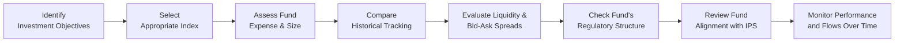

## Introduction and Context

Index-based equity strategies have become a mainstay in modern portfolio management, offering cost-effective and transparent ways to gain broad market exposure. In previous sections (see 1.1 for the Rationale of Index‑Based Equity Investing and 1.2 for a discussion on weighting approaches), we covered how these products fit into an overall equity allocation. Here, the focus is on evaluating and monitoring index-based investments on an ongoing basis. Even though an index fund or ETF may appear straightforward—after all, it’s “just” tracking a benchmark—ensuring that the product you pick remains well-aligned with your investment objectives, risk tolerance, and broader policy constraints is an ongoing challenge. 

I remember a conversation with a colleague who said, “It’s an index fund—what’s there to monitor?” Well, plenty! From tracking error to fund flows and liquidity, it’s essential to pay attention. If you care about the difference between your expected returns and real-life outcomes, then evaluating and monitoring index investments is not just recommended but key to your success.

Below, we’ll explore criteria for selecting an index fund or ETF, standard approaches to ongoing performance evaluation, considerations around liquidity and spreads, and how to maintain alignment with the Investment Policy Statement (IPS). We’ll also show how to interpret key metrics like tracking difference and expense ratios. By the end of this discussion, you’ll have a stronger sense of how to choose the right index product—and how to keep an eye on it over time.

## Key Selection Criteria

When considering any index-based investment, whether it’s an ETF or a mutual fund, there are important yardsticks to evaluate:

### Index Methodology and Investment Universe

The underlying index methodology is foundational. Some indexes track broad-based market segments, while others have narrower mandates such as sectors, geographies, or factor exposures. Importantly, the index’s construction—be it market-cap weighted, equal-weighted, or fundamentally weighted—affects portfolio behavior. Before you invest, it’s wise to explore Section 1.2, where we discussed differences in weighting approaches, to ensure the chosen index methodology aligns with your investment thesis.

Some questions to ask:
• How frequently is the index reconstituted and rebalanced?  
• Are there constraints on sector, country, or factor exposure?  
• Does the methodology exclude certain stocks (e.g., based on ESG criteria)?  

A narrower universe can lead to more volatile returns, so be sure you’re structurally comfortable with that trade-off. 

### Expense Ratio and Total Cost of Ownership

Expense ratios are often the first number people compare—understandably so, because fees directly reduce your net returns. But expense ratios alone don’t tell the full story. For ETFs, transaction fees and bid-ask spreads can subtly eat away at returns, especially if you trade frequently. For index mutual funds, there may be fees if you redeem shares within a certain time or if you don’t meet minimum holding requirements. Interestingly, sometimes an index mutual fund with a slightly higher published expense ratio might still be cheaper for certain types of investors if it offers a more favorable share class or if your trading volume is low.

### Fund Size (Assets Under Management, AUM)

A fund’s size can matter—larger funds tend to enjoy economies of scale that come in handy for minimizing expenses, facilitating more efficient rebalancing, and keeping trading costs under control. That said, a fund that is too large may also face challenges replicating smaller components of the index, especially if it invests in less liquid stocks. For example, you might see large funds that own a huge percentage of thinly traded small-cap stocks. This can lead to market impact costs when they rebalance or meet redemptions.

### Historical Tracking Error

Tracking error measures how closely a fund’s performance tracks that of its benchmark. Even a purely passive strategy needs to buy and sell securities to handle inflows, outflows, and index reconstitutions. These factors create small deviations from the index’s performance. 

• Frequent rebalancing or more complicated indexes (like multi-factor or sector-based) may see higher tracking error.  
• A low tracking error is obviously desirable. But watch out for funds that claim zero tracking error—there can be short-term illusions or data reporting discrepancies.  

In practice, many investors also monitor tracking difference, which simply measures the difference in total return between the fund and the index over a specified time. While the terms “tracking error” and “tracking difference” are sometimes used interchangeably, they measure slightly different aspects of performance discrepancy.

## Ongoing Monitoring of Index Investments

### Performance Evaluation Relative to the Benchmark

An obvious place to start, but frequently overlooked in detail: compare actual fund performance to the benchmark at regular intervals—monthly, quarterly, and annually. Beyond absolute performance, it’s prudent to break down the excess return (or shortfall) due to:

• Management fees and expense ratio.  
• Portfolio turnover and transaction costs.  
• Cash drag (when the manager holds cash for liquidity needs).  
• Any sampling or optimization approach (discussed in Section 1.3).  

You might be surprised how quickly small differences accumulate. Keeping a regular scorecard helps detect if the fund’s performance is drifting from expectations. 

### Changes in Index Rules or Provider Methodology

Indexes themselves are not static. Over time, the index provider might:
• Change indexing rules or the reconstitution schedule.  
• Add or remove certain securities based on new classification criteria.  
• Merge with another index provider, altering product definitions.  

I recall a situation years ago where an emerging markets index changed its classification criteria for frontier markets. That single change altered the risk/return profile of the index significantly—something a friend of mine discovered too late when the fund started drifting from the expected return profile. The lesson: keep tabs on announcements from index providers and check the weights and constituents regularly.

### Liquidity, Bid-Ask Spreads, and Trading Efficiency

Monitoring liquidity is critical: even if you hold for the long term, there can be times (especially in volatile markets) when you need to trade or rebalance. High liquidity in the underlying securities typically translates into tighter bid-ask spreads for ETFs. Lower spreads reduce the total cost of ownership, though you may also face greater volatility in times of market stress.

For mutual funds, “liquidity” is less about intraday trading and more about whether you can redeem shares at the end of the trading day at a fair NAV. Nonetheless, certain funds might impose restrictions on how quickly you can redeem or have short-term redemption fees—important to keep in mind if you anticipate frequent shifts.

### Potential Shifts in Tracking Error

Tracking error can creep up for various reasons, such as changing liquidity conditions, large inflows/outflows, changes in fund managers or sub-advisors, and shifting portfolio compositions. If you’re seeing a consistent increase in tracking error that doesn’t appear to be temporary, it’s a signal to dig deeper.

## Fund Management Quality

Even “passive” investments rely on highly methodical fund managers (or investment teams) to replicate the index as efficiently as possible. While active skill is not the primary driver of returns, a manager’s expertise influences:

• Handling of index events like rebalancing and corporate actions.  
• Minimization of tracking error via full replication or optimized sampling.  
• Effective use of technology and algorithmic tools for trade execution.  

Reputation counts—you’ll often notice that brands with a strong presence in passive management (like certain large global asset managers) tend to handle rebalancing and tracking better. That’s partly thanks to robust infrastructure and longstanding relationships with brokers and market makers.

## Operational Churn and Asset Flows

Fund flows matter more than many realize. Large, sudden inflows can mean the fund manager must buy a large volume of securities quickly, driving up transaction costs and temporarily increasing tracking error. On the flip side, big redemptions can force sales and realize capital gains, affecting the after-tax returns for remaining shareholders, especially in jurisdictions with capital gains pass-through requirements.

It’s wise to monitor net inflows and outflows periodically. You can often find that data on fund sponsor websites or third-party analytics tools. A stable or steadily growing asset base tends to benefit shareholders (via consistent rebalancing, lower transaction costs from scale, etc.). Volatility in asset flows can also lead to higher turnover, which can be detrimental if you hold the fund in a taxable account.

## Regulatory and Structural Features

### Differences in Fund Domicile

In the United States, many index mutual funds and ETFs are structured under the Investment Company Act of 1940. In Europe, UCITS (Undertakings for Collective Investment in Transferable Securities) is the regulatory standard. Around the world, you’ll find different regulatory frameworks, each with its own rules about how funds can be marketed, the level of protection provided to investors, and what disclosures are required.

• UCITS funds, for instance, can be sold across EU borders with relative ease, ensuring a broad investor base.  
• U.S. 1940 Act funds have strict disclosure and governance requirements.  

For a global investor, the particular domicile of a fund could influence withholding taxes on dividends, the ability to trade on certain exchanges, compliance with local regulations, and differences in fees.

### Dividend Distribution and Tax Treatment

Some funds distribute dividends regularly, while others accumulate them within the fund. The frequency and manner of dividend distribution can affect your tax situation:
• If the fund distributes dividends frequently, you might incur taxes on dividend payouts even if you reinvest them (depending on your jurisdiction).  
• Accumulating funds often reinvest dividends automatically within the fund, which may be more tax-efficient in some locations.  

Always double-check the fund’s approach to dividends, especially if your investment strategy seeks stable cash flows (as with certain endowments or retiree portfolios).

## ETFs vs. Index Mutual Funds

Both vehicles track market indexes, but each has its own set of benefits and drawbacks:

### ETFs

• Intraday liquidity: ETFs trade on exchanges throughout the day. This can be an advantage if you want to quickly respond to market changes or implement tactical tilts (though do note that continuous trading can also tempt some investors to overtrade).  
• Potentially lower expense ratios: Many popular ETFs compete on fees, often leading to extremely low expense ratios for broad-based markets.  
• Transaction costs: If you buy or sell shares frequently, commissions and bid-ask spreads can add up.  

### Index Mutual Funds

• Simplicity of trading: You buy or redeem directly at the fund’s net asset value (NAV) once per day. It’s straightforward and typically does not involve extra commissions.  
• No intraday price volatility: Some investors prefer the calm of a single price per day rather than the minute-by-minute quotes found in ETFs.  
• Different share classes: Large fund families often offer multiple share classes with different expense ratios, allowing scale benefits for institutional or long-term investors.  

In practice, your preference might boil down to the importance of intraday liquidity and your trading patterns. If you frequently use short-term rebalancing strategies, an ETF might fit better. If your approach is more “buy-and-hold,” an index mutual fund can be the simpler choice.

## Consistency with the IPS

Every aspect of your index-fund selection and monitoring should align with your Investment Policy Statement (IPS). For instance, if your IPS includes an ESG constraint against certain industries, you’ll need an index that either excludes those industries or systematically underweights them. If your IPS states a strict limit on total portfolio fees, that might rule out specialized thematic ETFs with higher expense ratios. 

The IPS is your North Star—any deviation from it, even if that deviation is in “passive” holdings, can undermine your entire asset allocation strategy. Periodically review your index investments to ensure they still fit your broader risk and return profile.

## Best Practices and Common Pitfalls

• Don’t chase “hot” indexes. A new thematic ETF might be all the rage, but if it doesn’t fit your strategic asset allocation, or if the underlying environment changes, you risk style drift and performance disappointment.  
• Watch for “hidden” costs. Low advertised expense ratios can be overshadowed by wide trading spreads, especially on thinly traded ETFs or those focusing on niche segments.  
• Monitor reconstitution events. Index turnover can be surprisingly costly if not managed well, especially in smaller or less liquid markets.  
• Pay attention to tax implications. Funds that frequently distribute capital gains can erode after-tax performance in taxable accounts.  

## Real-World Example: Evaluating a Hypothetical Thematic ETF

Let’s say you’re inspired by emerging technologies in the automotive sector—autonomous and electric vehicles—and you stumble on an ETF that tracks an index of “Global Autonomous & EV Innovators.” It seems like a great idea. But how do you evaluate it?

• Check the index methodology: Does the index screen for actual revenue from these activities, or does it simply hold big tech names that provide partial solutions?  
• Investigate fund size: If the fund has only \$50 million in AUM, is that sustainable? Will you be able to sell quickly if you need to?  
• Look at expense ratios and bid-ask spreads: If the expense ratio is 0.75% and the average bid-ask spread is 0.30%, that’s already more expensive than a broad market ETF with an expense ratio under 0.10%.  
• Examine historical tracking error: If the index is somewhat illiquid or invests in smaller innovative firms, you may see bigger gaps in performance.  
• Regulatory constraints: Check whether it’s UCITS-compliant or a U.S. 1940 Act product and how dividends will be distributed.

If, after a deep look, everything aligns with your objectives, the ETF might be suitable. But if you need a large, liquid vehicle to manage short-term rebalancing or if your IPS has strict cost constraints, this “cool-sounding” product may not fit well.

## Process Flow Diagram

Below is a simple Mermaid.js diagram visualizing a generic process for evaluating and monitoring an index-based fund. It shows each step from selection to continuous review:

## Conclusion and Exam Tips

Evaluating and monitoring index investments is an ongoing process that demands both quantitative and qualitative analysis. You’re not just “buying the market”—you’re buying a specific vehicle that aims to replicate an index. Differences in product structure, fund size, expense ratios, liquidity, and regulatory factors can lead to divergence from the benchmark and potential performance drag.

On the CFA Level III exam, you can expect scenario-based questions that test your ability to select and monitor index products. They might present a hypothetical investor’s IPS and challenge you to identify the best passively managed fund—one that aligns with specific constraints and objectives. You may also find constructed-response questions that request an explanation of how tracking error or other key metrics can impact a portfolio’s returns.

A few final tips:

• Make sure to practice identifying the root causes of tracking error (especially in multi-factor indexes).  
• Demonstrate how you would address persistent underperformance in an index investment during a performance presentation.  
• Don’t forget to incorporate rebalancing costs and tax implications.  

By mastering best practices in evaluating and monitoring index investments, you’ll be well on your way to navigating real-world portfolio decisions and acing relevant exam questions.

## Glossary

• Exchange‑Traded Fund (ETF): An investment fund traded on major stock exchanges, typically tracking an index, offering intraday liquidity.  
• Open‑End Fund (Mutual Fund): A collective investment vehicle that issues and redeems shares at its net asset value (NAV).  
• Tracking Difference: The difference between a fund’s total return and that of its benchmark index over a given period.  
• Bid‑Ask Spread: The difference between the highest price a buyer is willing to pay and the lowest price a seller will accept.  
• UCITS (Undertakings for Collective Investment in Transferable Securities): A regulatory framework in the European Union for collective investment schemes that can be marketed across the EU.  
• IPS (Investment Policy Statement): A document that defines the client’s/investor’s objectives, constraints, and strategies.  
• NAV (Net Asset Value): The per-share value of a mutual fund’s assets minus its liabilities.  
• Liquidity: The degree to which an asset can be quickly bought or sold without significantly affecting its price.

## References and Further Reading

• Malkiel, Burton G. “A Random Walk Down Wall Street.” W.W. Norton & Company.  
• Morningstar: “ETF vs. Mutual Fund Comparison.” (https://www.morningstar.com)  
• CFA Institute: “Introduction to Exchange‑Traded Funds.”  
• Vanguard Portfolio Watch Tools and Updates (https://advisors.vanguard.com)  

These resources provide expanded discussions of both theoretical and practical aspects of index fund selection, performance, and strategies. They’re excellent for additional insight and exam prep.

## Practice Questions: Evaluating and Monitoring Index Investments



### Which of the following is a primary reason for monitoring an index fund’s tracking difference regularly?

- [ ] Ensuring the fund transitions into an actively managed strategy
- [ ] Confirming the fund outperforms a specialized hedge fund index
- [x] Identifying persistent deviations from the benchmark’s performance
- [ ] Determining whether the fund has violated any disclosure requirements

> **Explanation:** Tracking difference compares the total return of the fund to its benchmark over time. Monitoring it regularly helps identify any consistent discrepancies that might indicate inefficiencies in replication, high costs, or structural issues.

### A newly launched ETF has a bid-ask spread of 0.50% on an average trading day, while a comparable index mutual fund has no trading commission. What key consideration should an investor keep in mind when comparing these two?

- [x] The ETF’s bid-ask spread may lead to higher total cost, especially for frequent traders.
- [ ] Index mutual funds always trade at a premium to NAV.
- [ ] The ETF guarantees superior after-tax returns.
- [ ] The ETF’s expense ratio is unaffected by the spread.

> **Explanation:** While index mutual funds typically have no bid-ask spread (they trade at NAV), ETFs can have wider bid-ask spreads. Frequent trading could thus become costly if you choose the ETF with a relatively large spread.

### A fund that tracks a narrow, thematic index might experience higher tracking error compared to a broad market fund primarily because:

- [x] Illiquidity and sector concentration can amplify divergence from the benchmarks.
- [ ] The fund manager is incompetent.
- [ ] The index only updates once a year.
- [ ] The fund invests in multiple global indices simultaneously.

> **Explanation:** Narrow, sector-concentrated, or thematic benchmarks often contain less liquid stocks and can have larger swings in price, thus making near-perfect replication harder. This typically increases tracking error.

### When evaluating the operational churn in an index ETF, which factor is most relevant to consider?

- [ ] The fund’s marketing budget
- [ ] The credit quality of the fund sponsor
- [x] Net inflows and outflows, as they can drive rebalancing costs
- [ ] The sponsor’s historical default rates in bond markets

> **Explanation:** Operational churn largely stems from having to rebalance the portfolio to accommodate new shareholders (inflows) or to satisfy redemptions (outflows). High churn can lead to greater transaction costs and can affect tracking error.

### Why might a large AUM be advantageous for an index fund?

- [ ] It guarantees no tracking error.
- [x] Economies of scale can help reduce trading costs and expense ratios.
- [ ] It allows for frequent changes in investment methodology.
- [ ] It ensures no outflows occur.

> **Explanation:** Larger AUM typically leads to economies of scale, which can lower management fees and enhance operational efficiency. However, large size alone does not guarantee perfect tracking or zero outflows.

### How might a sudden change in index composition affect an index mutual fund?

- [x] It could lead to higher portfolio turnover and increased trading costs.
- [ ] It eliminates the need for rebalancing.
- [ ] It signals the fund to become actively managed.
- [ ] It has no effect since the fund is passive.

> **Explanation:** Even though the fund is passive, it must rebalance to match the new index constituents, generating potential capital gains and transaction costs that can impact performance.

### If a fund is frequently distributing dividends, what is a potential tax-related drawback for certain investors?

- [x] They may incur tax liabilities on dividends even if reinvested.
- [ ] They will pay a one-time capital gains tax only at redemption.
- [x] The fund’s NAV decreases an equivalent amount due to distribution.
- [ ] It reduces the expense ratio significantly.

> **Explanation:** High dividend distribution can be less tax-efficient for investors in taxable accounts, who must often pay taxes annually on the received distributions. Also, distributions reduce the fund’s NAV by the dividend amount.

### A fund states it uses “full replication” to track a broad index. Which statement is typically true?

- [ ] The fund proactively avoids illiquid large-cap stocks.
- [ ] The fund invests only in a sampling of securities representing the index sector breakdown.
- [ ] The fund applies an optimization model but does not hold all constituents.
- [x] The fund holds every security in the index in proportion to its index weight.

> **Explanation:** Full replication implies that the fund owns every constituent of the index in the same proportion as the benchmark, ideally reducing tracking error at the cost of potentially higher transaction costs compared to a sampling strategy.

### Which characteristic of an ETF typically appeals most to tactical or short-term traders?

- [x] Intraday liquidity, allowing them to buy and sell throughout the trading session.
- [ ] Daily redemption at NAV.
- [ ] Guaranteed performance outperformance of the index after fees.
- [ ] Automatic dividend reinvestment inside the fund at year-end.

> **Explanation:** ETFs can be traded intraday, thus attracting investors or traders who wish to respond quickly to market changes. Mutual funds, by contrast, trade at NAV once per day.

### True or False: UCITS-compliant funds allow cross-border marketing throughout the European Union, making them appealing to global investors.

- [x] True
- [ ] False

> **Explanation:** UCITS regulations enable funds to be sold across EU borders under a standardized regulatory framework, which helps broaden the potential investor base and may improve liquidity.


