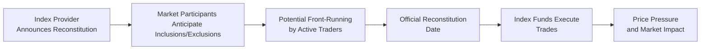

## Introduction

Index reconstitution might sound fancy at first, but honestly, it’s a pretty straightforward idea: every so often, an index provider updates the list of companies in an index—maybe because some companies have grown in market cap, or others have shrunk or been acquired. Over the years, I’ve personally seen times when everyone scrambles right before this happens—like people rushing a store sale on Black Friday. Why? Because being added to (or dropped from) a major index can dramatically affect a stock’s price, often due to the trading decisions of large index funds trying to replicate that index at the moment of reconstitution. In this section, we’re going to explore the nuts and bolts of index reconstitution events, the changes in methodology that index providers periodically make, and how these factors shape our portfolio management decisions.

Before we dive too deep, let’s set the stage. When we say “index,” we’re typically talking about a group of stocks (or other assets, if it’s a fixed income or multi-asset index) chosen according to specific criteria—like size, sector classification, or liquidity. In Chapter 1 of this text, we’ve already discussed the rationale for index‑based equity investing (see Section 1.1), how these indices are weighted (Section 1.2), and methods for replicating them (Section 1.3). Here, we’ll zero in on what happens during and after reconstitution. We’ll look at inclusion/exclusion effects, front-running risk, and even how “float‑adjusted weighting” can disrupt a portfolio’s structure. We’ll also see how the unpredictability or transparency of index changes can help or hurt active managers and even semi-active managers trying to add a little alpha on top of index tracking.

## Significance of Index Reconstitution

Index reconstitution is the process by which index providers update their constituent lists according to pre-stated or sometimes (semi-)secret criteria. Typically, reconstitutions happen on a predictable schedule—a well-known example is the Russell indexes, which announce their annual reconstitution around mid-year. However, some indexes, like certain global equity indexes, might reconstitute more frequently or on a less rigid timeline.

Market participants keep a close eye on these events because:

• Stocks added to an index often see short-term price bumps.  
• Stocks removed from an index often suffer short-term selling pressure.  
• Trading volume can surge, creating liquidity events and unusual trading patterns.  

This entire phenomenon is sometimes referred to as the “inclusion (or exclusion) effect.” If watchers anticipate that a certain mid-cap stock might graduate to a large-cap index, they may start buying it ahead of time. Conversely, if they expect a stock might be dropped from an index, they might short-sell it, anticipating that forced selling by index funds will push down the stock’s price. 

### Concept: Inclusion and Exclusion Effects

The inclusion effect basically means that when an index says, “Hey, we’re adding Company ABC,” index funds that replicate that index need to scoop up shares of Company ABC to match the new weighting. Buyers may flood in, driving up that stock’s price. On the flip side, if a company gets excluded, those same funds must sell their stakes, often driving down its price. The real question for portfolio managers is how to handle these changes thoughtfully.

### Reconstitution Date

The reconstitution date marks the scheduled day (or very close to it) on which the index’s updated constituent list goes into effect. Most index-based portfolios aim to replicate the index as closely as possible. That means, in principle, they need to buy or sell shares in alignment with changes to the index constituents. But as we’ll see, the exact timing of when managers execute these trades can require careful analysis.

## Methodology Changes

Sometimes it’s not only about which stocks are added or removed. Index providers also modify how the index is actually constructed or weighted. For example, some providers might shift from a full market capitalization weighting to a float-adjusted weighting approach. “Float-adjusted weighting” means ignoring shares that aren’t actively traded, such as those held by insiders, governments, or strategic investors, and weighting the index by the shares that are actually in the market.

These changes can affect a portfolio’s structure. Suppose an index used to count all of Company XYZ’s shares for weighting, but now they decide to exclude the large portion owned by the founding family. That means the stock’s index weight probably drops. Index funds have to rebalance accordingly, purchasing or selling shares to align with the new weighting methodology.

### Transparency vs. Proprietary Methodology

Certain indexes—often large, well-known ones like the S&P 500—have fairly transparent and publicly available selection rules. Everyone can figure out the approximate time the changes will be announced, so front-running risk can be high. Other indexes might be more opaque, announcing changes on short notice or employing complex inclusion criteria, which can limit the ability of external traders to front-run the event.

As you can imagine, the clearer and more rule-based an index reconstitution is, the more strictly index-based portfolios can time their trades to minimize tracking error. But that same transparency also means a bigger chance that active participants might anticipate and exploit the same schedule, driving up transaction costs for index managers.

## Market Impact: Understanding Price Pressures and Trading Costs

When stocks move in or out, the volume can spike. This flurry of trades, known as a liquidity event, can cause significant price pressure. There’s a term you might see—“trading slippage”—which is the difference between the price you expect to pay for a trade (ideally close to the stock’s fair value) and the actual price you end up paying (often inflated if you are forced to trade amidst massive buy or sell orders). 

### Front-Running Risk

Front-running at reconstitution often looks like this:  
1. Index watchers anticipate which stocks will be added or removed based on disclosed rules or by studying recent company fundamentals.  
2. These watchers buy or sell ahead of the official reconstitution.  
3. Index funds are forced to buy into a stock that may already have risen in price (or sell a stock that’s already been driven down).  

In practice, this means that index managers bear the brunt of the increased transaction cost or slippage, as they can’t deviate too far from the official reconstitution date without risking higher tracking error. On the other hand, skilled managers—especially those operating enhanced indexing or semi-active strategies—may try to front-run the front-runners, or wait out some of the volatility, picking their moment to trade. That’s a balancing act: deviate too far in timing, and you risk short-term mismatches that cause tracking error. 

### Timing of Trades

Timing trades around reconstitution is as much an art as a science:

• “Match-the-close” approach: Some managers execute trades right at the close on the reconstitution date, ensuring minimal tracking error with the official index constituents.  
• Opportunistic approach: Others start unwinding or building positions weeks in advance if it’s almost certain certain stocks will be included or excluded.  
• Post-event approach: A more contrarian strategy might wait a few days or weeks after the reconstitution date to let hype abate, especially if they believe the inclusion effect is short-lived and might revert.  

Each approach has pros and cons. Matching the official turnover date ensures your portfolio lines up with the index weighting quickly. But every other index replicator is doing the same, so prices might be unusually high (for additions) or low (for deletions). Meanwhile, trading early can secure better prices—assuming your guess about which stocks will be added or removed is accurate. And waiting can theoretically let you avoid the spikes, but you’ll temporarily have a mismatch from the official index, which can cause short-run performance differences.

## Common Pitfalls and Best Practices

Index reconstitution might sound simple—just follow what the index does, right? But if you don’t apply some best practices, you risk big transaction costs and unexpected performance hits. Let’s look at a few issues:

1. Overly mechanical trading: Managers who mechanically buy additions at the close on reconstitution day can be hammered by front-runners who already purchased the stock.  
2. Under-reacting to methodology changes: If the index changes weighting rules (say from market cap to float-adjusted weighting) and you don’t adjust quickly enough, you can experience big divergences in performance.  
3. Ignoring local regulations/constraints: For instance, if certain markets have restrictions on foreign ownership or require different settlement times, it might complicate timely trades.  

### Best Practices

• Stay informed: Constantly monitor announcements from index providers.  
• Use partial or phased trades: Instead of executing everything at the close, break up trades to manage price impact.  
• Employ derivatives when beneficial: Futures or swaps tied to the index can sometimes help quickly adjust exposures without transacting in each individual name. (We discuss derivatives usage in more depth in Chapter 8: Trade Strategy and Execution.)  
• Evaluate liquidity carefully: If a stock is illiquid, it may be wise to spread trades out over several days or weeks.  

## Portfolio Construction Implications

From a portfolio manager’s viewpoint—in either a fully passive or semi-active context—the reconstitution process can’t be ignored. If your fund’s mandate is to mimic the index, it’s critical to keep tracking error low. Reconstitutions ordinarily produce the largest potential for deviation from the index if trades aren’t executed properly.

### Rules vs. Discretion 

Passive index managers generally strive to have minimal discretion. However, focusing on the “highest fidelity” replication strategy can sometimes lead to higher transaction costs if you trade exactly at the reconstitution close. A semi-active (or enhanced) manager, on the other hand, may accept a small tracking error in exchange for cost savings or the possibility of alpha generation. 

### Factor Tilts and Reconstitution

If you’re using a factor-based approach (refer back to Section 1.2 on factor weighting) overlaid on a broad market portfolio, reconstitution can affect your factor exposures more than you might anticipate. For example, if large-cap growth stocks are widely being added while smaller names are removed, your portfolio’s style tilt might quickly shift. Periodic rebalancing may be needed to maintain consistent exposures.

## Implementation Tools and Diagrams

Below is a quick flowchart illustrating the typical timeline of events for a major index reconstitution. While each index might have slightly different timelines, the pattern of announcement, speculation, official changes, and subsequent price movement tends to be fairly consistent:

This diagram highlights the sequence:

1. Announcement: The index provider reveals changes.  
2. Anticipation: Analysts and active traders forecast which stocks will be added or removed, leading to early price movement.  
3. Front-Running: Some participants speculate by transacting in expected additions/deletions.  
4. Reconstitution Date: Index changes are formally implemented, forcing index managers to trade.  
5. Execution: Managers execute or finalize trades to match the new index structure.  
6. Price Pressure: There can be abnormal returns or volume spikes for inclusions and exclusions.  

## Real-World Examples and Case Studies

Let’s talk specifics. There have been multiple research papers analyzing the inclusion effect. One notable case was the addition of Tesla to the S&P 500 in late 2020—this was highly publicized because Tesla had become a massive company in terms of market capitalization, yet it wasn’t in the index for a while. In the period leading up to its official inclusion, you had an extraordinary run-up in the share price. Many argued that part of it was front-running, as index funds would have to buy billions of dollars’ worth of Tesla shares.

Another case might involve smaller stocks moving in or out of the Russell 2000 Index. These changes can be even more dramatic on a percentage basis, because smaller companies can see very large swings in their daily volumes and prices relative to their average float. In some studies, the stocks added to the Russell 2000 see short-term abnormal returns (jumping right around reconstitution) and a partial reversal afterward.

### A Hypothetical Short Example

Suppose in the newly announced reconstitution:

• Stock A is upgraded from a mid-cap index to a large-cap index.  
• Stock B is removed from the large-cap index due to a drop in liquidity.  

Your index fund, which tracks the large-cap index, must buy Stock A and sell Stock B at or around the reconstitution date. If you trade exactly on the effective close, you might pay a premium for Stock A and accept a discount for Stock B, thanks to other participants who have already traded in anticipation. If you trade earlier, you might partially avoid some price pressure, but if your assumptions about which stocks are in or out are incorrect, you risk deviating from the official index. This tension underscores the balancing act that index managers face.

## Compliance and Regulatory Considerations

In some jurisdictions, any attempt to systematically front-run reconstitution changes could be scrutinized as market manipulation—especially if it involves insider knowledge of a non-public reconstitution. Generally, though, reconstitution schedules are public, so it’s not “insider trading.” But managers should ensure they don’t engage in manipulative practices, such as artificially driving up prices or colluding with other parties.

Additionally, remember that each index has guidelines you must follow to maintain compliance with your benchmark. This might include rules around sector representation, liquidity thresholds, or weighting constraints (e.g., capping the weight of any one constituent if it’s a sector-specific index). Meanwhile, if you’re operating under a particular investment policy statement or in a regulated environment (like an institutional pension plan subject to liability-driven investing constraints, as discussed in Chapter 4), you need to ensure that your index management approach doesn’t violate these constraints.

## Dealing with Methodology Overhauls

Sometimes, an index provider might do more than just shuffle constituents. They might shift from a full market-cap weighting to a float-adjusted weighting model. Or they might impose certain ESG screens. Or they might adopt different sector classification systems. Such methodology changes are bigger than standard reconstitution shifts, and they can influence multiple holdings simultaneously.

### Float-Adjusted Weighting (A Closer Look)

Float‑adjusted weighting excludes shares not regularly traded—like those held by controlling shareholders, governments, or large corporate insiders. Why does this matter for managers? Because if the float is much smaller than total shares outstanding, the weighting of that company in the index might drop significantly. This results in forced selling among index funds, which can cause short-term downward pressure on that stock. Conversely, if the float is actually larger than previously recognized (maybe because locked-up shares from a prior IPO have just become tradable), that stock’s weight might rise, compelling funds to purchase more.

### Case: Adoption of ESG Criteria

Increasingly, index providers incorporate ESG-based screens or weighting. This can lead to entire sectors or certain companies with questionable ESG metrics being underweighted or excluded. For managers tracking this “modernized” index, portfolio turnover can be substantial. Possibly, you’d have to exit positions in industries newly flagged as “ineligible” for the index. The reconstitution day for such an index can feel like a mini earthquake for the market’s structure, as you watch entire industries shift in or out of the new weighting scheme.

## Risk Monitoring and Minimizing Tracking Error

In Section 1.4, we covered tracking error—how it arises and why it matters. During reconstitution, tracking error risk is at its peak because:

• You might need to deviate from the official changes if you choose to trade early or in smaller increments.  
• Market participants could move prices in a way that’s out of sync with the official reweighting assumptions.  
• Liquidity can dry up for certain stocks, leading to execution problems.

### Practical Tips 

1. Use partial trades. Minimize slippage by breaking up large trades into multiple smaller ones executed over days or weeks.  
2. Hedge with derivatives. If you anticipate that you’re going to add Stock A but don’t want to buy it in the open market right away, you might temporarily use a forward contract or total return swap to gain partial exposure.  
3. Invest in Transaction Cost Analysis (TCA). We discuss this in Chapter 8 in more detail. TCA helps you see how much you’re paying relative to benchmarks like Volume Weighted Average Price (VWAP) or Implementation Shortfall.  

## Personal Reflections and Anecdotes

I still recall the first time I tried to manage an index-based reconstitution. I was so worried about matching the official close that I just placed a big market buy order on the new additions. Lo and behold, the transaction cost was enormous because the stock soared that day. Looking back, I could have avoided some pain by splitting up the trade or using a derivative overlay until the dust settled. These experiences taught me that while it’s critical to keep the portfolio in line with the index, sometimes it pays to be a bit strategic—and yes, slightly contrarian.

## Conclusion and Exam Tips

Index reconstitution and methodology changes might feel like an afterthought for some investors—but if you’re managing an index-based strategy, they’re actually one of the trickiest operational hurdles you’ll face. The stakes can be high: you want to minimize tracking error, comply with your investment policy, and keep transaction costs low. The best approach typically blends knowledge of the index’s rules, anticipation of market behavior, strategic trade timing, and sometimes the use of derivatives to control exposures.

From a CFA exam perspective, expect scenario-based questions that test your ability to manage the timing of reconstitution trades and address potential pitfalls, like front-running or liquidity shortages. Read the question stem carefully—especially if it’s about an index shifting from cap-weighted to float-adjusted weighting. They might test your understanding of how to quickly adapt your portfolio to these changes and how to measure the associated transaction costs or short-term performance impacts.

## References

• Chen, Honghui, Greg Noronha, and Vijay Singal. “Index Changes and Losses to Investors.” Financial Analysts Journal.  
• FTSE Russell: “Index Methodology Guides.” (https://www.ftserussell.com)  
• MSCI: “Float Adjustment in Equity Indexes.” (https://www.msci.com)  
• Schapiro, Mary L. “Strengthening Our Equity Market Structure.” U.S. SEC Speeches.  
• Chapter 1, CFA® 2025 Level III, Portfolio Management Pathway – for an overview of index weighting methods.  
• Chapter 4, CFA® 2025 Level III, Portfolio Management Pathway – for linking index-based strategies to liability-driven objectives.  
• Chapter 8, CFA® 2025 Level III, Portfolio Management Pathway – for deeper dives into transaction cost analysis and trade execution best practices.

## Test Your Knowledge: Index Reconstitution and Methodology Changes



### Which of the following best describes the “inclusion effect” when a stock is added to a major equity index?

- [ ] The stock’s beta increases immediately upon inclusion into the index.
- [x] The stock experiences short-term upward price pressure due to forced buying by index funds.
- [ ] The stock’s institutional ownership decreases dramatically.
- [ ] The stock’s market capitalization falls below the threshold required for the index.

> **Explanation:** When a stock is added to a major index, index managers tracking that benchmark must buy the stock, pushing its price higher in the short term.

---

### A portfolio manager wants to minimize slippage upon a known index reconstitution date. Which strategy is most likely to reduce transaction costs while maintaining low tracking error?

- [ ] Buying heavily as a single market order immediately at the market open on reconstitution day.
- [ ] Completing all trades after the reconstitution day is over.
- [x] Executing smaller, partial trades over a period leading up to the reconstitution date.
- [ ] Ignoring the reconstitution changes altogether.

> **Explanation:** Executing trades in smaller increments over time can help minimize slippage. The manager balances front-running risk while keeping tracking error fairly low.

---

### Which statement is most accurate regarding front-running risk in index reconstitution?

- [ ] Front-running only applies to stocks being removed from an index.
- [ ] Index funds are generally able to avoid all front-running by using dark pools.
- [x] Active traders may buy or sell stocks in advance of a reconstitution date, driving up transaction costs for index-tracking managers.
- [ ] There is no benefit to trading before the official reconstitution date.

> **Explanation:** Active traders often anticipate reconstitution changes, buying or short-selling ahead of index funds, which can increase transaction costs for managers seeking to replicate the index.

---

### An index provider switches from a full market-cap weighting approach to a float-adjusted weighting approach. Which of the following is a likely outcome?

- [x] Certain stocks with low free float will have reduced weights in the index.
- [ ] The index will now use fundamental data to assign weights.
- [ ] The reconstitution date becomes unpredictable.
- [ ] Stocks with high insider ownership will see higher weights.

> **Explanation:** Float-adjusted weighting excludes shares not regularly traded, so companies with large insider holdings typically see their index weights drop.

---

### When an index methodology changes to include ESG considerations (e.g., excluding tobacco and firearms), how should an index manager respond to maintain faithful replication?

- [x] Remove or reduce ownership of positions that no longer meet ESG criteria.
- [ ] Keep the same holdings and accept higher tracking error.
- [x] Potentially redeploy capital into other stocks that fit the new ESG criteria.
- [ ] Make zero changes until the index’s next scheduled reconstitution date.

> **Explanation:** When an index’s methodology shifts to exclude certain industries, managers must remove those stocks and reallocate capital in line with the new constituents and weights, or risk higher tracking error.

---

### From a trading execution perspective, which measure best captures the difference between the price you expected to get on a trade and the price you actually receive?

- [x] Trading slippage
- [ ] Dividend yield
- [ ] Tracking error
- [ ] Sharpe ratio

> **Explanation:** Trading slippage focuses specifically on the difference between the expected transaction price and the executed price, a critical concept around reconstitution events.

---

### An index manager is concerned about liquidity events during reconstitution. Which of the following is a recommended approach?

- [ ] Combine all trades into one giant order at the close.
- [x] Use partial orders or algorithmic trading to spread out trades over time.
- [x] Monitor volume in different trading venues to find liquidity pockets.
- [ ] Ignore volume data, as the index weighting is fixed.

> **Explanation:** Spreading trades and leveraging algorithmic strategies can mitigate liquidity risks, especially during volume spikes on reconstitution day.

---

### Which of the following approaches is most consistent with a semi-active (enhanced index) strategy seeking minor alpha around index reconstitution?

- [ ] Trading strictly at the reconstitution close to maintain zero tracking error.
- [ ] Immediately buying all stocks that might be added, regardless of the cost.
- [ ] Avoiding reconstitution changes altogether to preserve liquidity.
- [x] Slightly deviating from official reconstitution timings to exploit potential mispricings.

> **Explanation:** Semi-active strategies often allow modest deviations in trade timing to capture potential alpha or reduce costs, while still adhering closely to the index composition overall.

---

### If a manager anticipates which stocks will be added to the index but is unsure of the timing, what is the primary risk of trading far in advance of the official announcement?

- [x] An increase in tracking error if the stock is not actually added.
- [ ] Excess dividends earned on the newly acquired shares.
- [ ] Guaranteed lower transaction costs.
- [ ] Regulatory intervention based on insider trading laws.

> **Explanation:** Trading too early based on a guess could lead to a mismatch with the eventual official index holdings, creating unwanted tracking error if the guess is wrong.

---

### The primary objective in minimizing tracking error during index reconstitution events is:

- [x] True
- [ ] False

> **Explanation:** Minimizing tracking error is crucial for index managers who aim to replicate the benchmark. However, they must also balance transaction costs, possible front-running, and other practical factors.


