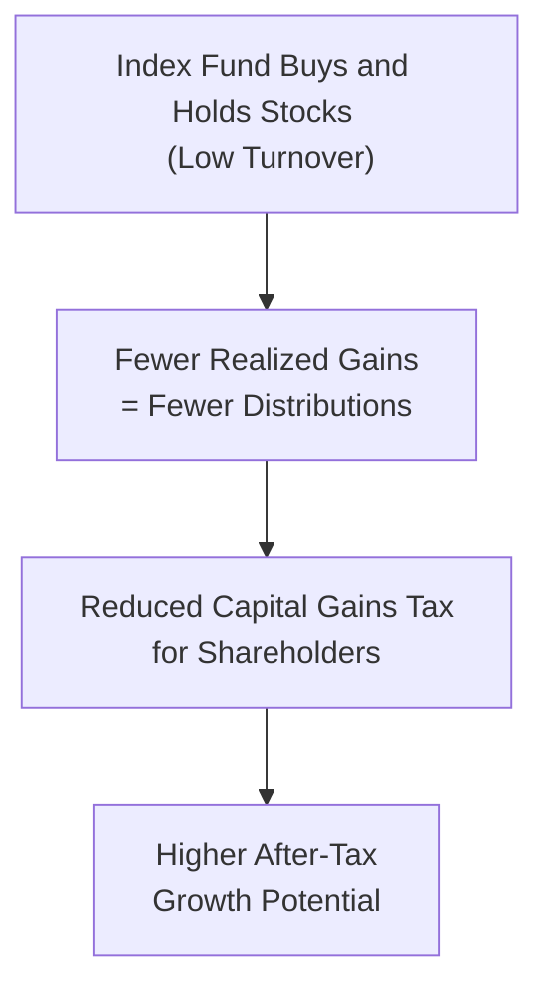

## Introduction
Tax efficiency in index-based investing is often called the “silent benefit” that savvy investors love. There’s a certain thrill to watching your portfolio grow, but let’s be honest: if you’re forced to hand over a big chunk of gains to the tax authorities each year, it’s not so thrilling. One of the key reasons index-based strategies have boomed among both retail and institutional investors is their ability to minimize unwanted tax events. This is done primarily by keeping turnover low and carefully mitigating recognized gains.  

In this section, we explore how index-based equity portfolios manage their turnover to remain tax-friendly while still reflecting their benchmark indexes. We’ll take a look at the various facets of tax efficiency—like how ETFs handle “in-kind” redemptions to reduce capital gains distributions—and we’ll walk through the challenges of rebalancing in real-life market conditions. We’ll also discuss how these strategies can help investors around the globe, given that different jurisdictions can have unique withholding taxes and capital gains rules.

## Lower Turnover Advantage
Index funds, by design, generally track a specific benchmark. They don’t have to constantly hunt for undervalued or overvalued securities like actively managed funds do. This leads to fewer transactions, also known as lower turnover. Lower turnover means fewer realized capital gains throughout the year. And fewer realized capital gains typically means fewer taxable distributions passed on to shareholders, especially in taxable accounts.

• Why does that matter so much? Because in many countries (for instance, the United States), distributed capital gains can trigger immediate taxes for shareholders—even if investors reinvest those gains back into new shares.  
• In contrast, an investor in a low-turnover index strategy often benefits from deferring embedded capital gains until they actually sell their fund shares—an event that might not occur until far in the future.  

Let’s face it, not paying taxes until you have to is often a much better deal than paying taxes yearly.

## Impact of Rebalancing on Taxes
Even the most passive index fund won’t be 100% static. Benchmarks rebalance periodically to maintain accurate sector weights or to swap out stocks that no longer meet index criteria. Although indexing is often less frequent in turnover compared to active strategies, changes in sector compositions or corporate restructurings inevitably prompt some trades.

• Rebalancing vs. Reconstitution:  
  • Rebalancing involves adjusting positions to maintain target sector or style allocations (e.g., if tech stocks soared and became overweight, the fund might trim some exposure to realign).  
  • Reconstitution is when the index provider adds or removes securities altogether (e.g., a small-cap stock grows into mid-cap status).  

These events create potential taxable events if the fund sells positions that have experienced gains. However, thoughtful managers of index funds can exploit certain timing strategies—like offsetting gains with losses in other parts of the portfolio or executing sales in smaller increments to temper the tax bite.

### Timing and Wash Sales
You might be wondering: “So, if a fund sells a stock and can buy it back, can it reset the basis for tax efficiency?” Possibly, but rules like the wash sale rule (in the United States) prevent investors from harvesting a loss while simultaneously buying a “substantially identical” security. That said, an index provider might reconstitute from one stock to another that is not too similar, thus potentially enabling the fund to realize a short-term loss that offsets gains.

## The Mechanism of ETF Structure
ETFs (Exchange-Traded Funds) introduce a useful mechanism for tax efficiency: “in-kind” creations and redemptions. This system can allow ETFs to sidestep many taxable events triggered by selling securities outright. Here’s how it usually works in simplified terms:

• In-Kind Creation:  
  • When new money flows in, an authorized participant transfers a basket of securities to the ETF in exchange for new ETF shares. Because this is an “in-kind” transaction, it rarely triggers capital gains.  
• In-Kind Redemption:  
  • When large investors redeem, they typically receive a basket of the underlying assets instead of cash. This can help the ETF remove low-basis shares from the portfolio with minimal realized capital gains that would otherwise be distributed.

This in-kind process is a big reason why ETF shareholders often see fewer capital gains distributions compared to traditional mutual funds.  

To be clear, in some extreme cases—like a large exodus during a market meltdown—ETFs might still need to engage in some outright sales of securities. But generally, the ability to handle inflows and outflows with in-kind transactions keeps the ETF’s realized gains low.

## Capital Gains Distributions in Index Funds
Whenever an index fund sells securities for more than it paid, it may recognize a capital gain that it must pass on to investors in taxable accounts as a distribution. These distributions show up on the investor’s annual tax form (such as a 1099-DIV in the U.S.) and can be taxed at capital gains rates.  

Index funds strive to minimize how often this happens. It’s helpful to track two main types of capital gains distributions if you’re a shareholder in a taxable account:  

• Short-Term Capital Gains: Typically taxed at higher ordinary income tax rates.  
• Long-Term Capital Gains: Eligible for lower tax rates in many jurisdictions (like the U.S. if held for more than one year).  

In many cases, especially with an ETF structure or a well-managed index mutual fund, long-term gains can be deferred for quite some time. Some funds won’t distribute capital gains for many years.

## Geographical Tax Considerations
It’s important to note that not all taxes are created equal—or at least, not all are from the same country. Investing in an international index fund might expose you to foreign withholding taxes on dividends, or your country of residence might impose certain reporting requirements on foreign holdings. Sometimes, the fund’s domicile can reduce or increase the amount of foreign withholding:

• For example, a Luxembourg or Irish-domiciled ETF might face different withholding rates on dividends from European companies than a U.S.-domiciled fund would.  
• Meanwhile, certain treaties might provide reduced tax rates if the fund’s domicile has a favorable tax treaty with the issuing company’s country.

Overall, an investor’s residency and personal tax situation can make a big difference. If you remember nothing else, just keep in mind: always check how foreign-sourced dividends are taxed, especially if you invest in internationally focused index vehicles.

## Transaction Cost Control
While taxes are most often top-of-mind, transaction costs matter, too. Index funds with lower turnover typically incur fewer brokerage commissions, bid-ask spreads, and market-impact costs. This can preserve more of the portfolio’s value over the long run, boosting net returns—even before we throw taxes into the mix.  

From a purely theoretical perspective, you could model transaction costs (T) as a function of turnover (TO) times some cost per trade (CPT):


\text{Total Transaction Costs} = \text{TO} \times \text{CPT}


Although this is a simplistic representation, it can help highlight that reducing turnover can significantly reduce transaction-related expenses.  

## Tax-Loss Harvesting
Index funds sometimes implement tax-loss harvesting to further improve after-tax performance. This involves selling positions that have declined in value to realize a capital loss, which can offset current or future capital gains. The manager might then replace the position with a similar (but not identical) investment to maintain the portfolio’s risk profile.

• For example, if an S&P 500 Index fund is forced to sell one stock for a capital gain, it might simultaneously sell another position trading at a loss. If the manager does it carefully, the net tax event to the fund is zero (or minimal).  
• Many “tax-managed index funds” systematically incorporate tax-loss harvesting. They may look for opportunities to rotate among closely related securities or even hold a basket of representative stocks to preserve factor exposures without triggering wash sales.

Practitioners need to watch out for local tax regulations on wash sales or other restrictions so they don’t lose the benefits of the harvested losses.

## Holistic Portfolio View
As with any good meal, it’s not about one ingredient but how they all come together. In portfolio management, that means you want to see how your index-based strategy interacts with everything else you hold. If you have multiple accounts—some taxable, some tax-advantaged (like IRAs in the U.S.)—it could make more sense to hold your more tax-inefficient assets in the tax-advantaged account, while placing more tax-efficient holdings in the taxable account.

• If you’re investing in multiple index funds, you might coordinate rebalancing across all funds so losses in one fund can offset gains in another.  
• Investing across different geographies and asset classes requires close attention to local tax laws (and potentially currency risk management, as covered in other chapters related to multi-currency exposures or fixed income strategies).  

By looking at the entire asset allocation, you can structure your portfolio to maximize potential after-tax returns without significantly increasing risk.

## Best Practices and Common Pitfalls
Even though index investing might sound straightforward, it’s easy to run into pitfalls:

• Common Pitfall #1: Neglecting to consider the difference in tax treatment between short-term and long-term capital gains. For instance, if the index turnover is slight but the realized gains are mostly short-term, the overall tax efficiency might not be as good as it looks.  
• Common Pitfall #2: Overlooking the cost and complexity of investing in a foreign-domiciled fund. Some individuals get stuck with complicated tax forms or higher withholding rates they weren’t prepared for.  
• Common Pitfall #3: Failing to coordinate across multiple accounts or ignoring the potential wash-sale implications if you sell in one account and buy in another. Yep, I’ve seen that mix-up plenty of times!  
• Best Practice: Engage in regular (but not too frequent) tax reviews. Monitor unrealized gains and losses. Work with a tax advisor if your situation is complex. Keep track of your cost basis carefully.

## Potential Challenges in Implementation
While an index-based approach is generally simpler, there are still some hidden complexities:

• Large Market Disruptions: In periods of high volatility, even index funds might find themselves rebalancing rapidly or incurring higher trading costs, especially if they track a smaller or less liquid index.  
• Changes in Tax Legislation: It’s not uncommon for governments to tweak capital gains tax rates, dividend tax rates, or rules regarding the in-kind transactions that underpin ETFs. Keep an eye on changes that could affect overall tax efficiency.  
• Overconcentration Risk: Some indexes (like those heavily concentrated in a few large-cap tech names) might see big weighting changes that can force the fund to realize gains. This is rarely as big a problem in broad market indexes but can happen with specialized indexes.

## Diagram: Index vs. Tax Efficiency Flow
Below is a quick conceptual diagram to visualize how a low-turnover index strategy can minimize tax drag:

## Glossary
• Turnover Ratio: A measure of how often securities are bought and sold within a fund, expressed as a percentage of the average portfolio size.  
• Capital Gains Distribution: The distribution of profits from securities sales within a fund to shareholders, creating a taxable event if held in a taxable account.  
• In-Kind Creation/Redemption Process (ETF): A mechanism that allows large shareholders to exchange baskets of securities for ETF shares (or vice versa) with minimal taxable transactions.  
• Tax-Loss Harvesting: The strategy of selling securities at a loss to offset a capital gains tax liability.  
• Withholding Tax: A tax deducted at the source on dividends or interest, often relevant for cross-border investments.  
• Tax Drag: The reduction in net returns caused by taxation on dividends, interest, or realized capital gains.  
• Tax-Managed Index Fund: A specialized index fund that employs strategies (e.g., loss harvesting, minimal turnover) to maximize after-tax returns for investors.  
• Wash Sale Rule: A U.S. IRS rule that prohibits claiming a tax loss on a security if a substantially identical security is purchased within 30 days before or after that sale.  

## References
1. Poterba, James M., and John B. Shoven. “Exchange-Traded Funds: A New Investment Option for Taxable Investors.” American Economic Review.  
2. Vanguard: “Tax‑Managed Funds and Strategies” (https://investor.vanguard.com)  
3. Morningstar: “ETFs, Mutual Funds, and Tax Efficiency.”  
4. Scholes, Myron S. and Mark Wolfson. “Taxes and Business Strategy: A Planning Approach.” Prentice Hall.

## Final Exam Tips
• Watch for Trigger Terms: Exam questions might phrase “portfolio turnover” or “tax drag” in several ways. Be ready to differentiate among short-term versus long-term capital gains.  
• Connect to Other Topics: Link your knowledge of tax efficiency to the broader realm of risk management, attribution analyses, or factor investing. For instance, a question about factor tilt in an equity portfolio might ask how turnover from factor rotation affects taxes.  
• Time Allocation: If a constructed-response question comes up, outline your approach clearly, address each part of the question, and reference real-world scenarios.  
• Focus on Mechanisms: Know exactly how ETF in-kind redemptions help reduce realized gains. The difference between an in-kind redemption and a forced sale can show up in an item-set question on taxes.  
• Pitfalls: Don’t ignore the possibility that an index fund can still generate capital gains distributions—particularly after reconstitution.  

Above all, remember that “tax efficiency” is not just about paying lower taxes; it’s about how an index strategy aligns with your overall risk and return objectives.

## Test Your Knowledge: Tax Efficiency in Index-Based Investing



### Which of the following is a primary benefit of low portfolio turnover in an index fund?
- [x] Fewer realized capital gains distributions
- [ ] A wider tracking error
- [ ] Higher management fees
- [ ] Greater short-term volatility

> **Explanation:** Lower turnover generally means fewer transactions that realize capital gains. This leads to fewer capital gains distributions for investors, enhancing after-tax returns.

### In an ETF structure, “in-kind” creations and redemptions help reduce:
- [x] Realized capital gains inside the fund
- [ ] The turnover ratio for benchmark rebalancing
- [ ] The volume of trades on the stock exchange
- [ ] Dividend distributions to investors

> **Explanation:** When large investors create or redeem ETF shares using a basket of underlying securities instead of cash, it significantly reduces the need to sell holdings outright, thereby minimizing realized gains within the fund.

### If a fund manager sells Stock A at a loss to offset gains and immediately purchases “substantially identical” Stock A again within 30 days, the manager:
- [ ] Is fully entitled to the tax loss
- [ ] Incurs a dividend withholding tax
- [x] Violates the wash sale rule
- [ ] Avoids short-term capital gains tax

> **Explanation:** The wash sale rule in the U.S. disallows claiming a tax loss if the same (or a substantially identical) security is purchased within 30 days before or after the sale.

### Which of the following statements about capital gains distributions in index funds is most accurate?
- [x] Well-managed index funds aim to minimize realized gains passed on to shareholders
- [ ] Index funds never distribute capital gains
- [ ] All index funds distribute only long-term capital gains
- [ ] Capital gains are never taxed if the fund is held in a taxable account

> **Explanation:** Index fund managers seek to keep realized (and thus distributed) gains low. However, distributions do still occur when securities within the index are replaced or significantly rebalanced.

### When an international equity index fund faces non-U.S. dividend income, which factor is most relevant to the fund’s after-tax return?
- [x] Foreign withholding tax rates
- [ ] The wash sale rule
- [x] Double taxation in the investor’s home country
- [ ] Earnings per share trends

> **Explanation:** Withholding taxes imposed by foreign jurisdictions reduce the net dividend income. Depending on the investor’s domicile, certain treaty benefits or credits might be available, but foreign withholding is often the first tax impact on non-U.S. dividends.

### Which practice specifically attempts to harness market downturns or price dips to reduce taxable liabilities by realizing losses?
- [x] Tax-loss harvesting
- [ ] Turnover minimization
- [ ] In-kind creation
- [ ] Dividend reinvestment

> **Explanation:** Tax-loss harvesting purposely sells positions at a loss to recognize the capital loss, which may offset other gains and reduce current tax liability.  

### If an index fund experiences large outflows in a single day, the fund’s manager can often:
- [x] Use in-kind redemptions to minimize capital gains
- [ ] Distribute short-term capital gains equally among remaining investors
- [x] Immediately repurchase the outgoing positions
- [ ] Close the fund permanently

> **Explanation:** The manager can provide large redeeming shareholders with baskets of the underlying securities. This in-kind redemption does not generate significant capital gains distributions for the remaining shareholders.

### A key difference between short-term capital gains and long-term capital gains in many jurisdictions is:
- [x] Short-term gains are often taxed at higher rates than long-term gains
- [ ] Long-term gains are always tax-free
- [ ] Short-term gains are never taxed
- [ ] Long-term gains are taxed at the investor’s average cost basis

> **Explanation:** Typically, short-term gains (held for less than one year) are taxed at higher ordinary income rates, whereas long-term gains enjoy preferential rates.

### Which term describes the deterioration of net returns due to taxes on dividends, interest, or realized capital gains?
- [x] Tax drag
- [ ] Turnover ratio
- [ ] Dividend yield
- [ ] Tracking error

> **Explanation:** “Tax drag” refers to how the investor’s net return is reduced due to taxes encountered throughout the investment process.

### True or False: A tax-managed index fund is designed primarily to avoid all taxes for U.S. investors worldwide.
- [x] True
- [ ] False

> **Explanation:** Although the main goal of a tax-managed index fund is to enhance after-tax performance (often via loss harvesting and minimal turnover), “avoid all taxes” is an overstatement. “Tax-managed” doesn’t mean zero taxes; it means optimizing the fund’s strategy to reduce tax impact wherever legally possible.


