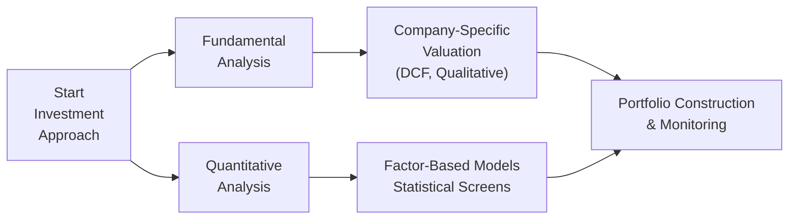

## Introduction
So, let’s talk about the intriguing world of active equity investing. You know, the part of finance where we try to earn higher returns than those tired old benchmarks. Within active equity, we often see two big camps: the fundamentals folks (the “why” people who pore over company financials, meet management, and read entire transcripts) and the quants (the “how” people who run models, parse data, and let algorithms drive decisions). 

In truth, it’s not some epic gladiatorial showdown. It’s more like having two different vantage points on a single mountain. The fundamental approach sits on one peak, scanning for deeper business insights, while the quantitative approach sits on another, analyzing patterns in large datasets. The best part? You can trek both peaks for a fuller perspective.

Let’s walk through how each approach works, why people choose one or the other (or both!), and how you might blend them to build a robust equity strategy.

## The Fundamental Approach
The fundamental approach is as old-school as it gets. It’s the stuff Warren Buffett is known for—hunting for undervalued companies by studying financial statements, evaluating management quality, and double-checking an organization’s long-term competitive advantage. And yes, I often think of a friend who used to carry five different versions of a company’s 10-K in his backpack just to scribble notes on each line item. That’s dedication... or, well, mild obsession.

### Key Elements of Fundamental Analysis
• Intrinsic Value Estimation: You work out what a company is truly worth, often by projecting future cash flows and discounting them back to the present.  
• Qualitative Review: You look at the management team, the brand, the intellectual property, and intangible factors.  
• Industry Assessment: Is the firm operating in a secular growth area (like green technology) or a cyclical sector (like automotive parts)?  
• Competitive Positioning: Are they a market leader? Or is it just a small fish in a shark tank?

### Intrinsic Value & Valuation Models
A big part of fundamental investing is figuring out a company’s “intrinsic value.” Often, people use a Discounted Cash Flow (DCF) framework. That’s basically:


V_0 = \sum_{t=1}^{T} \frac{FCF_t}{(1 + r)^t}


Where:  
• \\( V_0 \\) = Present value of the company  
• \\( FCF_t \\) = Free cash flow in year \\( t \\)  
• \\( r \\) = Discount rate (often the weighted average cost of capital)  
• \\( T \\) = Forecast horizon  

The difference between your estimated intrinsic value and the current market price is a big clue about whether the stock is cheap or expensive. And although we might want to avoid being strictly formulaic, it’s important to remember that a thorough fundamental model typically includes scenario analysis—like how the stock might hold up if interest rates rise or if the economy sours.

### Qualitative Considerations
But it’s not all numbers. You also weigh intangible factors—like a company’s brand equity, corporate governance practices, the brilliance (or not) of its leadership, and even potential ESG considerations. If you’re looking at a consumer products company, you might investigate brand loyalty by reading product reviews or analyzing social media sentiment. In a technology firm, you might rely on patent analysis, software quality, or developer community acceptance.

### A Quick Fundamental Example
Let’s imagine you’re analyzing a hypothetical tech company, CloudX, which provides cloud-based software solutions. You would:
1. Read its public filings (e.g., annual reports) to evaluate top-line revenue growth.  
2. Assess the CFO’s commentary on operating margins.  
3. Speak with industry experts or read up on how robust its platform is relative to peers.  
4. Estimate free cash flow for the next five years.  
5. Discount those flows back at a rate that accounts for CloudX’s risk, factoring in the possibility of new entrants or regulatory changes.  

If your final valuation suggests that CloudX is worth $120/share while it’s only trading at $90, you might see a 33% undervaluation—enough to trigger a “buy” decision if you trust your analysis.

## The Quantitative Approach
Now let’s shift gears. The quantitative approach thrives on systematic processes and large datasets. Instead of analyzing one company at a time, you systematically screen thousands of companies simultaneously. Well, that’s the dream, at least. 

### Key Elements of Quantitative Analysis
• Data-Driven Factors: For instance, a “value” factor might pick out firms with low price-to-book ratios, while a “momentum” factor might select shares that have shown consistent upward price trends.  
• Statistical Methods: Regression analyses, machine learning algorithms, or more advanced statistical models are used to detect relationships in historical data that might predict future returns.  
• Portfolio Optimization: After picking securities, you typically want to assemble them in a portfolio that meets certain constraints, like staying sector-neutral or capping volatility.  
• Backtesting & Validation: You subject potential strategies to decades of history (if available) to see how they would have performed. If performance is great in sample but plummets out of sample, you might suspect overfitting.

### Data and Factor Models
One popular approach is factor-based investing. Long story short, you assume that stock returns can be decomposed into exposures to certain systematic factors. A classic single-factor model might look like this:


R_i = \alpha + \beta (R_\text{factor}) + \varepsilon_i


Where:  
• \\( R_i \\) is the return on security \\( i \\).  
• \\( \alpha \\) captures security-specific (idiosyncratic) return.  
• \\( \beta \\) is the sensitivity to the factor.  
• \\( R_\text{factor} \\) is the factor’s return (e.g., value, momentum, etc.).  
• \\( \varepsilon_i \\) is the error term.

In reality, multi-factor models are more common, incorporating several features such as “value,” “quality,” “size,” and “momentum” simultaneously. A quant manager might screen for stocks with the highest combined rank across multiple factors, then weigh them in a disciplined, rules-based manner.

### Model Development & Overfitting
“Overfitting” is basically the quants’ biggest nightmare. It’s when a model fits historical noise a bit too perfectly, leading to illusions of grandeur that quickly vanish in live trading. So guardrails—like robust out-of-sample testing, cross-validation, and caution around too many parameters—are essential.

And let’s not forget about “regime changes.” A model trained on data from a low-interest-rate environment might struggle to adapt when interest rates start climbing. Quants sometimes incorporate adaptive or dynamic models that recalibrate based on shifting market regimes.

### A Simple Quant Example
Imagine you want to build a “Quality + Momentum” strategy for large-cap stocks in two major markets (say, the US and Europe). You do the following:
1. Pull together monthly financial data for thousands of stocks over 15 years.  
2. Define your “quality” metric (like high return on equity, low debt-to-equity, stable earnings).  
3. Define “momentum” as the trailing 12-month return, skipping the most recent month to avoid short-term reversals.  
4. Rank every stock each month by blended quality and momentum scores.  
5. Buy the top 20% in each region; short the bottom 20% if you’re in a long-short strategy.  
6. Perform an out-of-sample backtest (train on the first 10 years, then test on the last 5).  
7. Evaluate whether the factor combination consistently delivered positive returns net of transaction costs.

A key check at the end is to confirm you’re not inadvertently just loading up on a single industry or region. If your “top 20%” is mostly technology stocks in the US for some reason, that might mean unintended concentration risk.

## Blended Strategies
Here’s the truth many folks eventually learn: these approaches aren’t mutually exclusive. In fact, they often complement each other nicely. 

Maybe you start off with a broad quantitative screen to filter out hundreds of no-go stocks—like those with extremely low profitability or shaky balance sheets. Then, from that narrower list, you conduct deeper fundamental analysis to pinpoint hidden gems.  

Or you do the opposite: first pick some companies that your fundamental framework suggests are compelling, then apply a quant lens to gauge factor exposures or to systematically size positions to control for volatility. 

Blended approaches can reduce blind spots. A purely fundamental analyst might miss subtle price pattern signals, while a purely quant manager might fail to capture intangible elements—like how a brand resonates with consumers or how effective management truly is.

## Key Considerations
### Data Quality
No matter which route you take—fundamental or quant—garbage data leads to garbage decisions. I once heard of a manager who missed a key detail in a footnote about inventory write-downs, leading to a badly flawed fundamental forecast. Quant managers must also check data integrity for corporate actions (like splits, dividends, ticker changes). A single glitch can skew an entire factor’s signals.

### Model Risk
Quant managers are basically glued to their risk models. Overfitting, missing variables, or unrepresentative historical data can wreck your strategy. Meanwhile, fundamental managers can fall prey to overconfidence—basing a big bet on a single assumption that might not hold up when the market environment changes.

### Behavioral Factors
Fundamental investing can be heavily influenced by personal biases: maybe trust in a charismatic CEO or an emotional attachment to an industry. Quant strategies tend to mitigate some of those biases by focusing on rules-based signals. However, quants aren’t immune to “model myopia” (pure reliance on the model, ignoring real-world news or strategic shifts). 

### Scalability
Fundamental approaches usually require more in-depth, security-specific analysis; they can handle fewer positions. Quant approaches can scale across thousands of securities with relative ease—thanks to computing power, advanced data analytics, and sometimes automation. 

## Visualizing the Approaches
Let’s look at a simple diagram illustrating a high-level overview of how these two approaches compare:

The left-hand path is the more traditional fundamental approach, the right-hand path is the systematic quant approach, and both converge on portfolio construction. Blended strategies just incorporate elements from both paths into a single integrated process.

## Glossary
• Intrinsic Value: An estimate of a company’s true worth, often derived from discounted cash flow or other valuation models.  
• Overfitting: When a statistical model mistakes random noise for a pattern, leading to poor performance in new data.  
• Factor: A specific variable—like “value” (low price-to-book) or “momentum” (recent price performance)—used to explain returns.  
• Qualitative Analysis: Research that focuses on nonnumeric criteria, like management quality or brand strength.  
• Quantitative Analysis: Research driven by numeric data, statistical tools, and systematic screening.  
• Systematic Strategy: An approach that uses repeatable, formulaic rules, usually implemented with algorithms.  
• Backtesting: Evaluating a strategy’s performance on historical data.  
• Scalability: The ability to replicate an investment strategy at larger amounts of capital.

## Best Practices & Pitfalls
• For Fundamental Analysts:  
  – Keep documentation of your investment thesis. It helps you remain objective when new data emerges.  
  – Be mindful of confirmation bias: you might see what you want to see in financial statements.  
  – Don’t skip intangible drivers just because they’re not quantifiable. A brand can make or break a company’s moat.  

• For Quant Managers:  
  – Always use robust testing procedures: out-of-sample tests, cross-validation, and stress testing.  
  – Watch out for data mining pitfalls: if you test enough factors, you’re bound to stumble upon spurious correlations.  
  – Remember real-world constraints. Can you actually trade all those stocks at scale without massive market impact or transaction costs?

## Real-World Case: A Blended Strategy
Let’s say an asset manager runs a global equity portfolio. They combine a multi-factor model (value, momentum, and quality) to generate an investable universe. Then, for each of the top 50 stocks in that universe, a fundamental portfolio manager conducts deep dives—checking the company’s unique business model, recent product launches, and competitive advantage. 

If the fundamental review still looks promising, they buy the stock and continue to monitor both the quant signals and the qualitative developments. If the quant signals fade over time or the fundamental story deteriorates, they reduce or exit the position. This double-layer approach can help reduce false positives from any single method.

## Exam Tips for CFA® Level III
• Practice articulation of differences between fundamental and quant approaches. In essay (constructed response) questions, you might need to recommend a strategy based on a scenario.  
• Be comfortable with factor terminology: “value,” “momentum,” “quality,” “low volatility,” etc. The exam might ask you to identify which factor best supports a scenario.  
• Time management: You could be asked to do a quick financial or factor-based calculation. Make sure you know the standard formulas (DCF, factor returns, portfolio weighting).  
• Don’t forget the behavioral aspects. The exam often weaves in subtle references to bias, especially in fundamental analysis.

## Conclusion
Fundamental versus quantitative investing doesn’t have to feel like a zero-sum game. Modern portfolio managers often blend both worlds to gain a more complete view of the market. On one hand, fundamental analysis helps you develop a nuanced sense of a company’s intrinsic worth and intangible qualities. On the other, quantitative analysis brings scientific rigor, objectivity, and scale to the research process.

Take the time to understand how each approach can inform the other. By doing so, you’re better equipped to build more resilient portfolios, recognize hidden risks, and (hopefully) spot alpha opportunities that might be invisible to a narrower mindset. And if you ask me, there’s nothing more satisfying than building a rock-solid thesis on the back of good old-fashioned homework—then validating it with a robust data-driven model. 

In the real world, thoroughness and adaptability are ultimately what separate mediocre results from great ones.

## References
• Grinold, R. C., & Kahn, R. N. (2000). Active Portfolio Management.  
• Piotroski, J. D. (2000). “Value Investing: The Use of Historical Financial Statement Information to Separate Winners from Losers.” Journal of Accounting Research.  
• Asness, C. S. (2015). “My Top 10 Peeves.” AQR White Papers.

## Test Your Knowledge: Fundamental vs. Quantitative Approaches



### Which of the following best describes the fundamental investing approach?

- [x] Focusing on the intrinsic value of a company using financial statements, management assessments, and qualitative insights.
- [ ] Using a purely data-driven model of historical returns to select securities.
- [ ] Emphasizing high-frequency trading signals for short-term gains.
- [ ] Exclusively investing in index-tracking funds to minimize active risk.

> **Explanation:** Fundamental investing is grounded in evaluating a firm’s intrinsic value, using both quantitative (financial analysis) and qualitative (management quality, brand strength) components.

### A quantitative investment strategy is most likely to rely on:

- [x] Factor-based signals identified through statistical analysis of historical data.
- [ ] A single in-person interview with corporate management.
- [ ] Daily reading of quarterly earnings transcripts to gauge management’s tone.
- [ ] Expert opinions of synergies in pending mergers and acquisitions.

> **Explanation:** Quantitative strategies typically involve analyzing large historical datasets to identify systematic patterns in returns (e.g., factors such as value, momentum, quality). Interviews and subjective assessments are more in line with a fundamental approach.

### What is a key risk faced by quantitative strategies?

- [ ] Paying excessive attention to intangible factors like brand sentiment.
- [ ] Overly relying on executives’ personal charisma to guide stock selection.
- [ ] Overfitting to historical data, leading to poor out-of-sample performance.
- [ ] Failing to explore financial statements and corporate governance issues.

> **Explanation:** Overfitting is the primary peril for quant strategies, wherein the model confuses noise with meaningful signals and performs poorly on new data sets.

### Which approach typically involves discounting projected cash flows to arrive at a stock’s fair value?

- [ ] Moral suasion approach.
- [ ] Tick data pattern analysis.
- [x] Fundamental valuation approach (DCF).
- [ ] Real-time factor rebalancing approach.

> **Explanation:** Discounted Cash Flow (DCF) analysis is a hallmark of the fundamental approach, used to estimate a company’s fair value.

### In a blended investment strategy, how might a quantitative screen be integrated?

- [x] Use factor signals to narrow the selection pool, then apply fundamental research on a smaller group of promising stocks.
- [ ] Conduct fundamental analysis and throw away any numeric data points for fear of confirmation bias.
- [ ] Only invest in assets with random price movements.
- [x] Apply purely technical indicators to ironically avoid fundamental insights.

> **Explanation:** One common blend is to begin with a broad quant-based filter (using factors or other metrics) to reduce the universe, then apply deeper fundamental research on the shortlist of securities.

### Which of the following is an example of a factor commonly employed in quantitative equity models?

- [x] Momentum.
- [ ] CEO personal approval ratings.
- [ ] Desired yield in a private real estate fund.
- [ ] Investor sentiment from a single social media post.

> **Explanation:** Momentum is a widely recognized quant factor. Factors like quality, value, and size are also used frequently.

### When we say a model might be subject to “regime changes,” what do we typically mean?

- [ ] The government overthrew the central bank, rendering finance obsolete.
- [x] Market conditions shift (e.g., changes in interest rates, liquidity, or volatility) such that previously successful relationships may no longer hold.
- [ ] The fundamental approach was abandoned for short-selling only.
- [ ] Regulatory authorities banned the use of leverage in equity strategies.

> **Explanation:** Regime changes refer to shifts in market conditions—like going from a low-volatility environment to a high-volatility environment—where prior statistical relationships might weaken or disappear.

### Why is documentation important for a fundamental analyst?

- [x] It helps maintain objectivity and track the evolution of the investment thesis.
- [ ] It ensures the quant algorithms never deviate from their code.
- [ ] It eliminates the risk of confirmation bias.
- [ ] It prevents any possibility of market downturns.

> **Explanation:** Writing down each step in the investment thesis keeps fundamental analysts disciplined, helping them recall assumptions and re-evaluate when new information arises.

### Which best describes a typical step in the quantitative investment process?

- [ ] Having a lengthy conversation with the CFO of a single company.
- [ ] Deriving intangible brand value by reading online press releases.
- [x] Ranking large numbers of stocks based on systematic factor scores (e.g., value, momentum, quality).
- [ ] Visiting consumer sites to see how items are displayed in brick-and-mortar stores.

> **Explanation:** Quantitative investing typically involves screening and ranking stocks using systematic, factor-based methods (or other statistical approaches) across large universes.

### True or False: A combined fundamental-quantitative approach can help mitigate biases inherent in each individual method.

- [x] True
- [ ] False

> **Explanation:** It’s true. By leveraging both the human insight of fundamental analysis and the rigor of quantitative models, a blended strategy can reduce certain biases and capture a wider range of investment opportunities.


