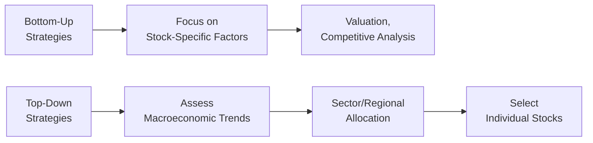
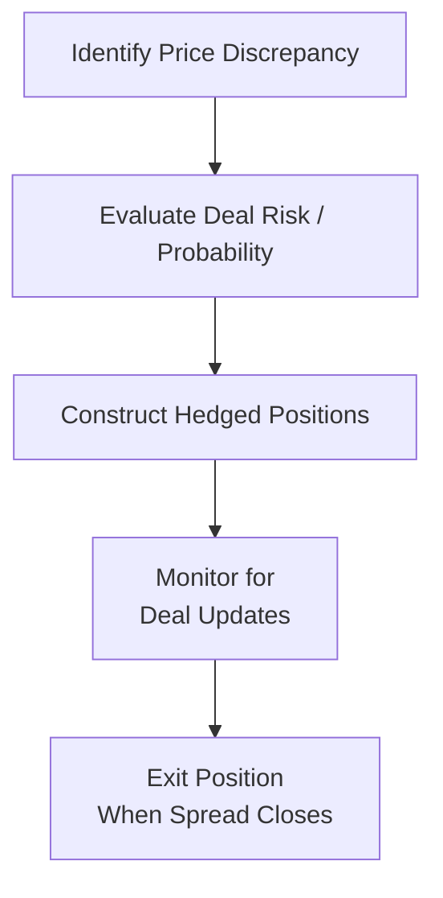

## Introduction

So, you’ve probably heard that active equity managers have all sorts of fancy approaches for picking (or shorting) stocks. That’s true—and it can be overwhelming if you’re new to the game. But maybe, just maybe, when we break them down into these five categories—Bottom-Up, Top-Down, Factor-Based, Activist, and Arbitrage—you’ll realize each one has a clear logic behind it. And then you’ll see how they mesh (or clash) with your own approach to investing.

These concepts aren’t just academic. One time I accompanied a friend, who’s also a portfolio manager, to a tech conference where we found a tiny software firm—so specialized that hardly anyone paid attention to it. It was definitely a dainty fish in an ocean full of whales. But after we dug deeper, we realized their growth potential was off the charts. Observing her process was a perfect example of Bottom-Up investing; she focused on details of the firm instead of broad macro trends. In contrast, some managers at that same conference were discussing whether the semiconductors or biotech sector might fare better under a likely shift in monetary policy—just the quintessential Top-Down approach. It was a neat experience to see how different styles can thrive simultaneously, all in one corner of the market.

In this section, you’ll learn the logic, mechanics, potential pitfalls, and best practices of each approach. By the end, you should be able to see how these strategies complement each other—or even combine them in a multi-strategy portfolio. Let’s get to it.

## Bottom-Up Strategies

Bottom-Up equity strategies emphasize deep dives into the firm-specific factors—like financials, competitive positioning, product pipeline, management, and so on. Instead of starting from the big picture (e.g., interest rates, GDP growth rates, or global trade patterns) and then boiling down to an individual company, Bottom-Up managers work from the ground up. It’s like analyzing a single piece of a puzzle and then seeing how it fits into the entire mosaic.

Typical steps in a Bottom-Up approach often include:  
• Screening and idea generation (e.g., searching for companies with low P/E ratios, high return on invested capital, or specific growth metrics).  
• Rigorous fundamental analysis (reviewing balance sheets, income statements, and management guidance).  
• Competitive advantage assessment (Porter’s Five Forces, brand strength, intellectual property).  
• Company valuation using discounted cash flow (DCF), comparable companies, or other valuation models.  
• Final investment decision, often prioritizing undervalued opportunities or unique market leaders.

While this process might sound time-consuming, it can uncover gems. Investors who put in the effort can find mispriced securities that macro-oriented investors might overlook. A risk, of course, is ignoring broader economic headwinds. Sometimes, even the best small company is no match for a full-blown recession.

### Practical Example

Imagine searching for a niche auto-parts manufacturer that has minimal coverage from Wall Street analysts. You notice they’ve been building a name in producing a specialized electric-vehicle component that hasn’t yet attracted huge competition. After meeting management (maybe even seeing their manufacturing process in person), you decide they’re poised for remarkable growth if electric vehicles continue to gain popularity. You then value them by projecting free cash flows under different scenarios—optimistic, base case, or pessimistic. If the current stock price is trading well below your fair value (and your dismissal of any macro or sector-level red flags checks out), you pounce.

### Key Strengths and Challenges of Bottom-Up

• Strengths:  
  – Identifies hidden opportunities overlooked by large-scale or passive investors.  
  – Focuses on time-consuming fundamental research that can yield differentiated insights and potential alpha.  
  – Often suits managers who are adept at modeling, forecasting, and direct company engagement.  

• Challenges:  
  – Potential to miss broader macroeconomic or geopolitical shifts.  
  – Requires substantial resources and time for in-depth research.  
  – Not always scalable, especially if you’re running a large AUM trying to build positions in lesser-known small caps.

## Top-Down Strategies

Top-Down strategies start with the macro environment. Picture scanning economic indicators like GDP growth trends, interest rate policies, inflation data, or even political factors—then moving through regional or sector choices before you zero in on individual stocks.

An investor might say: “So, I see global GDP is cooling off, but emerging markets appear to be heating up in the commodities space. Maybe it’s time to rotate into energy and materials, then pick the best stocks in those sectors.” This strategy can be supplemented with sector rotation models, country-specific allocations, or thematic approaches (like investing in clean energy or robotics).

### Typical Top-Down Process

1. Analyze macroeconomic indicators (economic growth rates, central bank policy, currency trends).  
2. Determine favored regions or countries (maybe the U.S. is favored over the Eurozone or emerging markets).  
3. Select sectors believed to outperform in current or upcoming economic cycles (e.g., cyclical sectors during expansions, defensives during slowdowns).  
4. Within those chosen sectors, filter down to individual stocks.  

This approach might be well-suited to managers who pay close attention to big themes and allocate capital quickly when broad market conditions shift. But there’s always a risk of top-down misjudgments—like misreading the timing of a macroeconomic change or focusing on a particular sector just as it reaches its peak.

### Diagram: Comparing Bottom-Up and Top-Down

Below is a rough flowchart contrasting Bottom-Up and Top-Down approaches:

As you can see, it’s basically a reversal in approach. Bottom-Up starts with the micro details, Top-Down starts with the macro view.

## Factor-Based Strategies

Factor-Based investing relies on constructing portfolios that systematically tilt toward well-researched characteristics—value, growth, size (small cap vs. large cap), quality, momentum, and low volatility, among others. Yes, we can view it as quant investing, but many fundamental managers also incorporate factor screens. And it’s not just about blindly following a factor: it’s about understanding why that factor works and how it might behave in different market environments.

Common factors include:  
• Value (cheap stocks compared to fundamentals).  
• Size (small-cap vs. large-cap).  
• Quality (earnings stability, strong balance sheet, profitability ratios).  
• Momentum (stocks with recent strong price performance).  
• Low volatility (stocks that exhibit lower price swings than the overall market).

### Historical Underpinnings

Academic studies—particularly Fama-French’s research on size and value—fostered the factor revolution. Subsequent work by others introduced momentum, low vol, and quality. Factors persist over the long term, presumably as a reward for certain types of risk or due to behavioral biases that push investors away from certain unloved areas of the market.

### Incorporating Factors in a Portfolio

In practice, factor-based strategies may look like a set of rules:  
• Overweight stocks with lower price-to-book ratios but stable cash flows (value + quality tilt).  
• Underweight or short stocks displaying negative momentum or extremely high valuations.  
• Rebalance periodically as factor exposures change over time.

Factor investors pay special attention to factor correlations. If you want a diversified factor portfolio, you can combine complementary factors (like value + momentum) to buffer the cyclical nature of each. But remember, factor performance can experience drawdowns for extended periods—meaning there’s no silver bullet that always outperforms. This style often relies heavily on backtesting, systematic rebalancing, and robust risk controls.

## Activist Strategies

Activist investing is almost like rolling up your sleeves and entering the boardroom—well, metaphorically (sometimes literally!). Managers buy a large enough stake in a company to influence management decisions or corporate governance. The goal? Unlock hidden value for shareholders. That could mean pushing for spin-offs, operational improvements, share buybacks, or management changes if the activist thinks the board is failing.

### Approach

• Build a concentrated position in the target company.  
• Engage with management—sometimes quietly, sometimes through public letters—for improved strategic direction.  
• Monitor or orchestrate changes such as divesting non-core assets, cutting unnecessary costs, or restructuring capital (e.g., through share buybacks, special dividends).

### Risks and Time Horizon

Activist strategies may involve prolonged negotiations or even public proxy battles, so the time horizon tends to be longer than your typical “two-quarter trade.” There’s also the risk that management resists changes or that the market environment shifts unfavorably (e.g., a recession hits just as you’re trying to spin off a business unit). Activists must also manage the reputational risk—if they push too hard and fail, share prices can fall sharply, creating short-term losses.

### Example of Activism

You might recall the wave of activist campaigns in the tech sector during the mid-2010s when some big names spun off segments that were underperforming but overshadowing the rest of the business. Activists reaped rewards once the spin-offs traded separately at higher multiples. But while these stories can be dramatic and headline-grabbing, remember that not every activist push is successful. As an investor, thorough due diligence on the feasibility of activism is crucial.

## Arbitrage Strategies

Arbitrage typically conjures images of fancy math, derivative overlays, or high-frequency trading. But in an equity context, it generally means exploiting price discrepancies between related instruments while minimizing market exposure. Think of it as trying to be “market neutral,” with the main risk being that the mispricing persists or that the event you’re relying on (like a merger) never closes.

### Types of Equity Arbitrage

• Merger Arbitrage: Buy the target’s stock (if a deal is expected to close at a higher price) and possibly short the acquirer’s stock (if it’s a stock-for-stock deal). The payoff is the spread between the current prices and the price at deal closure. Of course, if the merger collapses, you’re in for a wild ride.  
• Convertible Arbitrage: Exploit mispricing between convertible bonds and the issuer’s common stock. Typically involves a long position in the convertible bond plus a short position in the underlying stock (hedging out some equity exposure).  
• Statistical Arbitrage (Stat Arb): Pairs trading or other rule-based systems that identify short-term anomalies in correlated equities (e.g., going long Stock A and short Stock B if they historically move together but have temporarily diverged).

Arbitrage managers rely on quantitative models, event probabilities, and strict risk management around “deal risk.” Think with Merger Arb: if there’s a big chance the acquiring firm might walk away or regulators might block the deal, you’d want to discount the expected payoff or set appropriate stop-loss parameters.

### Mermaid Diagram: Example Arbitrage Process

## Selection Criteria and Implementation

Selecting the right strategy depends on multiple factors:  
• Manager skill set: For instance, to do activism well, you need a background in corporate law, negotiations, or deep governance knowledge.  
• Risk budget: Some strategies, like merger arbitrage, can appear “low-risk” but carry substantial event risk. Factor-based strategies require robust data integration.  
• Liquidity constraints: Activist and certain arbitrage strategies may tie up capital for longer periods. Bottom-Up or Top-Down approaches can be more flexible, but the scale might be limited if you focus on microcaps (Bottom-Up) or niche sectors (Top-Down).  
• Style adherence: If you’ve promised your investors a factor-based approach, you want to avoid style drift. Evaluate your factor exposures regularly and remain consistent with your stated mandate.

Monitoring is also crucial. When implementing these strategies, make sure you measure potential alpha sources, conduct attribution analysis (as you’ll see in Chapter 3 on Active Equity Investing: Portfolio Construction), and keep an eye on your exposures—both intended (like factor tilts) and unintended (like correlation with economic cycles).

## Glossary

• Sector Rotation: An investment strategy of rotating among different sectors as economic conditions change.  
• Shareholder Value: The value delivered to shareholders, largely driven by strong strategic and operational decisions.  
• Spin-Off: A corporate action creating a new, separate company by distributing new shares of part of the parent business.  
• Pairs Trading (Stat Arb): Going long and short on two correlated securities, aiming to profit from temporary mispricing.  
• Style Drift: When a manager deviates from the declared strategy or asset-class mandate.  
• Deal Risk: The possibility that a planned corporate action (merger, acquisition) fails, reversing or invalidating your trade’s premise.  
• Macroeconomic Cycles: Repeating periods of economic expansion and contraction over time.

## Best Practices and Common Pitfalls

Best Practices  
• Align strategy with investor objectives and constraints: For instance, if your investors have a short time horizon, maybe avoid activism.  
• Conduct rigorous research and stress testing across various environments—particularly important for factor-based and arbitrage strategies.  
• Use effective risk management tools: Tracking error, value at risk (VaR), scenario analysis—some of these are covered in Chapter 3.  
• Maintain discipline and style consistency: Chasing trends that don’t fit your strategy often leads to underperformance and style drift.

Common Pitfalls  
• Overconcentration: Activism and merger arb can encourage putting too many eggs in a single basket.  
• Excessive reliance on single-factor models: Factor investing can falter if the factor goes out of favor for protracted periods.  
• Neglecting macro context in Bottom-Up strategies (and vice versa): Even a great small-cap pick can suffer if a global recession drives down all equity valuations.  
• Underestimating complexity: Arbitrage trades can unravel quickly if the data or assumptions are flawed.

## Final Exam Tips

• Practice scenario-based questions: CFA Level III frequently presents hypothetical market conditions or case studies that test your ability to select or implement the right approach for a specific client.  
• Solidify your fundamentals: For Bottom-Up, be ready to apply valuation models. For Top-Down, know how to interpret macro data.  
• Understand synergy with risk budgeting: Factor exposures, active share, or event risk can all be tested in the context of a bigger portfolio.  
• Be prepared for ethics: Even an activist approach can raise questions about insider trading or conflicts of interest if not handled correctly.  
• Time management on exam day: If you’re asked to compare and contrast strategies or run through a hypothetical trade (like a merger arb scenario), keep your answers concise and well-structured.

## References and Further Exploration

• Damodaran, A. (2012). Investment Valuation. This classic covers both bottom-up and top-down frameworks for valuing firms.  
• Brav, A., Jiang, W., Partnoy, F., & Thomas, R. (2008). “Hedge Fund Activism, Corporate Governance, and Firm Performance.” The Journal of Finance. Great insights into how activists engage with companies.  
• Ang, A. (2014). Asset Management: A Systematic Approach to Factor Investing. An excellent resource for understanding factor-based approaches in depth.  

If you want to see more real-world examples of these strategies, consider browsing academic journals or seeking out specialized books and online courses that delve deeper. Personal case studies from other experienced professionals will also help you refine your perspective.

--------------------------------------------------------------------------------

## Test Your Knowledge: Bottom-Up, Top-Down, Factor-Based, Activist, and Arbitrage Strategies



### Which of the following best describes a Bottom-Up equity strategy?
- [ ] An approach that focuses on macroeconomic indicators before selecting individual stocks.  
- [x] An approach that emphasizes company-level fundamentals and valuations first.  
- [ ] A strategy that automatically rebalances based on specific factor exposures.  
- [ ] A method that aims to influence management through proxy battles and board representation.  

> **Explanation:** Bottom-Up strategies prioritize in-depth analysis of individual companies—business model, competitive edge, and valuation—before considering broader market or economic factors.

### Top-Down managers are most likely to begin with:
- [ ] Analyzing a single company’s revenue forecasting models.  
- [x] Studying overall economic trends (GDP, interest rates) to determine sector allocations.  
- [ ] Implementing pairs trading across highly correlated stocks.  
- [ ] Evaluating convertible bonds for mispricing relative to underlying shares.  

> **Explanation:** Top-Down strategies typically start at the macro level—focusing on economic, geopolitical, and sectoral trends—before drilling down to stock selection.

### Which of the following is a primary goal of Activist investing?
- [ ] Exploiting short-term market inefficiencies in correlated pairs of stocks.  
- [ ] Achieving market-like returns with minimal tracking error.  
- [x] Influencing company management or strategy to unlock shareholder value.  
- [ ] Hedging statistical factor exposures in multiple regions.  

> **Explanation:** Activist investors look to improve overall shareholder value by vigorously pushing for corporate governance, strategic, or operational changes.

### A fundamental risk of Merger Arbitrage strategies is:
- [x] The potential for a deal to collapse, causing a sharp drop in the target's stock price.  
- [ ] Underweighting individual stock exposure due to strict factor allocations.  
- [ ] Excessive reliance on direct corporate engagement.  
- [ ] Layering in additional macro positions that reduce overall alpha.  

> **Explanation:** Merger Arbitrage relies on the successful completion of corporate deals. If a deal fails, the target stock price often falls significantly.

### In Factor-Based investing, a “value” factor tilt typically involves:
- [x] Selecting stocks that are cheaper relative to fundamentals (e.g., low P/E or low price-to-book ratios).  
- [ ] Avoiding small-cap stocks with volatile earnings.  
- [x] Combining fundamental measures like P/E with stability metrics like profitability.  
- [ ] Ignoring all fundamentals in favor of purely technical indicators.  

> **Explanation:** The value factor focuses on identifying cheaply valued stocks based on metrics like P/E or price-to-book. Many managers also overlay quality metrics to reduce risks.

### Bottom-Up approaches may be less effective if:
- [x] Broad macroeconomic or geopolitical events overwhelm company-specific fundamentals.  
- [ ] The factor exposures in a portfolio are strictly controlled.  
- [ ] The manager occasionally meets with corporate management.  
- [ ] Liquidity is high and the manager short-sells frequently.  

> **Explanation:** Even a thoroughly researched company pick can struggle during severe market downturns or global shocks—macro factors can trump micro fundamentals.

### Why might a Top-Down approach be combined with sector rotation?
- [x] To allocate capital to industries poised to benefit from shifting macroeconomic conditions.  
- [ ] To focus exclusively on convertible bonds.  
- [x] To systematically select small-cap stocks based on quality factors.  
- [ ] To exert influence over a company’s board of directors.  

> **Explanation:** Sector rotation typically aligns capital allocation with industries expected to perform better under particular economic or market conditions—exactly the domain of Top-Down methodologies.

### In Activist strategies, the approach generally:
- [x] Involves a longer investment horizon due to the time required for management or operational changes.  
- [ ] Focuses on immediate gains from exploiting short-lived price discrepancies.  
- [ ] Allocates capital based on systematic factor tilts like momentum or value.  
- [ ] Avoids direct communication with company management.  

> **Explanation:** Implementing significant corporate governance or strategic changes takes time, which usually extends the investment horizon for activist strategies.

### A key motivation for implementing pairs trading (Stat Arb) is:
- [x] Profiting from the mean reversion of correlated stocks by pairing a long and short position.  
- [ ] Rotating into cyclical sectors based on GDP growth.  
- [ ] Cornering management to improve corporate governance.  
- [ ] Systematically investing in undervalued stocks while shorting overvalued ones based on fundamental metrics alone.  

> **Explanation:** Pairs trading (Stat Arb) aims to exploit temporary pricing dislocations between two correlated securities, expecting them to converge.

### When discussing style drift, it usually refers to:
- [x] A manager deviating from their stated investment philosophy (e.g., a value manager suddenly purchasing high-flying growth stocks).  
- [ ] A risk that arises from uncompleted merger deals.  
- [ ] A rebalancing strategy for factor exposures.  
- [ ] The shift in risk-free interest rates over time.  

> **Explanation:** Style drift describes a situation in which a manager strays from the original or told-to-clients style mandate—potentially exposing clients to unintended risks.


