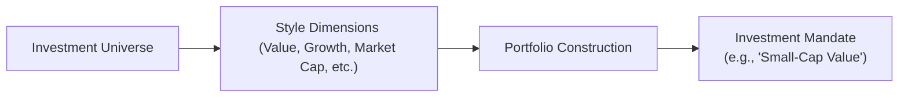
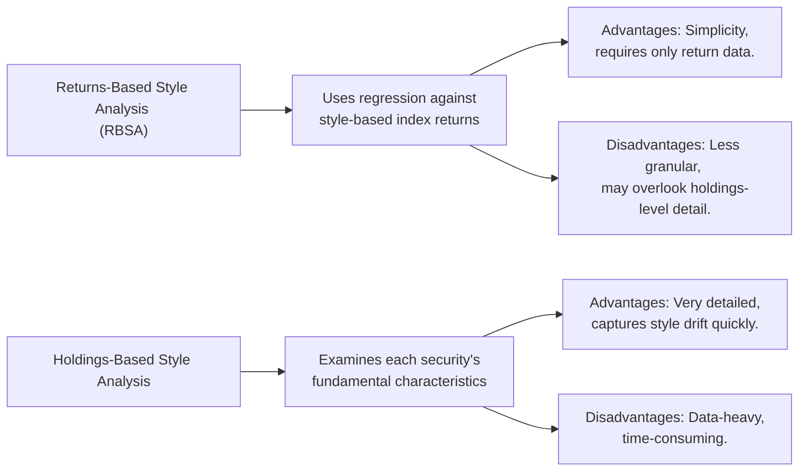

## The Importance of Equity Investment Style Classification
I still remember my first week on the job at an investment management firm, chatting with a senior portfolio manager over coffee. He casually asked if I understood what made a portfolio “growth-oriented” or “value-oriented.” I nodded (sort of), but honestly, I was struggling to define these labels precisely. Now, over the years, I’ve realized how central equity investment style classification is to everything from client communication to performance measurement.

In a nutshell, style classification helps you and your stakeholders quickly discern the philosophy behind the portfolio. Whether it leans toward growth, value, or somewhere in between (a “blend”), understanding these labels guides expectations about returns, risk levels, and the factors driving portfolio performance. It also helps us better choose appropriate benchmarks and measure alpha. After all, you wouldn’t compare a small-cap value fund to a large-cap growth index, right?

By breaking down a manager’s style, we can also see how that style fits within a broader investment plan. Many institutional and individual investors use different styles (e.g., “small-cap value,” “large-cap growth”) to diversify equity exposure and smooth out some of the volatility in their overall equity allocation. Essentially, style classifications provide a consistent language—one that fosters clear communication about a portfolio’s strategy and risk/return profile.

## Common Style Dimensions
Style classification typically revolves around a few major dimensions:

• Value vs. Growth  
• Market Capitalization (Small, Mid, Large)  
• Sector or Industry Focus  
• Geographic Scope  

Let’s talk about each.

### Value vs. Growth
Value investing focuses on stocks that appear undervalued by the market. These companies might have low price-to-earnings (P/E) or price-to-book (P/B) ratios and often pay dividends. Growth investing, meanwhile, targets companies expected to grow at a faster pace than the market, typically boasting higher-than-average P/E and P/B ratios but reinvesting earnings back into the business rather than paying out dividends. “Blend” strategies sit somewhere in between, holding both growth and value characteristics.

### Market Capitalization
This dimension classifies companies into small cap, mid cap, or large cap. Small-cap companies tend to be younger or less established but can offer higher growth potential at the cost of higher volatility. Large-cap firms are typically well-established, often providing relatively stable returns. Mid caps, unsurprisingly, sit between the two. Many managers focus on a specific “cap range” to align with their expertise or to meet a client’s desired risk profile.

### Sector or Industry Focus
Some managers specialize in particular sectors, like technology or healthcare, aiming to leverage in-depth industry research. For instance, a “global healthcare growth” strategy invests in companies primarily involved in healthcare, pharmaceuticals, or biotech, while seeking growth-style opportunities within that sector.

### Geographic Scope
Portfolios can be domestic or global, focusing on an investor’s home market or exploring international (sometimes emerging) opportunities. Combining a style, a market cap, and a geographical focus can be powerful—e.g., “small-cap emerging markets value” is far more specific than simply “international equities.”

## Combining Multiple Style Dimensions
In practice, portfolios usually combine two or more style dimensions to fine-tune the investment mandate:

• Large-cap growth  
• Small-cap value  
• Global technology value  
• Emerging markets growth  

And so forth. The point is that each style dimension refines the risk/return expectation. For instance, large-cap growth might emphasize established but fast-growing companies (e.g., a tech giant), while small-cap value might comb through undiscovered, undervalued “diamonds in the rough.”  

Below is a simple illustration of how these style dimensions might connect:

In this diagram, the manager starts with a broad universe (A) and narrows it down using style dimensions (B). That results in a specific strategy or mandate (D).  

## Tools for Style Analysis
Managers and analysts typically use two main approaches to confirm (and monitor) a portfolio’s style orientation: Returns-Based Style Analysis (RBSA) and Holdings-Based Style Analysis.

### Returns-Based Style Analysis (RBSA)
This approach uses statistical methods (often linear regression) to compare the historical returns of a portfolio with those of style-based indices. The idea is to see how closely the portfolio’s returns correlate with, say, a value index or a growth index. If the portfolio’s returns mimic a value index more closely, there’s good evidence it behaves like a value strategy. RBSA is appealing because it relies on readily available return data and doesn’t require a deep dive into each security.

### Holdings-Based Style Analysis
Here, you look “under the hood” at each security in the portfolio, analyzing metrics such as P/E, P/B, and earnings growth to classify positions as value or growth and large, mid, or small cap. Aggregating data across all positions gives you a sense of your portfolio’s overall style tilt. This method can be more labor-intensive and data-demanding. But the payoff is a more accurate picture of the actual holdings at a given point in time—rather than relying on return correlations.

A quick comparison of these tools:

## Challenges in Style Classification
Despite how useful style classifications are, they’re undeniably finicky. Here are some typical challenges:

### Style Drift
Managers might inadvertently—or intentionally—adjust their approach over time. For example, in bullish markets, a “value” manager might start buying growth-leaning stocks. That can lead to confusion or mismatch between the investment mandate and the actual portfolio composition.

### Evolving Definitions
The line between “value” and “growth” can blur, especially during major market shifts or when new industries (like emerging technologies) change core valuation metrics. Classic metrics—like P/E or P/B—may not reflect intangible asset values in fields like software or biotech.

### Benchmark Selection
If you pick an inappropriate benchmark for your style, you risk misrepresenting performance. For example, using a broad market index to measure small-cap value performance can obscure real alpha generation (or underperformance).

## Examples and Real-World Applications
Imagine a pension fund with a policy target that includes a 10% allocation to small-cap growth and 10% to large-cap value. By clarifying these styles, the pension fund can properly compare manager performance in each silo. If a small-cap growth manager starts buying larger, more established stocks, the pension fund might suspect style drift. They’d confirm that suspicion with a holdings-based analysis and, if necessary, reevaluate the manager’s role in the portfolio.

Or consider a family office that has historically run a concentrated growth portfolio—heavy on tech and consumer discretionary stocks. After significant market fluctuations, the family might want a “value tilt” to stabilize returns. They might hire a separate manager or establish an internal “value” portfolio, focusing on large-cap stocks that pay dividends and trade at lower P/E ratios. Over time, they would monitor that portfolio’s style orientation (via RBSA or holdings-based) to ensure it remains true to its label.

## Glossary
• Growth Stock: A company expected to grow at an above-average rate relative to the market or its industry, typically featuring higher valuation metrics (e.g., P/E, P/B).  
• Value Stock: A company viewed as trading below its intrinsic value, often displaying lower-than-industry-average valuation ratios.  
• Blend Fund: An equity portfolio that invests in both growth and value stocks or pursues a mix without a strong tilt in one direction.  
• Returns-Based Style Analysis (RBSA): A regression-based approach that infers style exposures from how a portfolio’s returns correlate with those of style indices.  
• Holdings-Based Style Analysis: An examination of the underlying securities (P/E, P/B, and other indicators) to determine where the portfolio sits on style dimensions.  
• Price-to-Book (P/B) Ratio: A valuation ratio comparing a company’s market price to its book value, commonly used to gauge value orientation.

## Final Exam Tips
• Be ready to apply both RBSA and holdings-based analysis in a scenario-based question. The exam might ask you to explain which method is more suitable under certain data constraints.  
• If you see a “style drift” question, emphasize how it can be detected and controlled by periodically checking a manager’s holdings and factoring in the changing definitions of “growth” or “value.”  
• Always connect style classification to broader portfolio and risk management concerns. For instance, you might get a question about how style classification shapes factor exposure or how it influences active risk.  
• Practice explaining how a mismatch between style orientation and benchmark selection can distort alpha. This is a popular exam topic because the CFA curriculum stresses accurate performance measurement.  
• Time management is key in essay questions, so consider bulleting your main points clearly (though your final answer must be in complete sentences). Outline your approach—mention the relevant style dimension, data source, or performance metric—before diving into your final recommendation.

## References
• Sharpe, W. F. (1992). “Asset Allocation: Management Style and Performance Measurement.” The Journal of Portfolio Management.  
• Brown, S. J., & Goetzmann, W. N. (1997). “Mutual Fund Styles.” Journal of Financial Economics.  
• CFA Institute. (2025). CFA® Program Curriculum, Level III.  
• Fabozzi, F. J. (Ed.). (2021). Institutional Investor’s Guide to Equity Invest­ment Styles. CFA Institute Research Foundation.  

## Test Your Knowledge: Equity Investment Styles and Classifications



### Which of the following is the primary goal of classifying equity portfolios by style (e.g., value or growth)?
- [ ] To maximize short-term speculative gains.
- [ ] To obscure the manager’s true strategy.
- [x] To facilitate clearer benchmarking, communication, and performance evaluation.
- [ ] To avoid the use of fundamental analysis.

> **Explanation:** Style classification ideally makes it simpler to select benchmarks, assess performance attribution, and communicate the portfolio’s approach.

### In Returns-Based Style Analysis (RBSA), which data is primarily used to infer the portfolio’s style tilt?
- [ ] Detailed holdings information at a point in time.
- [x] Regression of portfolio returns against style-based indices.
- [ ] Economic indicators like GDP growth and inflation.
- [ ] The manager’s stated investment policy only.

> **Explanation:** RBSA relies on statistical correlation of the portfolio’s historical returns with known “style index” returns.

### A fund that invests in mature, undervalued companies and looks for low P/E or P/B signals is most likely classified as:
- [ ] Growth.
- [ ] Sector-specific.
- [x] Value.
- [ ] Blend.

> **Explanation:** A lower P/E or P/B ratio typically characterizes value investments.

### Which of the following examples best illustrates a multi-dimensional style classification?
- [ ] “Domestic fund.”
- [x] “Small-cap growth portfolio.”
- [ ] “Bond index fund.”
- [ ] “Emerging market commodities strategy.”

> **Explanation:** “Small-cap growth portfolio” references both market capitalization (small cap) and style orientation (growth).

### One key advantage of holdings-based style analysis over returns-based style analysis is:
- [x] It captures detailed data on each security, providing more granularity.
- [ ] It never requires updates.
- [x] It can more quickly detect style drift.
- [ ] It is much simpler to implement than RBSA.

> **Explanation:** Because holdings-based analysis looks at each security, it’s more granular than returns-based methods. It can detect small changes in portfolio composition quickly.

### Which statement is most accurate regarding “blend” equity funds?
- [ ] They invest only in large-cap stocks.  
- [x] They combine both growth and value characteristics.  
- [ ] They avoid mid-cap or small-cap securities entirely.  
- [ ] They are only applicable to international portfolios.  

> **Explanation:** Blend funds typically hold stocks from both growth and value camps without committing strongly to one or the other.

### An investor reviews a manager’s track record and observes that over the last several quarters, the manager’s holdings have shifted from deep value stocks to high-growth technology. This is likely an example of:
- [x] Style drift.  
- [ ] Benchmark mismatch.  
- [x] Manager’s personal preference.  
- [ ] A violation of CFA Institute’s Code of Ethics.  

> **Explanation:** When a manager substantially changes style orientation over time, it’s referred to as style drift. While personal preference might be a (humorous) explanation, style drift is the recognized term in financial analysis.

### A small-cap manager who only invests in software firms exemplifies which style dimensions?
- [x] Market cap and sector focus.  
- [x] Growth orientation.  
- [ ] Geographic scope only.  
- [ ] Dividend investing.  

> **Explanation:** “Small cap” indicates a market capitalization choice, and “software” implies a sector or industry focus—also typically associated with growth characteristics.

### Why might an inappropriate benchmark cause problems in evaluating a manager’s performance?
- [ ] It automatically guarantees the manager’s underperformance.  
- [ ] Managers are required by regulation to adopt only one specific index.  
- [x] It can distort perceived alpha and lead to incorrect performance attribution.  
- [ ] It simplifies the manager’s job.  

> **Explanation:** If your benchmark doesn’t match the manager’s style (e.g., small-cap value portfolio vs. large-cap growth benchmark), alpha calculation and performance attribution become misleading.

### True or False: A growth-oriented manager will typically favor companies with high dividend yields and low P/E ratios.  
- [ ] True  
- [x] False  

> **Explanation:** A growth manager usually targets firms reinvesting in their expansion, which often implies higher P/E ratios and lower dividend payouts, since profits are used for growth rather than shareholder dividends.


