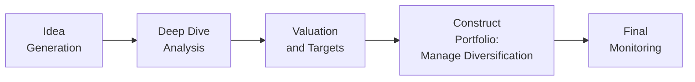
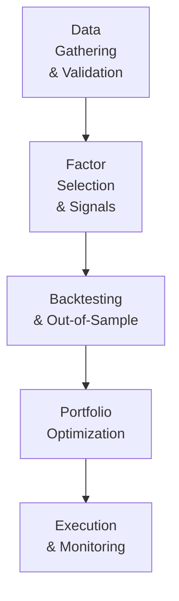

## Introduction and Strategic Foundations

Let’s say you’re starting out at an asset management firm, or maybe you’re running your own small advisory. And you’re thinking: “I have these great ideas, but which approach should I take—purely based on fundamental, boots-on-the-ground research, or more of a quantitative, model-driven approach?” Well, there isn’t a simple universal answer. Instead, it all hinges on your target market, your time horizon, your risk appetite, and the type of investor you are at heart. Do you love reading balance sheets, or do you love coding factor models?

Fundamental strategies lean into deep analysis of individual companies—what's going on at the ground level, how competitors stack up, how well the company's products address market needs, and so forth. Quantitative strategies, by contrast, rely on systematic modeling and scouring massive datasets for patterns, seeking repeatable alpha that can be captured through algorithmic decision-making.

Below, we’ll explore both approaches to constructing an active equity strategy. Remember, in practice, many successful strategies blend fundamental insights with quantitative tools. Still, let’s break them down separately to really get a sense of how each one is developed.

## Building a Fundamental Strategy

Fundamental managers rely on careful, discretionary evaluation of businesses, typically with a long-term view. The fundamental process has broad steps that apply whether you’re looking at large-cap technology stocks or small-cap emerging market plays.

### Idea Generation

First, you need to figure out where to look. If you’re focusing on undervalued companies, you might start with screening tools that filter for specific valuation multiples (like low price-to-earnings or low price-to-book). Or maybe you’re a growth investor—then you might screen for robust revenue expansions and high return on equity. Some managers like to find catalysts, which could be anything from the introduction of a new product to a regulatory change.

In my own practice—well, at least in earlier roles—I’d browse entire industries for anomalies. Sometimes I'd see a pharmaceutical company announcing a pipeline drug that might not be fully priced in by the market. That’s a potential catalyst.

### Deep Dive Analysis

Next, fundamental managers take a deep breath and dive into the details. This stage often involves:

• Reading annual reports, 10-Ks, and 10-Qs, if available.  
• Listening to (or reading transcripts of) earnings calls.  
• Studying competitor moves, industry dynamics, and macroeconomic conditions that might influence the company.  
• Evaluating the company’s capital structure, especially if debt levels are high or if there are convertible securities that might dilute earnings down the road.

You’ll also want to pay attention to intangible factors like management credibility and corporate culture. It might sound a bit intangible, but you can often glean insights from the consistency of management’s messaging, turnover rates among key executives, or even how they handle IR (investor relations) communications.

### Valuation and Price Targets

After you’ve identified a few high-potential firms, you jump into the number-crunching. Typically, fundamental folks rely on:

• Discounted Cash Flow (DCF) models: Forecast free cash flows and discount them back to the present using a required rate of return.  
• Comparable Multiples: Compare your company’s valuation metrics (P/E, EV/EBITDA, P/B) with industry peers.  
• Residual Income or Economic Value Added (EVA) methods: Identify how much value a company’s earning in excess of its cost of capital.  

Consider a simple example: Suppose you anticipate Company A’s free cash flow next year will be $100 million, growing 5% each year for five years, then flattening at 3% after that. You decide on a discount rate of 8%. Summarizing the math quickly:

1. Project free cash flows for years 1–5.  
2. Apply a terminal value calculation using the perpetuity growth model at year 5, discount it back to the present.  
3. Sum all discounted cash flows to arrive at the firm’s intrinsic value.

If that intrinsic value suggests the current stock price is 20% below your fair value, you might jump in—assuming all your fundamental checks have turned out positive.

### Portfolio Construction

You have your high-conviction picks, but building a portfolio is more than just throwing them all together. Maybe you want to ensure your exposure to cyclical sectors (like energy or materials) is balanced with more stable sectors (like consumer staples). Or you might want to cap the maximum weight of any single security to limit idiosyncratic risk. Typically, you’d also ensure geographic diversification—unless your mandate is purely domestic.

Let’s visualize a general process for fundamental portfolio construction:

### Monitoring and Exit

Finally, fundamental managers keep close tabs on their companies. If the initial thesis changes—say a big competitor steps into an important product market, or revenues abruptly shrink—it might be time to adjust or exit. This is also where stop-loss orders sometimes come into play; you might decide to exit a position if the market passes a certain negative threshold, regardless of the fundamental outlook, to prevent large drawdowns.

## Building a Quantitative Strategy

Now, let’s move on to the quant side. Quantitative investing typically harnesses economic and behavioral factors. The big difference is that these approaches rely heavily on advanced statistical techniques, machine learning models, or algorithmic optimization.

### Research and Data Gathering

At the outset, you need data, and lots of it. That includes market prices, volume data, fundamental metrics (like earnings or book value), and maybe even alternative datasets like satellite imagery or social media sentiment if your strategy is that advanced. Whatever data you gather, be sure to:

• Clean it thoroughly (remove errors, address missing values, handle outliers).  
• Normalize it if you need to compare across large sets of information.  
• Align timeframes (daily data, weekly or monthly data, etc.) depending on your strategy horizon.

Once, I remember a colleague who forgot to adjust for stock splits properly in historical prices. Our backtest results were thoroughly skewed… Oops. So yeah, data quality is huge.

### Factor Selection and Model Design

Quant strategies often revolve around factors (like value, momentum, quality, or even esoteric signals). Let’s say you’re building a “value-plus-momentum” strategy. You might define “value” using metrics such as price-to-book or price-to-cash-flow, and “momentum” by looking at the past 6- or 12-month returns for a stock.

Then you typically rank a universe of stocks by these factors and choose those with the best composite rankings. Alternatively, you might use a machine learning model that lumps several signals together and tries to predict the future direction of returns. The goal, in any case, is to isolate persistent anomalies or inefficiencies in the market.

### Backtesting and Validation

You’ve picked your factors, coded your signals, and now it’s time to see if your model would have actually worked historically. In backtesting, you run your strategy on past data. But make sure you’re not overfitting—meaning your model memorizes the past without capturing a truly robust relationship.

One best practice is to do an out-of-sample test, where you hold back a chunk of historical data and only test on it after you finalize your model. If your performance metrics collapse on new data, that’s a red flag that your model might be overfit.

### Portfolio Optimization

Once you confirm your factor model works, you might feed your expected returns or factor exposures into a portfolio optimizer, such as mean-variance optimization (MVO). That helps you find an appropriate blend of stocks to maximize expected return for a given risk level. You can also incorporate constraints—like a maximum 5% position in any single stock, or limiting sector weights to ±3% of the benchmark index.

An example:

1. Suppose your factor model predicts annual expected returns for each stock in the S&P 500.  
2. You import these “alpha forecasts” into a mean-variance framework.  
3. You set constraints on turnover (to manage transaction costs), sector exposures, and total portfolio risk.  
4. The optimizer outputs a series of recommended weights for each stock.

### Execution and Rebalancing

A quant strategy typically requires disciplined rebalancing—maybe monthly or quarterly. You evaluate new data, update factor scores, re-run the optimization, and adjust holdings if needed. Execution can be done through algorithmic trading to minimize market impact, a vital piece to ensure your alpha isn’t eaten up by transaction costs.

## Risk Management Techniques

Whether you lean fundamental or quant, risk management is your essential seatbelt. If you’re a fundamental manager, you might set strict limits on how big any single position can become or how large your sector bets can be relative to a benchmark. In quant strategies, you manage factor exposures, ensuring you’re not inadvertently doubling down on a single risk factor (like excessive leverage or extreme momentum).

Also consider:

• Stop-Loss Orders: Automatic triggers that exit a position once it has lost a certain percentage of value.  
• Drawdown Thresholds: If your portfolio value falls beyond a specified limit, you might reduce or de-risk exposures.  
• Updating Models: For quant strategies, factor definitions might need periodic upgrading, especially if market regimes shift (e.g., from low interest rates to rising interest rates).  
• Liquidity Constraints: Particularly relevant if you handle large AUM or trade in smaller-cap markets. Ensure you can exit positions without incurring massive slippage.

## Common Pitfalls and Possible Workarounds

1. Overfitting in Quant Models: All the hype about “machine learning” and “big data” is great, but watch out for models that are too perfectly tuned to historical data.  
2. Behavioral Biases in Fundamental Analysis: Overconfidence in your personal convictions, reluctance to admit mistakes, or anchoring on initial valuations can lead to suboptimal decisions.  
3. Ignoring Transaction Costs: Both strategies can fail if you haven’t accounted for real-world friction.  
4. Factor Decay: Over time, some alpha factors become overcrowded (e.g., the classic small-cap value anomaly might fade if everyone is chasing it), so continuous innovation is necessary.  
5. Macro Shocks or Regime Shifts: Strategies that worked in one environment (stable inflation, for instance) might fail in another (sudden high inflation).

## Application to Real-World Scenarios

• Emerging Markets Twist: A fundamental manager diving into emerging markets might face limited data, unreliable financial statements, and different accounting standards. Meanwhile, a quant approach might struggle with illiquid, lower-frequency data, leading to high transaction costs.  
• Specialized Sectors: If you focus on biotech or technology, fundamental knowledge of product pipelines can be crucial, but so is analyzing scientific data and patent filings. Quants can design specialized factor models, such as the progress of clinical trials or patent approval rates, but the data might be patchy.  
• Market Stress Events: During tumultuous periods (think 2008 or early 2020), fundamental valuations can swing wildly. Quants might see their historical correlations break down if the crisis environment is entirely different from the backtested period.

## Practical Tips for CFA® Level III Candidates

1. Integration of Market Theories: Some exam questions revolve around how fundamental or quant approaches tie back to Efficient Market Hypothesis (EMH) concepts, or how alpha can exist in segments of the market with less analyst coverage.  
2. Ethics Angle: Watch out for data usage. If you’re incorporating alternative data, be aware of privacy concerns and ensure compliance with regulations.  
3. Weighted vs. Unweighted Approaches: You might find item sets describing mean-variance optimization with constraints, asking you to interpret the results.  
4. Time Management in Constructed Response: If you’re tackling an essay question about building an active strategy, structure your answer around the steps we covered—idea generation, analysis, valuation, risk management, etc.  
5. Always Cross-Check Factor Efficacy: The exam might test your ability to identify biases (survivorship bias, look-ahead bias) in a backtest.  
6. Focus on Risk-Return Trade-Offs: Show you understand not just how to generate alpha, but how to maintain a stable risk profile.

## Glossary

• Catalyst: An event—like an FDA drug approval or major contract announcement—that can cause the market to rapidly reassess a company’s value.  
• Earnings Surprise: Any reported earnings figure that deviates significantly from consensus analyst forecasts.  
• Normalization (Data): The process of adjusting raw data points (e.g., returns, volumes) so they’re comparable across time and markets, factoring out anomalies or scale differences.  
• Out-of-Sample Test: Testing your model on a dataset reserved for final validation—so you don’t “cheat” by optimizing your strategy based on the exact same data used for training.  
• Mean-Variance Optimization (MVO): A mathematical approach that balances expected returns against variance (risk), aiming to find an optimal portfolio weighting.  
• Stop-Loss: A standing order to sell once a price drops below a preset level, limiting further losses.  
• Position Sizing: Determining the relative weight of each holding in a portfolio based on risk tolerance and return potential.

## References and Further Reading

• Fabozzi, F. J., Focardi, S. M., & Kolm, P. N. (2006). “Incorporating Trading Rules into Portfolio Construction.” Journal of Portfolio Management.  
• Poterba, J. M., & Summers, L. H. (1988). “Mean Reversion in Stock Prices.” Journal of Financial Economics.  
• Kahn, R. (2019). The Future of Investment Management. CFA Institute Research Foundation.  

These readings offer both theoretical and practical perspectives on building and managing active strategies. They’ll give you a sense of how major players in the industry tackle both fundamental and quantitative approaches.

## Final Exam Tips

• Map Out the Process: On exam day, if you see a question about constructing either a fundamental or quant strategy, break your answer down systematically: Idea Generation, Analysis, Valuation, Construction, Monitoring.  
• Highlight Risk Controls: The CFA Institute is big on risk management. Always mention how you constrain exposures, handle triggers for rebalancing, or mitigate drawdown.  
• Show Awareness of Market Conditions: If the question references a changing interest rate environment or equity market volatility, incorporate how you’d adjust your strategy or factor models.  
• Time Management: In essay questions, use bullet points or short paragraphs to convey clarity. In item sets, maintain a thorough approach, but watch your clock so you can address all sub-questions.  

By merging robust frameworks with your own insights, you can develop active equity portfolios that (hopefully) generate alpha—and keep your stakeholders happy. Good luck on your journey to mastering both fundamental and quantitative active strategies!

--------------------------------------------------------------------------------

## Assessing Fundamental and Quantitative Strategy Construction



### Which key element differs most between fundamental and quantitative strategies?

- [ ] Monitoring portfolio holdings
- [ ] Employing risk management techniques
- [ ] Setting stop-loss triggers
- [x] Execution based on model outputs rather than discretionary judgment

> **Explanation:** Fundamental strategies rely on discretionary insight and deep-dive analysis, whereas quantitative strategies use systematic, model-driven signals to make execution decisions.

### What is a catalyst in the context of fundamental investing?

- [x] An event or piece of news expected to cause changes in a company’s valuation
- [ ] A trading algorithm that executes large orders
- [ ] A mathematical model for predicting stock returns
- [ ] A factor that measures a company's momentum

> **Explanation:** In fundamental analysis, a catalyst is something (e.g., a regulatory approval, a major partnership, or a new product launch) that spurs the market to re-evaluate the stock’s value.

### Which is a common practice to validate a quantitative model and avoid overfitting?

- [ ] Ignoring outliers in the dataset
- [ ] Using the same dataset for training and testing
- [x] Performing out-of-sample tests on reserved data
- [ ] Increasing portfolio leverage to inflate returns

> **Explanation:** Out-of-sample testing ensures your model is not overly optimized to historical quirks and has the capacity to generalize to new data.

### In constructing a mean-variance optimized portfolio for a quant strategy, which input is most critical?

- [x] Estimated expected returns or alpha forecasts
- [ ] Legal disclaimers
- [ ] Dividend payout history
- [ ] Earnings call transcripts

> **Explanation:** The optimizer uses expected returns (along with covariances or correlations) to build the portfolio. Without accurate alpha forecasts, optimization yields unreliable allocations.

### An investor wants a fundamental approach focusing on undervalued stocks. Which screening factor is least relevant?

- [x] Short-term earnings momentum only over 1 week
- [ ] Low price-to-earnings ratio
- [ ] Low price-to-book ratio
- [x] High total addressable market  (Note: This can be relevant, so let's make a multi-select question here.)

> **Explanation:** Typically, fundamental “value” screens favor valuation metrics like low P/E or P/B. While market momentum or addressable market can be relevant to growth or momentum investing, they’re less central to classic value screens.

### What is a major advantage of quantitative strategies over fundamental ones?

- [x] The ability to systematically process large datasets and remove certain human biases
- [ ] Guarantees of no drawdowns
- [ ] Imperviousness to market volatility
- [ ] Elimination of transaction costs

> **Explanation:** Quantitative approaches excel in handling big data and can mitigate emotional biases, although they cannot eliminate risk or transaction costs.

### Which risk management tool is common in both fundamental and quantitative equity approaches?

- [x] Setting position size limits
- [x] Defining sector-level exposure caps
- [ ] Using advanced neural networks only
- [ ] Avoiding all forms of leverage

> **Explanation:** Both fundamental and quant managers typically use constraints on position sizing or sector weights to manage risk. Neural networks or no leverage might be strategy-specific choices.

### In the fundamental approach, the “Deep Dive Analysis” stage primarily involves:

- [x] Reading financial statements, evaluating management quality, and studying industry trends
- [ ] Automating model-driven ranking of stocks
- [ ] Building advanced factor-based signals from price data
- [ ] Running real-time high-frequency trading algorithms

> **Explanation:** A hallmark of fundamentals is thorough company evaluation, which includes analyzing financial reports, management, and competitive environment.

### What is the most likely cause of a quantitative backtest showing unrealistic performance?

- [x] Overfitting or selection bias in the modeling process
- [ ] Insufficient leverage used
- [ ] Excess market liquidity
- [ ] Underweighting growth stocks

> **Explanation:** When a backtest looks “too good to be true,” it often is: the model is probably overfit to historical noise or improperly selected data, rather than identifying a genuine market inefficiency.

### True or False: A fundamental equity strategy can include systematic rules, while a quantitative strategy can incorporate discretionary judgment.

- [x] True
- [ ] False

> **Explanation:** Although we often present them as distinct categories, many real-world strategies blend elements of both. A fundamental manager might add systematic screening, and a quant manager might override a model if unusual discretionary knowledge arises.


