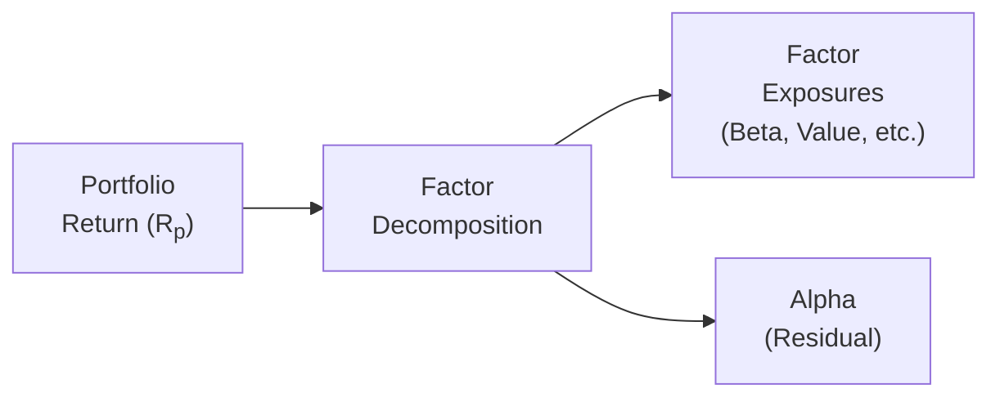

## Introduction

Sometimes, when I think back to my earliest experiences trying to pick winning stocks, I can’t help but grin: I had no idea what “alpha” even meant, let alone how to measure it. I only knew that I wanted to “beat the market.” And guess what? I was essentially seeking alpha without realizing it! Since then, I’ve learned that pursuing alpha is much more than hunches; it’s about systematically identifying the drivers of excess returns and quantifying them.

This section aims to show you how to identify potential alpha sources and how to figure out whether you’ve got genuine skill—rather than random luck—on your side. Along the way, we’ll chat about typical pitfalls, such as data mining or hidden factor exposures, and then we’ll discuss how to ensure your alpha is truly sustainable.

## Understanding Alpha

Alpha, in the simplest sense, is the portion of portfolio returns that can’t be explained by general market movements or other common risk factors. It’s the “secret sauce” that active managers bring to the table—value added (or subtracted) by skill, insight, or exploitation of market inefficiencies. Formally, alpha is often calculated as:

(1)  α = Rᵨ – [ R𝑓 + β (Rₘ – R𝑓 ) ]

• Rᵨ = Return on the portfolio.  
• R𝑓 = Risk-free rate.  
• Rₘ = Return on the market index or benchmark.  
• β = The portfolio’s sensitivity to the market index.

If you see a positive α over time, you might assume that your strategy has skill. But as we’ll see, it’s not always that simple.

## Common Alpha Sources

Active managers are constantly looking for edges—small or large—that differentiate them from everyone else. We can generally group these edges into four categories: (1) informational advantages, (2) analytical advantages, (3) behavioral insights, and (4) short-term opportunities.

### Informational Advantages

Informational advantages come from having data, research, or news that others do not—or at least do not have yet. This might include:

• Access to alternative data sources (e.g., satellite images that track retailer foot traffic).  
• Specialized industry knowledge (e.g., background as an engineer investing in tech).  
• Unpublicized research or direct relationships with corporate management (though be mindful of insider trading rules, obviously).

I remember once meeting a manager who grew up in a farming community. She had a deep understanding of agricultural cycles, weather patterns, and planting technologies—way beyond any typical modeling approach. She identified underappreciated seed technology companies and outperformed the benchmark by focusing on these niches. That’s a classic case of a personal informational advantage.

### Analytical Advantages

Analytical advantages hinge on strong modeling capabilities and the knack for interpreting complex data. For instance, a quantitative manager might:

• Develop rigorous factor models that more accurately estimate expected returns.  
• Employ advanced machine learning to spot anomalies in price data.  
• Combine macroeconomic forecasting with bottom-up fundamental analysis, or vice versa, to identify mispriced securities.

Meanwhile, a fundamental analyst might build in-depth financial models that offer sharper estimates of a company’s true valuation. By digging into the annual reports, stress-testing management’s assumptions, or dissecting cost structures, they might see a hidden gem. It’s not just about having the data; it’s about seeing insights others miss.

### Behavioral Insights

Behavioral finance tells us that market participants often act in less-than-rational ways—overreacting to news, underreacting to slow-building trends, or anchoring on past price levels. If you can systematically exploit these human tendencies, that’s a real alpha source. For example:

• Momentum strategies can capture price drift when investors underreact to improving fundamentals.  
• Contrarian strategies seek to benefit when the masses have overreacted and driven prices too far in one direction.

As an example, some managers watch how analyst earnings forecasts drift over time, knowing that analysts may be biased or slow to adjust. Spotting changes in sentiment early can be a profitable angle.

### Short-Term Opportunities

Short-term, event-driven strategies often aim to pounce on big price dislocations arising from corporate announcements, mergers, spin-offs, or other one-off occurrences. If a stock’s price plunges after a poor earnings announcement, an active manager might decide the market has over-discounted the news. Or if M&A rumors trigger panic selling in complementary sectors, there might be a chance for an arbitrage play. Timing matters here: short-term trades typically require agile trading desks and sophisticated analytics.

## Measuring Alpha

We can talk about alpha all day, but measuring it is where the rubber meets the road. Determining whether your portfolio outperformed by skill—or luck—requires careful analysis. Let’s consider some key methods.

### Jensen’s Alpha

Jensen’s alpha, derived from the Capital Asset Pricing Model (CAPM), is probably the most classic measure. It subtracts a market-based return expectation from the portfolio’s actual return:

(2)  α = Rᵨ – [ R𝑓 + β (Rₘ – R𝑓 ) ]

If α is positive, you’ve earned more than what the CAPM beta would suggest. Negative α means you underperformed relative to a risk-comparable portfolio. However, you should know CAPM is just one factor model—modern markets can be driven by a range of additional factors, like value, momentum, size, etc. If the portfolio’s performance is really linked to these other dimensions, a single-beta model may mislead you into thinking there’s alpha when, in fact, the exposure is to some other factor.

### Multiple-Factor Regression Analysis

To dig deeper, practitioners often use multifactor models based on academic and practitioner research (e.g., Fama-French five-factor model, or custom in-house models). The general idea might look like:

Rᵨ – R𝑓 = α + ∑(βᵢ × Fᵢ) + ϵ

Where Fᵢ are factor returns (value, size, momentum, etc.), and βᵢ are the portfolio’s sensitivities to those factors:

• If α remains significant after accounting for all relevant factors, you might have real alpha.  
• If α disappears once you incorporate all your factor bets, you likely have hidden exposures rather than skill.

### Risk-Adjusted Metrics

We want to ensure alpha is measured on a risk-adjusted basis. After all, it’s trivial to juice returns by lever‑ing up an otherwise average portfolio. Key measures include:

• Information Ratio (IR): The ratio of active return over its active risk (standard deviation of active returns). A consistently high IR points to skill.  
• Sharpe Ratio: Although overshadowed by the IR for measuring alpha, it’s still useful for capturing total risk-adjusted returns (including market and other factors).  
• Sortino Ratio, Treynor Ratio, etc.

If your alpha is simply a function of hidden factor tilts, it can vanish in a powerful downturn. In other words, measure alpha with a keen awareness of your factor exposures.

Below is a simple diagram illustrating the decomposition from overall return to factor exposures and finally to alpha:

## Spotting False Alpha

Let’s be candid: sometimes what appears to be alpha is just a mirage. Maybe you’re riding a popular factor wave, or maybe your backtest was “p-hacked” to the nth degree. Here are some typical red flags.

### Overfitting or P-Hacking

Overfitting can occur when a quantitative strategy is tuned to perform perfectly on historical data but fails in real-time trading. You keep tweaking the model to “improve” performance on a specific dataset. In practice, you’re just building an algorithm that explains past noise rather than future reality.

### Excessive Leverage

Seeing double-digit outperformance might seem great—until you realize the portfolio was leveraged 5:1. Leverage inflates returns when the market cooperates, but can backfire catastrophically. This doesn’t mean leverage is always bad, just that you should adjust for it when attributing outperformance. Otherwise, you’re basically comparing an apple on steroids to a plain old orange.

### Unreported Risks and Hidden Factor Exposures

Sometimes, managers might have a big tilt toward a certain industry or factor. They appear to have alpha when that factor does well. Then the factor (e.g., high-yield credit in a boom) turns sour, and their alpha abruptly collapses. If a manager’s “secret sauce” is just a disguised factor bet, that’s not real alpha—at least not in the sense of skill-based outperformance.

## Sustainability of Alpha

So you’ve found a strategy that has produced alpha for a few quarters—congrats! The next question is: Will it last?

### Competitive Landscape

When many managers flock to the same anomalies or factor tilts, returns can shrink as everyone piles in. I once followed a manager who had great success shorting small biotech firms after oversubscribed IPOs. Before long, other funds caught on, competition rose, and spreads narrowed. The alpha from that strategy pretty much evaporated.

### Capacity Constraints

Some strategies don’t scale well. Imagine a small-cap strategy that capitalizes on nuanced price anomalies in illiquid stocks. As assets under management (AUM) grow, the manager can no longer trade in and out of these tiny stocks without moving their prices. Essentially, capacity constraints choke alpha once the strategy becomes large.

### Structural Edges vs. Ephemeral Conditions

If your alpha is based on fleeting market dislocations (e.g., credit spreads in a crisis), it might not last when markets normalize. By contrast, if you have a true structural edge—for instance, a technology platform that gathers unique data more quickly than others—then maybe that alpha can persist. Always ask: “Is this a one-time anomaly or a repeatable source of outperformance?”

## Real-World Examples and Case Studies

• Mutual Fund Performance: A study by Wermers (2000) decomposed mutual fund returns. It found that, on average, active equity managers do have some skill, but it’s often offset by fees and transaction costs. This underpins the importance of net-of-fees alpha measurement.  
• Activist Strategies: Activist investors like Carl Icahn have sometimes generated alpha by pushing for corporate changes that unlock shareholder value. However, these strategies are often capacity-constrained and rely on negotiating power that not every manager can wield.  
• Factor Investors: Some large institutional investors systematically capture risk premia (e.g., value, momentum) across global markets. Over time, once those factor premia are widely known and exploited, their alpha-like returns might dwindle.

## Best Practices and Common Pitfalls

• Conduct robust backtests that incorporate out-of-sample testing and realistic trading assumptions.  
• Align your time horizon with the nature of your strategy (e.g., short-term event-driven vs. long-term fundamental).  
• Monitor factor exposures regularly to ensure that your alpha isn’t just a disguised factor tilt.  
• Remain open-minded about the possibility that your “secret formula” could be ephemeral.  
• Keep an eye on fees and trading costs, which can eat up a significant portion of gross alpha.

## Glossary

• Beta (β): Sensitivity of a security’s return to the overall market return.  
• Informational Edge: Unique knowledge or data not widely available.  
• Jensen’s Alpha: Excess return of a portfolio over its expected return as predicted by the CAPM model.  
• Information Ratio: The ratio of active return to active risk—useful for measuring consistency of outperformance.  
• P-Hacking: Tuning statistical or modeling techniques to reach desired conclusions, often by excessive data mining.  
• Capacity Constraints: The increased difficulty of trading a strategy as the size of capital being managed grows beyond what the market can accommodate efficiently.

## Conclusion and Exam Tips

Identifying and measuring alpha is a core component of active portfolio management. As you prepare for the CFA Level III exam, keep these points in mind:

• Always dissect returns to determine whether any outperformance is due to skill, factor tilts, or random luck.  
• Recognize that alpha can be masked by hidden risk exposures or overshadowed by fees and transaction costs.  
• Focus on sustainability. A strategy that looks brilliant on paper might falter in real market conditions if it relies on ephemeral trends or has severe capacity constraints.  

Time management is crucial in the essay (constructed response) portion of the exam. If presented with a portfolio performance scenario, break down the problem systematically: identify the relevant factor exposures, calculate alpha, and interpret your findings. Then address any hidden exposures or risks that might invalidate your alpha. Clear, concise reasoning often yields extra points.

## References and Further Reading

• Grinold, R. C. (1989). “The Fundamental Law of Active Management.” The Journal of Portfolio Management.  
• Wermers, R. (2000). “Mutual Fund Performance: An Empirical Decomposition into Stock-Picking Talent, Style, Transactions Costs, and Expenses.” The Journal of Finance.  
• Clarke, R., de Silva, H., & Thorley, S. (2002). “Portfolio Constraints and the Fundamental Law of Active Management.” Financial Analysts Journal.  

Use these readings to explore more nuanced discussions about how breadth, skill, and constraints interact to produce alpha. They’ll help deepen your understanding of why alpha is so elusive—and infinitely fascinating.

## Potential Alpha Sources Self-Assessment Quiz



### Which of the following statements best describes “alpha” in the context of active portfolio management?

- [x] Excess return that cannot be explained by the market’s overall movement.
- [ ] Return attributable to broad market factors.
- [ ] The difference between an asset’s book value and its market value.
- [ ] The portion of the portfolio exposed to systemic risks only.

> **Explanation:** Alpha refers to performance that exceeds what is expected based on market risks or inherent factors, capturing the manager’s skill rather than broad market or factor returns.

### What is the main purpose of multifactor regression in measuring alpha?

- [ ] To increase the number of variables in the model so that alpha becomes larger.
- [x] To decompose portfolio returns into various factor contributions and isolate manager-specific skill.
- [ ] To enhance trading liquidity by adding multiple exposures.
- [ ] To ensure market exposure is eliminated from the strategy entirely.

> **Explanation:** Multifactor regressions help break down performance into factor-driven and manager-driven components. The part not explained by known factors is typically allocated to alpha.

### Which of these is generally considered a key benefit of using the Information Ratio (IR)?

- [ ] It directly measures the volatility of the stock’s price relative to the market.
- [ ] It is used solely for leveraged strategies.
- [x] It helps measure how consistently an investor generates active returns relative to the variability of those returns.
- [ ] It can only be meaningfully applied to passive investment strategies.

> **Explanation:** The IR compares the average active return (excess return over benchmark) to the volatility of that active return, capturing both the magnitude and consistency of alpha.

### Which scenario might indicate a risk of “false alpha”?

- [x] A strategy with extremely high return in backtesting but lackluster performance out-of-sample.
- [ ] A portfolio with net returns above fees and transaction costs.
- [ ] A manager who invests conservatively in high-grade bonds.
- [ ] A manager who thoroughly hedges currency exposure.

> **Explanation:** Overfitting or p-hacking often generates excellent historical “results” that fail to materialize in real-market conditions, suggesting false alpha.

### In evaluating the sustainability of alpha, what is a critical factor to consider?

- [ ] Whether the strategy used academic theory.
- [x] Potential for crowding and competition from other market participants.
- [ ] Whether leverage is employed at a ratio below 2:1.
- [ ] Whether the manager invests in large-cap indices only.

> **Explanation:** Crowd behavior can erode alpha. As more people learn about a certain inefficiency, the advantage typically diminishes or disappears.

### Which of the following statements is true regarding capacity constraints?

- [ ] They are irrelevant to alpha generation.
- [x] They can limit the size of trades, making it difficult to maintain returns once AUM becomes large.
- [ ] They strictly apply to large-cap and liquid stocks.
- [ ] They only become a factor in the derivatives market.

> **Explanation:** When managing more capital, trades in smaller or less liquid markets can significantly move the price, thereby eroding potential alpha.

### What is the primary critique of measuring alpha using only a single-factor CAPM model?

- [x] It may conflate genuine skill with returns driven by factors other than the market.
- [ ] It makes alpha more accurate by capturing only a single market risk.
- [ ] It is the only model recognized by the CFA Institute.
- [ ] It makes alpha harder to identify because it accounts for every possible factor.

> **Explanation:** Beta in the CAPM captures market exposure alone; additional risk factors like size, value, or momentum might produce returns that appear as alpha unless they’re accounted for appropriately.

### Which of the following is an example of sustaining an informational advantage?

- [ ] Consistently using the CAPM for all market analysis.
- [ ] Trading only during index rebalancing periods.
- [ ] Using aggregated market data that is publicly available.
- [x] Maintaining specialized knowledge or alternative data sources that are not widely available to competitors.

> **Explanation:** Having unique data or specialized expertise that others cannot easily replicate can help preserve alpha-generation capabilities over time.

### Which tactic is generally recommended for avoiding p-hacking?

- [ ] Focusing solely on in-sample backtests to perfect the fit.
- [ ] Disregarding out-of-sample validation data in performance metrics.
- [x] Conducting robust out-of-sample tests and using different time periods or datasets to verify results.
- [ ] Using leverage to amplify historical returns.

> **Explanation:** Overfitting can often be spotted by testing the model on data not used in the creation (i.e., in-sample data). Confirming performance across different datasets helps ensure robustness.

### True or False: A portfolio manager who generates returns consistently above the market must be creating a positive alpha.

- [x] True
- [ ] False

> **Explanation:** By definition, alpha is about beating a relevant benchmark. If the portfolio systematically outperforms the market, it suggests the manager is capturing positive alpha—unless hidden factor exposures or unaccounted risks are the real drivers behind their performance.


