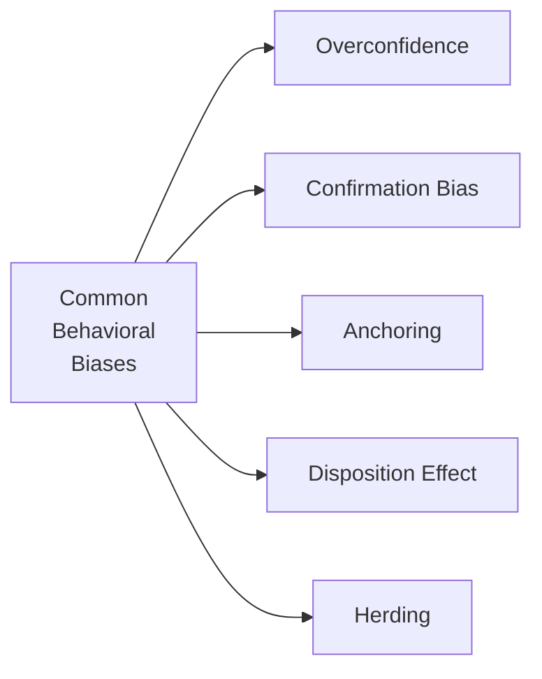

## Introduction

Behavioral biases can creep into equity strategy development and subtly shape the way we research, build models, and make investment decisions. Perhaps you’ve sat in an investment meeting and felt that irresistible pull to follow the crowd’s opinion—deep down, something told you it might not be the best idea, but you did it anyway. These tendencies are common to all of us because, at the end of the day, we’re only human. Even the most technically sound strategies can be sabotaged by psychological blind spots.

In this section, we’ll explore the main behavioral biases that affect equity strategy development—let’s refer to them as the usual suspects—and show how they can systematically distort our thinking. We’ll also walk through some practical ways to mitigate these biases and apply behavioral insights in your day-to-day equity strategy work.

## Relevance of Behavioral Finance

Behavioral finance adds a human dimension to traditional finance theories, reminding us that markets aren’t just driven by rational participants who have perfect information. Instead, people interpret and act on information through a filter of emotions, predispositions, and cognitive shortcuts. 

When assembling or refining equity strategies, it’s easy to get excited and assume your analyses are bulletproof (I’ve certainly been guilty of that early in my career). You might rely on the same data sources or discount negative signals that conflict with your “gut feeling.” Occasionally, we also anchor on past performance (“the stock was at $100 last year, so it has to go back there!”) without good reason. As a result, equity strategy decisions can become skewed, leading to suboptimal portfolio performance. 

The interplay between biases and irrational market responses can be substantial enough to create anomalies—mispriced securities that can be exploited through thoughtful, unbiased processes. Recognizing this interplay is key when designing factor-based or discretionary fundamental strategies described in other parts of this curriculum (e.g., “2.4 Constructing Fundamental and Quantitative Active Strategies”).  

## Common Behavioral Biases in Equity Strategy Development

Below is a simple Mermaid diagram summarizing five major biases. Don’t worry, we’ll dig into each in detail.

### Overconfidence Bias
Overconfidence bias leads managers (and entire teams) to overestimate their forecasting abilities or the reliability of their models. We convince ourselves that our proprietary approach or specialized knowledge is so unique that issues must be outliers. This mindset can blind us to signs that our strategy’s assumptions are flawed.

In practice, overconfidence might manifest as:
• Taking on higher levels of portfolio risk without truly recognizing the downside.  
• Under-diversifying because we “know” we’ve identified a few sure winners.  
• Underestimating how random noise or luck can influence short-term performance results.  

Most famously, overconfidence can lead to “giant blowups,” where a manager places outsized bets believing they have an edge, only to be gobsmacked by volatility or negative fundamental news. 

### Confirmation Bias
Confirmation bias is the tendency to search for, interpret, and remember information that supports our preexisting views. Maybe you’ve noticed how, once you fall in love with a growth stock, you automatically “only see positive reviews” or “only see upward trends.” Contrarian data might be conveniently ignored or labeled as “fluke.”

Within equity research, confirmation bias can be harmful. You might skip over contradictory analyst reports, or you might fail to examine competitor product lines. Instead, you spin a neat story around the data that matches your bullish thesis. This is especially risky when calibrating quantitative models: we sometimes iterate the model until it “confirms” our original hypothesis, ignoring that we might be overfitting.

### Anchoring
Anchoring refers to the common human practice of relying too heavily on the first piece of information we receive—or on an outdated reference point—when making decisions. For example, if a stock traded at $80 per share a year ago, you might constantly use $80 as a so-called “anchor” to evaluate the current price. You find yourself thinking, “It’s at $40 now, so obviously it’s undervalued by 50%!” The $80 anchor might be completely irrelevant given new developments, but it captures our imagination. 

Anchoring can affect everything from setting price targets to adjusting factor exposures. If we used a certain fundamental ratio or macro forecast last quarter, we might resist updating these assumptions even when new data suggests otherwise.

### Disposition Effect
The disposition effect describes the tendency to sell winners too early—locking in gains out of fear the stock might dip—and hold losers too long in the hope they “bounce back.” Equity managers frequently exhibit this bias. It pops up in performance reviews when we brag about winners we sold at modest gains, only to see them soared after we exited, or hold onto a losing stock with no improvement in fundamentals, purely because of an emotional aversion to admitting a mistake.

Apart from the emotional damage, the disposition effect can systematically reduce your returns if you consistently exit high-conviction winners prematurely and cling to decaying positions that are unlikely to rebound.  

### Herding
We all want to fit in. Herding bias is following consensus trades, especially under social or professional pressure, rather than performing independent analysis. It’s surprisingly easy to defend a “crowded trade” in front of your investment committee—to say, “Well, 10 leading asset managers are all doing it.” But remember, big mistakes can become amplified when an entire market segment invests behind the same idea. During periods of euphoria or panic, a herd mentality can inflate bubbles, fuel flash crashes, and create distinct pockets of inefficiency.

## Mitigation Techniques

It’s one thing to be mindful of biases; it’s another to structurally reduce their impact. The following are best practices for equity managers looking to keep biases in check:

• Use systematic checklists and rules-based approaches:  
  Before you make a trading decision, consider having a standardized set of considerations—valuation metrics, risk factors, quality of evidence—so you evaluate everything consistently.  

• Foster a culture of constructive debate:  
  Encourage your team to voice disagreements. Impose a devil’s advocate role, explicitly tasked with questioning assumptions. A supportive, respectful environment can help everyone challenge blind spots.  

• Gather independent or alternative data:  
  If your entire sector research is based on the same single brokerage feed, try to incorporate different data streams—satellite imagery, consumer traffic data, or social media sentiment—so you reduce the risk of confirmation bias.  

• Conduct post-mortem analyses and skill vs. luck audits:  
  Periodically review your biggest losses and biggest wins. Ask: “Was this the result of skill or luck?” Digging into how decisions were made will highlight recurring bias patterns.  

• Diversify your team:  
  People from varied backgrounds and experiences can offset groupthink. A well-rounded team is typically better at spotting hidden assumptions in your equity strategy.  

## Incorporating Behavioral Insights into Strategies

It’s not all doom and gloom—behavioral pitfalls can also be turned into alpha opportunities for savvy managers. Here’s how:

• Factor Design:  
  Behavioral insights suggest certain contrarian factors—like buying beaten-down stocks at the peak of fear—can be lucrative because they exploit herding or overconfidence elsewhere in the market. If you believe markets systematically overreact to negative news, your equity strategy might incorporate a “mean reversion” signal to capture rebounds.  

• Objective Rebalancing Rules:  
  Instead of letting daily emotions drive your buy/sell directions, set rules-based triggers for rebalancing. For example, you might define a rebalancing threshold that aims to reduce the disposition effect or anchoring issues.  

• Monitoring Trading Patterns:  
  Data analytics can detect recurring bias-driven patterns in your trading. For instance, if you historically initiate trades on a stock after reading only bullish news, you may need to systematically require risk-off checks or second opinions.  

• Behavioral Factor ETFs and Portfolios:  
  Some managers are now launching behavioral finance-inspired funds that purposefully target securities where standard biases cause mispricing, effectively capitalizing on widespread psychological mistakes.  

By actively harnessing known behavioral tendencies—from short-term overreactions to sentimental extremes—you can potentially strengthen your strategy’s risk-adjusted returns.  

## Glossary

• Cognitive Bias: A systemic pattern of deviation from rational judgment that can affect decisions and strategy building.  
• Herd Mentality: The inclination to follow peers or industry consensus, leading to reduced independent analysis and potentially crowd-driven mispricing.  
• Devil’s Advocate: A designated skeptic on the team who challenges groupthink to uncover weaknesses in an argument.  
• Contrarian Signal: An indicator that encourages taking a position opposite to the prevailing market sentiment, often to exploit investor overreactions.  
• Sentiment Extremes: Periods of widespread euphoria or fear that can distort the market’s pricing mechanism, often preceding significant reversals.  

## Conclusion and Best Practices for the CFA Exam

As you prepare for the Level III exam, remember that these biases aren’t just theoretical—they show up in case studies, item sets, and constructed-response questions. You might be asked to recognize how a manager’s decision was biased by overconfidence or anchoring, or to propose methods to mitigate the effect of herding.

What tends to be tested? CFA Institute exam questions often highlight:
• The difference between identifying a behavioral bias and articulating a solution to prevent it.  
• How biases can ruin performance attribution or hamper the viability of a fundamental/quant strategy.  
• The interplay between biases and the Code of Ethics: Are managers ignoring prudent risk management because they’re anchored to prior convictions?

Finally, building an awareness of your own biases is an essential life skill—one that influences not just your investment returns, but also how effectively you can communicate and collaborate within a team.  

## References

• Kahneman, D. (2011). Thinking, Fast and Slow.  
• Montier, J. (2007). Behavioral Investing: A Practitioner’s Guide to Applying Behavioral Finance.  
• Thaler, R. H. (2015). Misbehaving: The Making of Behavioral Economics.  
• CFA Institute (Official Curriculum Readings).  

## Test Your Knowledge: Behavioral Biases in Equity Strategy Development



### Which of the following statements best describes overconfidence bias?

- [ ] Overconfidence bias is the tendency to blindly follow peers’ investment decisions.  
- [ ] Overconfidence bias is relying on a past irrelevant reference point for decision making.  
- [x] Overconfidence bias is overestimating personal analytical abilities or the quality of a model.  
- [ ] Overconfidence bias is refusing to update a forecast in light of new evidence.  

> **Explanation:** Overconfidence bias is often seen when analysts or managers place too much faith in their skills, leading them to underestimate risks or discount conflicting information.

### How does confirmation bias commonly manifest in equity strategy research?

- [ ] By causing investors to buy highly volatile stocks without any fundamental analysis.  
- [ ] By causing investors to apply systematic contrarian models for rebalancing.  
- [x] By making researchers favor information that supports their existing standpoint and ignore contradictory evidence.  
- [ ] By encouraging objective dialogues and thorough peer review of research assumptions.  

> **Explanation:** Confirmation bias encourages seeking or interpreting information in a way that aligns with preexisting beliefs, potentially leading to flawed research or ignoring important contrary data.

### Which of the following actions is most likely to reduce the disposition effect?

- [x] Setting predetermined sell rules based on price thresholds or risk metrics.  
- [ ] Maintaining positions in the same stocks indefinitely to avoid realized losses.  
- [ ] Adopting the consensus opinions of several large brokerage firms.  
- [ ] Using a single data source to confirm your original thesis.  

> **Explanation:** Pre-specified selling rules help counteract the emotional tendency to hold onto losing positions hoping they’ll rebound, or to sell winners too quickly.

### Anchoring bias typically occurs when investors:

- [x] Fixate on an initial number (such as a historical stock price) as a reference point.  
- [ ] Focus on independent research to question consensus views.  
- [ ] Overweight contradictory evidence and disregard model-based insights.  
- [ ] Employ structured rules to systematically filter potential investments.  

> **Explanation:** Anchoring arises when investors rely heavily on an insignificant or outdated piece of information (like a previous price) for future decisions.

### Which bias is most evident when a portfolio manager chooses to follow a trend purely because many other market participants have done so?

- [ ] Confirmation bias  
- [ ] Anchoring  
- [ ] Overconfidence bias  
- [x] Herding  

> **Explanation:** Herding is when managers follow the masses or adopt popular trades rather than conducting an independent assessment of an investment’s risk/return profile.

### The disposition effect can lead to:

- [ ] Buying more of a losing stock purely on the basis of fundamentals.  
- [x] Selling stocks that have appreciated too soon while holding losing positions too long.  
- [ ] Strict adherence to risk-budgeting mechanisms to control losses.  
- [ ] Investing through diversified factor-based strategies for balanced exposure.  

> **Explanation:** The disposition effect encourages locking in gains prematurely out of fear and holding onto losing positions in hopes of recovery.

### One way to mitigate confirmation bias is to:

- [x] Require devil’s advocacy in the investment committee to challenge prevailing assumptions.  
- [ ] Consistently rely on the same news source for data.  
- [ ] Delegate all research to a single portfolio manager without group input.  
- [ ] Place additional weight on any evidence that matches your original thesis.  

> **Explanation:** A devil’s advocate role fosters healthy dissent and ensures a thorough evaluation of investment strategies from multiple perspectives.

### How can a checklist approach help in managing behavioral biases?

- [x] It standardizes decision-making steps and ensures key metrics and risk factors aren’t overlooked.  
- [ ] It encourages shortcuts in fundamental analysis.  
- [ ] It automatically implements contrarian trades without human input.  
- [ ] It eliminates all forms of risk from an equity portfolio.  

> **Explanation:** A systematic checklist approach creates a more objective framework for decisions, increasing consistency and reducing the impact of personal biases.

### What describes a key benefit of using alternative data sources in equity research?

- [x] They can challenge prior assumptions and help avoid confirmation bias.  
- [ ] They guarantee immediate alpha generation in any market environment.  
- [ ] They ensure the anchoring point becomes more relevant over time.  
- [ ] They force a manager to rely on a single methodology.  

> **Explanation:** Alternative data can provide new perspectives and prevent the research team from fixating solely on conventional metrics or single-sourced information.

### True or False: Post-mortem reviews of investment decisions focus primarily on attributing performance results to luck, rather than skill.

- [x] True  
- [ ] False  

> **Explanation:** In practice, post-mortem reviews often assess what portion of outcomes was driven by skill versus luck. Emphasizing the role of luck can highlight structural or behavioral factors that contributed to both successes and failures.


