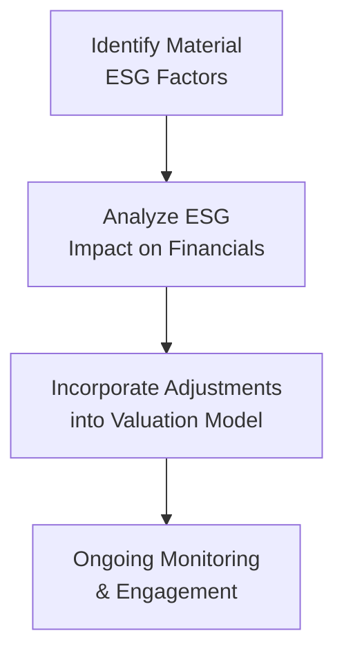

## Introduction

Have you ever chatted with a portfolio manager who’s absolutely fired up about sustainability? I once met someone who’d just come back from touring a solar farm, and they couldn’t stop talking about how those panels could, in their view, power not only our communities but also a portfolio’s returns. That conversation got me thinking, “Wow, ESG really is changing the game in active equity management.” 

Integrating Environmental, Social, and Governance (ESG) factors into active equity strategies has become a big deal for both institutional and retail investors. The idea is that well-managed companies—those that are mindful of carbon footprints, treat employees fairly, exhibit strong governance, and so on—may actually be more resilient and deliver more robust returns over time. However, weaving ESG criteria into your analysis is no small feat. It often means sifting through mountains of data (some of it inconsistent), grappling with intangible issues like company culture, and making sure you don’t veer into “greenwashing.” But done right, ESG can be a powerful tool to enhance risk-adjusted returns and align portfolios with clients’ values.

Below, we dig into what ESG is all about, how to integrate these factors, the benefits and challenges of using ESG in active equity strategies, and how to measure impact. We’ll also explore some practical portfolio construction considerations, highlight best practices (and pitfalls to avoid), and finish with a set of exam tips and sample practice questions.

## What Is ESG?

ESG stands for Environmental, Social, and Governance factors. Broadly speaking:

• Environmental factors include carbon emissions, water usage, renewable energy strategies, and waste management.  
• Social factors cover issues like labor practices, community relations, data privacy, and product safety.  
• Governance factors relate to board diversity, executive compensation, shareholder rights, transparency in operations, and more.

ESG analysis aims to capture these qualitative (and sometimes quantitative) elements of a company’s operations, which traditional financial statements may not fully reveal. Grounded in the idea that companies managing ESG risks well can achieve more sustainable returns, ESG integration has grown in popularity among investors who want to address both risk and opportunity.

## Key ESG Integration Methods

There are several ways to integrate ESG factors into active equity strategies. Each approach can suit a different type of client mandate or investment objective.

Negative Screening (Exclusions)  
Sometimes called “exclusionary investing,” negative screening removes companies or even entire industries that don’t meet certain ethical or sustainability standards. For instance, you might exclude tobacco, fossil fuel, or weapons manufacturers. It’s straightforward: if a company crosses a specific ESG red line, you cut it from consideration. However, negative screening risks oversimplification, because some excluded industries may contain companies that are actively transitioning toward more sustainable practices.

Positive/Best-in-Class Screening  
Under this approach, you include the companies that demonstrate the best ESG performance within each sector. Instead of outright excluding entire sectors, you select the leaders who are genuinely trying to be more sustainable, reduce carbon emissions, or improve labor practices. Your goal is to identify top ESG performers and overweight them.

Thematic Investing  
If you’re super passionate about an emerging trend—say, renewable energy—then thematic investing might appeal to you. This strategy focuses on specific ESG-related themes, such as solar technology, sustainable agriculture, or water management. The portfolio tilts heavily into companies aligned with those themes, hoping to capture above-average growth as these sectors evolve.

ESG Integration in Fundamental Analysis  
Maybe you prefer to keep your usual valuation models but integrate ESG considerations in, say, your discount rate or growth assumptions. For instance, if you believe a particular company faces elevated regulatory risk due to poor climate disclosures, you might assign a higher equity risk premium and thus a higher discount rate to that stock’s cash flows.

Below is a quick, high-level diagram illustrating how ESG factors might flow into fundamental analysis:

A simplified version of adjusting the discount rate (r) in, say, a Dividend Discount Model, could be:


r = R_{f} + \beta (R_{m} - R_{f}) + \alpha_{\text{ESG}}


where \\( \alpha_{\text{ESG}} \\) is an added risk premium (or discount) to account for ESG-related idiosyncratic risk.

## Benefits and Challenges

Integrating ESG isn’t all rainbows and sunshine. Let’s break down some of the upsides and downsides.

Potential Risk Mitigation  
Companies that handle environmental or social issues poorly can face lawsuits, regulatory fines, supply chain disruptions, or brand damage. By focusing on firms with robust ESG practices, you might reduce certain tail risks in your equity portfolio.

Performance Impact  
Does ESG help or hurt returns? Plenty of research suggests a positive correlation between strong ESG and long-term financial performance. However, the results aren’t uniform across all sectors, time horizons, or methodologies. In some cyclical industries, ignoring certain high-carbon companies could mean missing out on rebounds or fast market moves—so there is a trade-off.

Data Gaps & Inconsistency  
If you’ve ever tried to source ESG data, you’ve probably encountered that dreaded patchwork of incomplete metrics and inconsistent definitions. One provider might score a firm differently than another. Also, some markets (like certain emerging economies) have limited ESG disclosures, making analysis tricky.

Greenwashing Risks  
Companies sometimes overstate or exaggerate their sustainability claims. For an investment manager, that means you must do more due diligence to separate truly sustainable practices from marketing fluff.

## Measuring Impact and Reporting

The need to measure ESG impact is partly a response to skepticism—both regulators and clients want to see genuine evidence, not just good intentions.

• ESG Ratings: Firms like MSCI, Sustainalytics, and S&P Global provide ESG scores that investors use for benchmarking. Each provider has slightly different methodologies, so you may see variation in a single company’s ratings.  
• Company Self-Reporting: Many companies publish annual sustainability or corporate social responsibility (CSR) reports. A recognized framework is the Global Reporting Initiative (GRI), which offers guidelines for consistent reporting on environmental and social impacts.  
• Regulatory Trends: Global regulations are moving swiftly. In Europe, for instance, the Sustainable Finance Disclosure Regulation (SFDR) requires asset managers to classify investment products according to sustainability characteristics. This push for standardization is spreading worldwide, so watch this space.

## Portfolio Construction Considerations

In active equity strategies, you’re trying to add alpha—so how does layering in ESG constraints or goals affect that?

Balancing Return and ESG Constraints  
There’s always a tension between maximizing returns and aligning with ESG preferences. Let’s say certain high-carbon energy companies look underpriced. Staying true to an ESG mandate might require passing up seemingly cheap stocks if they exceed the portfolio’s acceptable carbon-intensity threshold.

Shareholder Engagement and Proxy Voting  
Instead of just excluding companies, some equity managers “engage” with them. They use their voting power to push for better governance, environmental transparency, or social practices. When successful, these tactics can actually enhance a company’s ESG profile—and boost shareholder value in the long run.

Liquidity, Sector, and Concentration Issues  
ESG constraints can reduce your investable universe. In smaller sectors or markets, that might lead to liquidity and concentration problems. Active managers have to weigh the trade-off: do you hold fewer positions but maintain robust ESG standards, or expand your universe a bit to ensure adequate diversification?

Integration with Other Chapter Concepts  
As you’ll recall from earlier sections on factor-based, bottom-up, or top-down approaches, ESG can overlay seamlessly with any of these methods. For example, you could incorporate it in a factor-based strategy by adding an “ESG quality” factor (like a proprietary ESG score) to your multi-factor model, effectively blending sustainability with quant-based investing.

## Illustrative Table: Negative vs. Positive Screening

Below is a simplified overview of how negative and positive screening differ:

| Screening Type      | Core Approach                                     | Example Companies/Industries Excluded             |
|---------------------|--------------------------------------------------|---------------------------------------------------|
| Negative Screening | Exclude certain companies entirely from the pool | Tobacco, fossil fuels, gambling, weapons          |
| Positive Screening | Include only best-in-class ESG performers         | Firms with top-tier governance, low carbon usage, or strong labor policies |

Note: The example industries in the “Excluded” column apply to negative screening. In a positive screening approach, you might hold some fossil fuel–related companies that are aggressively transitioning to cleaner energy, as long as they have the highest ESG ratings within their sector.

## Glossary

• Corporate Governance: The system of rules, practices, and processes by which a company is directed and controlled.  
• Negative Screening: Excluding companies that engage in controversial or unsustainable activities from an investment portfolio.  
• Thematic Investing: Focusing on investment themes such as clean energy, sustainable agriculture, or social impact.  
• Climate Risk: The financial risk arising from climate change, including regulatory changes, physical weather events, and shifts in consumer preferences.  
• Greenwashing: The practice of making misleading claims about the environmental benefits of a product, service, or company practice.  
• GRI (Global Reporting Initiative): A widely used international framework for sustainability reporting.  
• EU SFDR (Sustainable Finance Disclosure Regulation): European regulation aiming to improve transparency around how financial market participants integrate sustainability into their processes.

## Practical Example

Imagine you are managing a mid-cap growth fund, primarily technology-focused. Your team decides to integrate ESG in a fundamental approach. Let’s walk through the steps:

• Screening: You first eliminate a few controversial firms that have had repeated data privacy breaches or are facing allegations of labor abuse.  
• Research: For each candidate stock, you check its ESG rating from at least two providers. Some differences arise, so you read the company’s annual sustainability report (aligned with GRI) to see how they’re disclosing their social and environmental impacts.  
• Valuation Adjustments: You discover that one of these mid-cap tech firms sources cobalt in an area known for questionable labor practices. This social risk might lead to supply chain disruptions. You decide to apply a slightly higher discount rate to reflect that potential risk.  
• Ongoing Engagement: You maintain regular contact with the company’s investor relations team, pushing for improved transparency on their source of raw materials. You also use your proxy votes to support a shareholder resolution demanding better accountability.  
• Monitoring & Exits: If the firm meaningfully improves its sourcing practices, your discount rate might go down, which could justify a revaluation. If it fails, you may trim or exit the position altogether, especially if the social risk escalates.

## Final Exam Tips

• Link ESG to Traditional Analysis: Don’t forget that ESG is most powerful when integrated into your usual fundamental or quantitative frameworks—rather than treating it as a standalone box-ticking exercise.  
• Understand Data Provider Differences: For exam questions, be aware that ESG ratings vary across providers. The key is recognizing the impact of these differences on your investment process.  
• Engagement Strategies: The CFA Institute exam might ask how active managers can influence corporate behavior. Emphasize proxy voting, dialogue with management, and coalition building with other shareholders.  
• Be Specific with Risk Factors: Candidates often lose points by being too vague about “ESG risk.” Pinpoint the nature of the risk (regulatory, reputational, operational, etc.), and link it to the firm’s performance.  
• Watch for Greenwashing: If an exam prompt suggests a company’s sustainability claims don’t match the facts, consider the implications for valuation, brand risk, and potential controversies.  
• Time Management: ESG might appear in a multi-part item set. Plan your time so that you can address each sub-question without rushing.

## References for Additional Exploration

• CFA Institute. (2020). “ESG Integration in the Americas.”  
• Friede, G., Busch, T., & Bassen, A. (2015). “ESG and Financial Performance: Aggregated Evidence from More than 2000 Empirical Studies.” Journal of Sustainable Finance & Investment.  
• Eccles, R. G., & Klimenko, S. (2019). “The Investor Revolution.” Harvard Business Review.  
• Global Reporting Initiative (GRI): https://www.globalreporting.org/  
• EU Sustainable Finance Disclosure Regulation (SFDR): https://finance.ec.europa.eu/sustainable-finance/overview_en  

Use these resources to get deeper into both the theoretical and practical sides of ESG investing.  

## Test Your Knowledge: ESG Integration in Active Equity Strategies



### Which of the following best describes “Negative Screening” in ESG-focused investing?

- [x] Excluding companies or industries based on certain ethical or sustainability criteria
- [ ] Buying only companies with the best ESG scores
- [ ] Targeting a specific environmental or social theme
- [ ] Incorporating ESG factors into a standard valuation model

> **Explanation:** Negative screening means filtering out (i.e., excluding) companies or sectors that don’t meet certain ethical or sustainability guidelines.

### When using a “best-in-class” or “positive screening” strategy, an investor:

- [x] Selects the firms with the highest ESG ratings within each sector
- [ ] Automatically excludes all industries with potential risks
- [x] Focuses on identifying sector leaders who display better ESG performance relative to peers
- [ ] Prioritizes only governance issues

> **Explanation:** Best-in-class approaches often take the top ESG performers in each sector. Exclusions are not necessarily automatic, unless they fail a minimum ESG standard altogether.

### Which of the following is a primary challenge when integrating ESG factors into traditional equity analyses?

- [x] Limited standardization and consistency of ESG data
- [ ] Easily quantifiable financial data
- [ ] Overabundance of reliable and comparable ESG metrics
- [ ] Lack of investor interest in ESG issues

> **Explanation:** A major challenge is the inconsistent and often patchy nature of ESG data. There’s no global standard system for rating ESG performance, making cross-company or cross-country comparisons tough.

### If a portfolio manager adjusts the discount rate of a stock upward because of ESG-related risks, it typically:

- [x] Lowers the present value of future cash flows
- [ ] Raises the present value of future cash flows
- [ ] Has no impact on valuation
- [ ] Eliminates volatility in the stock price

> **Explanation:** Increasing the discount rate means you’re applying a higher required rate of return, which reduces the present value of the estimated future cash flows.

### Which of these conditions might prompt a manager to consider “active engagement” with a company?

- [x] ESG controversies or poor disclosures that could be addressed through shareholder voting
- [ ] Management’s approval of a share buyback program
- [x] A desire to push for more sustainable supply chain practices
- [ ] The CFO’s short-term guidance on earnings

> **Explanation:** Active or shareholder engagement typically comes into play to address ESG controversies or to encourage better corporate practices, often involving proxy votes or direct discussions with management.

### Which statement about “greenwashing” is most accurate?

- [x] It involves companies overstating their commitment to ESG or sustainability
- [ ] It is a regulatory mandate to disclose emissions data
- [ ] It is the process of filtering out companies based on negative screening
- [ ] It automatically improves the firm’s sustainability profile

> **Explanation:** Greenwashing happens when a company makes claims about ESG or sustainability practices that are misleading or unsubstantiated.

### In thematic ESG investing, which of the following is most likely?

- [x] Targeting specific sectors like clean energy or water management
- [ ] Excluding all energy sector exposure
- [x] Aligning the portfolio with broader sustainability trends
- [ ] Minimizing engagement with company management

> **Explanation:** Thematic ESG strategies focus on a particular social or environmental theme (e.g., renewable energy). This style can be narrower than broad-based ESG integration.

### One reason an ESG-oriented equity fund might be wary of a low ESG-rated but undervalued company is:

- [x] Potential reputational risk and regulatory crackdowns
- [ ] Guaranteed higher returns despite ESG issues
- [ ] Accepted universal data standards for ESG across all markets
- [ ] No chance of an ESG rating upgrade in the future

> **Explanation:** A company that’s undervalued but has poor ESG performance can face lawsuits or reputational damage, undermining long-term profitability.

### In the context of ESG data providers:

- [x] Different providers can assign different ESG scores to the same company
- [ ] All providers follow the Global Reporting Initiative (GRI) standards equally
- [ ] Ratings are uniformly consistent across all markets
- [ ] There is only one third-party ESG data provider globally

> **Explanation:** ESG rating methodologies and weightings differ among providers, which can lead to disparity in scores for the same company.

### A portfolio manager might integrate ESG factors in fundamental analysis by:

- [x] Adjusting cash flow estimates or the discount rate to reflect specific ESG risks
- [ ] Ignoring material social issues that don’t fit the revenue model
- [ ] Automatically excluding every firm in the energy sector
- [ ] Using only backward-looking ESG data for modeling

> **Explanation:** Adjusting cash flow forecasts or discount rates is a key step in fundamental analysis that actively includes ESG considerations.


