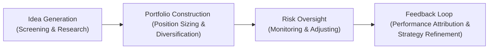

## Objectives of Active Equity Portfolio Management
Active equity portfolio management is, at heart, the art of outperforming a particular benchmark or market segment while respecting a defined risk budget. Many of us jump into active management because we believe we have an edge—maybe it's unique research insights, specialized skill in analyzing specific markets, or advanced quantitative models. Whatever our toolkit, the main objectives often include:

• Outperforming a benchmark (i.e., generating alpha).  
• Adhering to a specific risk profile that meets the client’s or fund’s objectives.  
• Achieving exposure to certain factors (size, value, momentum, ESG, etc.) while avoiding unwanted or unintended bets.  

I remember the first time I was handed a small endowment’s equity mandate—my main focus was to beat the S&P 500 while keeping portfolio volatility close to that of the benchmark. I was excited, and a bit nervous, determined to show my research skills could generate meaningful alpha. But I quickly learned that designing an environment where alpha can truly be harvested requires more than a gut feeling; it needs a coherent investment philosophy and a disciplined process.

## Investment Philosophy: Fundamental, Quantitative, or Both?
Active managers typically adopt either a fundamental approach, a quantitative approach, or a hybrid. The fundamental approach examines company-specific drivers like revenues, earnings growth, and competitive strengths. The quantitative approach uses math and statistics (factor modeling, algorithmic trading strategies) to spot correlations and mispricings. Many managers mix both styles, leveraging quantitative screens for idea generation and thorough fundamental research for final decision-making. The key is consistency—you know, you want to avoid “style drift,” meaning your portfolio unintentionally evolves into something that deviates drastically from your stated approach.

• Fundamental Analysis:  
  – Emphasizes intrinsic value, macroeconomic drivers, and analyst expertise.  
  – Relies on discretionary portfolio management (manager judgment, forward-looking insights).  

• Quantitative Analysis (Systematic):  
  – Uses rules-based models like factor tilts (value, momentum, quality, etc.).  
  – Analyzes historical data and tries to predict future performance through statistical relationships.

Many managers who lean on fundamental research still incorporate some analytics to monitor and hedge factor exposures. Conversely, a quant manager might manually override trades in cases where the model fails to capture new market developments (e.g., pandemic-driven anomalies). Blending the two approaches is a viable strategy, but it also requires a carefully designed process to keep the portfolio coherent.

## Building Your Investment Process
Whether you are a classic stock picker or a data-driven quant, establishing a clear process flow is vital. Let’s break it down:

Idea Generation (Screening & Research):  
• Fundamental managers might track corporate announcements, attend investor conferences, or read extensive research reports.  
• Quants could use factor scoring, machine learning signals, or anomaly detection to spot potential alpha sources.  

Portfolio Construction (Position Sizing & Diversification):  
• Determine the maximum position size and ensure the portfolio is adequately diversified across sectors, industries, or geographies.  
• Factor exposures must be monitored—if you’re a fundamental manager, you might not want to inadvertently load up on momentum or small-cap risk unless that’s your intention.

Risk Oversight (Monitoring & Adjusting):  
• Managers track exposures in real time, adjusting when positions breach thresholds.  
• Tools such as factor models, risk analytics dashboards, or stress tests help ensure that hidden risks do not inflate.

Feedback Loop (Performance Attribution & Strategy Refinement):  
• Use performance attribution to dissect alpha sources—did you generate outperformance from stock selection, sector allocation, or factor bets?  
• Refine or validate your strategy based on these insights. If you discover your alpha is purely from small-cap exposure you didn’t anticipate, you might want to adjust your screening process.

## Aligning with the Investment Policy Statement
All of this must align with the Investment Policy Statement (IPS). The IPS is your anchor—like a contract that outlines:

• Return objectives.  
• Risk tolerances (max drawdown, tracking error limits, volatility targets).  
• Constraints (ESG restrictions, sector caps, liquidity needs).  

If the IPS states that you must hold at least 30% in large-cap equities, or for ESG reasons avoid fossil fuel companies, well, that shapes your investable universe and influences your approach. Skirting the IPS is not just a compliance risk; it can also blow up client trust. One time, I had a client who was strictly anti-tobacco; had I absentmindedly included a tobacco stock with an appealing dividend yield, I would have violated the mandate.

## Forward-Looking Considerations
Portfolio management is future-oriented, so you’ll want to incorporate trends and forecasts:

• Economic Outlook: Growth, inflation, interest-rate expectations.  
• Industry Shifts: Disruptive innovation (e.g., AI, electric vehicles, digital payments).  
• ESG Factors: Governance practices, environmental impacts, and social responsibility trends.  
• Technological Developments: Automated trading, alternative data sources, advanced machine-learning techniques for alpha generation.

Balancing all these forward-looking elements requires a mix of analytics, domain knowledge, and, well, humility. Markets have a way of surprising us, so remain open to the possibility that your best-laid plans might need tweaking down the road.

## Balancing Flexibility and Discipline
An active equity manager should be flexible enough to seize opportunities but disciplined enough to stick to her style and not chase fads. A disciplined structure often includes:

• Clear buy/sell criteria.  
• Approved investment universe or watchlist.  
• Position-sizing rules and stop-loss levels.  
• Formal processes for risk committee reviews.

When too many discretionary overrides occur, you risk style drift and confusion—both for you and your investors. Conversely, if you’re overly rigid, you might miss out on timely opportunities (e.g., a sudden market dislocation). Striking the right balance is more art than science.

## Adapting the Portfolio with Market Changes
Successful active equity managers know that markets evolve, and so must portfolios. Once we design the initial structure, we keep monitoring:

• Market Liquidity: Shifts in liquidity can hamper the ability to trade quickly.  
• Emerging Sectors: Once-niche sectors, like biotech or clean energy, can rapidly become mainstream.  
• Regulatory Changes: For instance, new capital controls or reporting requirements in a certain country can affect how we invest internationally.  
• Client Constraints: The client might revise their risk tolerance or add new ESG mandates.  

It’s crucial to have a robust rebalancing framework—whether it’s time-based (monthly or quarterly) or triggered by threshold breaches (like factor exposures being out of bounds).

## Performance Attribution and Strategy Refinement
Performance attribution is where the rubber meets the road. Did that overweight in a certain sector drive alpha, or was it overshadowed by weak stock selection in another? We all love to celebrate winners, but we must also examine losers. 

• If your approach is fundamental, you might break it down by sector or factor.  
• If you’re quant-focused, factor-based attribution is often standard.

Attribution results feed back into the portfolio design. Maybe you realize your success is primarily from deep-value small-caps, in which case you can refine your approach (or explicitly tilt to that if it fits your mandate). Alternatively, you might see that your attempts to time the market consistently cost you alpha. That’s a signal to recalibrate.

## Practical Example: Building a Hypothetical Active Equity Portfolio
Let’s walk through a hypothetical scenario:

Imagine you manage a $100 million growth-focused equity fund benchmarked to the MSCI World Growth Index. Your investment philosophy is fundamental with a pinch of quantitative analysis.

1. Investment Universe & Screens:  
   – Start with the top 1,000 global growth companies by market cap.  
   – Remove companies with negative cash flow trends or unsustainable debt.  
   – Overlay an ESG filter to exclude carbon-intensive industries.

2. Deeper Research:  
   – Analyze around 100 finalists. Look for those with strong innovation pipelines (e.g., biotech, AI software).  
   – Evaluate macro tailwinds. Perhaps interest rates are low, so growth companies can flourish with cheap financing.

3. Position Sizing & Risk Controls:  
   – Cap any single stock weighting at 5% of portfolio.  
   – Ensure no more than 25% of total portfolio is in a single industry.  
   – Keep beta near 1.0 relative to the MSCI World Growth Index to manage systematic risk.

4. Ongoing Oversight:  
   – Set up monthly sector and factor exposure reviews.  
   – Evaluate performance attribution quarterly to see if our big overweight in AI software is generating alpha.

5. Refinements:  
   – If we find we’re consistently losing out in consumer discretionary stocks, we investigate whether we misunderstood the consumer cycle or maybe the quant signals for that sector need a tweak.

## Common Pitfalls and Best Practices
Common Pitfalls:
• Failing to align with the IPS—a big no-no for fiduciary duty and client trust.  
• Overconcentration—letting a single sector or factor dominate.  
• Excessive turnover—churning the portfolio can rack up transaction costs that eat into returns.  
• Emotional overrides—getting spooked by volatility or chasing fads can lead to style drift.

Best Practices:
• Define and regularly review your buy/sell discipline.  
• Monitor risk exposures meticulously—both fundamental and factor-based.  
• Keep a robust (but not suffocating) governance structure. Regularly track performance attribution to see where you’re actually creating (or destroying) value.  
• Communicate with clients or stakeholders—highlight your approach, changes, and rationale.

## Conclusion and Exam Tips
Designing actively managed equity portfolios is all about combining a well-articulated philosophy with a disciplined, yet adaptable, process. You start by setting clear alpha objectives and constraints, align everything with the IPS, and then refine through performance attribution feedback. Remember to keep an eye on style drift—staying true to your stated strategy fosters transparency and trust. In exam scenarios, they might test you on identifying the correct portfolio structure for a given set of IPS constraints or ask you to recommend risk-monitoring methods. They might also require you to calculate factor contributions or compare fundamental and quantitative approaches.

• Read the question carefully—especially the constraints and objectives.  
• Note any hints at risk tolerance or style preferences.  
• Show explicitly how you’d integrate them into your portfolio construction.  

Stay grounded, be ready to adapt, and keep that discipline in check. It’s a balancing act, but a rewarding one when done well.

## References
- Grinold, R. C., & Kahn, R. N. (2000). “Active Portfolio Management.” New York: McGraw-Hill.  
- Maginn, J. T., Tuttle, L. E., Pinto, J. E., & McLeavey, D. W. (eds). (2017). “Managing Investment Portfolios: A Dynamic Process.” CFA Institute Investment Series.  
- CFA Institute. (2023). “Standards of Practice Handbook.” https://www.cfainstitute.org  

Glossary (Selected Terms):  
• Alpha: The excess return on an investment relative to a benchmark, attributed to manager skill.  
• Style Drift: The unplanned deviation from a stated investment strategy or style, which can reduce transparency.  
• Investment Policy Statement (IPS): A formal document outlining objectives, constraints, and risk tolerances.  
• Mandate: The formal guidelines provided to a portfolio manager featuring policy objectives, eligible assets, and constraints.  
• Fundamental Analysis: A research approach focusing on intrinsic value and basic company or macroeconomic drivers.  
• Quantitative Analysis: A research approach using mathematical and statistical models to inform decisions.  
• Discretionary Portfolio Management: Manager-driven decisions based on research and experience.  
• Systematic Portfolio Management: Rules-based strategies employed via algorithms and models.

---

## Test Your Knowledge: Designing Actively Managed Equity Portfolios



### Which of the following best describes a key goal of active equity portfolio management?
- [ ] Replicating a market index as closely as possible.
- [x] Generating alpha by outperforming a benchmark within defined risk limits.
- [ ] Selecting stocks purely based on their dividend yield.
- [ ] Eliminating all sector exposures.

> **Explanation:** Active management seeks to outperform a benchmark, typically by leveraging unique insights or skills, while adhering to the client’s risk and return objectives.

### In the context of active equity portfolio design, “style drift” refers to:
- [ ] A deliberate shift from equities to fixed-income.
- [ ] The portfolio’s beta changing over time.
- [x] An unplanned deviation from a stated investment strategy or style.
- [ ] The impact of currency fluctuations on portfolio returns.

> **Explanation:** Style drift occurs when a portfolio manager inadvertently (or without clear intention) moves away from the original investment approach, potentially reducing transparency and misaligning with the client’s objectives.

### Which of the following constraints is most likely to be included in an Investment Policy Statement for an active equity mandate?
- [x] Restriction on tobacco or weapons manufacturing stocks.
- [ ] Requirement to always hold 5% in cash.
- [ ] A rule to invest only in companies with rising share prices.
- [ ] A maximum portfolio turnover ratio of 1000%.

> **Explanation:** A typical IPS constraint for an ESG-conscious client might involve excluding companies in tobacco or weapons. The other examples are less common or too arbitrary as an IPS constraint.

### An active manager focusing on fundamental analysis typically:
- [ ] Relies primarily on factor models and data-driven signals.
- [x] Uses company-specific research, macroeconomic views, and managerial expertise for stock selection.
- [ ] Trades routinely based on high-frequency signals.
- [ ] Never reviews macroeconomic indicators.

> **Explanation:** Fundamental managers often delve into a company’s financial statements, macro environment, and qualitative factors to identify mispriced securities.

### A hybrid approach that combines factor-based models with in-depth company research is often adopted to:
- [x] Enhance idea generation while validating stock picks through detailed analysis.
- [ ] Eliminate all discretion from portfolio management.
- [ ] Avoid the need for performance attribution.
- [ ] Reduce the portfolio turnover to zero.

> **Explanation:** Many managers screen for potential opportunities using factor models, then conduct deep fundamental research to confirm investment decisions.

### In constructing an active equity portfolio, which of the following is a key consideration for position sizing?
- [x] Setting maximum weight limits to avoid overconcentration.
- [ ] Focusing on one single stock for optimal returns.
- [ ] Allocating only based on prior-year stock price performance.
- [ ] Ignoring correlation across positions.

> **Explanation:** Maximum position sizes limit concentration risk. Managers typically also consider correlations, liquidity, and diversification needs.

### Performance attribution in an active equity portfolio is used to:
- [x] Determine how much of the excess return comes from sector allocation vs. stock selection.
- [ ] Measure how quickly trades are executed.
- [x] Pinpoint factor exposures that drove performance.
- [ ] Calculate the exact required return for each stock.

> **Explanation:** Performance attribution dissects the sources of alpha, such as sector bets, stock-level decisions, and factor tilts, helping managers refine their strategy.

### What is one hallmark of a systematic (quantitative) equity management style?
- [x] Reliance on rules-based models and algorithms to identify trades.
- [ ] Execution of all trades manually based on human judgment.
- [ ] Complete absence of any data analysis.
- [ ] The manager making all decisions without constraints.

> **Explanation:** Systematic approaches generally employ repeatable, data-based signals and are often more rules-based with minimal human overrides.

### Active managers might incorporate forward-looking considerations such as:
- [x] Industry disruptors, technological trends, and ESG factors.
- [ ] Last month’s price movements only.
- [ ] Unverified rumors on social media.
- [ ] The average rainfall in major global cities.

> **Explanation:** Forward-looking portfolios consider macroeconomic trends, technological advancements, and other relevant factors. ESG considerations are also increasingly pivotal.

### True or False: An Investment Policy Statement (IPS) can help prevent style drift by clearly defining acceptable assets, risk limits, and investment objectives.
- [x] True
- [ ] False

> **Explanation:** An IPS outlines the manager’s strategy and constraints, helping ensure the manager remains aligned with the mandate and avoids unintended deviations.


