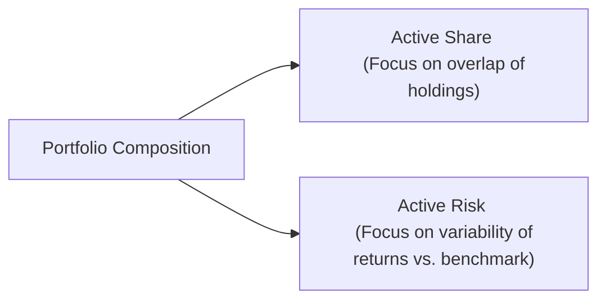

## Introduction

Active managers are often guided by two closely watched indicators when building their portfolios: active risk (commonly described as tracking error) and active share. At first, they might sound similar—both capture some flavor of “difference” relative to a benchmark. But they’re telling us different stories. In this article, we’ll unpack the meaning of each, why they matter for equity portfolio construction, and how to use them together in practice. 

The goal here is to help you confidently distinguish these concepts, see how they can point to different “styles” of active management, and learn to set realistic targets that match your clients’ objectives and risk tolerance. Anyway, let’s get started with active risk.

## Understanding Active Risk (Tracking Error)

Active risk is about how volatile a portfolio’s performance is relative to its benchmark. If you’ve heard the phrase “tracking error,” that’s essentially it. It answers questions like: “How much does my portfolio bounce around compared to the index I’m measuring against? Am I on a steady path, or could I veer significantly above or below the benchmark in a given year?”

### Formal Definition of Tracking Error
Mathematically, tracking error is defined as the standard deviation of the difference in returns between a portfolio and its benchmark:

$$
\text{Tracking Error} = \sqrt{\text{Var}(R_p - R_b)}
$$

Here:
- \\(R_p\\) is the portfolio return.
- \\(R_b\\) is the benchmark return.
- \\(\text{Var}(R_p - R_b)\\) is the variance of the difference in returns.

If you take daily or monthly returns, you can compute the differences for each period, then find the standard deviation of those differences over time. The larger that standard deviation, the bigger the swings above or below the benchmark. 

I once had a client (we’ll call them “Client A”) who freaked out because their portfolio’s monthly returns looked completely different from the S&P 500 in certain months, even though over a long period, they were outperforming. Their tracking error was relatively high, which just meant they were taking big bets that, in any given period, could significantly differ from the benchmark. They were winning over the long haul, but you can imagine monthly performance reports looked pretty wild.

### Factor vs. Idiosyncratic Contributors
Active risk can be decomposed into factor risk and idiosyncratic risk. Factor risk might come from being overweight in certain sectors, styles (like value vs. growth), or macro-economic exposures. Idiosyncratic risk, on the other hand, is unique to specific securities—maybe you invested in a biotech stock waiting on FDA approval of a new drug. That’s a risk that’s independent of broad market movements. Actually measuring how much each contributes can help you refine where your portfolio risk is coming from.

## Understanding Active Share

If active risk is about return volatility relative to an index, active share is about the portfolio’s holdings themselves. It’s a measure of how different your portfolio composition is from the composition of its benchmark. You can think of it as a percentage overlap metric—if your fund exactly matched its benchmark stock-by-stock in the exact same weights, your active share would be 0%. Meanwhile, if you held completely different names and weights than the benchmark, you’d be near 100% active share.

### Formal Calculation
The classic formula for active share is:

$$
\text{Active Share} = \frac{1}{2} \sum_{i=1}^{n} |w_{p,i} - w_{b,i}|
$$

Here:  
- \\(w_{p,i}\\) is the weight of stock \\(i\\) in the portfolio.  
- \\(w_{b,i}\\) is the weight of stock \\(i\\) in the benchmark.  
- \\(n\\) is the total number of stocks in the combined universe of portfolio and benchmark.

The absolute deviation for each stock is summed up and then halved, ensuring the final result is a number between 0% and 100%. 

A quick example might illustrate: Suppose you’re only looking at three stocks in your portfolio:  
- Stock A: 40% in the portfolio vs. 30% in the benchmark.  
- Stock B: 20% vs. 30%.  
- Stock C: 40% vs. 40%.  

The total absolute deviation is \\((|40 - 30| + |20 - 30| + |40 - 40|) = 10 + 10 + 0 = 20\\) (in percentage points). Half that is 10. So the active share is 10%. That’s pretty low, meaning your portfolio is fairly close to the benchmark’s composition. 

### Closet Indexing and High-Conviction Bets
One reason active share gets so much attention is the suspicion that some funds charging “active management” fees are actually closet indexers. A fund might claim to be actively managed but hold a portfolio that’s 90% identical to the index. With modern data tools, it’s not too hard for analysts or curious clients to see a fund’s active share and ask: “Why am I paying more if you’re basically replicating the index?”

On the other hand, a manager with a high active share is making more significant bets. That might be great if they have skill and can generate alpha. It might also be devastating if those bets go wrong. 

## Contrasting Active Risk with Active Share

Now for the real kicker: a high active share doesn’t always mean a high tracking error. They capture different aspects of “activeness.” As an example:

• You could hold lots of slightly different positions compared to the benchmark—say you tweak 50 stocks from 2% weight to 3% weight across the board. You’d end up with a decent active share because you have deviations in so many stocks. But if each deviation is small, the variance in your returns might not be that large. Thus tracking error might remain moderate. 

• Alternatively, you could concentrate your entire active bet into just two stocks: short a particular energy name that’s in the benchmark, and double up on a tech giant that’s also in the benchmark. That portfolio could have a moderate active share (since many other holdings align with the index) but a big tracking error—because a big chunk of your performance is driven by whether those two bold bets pay off.

It’s good to keep in mind that “differs in composition” and “differs in returns” are not the same dimension. If you want to show your clients you’re truly adding value via security selection, you might quote active share. If you’re setting risk constraints and explaining why your performance might deviate significantly from the index from month to month, you’ll talk about tracking error.

## Practical Example

Let’s imagine a simplified portfolio relative to an equity benchmark:

• The manager invests 30% in off-benchmark stocks: a handful of small-caps.  
• The remaining 70% is basically aligned with the major large-cap benchmark’s composition.  

Because 30% is invested off-benchmark, the manager’s active share is at least 30% (roughly speaking—plus half of any weighting differences in the 70% that overlaps). So the active share might come out to, let’s say, 40% or 50%. But if those small-caps have relatively low correlation with the large-cap portion of the portfolio, and the weighting differences in the large-cap portion remain small, the active risk might not be super high. So, you could see a scenario where: 
• Active share: 40%–50%  
• Tracking error: modest (e.g., 2% to 3%)

## Balancing and Setting Targets

In practice, many managers specify an active risk target (e.g., “My target tracking error is 4%–6% relative to the benchmark”), plus or minus a band. They might also set a ballpark figure for active share to ensure they’re not hovering near a closet-indexing approach. A manager might say, “I want to maintain at least 60% active share.” That’s a pretty bold statement, indicating significant deviation from the benchmark. But the manager must confirm that market conditions, client comfort level, and risk budgets all align. 

If you’re a large institutional pension plan that’s a bit more conservative or has a certain risk budget, you might prefer a manager with moderate or low tracking error—maybe 2%–3%. If your pockets are deeper (and you can handle more short-term volatility), you might go for someone with a 10% tracking error because you believe in their skill. 

On the other hand, if a manager charges a high fee for “active” management but you see the fund’s active share is consistently below 30%, that might raise eyebrows. You might question whether the fees are justified.

## Strategies to Manage Active Risk and Active Share

Managers can shape their portfolios according to their convictions, risk budgets, and style:

• Concentrated High-Conviction Bets: A manager might pick 10–15 stocks that they think will outperform. Typically, this approach yields a high active share. Tracking error might also soar if those stocks behave differently from the benchmark.  
• Diversified Active Tilts: A manager might overweight or underweight certain sectors or factors across a wide swath of stocks, so each position deviation is modest, but multiplied across many holdings. Active share could be moderate to high, while tracking error might be more controlled.  
• Factor-Based Tilts with Idiosyncratic Overlays: Some managers systematically tilt toward value, momentum, or ESG-friendly stocks, while also layering in specific off-benchmark names. That can produce a fused approach combining factor bets with high-conviction picks.  

One must watch out for the mismatch: if your active share target is high (implying many differences in holdings), but you also want very low tracking error, you either need to be extremely clever in how trades offset each other’s risk or accept that your returns might still show some lumps.

## Diagram: Active Risk vs. Active Share

Below is a simple Mermaid.js diagram to visualize how active share and active risk are linked to a portfolio’s composition and performance. 

This diagram is obviously simplified, but it captures the essence: the same portfolio composition that yields a certain active share can also produce a different level of active risk, depending on how those positions behave.

## Monitoring Performance and Manager Skill

One final consideration: A high active share or high active risk alone doesn’t guarantee outperformance. When you see a portfolio where the manager is taking big bets, also look at their track record, investment process, and discipline. Are these bets systematic or somewhat random? Are they grounded in well-researched insights (like factor tilts or strong fundamental analysis), or are they more like guesswork?

If you see a manager with consistently high active share but no alpha over many periods—maybe they’re losing more often than not—that’s usually not a good sign. Likewise, if a manager’s tracking error is low but they’re also consistently underperforming net-of-fees, you might wonder if you’re paying for “active” management but getting no real value.

## Glossary Terms

• Tracking Error: Standard deviation of the difference in returns between a portfolio and its benchmark.  
• Active Share: Percentage measure showing how different a portfolio’s holdings are from its benchmark.  
• Closet Indexing: When a portfolio claims to be active but closely mirrors its benchmark.  
• Factor Decomposition: Breaking down the portfolio’s overall risk into various systematic factors (sector, style, geography, etc.).  
• Idiosyncratic Risk: Security-specific risk not explained by broad market or factor movements.

## Exam Tips and Practical Guidance

• Know the formulas. That’s a straightforward way to get partial credit on exam questions. Write down the definition for tracking error and the formula for active share.  
• Understand the difference in what each metric tells you. The exam might ask for a scenario-based question where a portfolio’s active share is “high,” yet the tracking error is “low.” Don’t panic; you can explain how that can happen.  
• Reference client objectives. In exam essays, you often need to tie these metrics back to a client’s investment policy statement or risk tolerance.  
• Provide concrete reasons. If asked, “Why might a manager’s high active share not produce high tracking error?” a reasoned explanation about numerous small differences in many portfolio holdings typically scores well.  
• Budget time carefully. For essay questions, you might need to do quick calculations and provide big-picture commentary. Draft your bullets first, and then shape a concise, structured answer.

## References for Further Study

• Petajisto, A. (2013). “Active Share and Mutual Fund Performance.” Financial Analysts Journal.  
• CFA Institute. (2023). “Equity Portfolio Management.” Curriculum readings.  
• Ang, A. (2014). “Asset Management: A Systematic Approach to Factor Investing.” Oxford University Press.

## Active Risk vs. Active Share: Test Your Knowledge



### The primary distinction between active risk (tracking error) and active share is that active risk measures:
- [ ] The overlap in holdings between a portfolio and its benchmark.  
- [ ] The average outperformance relative to a benchmark.  
- [x] The variability of the portfolio’s performance relative to the benchmark.  
- [ ] The percentage difference in sector exposures compared to the benchmark.  

> **Explanation:** Active risk (tracking error) is about the volatility of returns relative to the benchmark—how much the portfolio’s returns swing around the benchmark’s returns.

### A portfolio has many small off-benchmark bets spread across dozens of stocks. Which outcome is most likely?
- [x] High active share but potentially moderate tracking error.  
- [ ] Low active share but high tracking error.  
- [ ] Low active share and low tracking error.  
- [ ] Zero correlation with the market.  

> **Explanation:** Spreading bets across many holdings can mean a high degree of difference from the benchmark holdings (high active share) but not necessarily wide return movements relative to the benchmark (moderate tracking error).

### If a portfolio’s active share is very low, it might indicate:
- [ ] The portfolio is designed for maximum volatility.  
- [x] The portfolio is closely mirroring the benchmark.  
- [ ] The manager has a high conviction on individual stocks.  
- [ ] The manager is using concentrated, off-benchmark positions.  

> **Explanation:** A low active share usually suggests the portfolio closely mimics the benchmark’s holdings composition, sometimes referred to as closet indexing.

### Which statement best describes the relationship between active share and tracking error?
- [ ] A high active share always yields a high tracking error.  
- [ ] If tracking error is zero, active share must be 100%.  
- [x] They are measuring different dimensions of activeness and one does not necessarily predict the other.  
- [ ] Active share is mathematically twice the value of tracking error.  

> **Explanation:** While related, each concept measures a different aspect of divergence from a benchmark—one is about differences in holdings, the other about differences in returns.

### A manager invests 30% of the portfolio in small-cap stocks not in the benchmark but keeps the remaining 70% mostly aligned with the benchmark. What likely occurs?
- [ ] Active share and tracking error both soar to 100%.  
- [x] Active share might be moderate or high, but tracking error could remain modest.  
- [ ] Active risk goes to zero, and active share is also zero.  
- [ ] Active share is likely negative.  

> **Explanation:** Some off-benchmark holdings increase active share, while the majority alignment with benchmark holdings can moderate overall return volatility (leading to a moderate tracking error).

### Which of the following is a common reason to decompose active risk into factor and idiosyncratic components?
- [ ] To estimate the portfolio’s nominal reserve requirements.  
- [x] To understand whether performance deviations are driven by broad systematic factors or stock-specific bets.  
- [ ] To check if the benchmark is miscalculated.  
- [ ] To measure trading efficiency in real-time.  

> **Explanation:** Factor decomposition helps managers pinpoint whether they’re gaining or losing relative to the benchmark because of market-wide style tilts (factor risk) or unique stock exposures (idiosyncratic risk).

### A manager with a high active share but persistently negative alpha might indicate:
- [x] They are taking many big bets that are not paying off.  
- [ ] They are systematically overweight benchmark constituents.  
- [x] They lack the skill to convert active bets into outperformance.  
- [ ] They are effectively employing a closet-indexing strategy.  

> **Explanation:** A high active share manager is deviating markedly from the benchmark. Repeated underperformance with a high active share often suggests that the manager’s active approach is not delivering the desired results.

### Which of the following is an advantage of having a higher active share for an active equity manager?
- [x] The potential for higher alpha if research skill is strong.  
- [ ] Guaranteed outperformance vs. the benchmark.  
- [ ] Lower overall risk exposure.  
- [ ] Automatic hedging against market downturns.  

> **Explanation:** Higher active share indicates a meaningful deviation from the benchmark, which can lead to greater outperformance if the manager’s skill is strong, but there’s no guarantee.

### Which scenario best explains high tracking error with a moderate active share?
- [ ] The manager invests in 500 small offsetting positions.  
- [x] The manager holds two large concentrated bets that dominate returns.  
- [ ] The manager is basically replicating the benchmark index.  
- [ ] The manager invests only in stable short-term government bonds.  

> **Explanation:** Having a small number of concentrated positions can inflate return volatility relative to the benchmark (high tracking error), even if much of the portfolio overlaps with the benchmark (moderate active share).

### True or False: A portfolio with a high active share always has a high percentage of off-benchmark stocks.
- [x] True  
- [ ] False  

> **Explanation:** A high active share indicates that the portfolio’s holdings differ significantly from the benchmark, often by including off-benchmark or heavily overweighted/underweighted positions.  




