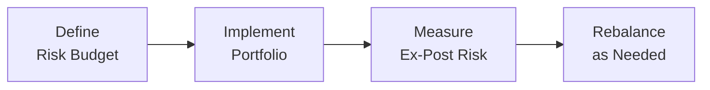

## Introduction

Imagine you’re in charge of cooking a big family meal. You have a set amount of time—your primary “budget”—and you need to decide how to allocate that time to prep main dishes, side dishes, sauce, dessert, and so on. Spend too much effort on the entrée, and you might end up with no dessert (which can be quite sad). Allocate too little time on the main course, and the entire meal could be bland. In equity portfolio management, we often face a similar “allocation of scarce resources” challenge—except our currency is risk. We can’t remove risk entirely, and we usually want some measure of it to achieve return goals. But we need to decide how much risk to “spend” on different positions, factors, or strategies to meet client objectives.

In this section, we’ll explore how to measure risk in equity portfolios—ranging from traditional metrics like standard deviation and beta to more sophisticated measures like Value at Risk (VaR) or factor exposures. Then we’ll dig into the concept of risk budgeting: deciding the maximum risk allocations or constraints to keep the entire portfolio aligned with the investor’s needs, constraints, and, yes, risk tolerance. We’ll also talk about advanced analytics (scenario analysis, stress testing) that push us to think ahead about unexpected developments (like a sudden market crash or a steep interest rate hike). Finally, we’ll look at how all these elements fit into an iterative process of building and maintaining an equity portfolio, so your “meal” is balanced but still appetizing—potentially alpha-generating while keeping an eye on the overall risk limits.

## Common Risk Measures in Equity Portfolios

When we talk about “risk” in equity portfolios, we often use shorthand for a variety of different metrics. Let’s spotlight a few of the most common ones:

• Standard Deviation  
• Beta  
• Value at Risk (VaR)  
• Factor Exposures (e.g., style, size, momentum)  

### Standard Deviation

Standard deviation is the classic measure of total volatility—how much returns fluctuate around their average. In a sense, it’s like reading your car’s speedometer: it tells you how wildly you’re driving. High standard deviation might signal big drawdowns in bad times, but also potentially big gains in good times.

Why it matters: Many investors, especially those with moderate risk appetites, want to keep that volatility within a comfort range. Standard deviation also forms the basis for other risk measures (for instance, VaR calculations often rely on historical standard deviations).

### Beta

Beta is about systematic risk—how sensitive your portfolio or stock is to overall market movements. A beta of 1.2, for instance, suggests that when the broad market moves up or down by 1%, your portfolio might move by roughly 1.2%. Beta balances risk with potential reward: if you expect the market to rise, a higher beta can be beneficial... but in a downturn, watch out.

Usefulness in portfolio construction: You can set a target beta level based on how you want to weather market storms. If your client can’t stomach big losses, you might keep your portfolio’s beta below 1. On the other hand, a risk-tolerant investor with a longer horizon might accept a higher beta for possible higher returns.

### Value at Risk (VaR)

VaR introduces a probabilistic approach. For example, you might say, “There’s a 5% chance we lose at least X% over the next month.” Sure, no measure is perfect—at the extremes, real markets can exceed whatever model or historical data suggested. But VaR remains a widely used metric in the institutional world because it offers a sense of worst-case outcomes. 

A typical form is daily or monthly VaR at a 95% or 99% confidence interval. If your daily 1% VaR is \$1 million, that means there’s roughly a 1% chance the portfolio might lose \$1 million or more in a single day under assumptions about volatility and correlations. Often, risk committees set VaR limits to control severe downside exposure.

### Factor Exposures

Factors explain the part of a portfolio’s returns and volatility that come from systematic drivers—like size (small-cap vs. large-cap), value (cheap vs. expensive), momentum (recent winners vs. losers), or even more specialized factors like quality or low volatility. Tools like multifactor risk models or the regression-based analysis taught in quantitative courses can help you break down how much of each factor you’re bearing. 

Use case: Many managers want to diversify across these factors or emphasize certain ones if they believe they have an edge. Understanding factor exposures also helps ensure you don’t accidentally take on a massive tilt in, say, small-cap value names that might amplify your risk beyond plan.

## Risk Budgeting in Practice

Risk budgeting basically says, “Given our total risk appetite, how do we allocate it across positions, sectors, or strategies?” This is about capping how much of the overall portfolio volatility or drawdown potential we’re willing to attribute to each piece of the puzzle.

For instance, you might say, “We’ll let up to 2% of the portfolio’s tracking error come from sector bets, and up to 3% from factor tilts, but we’ll strictly limit unsystematic idiosyncratic risk at the individual stock level.” It’s the same as deciding how many hours you’ll devote to dessert, main dish, side dish, etc. in the lunch analogy. We all have a finite budget of time (or risk), so we need to distribute it thoughtfully.

### Setting Risk Tolerances and Constraints

At the start, you define broad constraints—like maximum tracking error of 5% relative to the benchmark. From there, you can break it down:

• Maximum 2% from any single sector tilt (like overweight technology).  
• Maximum 1% from each factor tilt (like small-cap or momentum).  
• Maximum 1% from stock-specific bets.  

These constraints might come from a combination of your investment thesis, client preferences (maybe the client absolutely does not want heavy concentration in one sector), and your quantitative understanding of the market’s factor structure.

### Deciding the Appropriate Risk “Budget”

A big piece of the puzzle is how managers decide on the appropriate risk budget. In many institutional contexts (e.g., a large pension plan), the investment policy statement and the liability-related constraints set the overall risk appetite. Then we get more granular:  
• Which factor exposures are most likely to produce alpha over the next 12–36 months?  
• If you’re a believer in momentum strategies, for example, maybe you “spend” more risk there.  
• Do you have strong research indicating an upcoming shift in consumer behavior? Perhaps you allocate more risk to the Consumer Discretionary sector.  

Then you weigh potential alphas against the correlations and track record of each strategy or factor. It’s actually a neat puzzle—like building a mosaic from small tiles, each tile representing a risk source.

## Trade-Off: Concentration vs. Diversification

Risk concentration can help if you have a high-conviction idea. Concentrating risk resources in a small number of bets with big upside potential might produce impressive alpha. But it can also invite big heartaches when the bet moves against you. On the flip side, a well-diversified approach typically lowers volatility but might water down returns.

I remember a portfolio manager friend (let’s call him Sam) who was absolutely convinced that technology stocks were going to skyrocket after a period of weak returns. He put about 30% more tech exposure in his portfolio than the benchmark. For a while, it was a dream scenario—until a sudden market rotation hammered tech, handing back most of the gains with interest. Sam adjusted and learned the importance of managing sector weights to preserve client capital—especially if the client’s risk tolerance wasn’t aligned with such a big tilt.

So, you have to do a balancing act between maximizing alpha sources and ensuring you don’t blow up the portfolio on a single factor or sector. That’s precisely where risk budgeting policies help keep folks like Sam from inadvertently going too far off the rails.

## Advanced Risk Analytics: Scenario Analysis and Stress Testing

While standard deviation, beta, and VaR are staples, sometimes you need to look beyond them to see how your portfolio could fare under extreme or shifting market forces.

### Scenario Analysis

Scenario analysis involves assessing your portfolio’s performance under various hypothetical events. You might ask: “What if the Federal Reserve rapidly raises interest rates by 2% in the next six months?” “What if global trade tensions escalate, or if oil prices spike?” You then estimate how your stocks (and factors) might react. This approach is partially art and partially science, relying on historical relationships but also on your best guesses about future market behavior.

### Stress Testing

Stress tests are like the “worst-case scenario on steroids.” You see how your portfolio might do in a “worst of the worst” environment, such as a 2008-style financial crisis or a 2020-level pandemic shock. The aim is to spot vulnerabilities. If you find that a certain factor tilt (say, small-cap momentum) could get hammered in a crisis scenario, you might reduce that tilt or ensure you have adequate liquidity or volatility buffers. 

Stress testing can also be integrated with your risk budget. For instance, you might say, “Under extreme stress, we do not want to lose more than X% of the portfolio’s value.” Then you track your positions and ensure that, in total, your hypothetical drawdowns are within your tolerance limit.

## Integrating Risk Budgeting into Portfolio Construction

So how do you actually integrate risk budgeting when building an equity portfolio?

• Identify the “Core & Satellite” structure: The core is typically a broadly diversified basket that aligns with the market index or a minimal tracking error. The satellites are more active, high-conviction strategies or factor tilts.  
• For each active tilt, define how much risk you are willing to take. (Perhaps you only allow a cumulative 2% tracking error from sector bets, 2% from factor tilts, etc.)  
• Size your positions accordingly. If a single stock is so big that it alone contributes 1.5% of tracking error, is that acceptable within your single-stock limit? Or do you need to scale it down?

It’s a balancing act between your internal convictions (alpha sources) and the external constraints (client mandates, risk tolerance, regulatory caps). Implementing these budgets might involve advanced quantitative tools that run daily portfolio-level risk calculations, or it might be a simpler scenario-based approach if the portfolio is smaller or the manager is more fundamentals-based.

## The Iterative Cycle

Risk budgeting is not a “set it and forget it” approach. Markets evolve, stocks get re-rated, correlations shift, and central bank policies change. The process is cyclical:

• Define Risk Budget: Decide what portion of volatility or tracking error you’ll allow.  
• Implement Portfolio: Construct or modify holdings to match the desired exposures and constraints.  
• Measure Ex-Post Risk: Analyze how the portfolio behaves in the real world, checking if factor contributions, sector overweights, and realized volatility stay within limits.  
• Rebalance as Needed: Adjust positions if you’re straying from your risk budget, or if new information emerges about alpha opportunities.

## Glossary

• Risk Budgeting: A system of allocating risk in a portfolio across different sources (e.g., sector bets, factor tilts) within predefined limits. Think of it as splitting up your volatility pie into slices for each strategy.  
• Beta: The sensitivity of an investment’s returns relative to overall market returns. A beta above 1 indicates higher-than-market volatility; below 1 means less.  
• Value at Risk (VaR): A statistical estimate of the maximum loss (at a given confidence level) over a specified time horizon.  
• Scenario Analysis: Assessing potential portfolio outcomes under varied hypothetical events (e.g., rising interest rates, market crashes).  
• Stress Testing: Evaluating the portfolio’s performance under extreme, rare, or adverse market conditions. More severe than typical scenario analysis.  
• Factor Exposure: The portion of return or risk explained by sensitivity to a certain factor (size, value, momentum, etc.).

## Practical Exam Tips

• When confronted with an essay question about risk budgeting, make sure to discuss both the conceptual framework (“allocate risk across factors”) and the practical application (“use maximum tracking error constraints”).  
• For item sets, you might see a set of data about portfolio factor exposures and a manager’s risk limits. You’d then identify which exposures exceed the stated risk budget.  
• Don’t forget to mention how scenario analysis or stress testing can confirm the resilience of your proposed portfolio structure.  
• Be precise in your calculations. If they give you factor sensitivities and factor volatilities, be ready to compute the potential contribution to overall portfolio risk.  
• Time management: On the exam, laying out a concise response that directly addresses the question’s scenario is more valuable than tangential commentary.  

## References

- Litterman, R. (ed.) (2003). Modern Investment Management: An Equilibrium Approach. Wiley.  
- Bender, J., Hammond, P., & Mok, W. (2014). “Risk Budgeting Revisited.” Journal of Portfolio Management.  
- CFA Institute. (2025). “Advanced Equity Portfolio Construction: Risk Budgeting.” Curriculum readings.  

-------------------------------

## Test Your Knowledge: Risk Measures and Risk Budgeting in Equity Portfolios



### Which of the following best describes “risk budgeting” in an equity portfolio?

- [ ] Reducing all forms of volatility to zero within the portfolio.  
- [ ] Allocating all capital to the lowest-beta stocks.  
- [x] Allocating overall allowable risk across different sources, such as factor tilts or sector bets, within predefined constraints.  
- [ ] Eliminating sector tilts in an effort to track the index exactly.  

> **Explanation:** Risk budgeting is about deciding how much risk to “spend” in different areas, so that the total risk remains within limits but still aims to generate alpha.

### A portfolio manager states that the fund’s daily Value at Risk (VaR) at 1% is $500,000. What is the most correct interpretation?

- [x] There is approximately a 1% chance of losing $500,000 or more in a single day.  
- [ ] The fund is guaranteed to lose less than $500,000 each day.  
- [ ] The fund is 99% certain to earn at least $500,000 each day.  
- [ ] The fund will lose $500,000 exactly 1% of the time.  

> **Explanation:** VaR is expressed in probabilistic terms. At a 1% threshold, it implies a 1% chance the portfolio might lose at least that amount.

### A portfolio has a total tracking error limit of 5%. The manager has allocated 2% to factor tilts, 2% to sector bets, and 1% to idiosyncratic stock-specific bets. This approach exemplifies which principle?

- [ ] The manager is seeking to minimize total alpha.  
- [x] The manager is allocating the “risk budget” among separate sources of risk.  
- [ ] The manager is ignoring the risk budget to pursue maximum return.  
- [ ] The manager is diversifying factors without any constraints.  

> **Explanation:** The question clearly shows how the manager is splitting up the total tracking error “budget.”  

### A beta of 1.3 in an equity portfolio indicates:

- [x] The portfolio is 30% more volatile than the overall market.  
- [ ] The portfolio has 30% higher returns than the benchmark.  
- [ ] The portfolio will have a guaranteed 30% gain if the market rises by 1%.  
- [ ] No correlation to the market’s movement.  

> **Explanation:** Beta measures sensitivity to market movements. A beta of 1.3 suggests a 30% higher volatility relative to the market.

### In a stress test, a manager simulates a liquidity crisis scenario. The result indicates small-cap stocks might drop by 40%. The best course of action, from a risk budgeting perspective, is to:

- [ ] Immediately sell all small-cap stocks to avoid any risk.  
- [ ] Double the small-cap allocation to capture a rebound.  
- [ ] Ignore the test and assume the market will revert to normal.  
- [x] Adjust the portfolio, if necessary, so that the total exposure to small-cap meets the manager’s defined risk tolerance in a crisis scenario.  

> **Explanation:** Stress testing reveals potential extreme losses. If that exceeds the risk budget, the manager might reduce or hedge the small-cap position.  

### A portfolio manager wants to maintain robust diversification. What trade-off might they face?

- [x] Lowering volatility might also reduce potential alpha.  
- [ ] Strict index tracking typically increases alpha steadily.  
- [ ] Overconcentrating in high-beta stocks always lowers risk.  
- [ ] There is no trade-off; diversification guarantees high returns.  

> **Explanation:** Diversifying usually decreases the variability of returns (volatility), but it can also reduce outsized gains that come from high-conviction bets.

### Which of the following is a reason to perform scenario analysis?

- [x] To understand how specific macroeconomic changes (e.g., interest rate hikes) might affect the portfolio.  
- [ ] To guarantee no losses occur when rates move.  
- [ ] To replace VaR and ensure a fully risk-free portfolio.  
- [ ] To predict the portfolio’s returns with 100% certainty.  

> **Explanation:** Scenario analysis enables managers to test the portfolio under various “what-if” conditions, improving preparedness but not guaranteeing no losses.

### The iterative cycle of risk budgeting includes all of the following steps except:

- [x] Guaranteeing a fixed return with zero market risk.  
- [ ] Defining risk budgets and constraints.  
- [ ] Implementing and measuring ex-post risk.  
- [ ] Rebalancing as necessary.  

> **Explanation:** The cycle includes defining budgets, implementing them, measuring ex-post risk, and rebalancing. Eliminating all market risk or guaranteeing fixed returns is not realistic.

### If a portfolio’s factor exposure to the technology sector significantly exceeds its stated limit, a risk manager should:

- [ ] Ignore it if the sector’s performance has recently been positive.  
- [x] Reduce the tech weight to comply with the predetermined sector tilt limit.  
- [ ] Immediately increase exposure to offset other risk factors.  
- [ ] Eliminate all factor exposures to maintain a pure index holding.  

> **Explanation:** The point of a risk budget is to ensure no single factor or sector disproportionately dominates the portfolio beyond allowed levels.

### True or False: A higher beta always translates into higher alpha.

- [x] True  
- [ ] False  

> **Explanation:** Actually, this statement is tricky. Typically, “alpha” is the portion of returns not explained by beta (systematic market risk). But some might interpret a higher beta as a route to higher potential returns. Strictly speaking, a higher beta suggests more exposure to market risk—this can enhance returns if markets rise. However, in the context of risk budgeting, alpha is distinct from beta-driven market returns. Higher beta might produce higher returns in bull markets—but it doesn’t guarantee higher alpha, which is typically measured as market outperformance net of risk exposures.  


