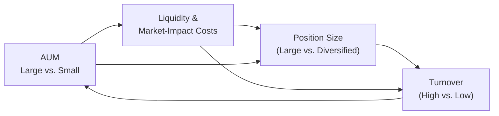

Introduction  
I remember a conversation I had with a colleague who managed a small boutique hedge fund. He was excited about how he could quickly swivel into highly specialized names—think micro-caps in niche industries—without moving the market. Meanwhile, a friend at a giant asset manager sighed about every trade requiring meticulous planning, lest it ripple through the markets and compromise their entry price. So yeah, the size of your Assets Under Management (AUM) very much influences your strategy. Let’s dig into how AUM, liquidity, position size, and turnover affect active equity portfolio construction, especially as you’re aiming for alpha and controlling risk.

Impact of AUM on Strategy Execution  
• Large AUM challenges  
If your fund is huge, you likely face difficulties getting in and out of smaller or illiquid stocks. You might spot a glorious opportunity in a thinly traded stock, but to build a meaningful position in the context of billions of dollars, you’d need to purchase a chunk substantial enough to drive the stock price up. And exiting? Sometimes it’s a slow dance that may push the price down if you have to liquidate quickly. Plus, there’s always the worry of signaling your trades to the market—large funds sometimes leave footprints that others can track.

• Small AUM benefits and challenges  
Smaller funds can be nimble, darting in and out of positions. Transaction size is smaller, so your trading might not move the market. That’s great if you enjoy a more active style. However, small managers might face constraints when negotiating prime brokerage or trading fees, since they don’t have the volumes or commissions to receive the best rates possible. Also, smaller funds may not have the resources to build a robust research infrastructure to spot wider sets of opportunities.  

• Balancing alpha with scaling  
Scaling a strategy as assets grow is not always linear. You might find a sweet spot in mid-cap equities, but the more capital you raise, the more you’re forced to push beyond these mid-cap selections or use derivatives overlays to adapt. This is often where “capacity constraints” show up—some strategies, like certain factor or activist approaches, have a natural upper limit on how many dollars they can deploy before diminishing returns kick in.  

Liquidity Considerations  
• Why liquidity matters  
Liquidity is about being able to convert your equity positions to cash without causing a significant price change. More liquid securities—like large-cap stocks—are straightforward to trade in bigger sizes. Less liquid ones, including certain emerging market shares or small-cap stocks, can be tough to trade without incurring high market-impact costs. Yet these same thinly traded names can offer outsized return opportunities if you do them right.

• Thinly traded stocks and alpha  
Some managers love smaller, illiquid names because they believe the market undervalues them and the slower trading dynamic creates persistent mispricings. But in volatile moments, or when your thesis sours, it can feel like a trap: you can’t exit without hammering your own position.  

• Market-impact costs and transaction costs  
Every time you trade, you face spread costs, commissions, potential slippage, and taxes (depending on the jurisdiction). If you’re a large fund or you’re targeting thin liquidity pools, these costs can be a real drag. Bidding up a stock just to purchase it is frustrating, but being forced to sell lower than your target price is worse.  

Position Size  
• Concentration vs. diversification  
Position size is the percentage (or absolute notional) you allocate to any single holding in your portfolio. By taking a large position, you might amplify the impact on returns if your thesis is on point. However, if your analysis misses the mark, ouch—drawdowns can be huge. A more diversified approach with smaller positions helps spread out risk, but you can dilute your best ideas. It’s that constant push and pull: “How much should I bet on my conviction?”  

• Single-position limits  
Many portfolio managers use single-position limits, such as capping any holding at 5% or 10% of the portfolio. This sort of risk management practice arises partly due to regulatory requirements or internal guidelines. Some funds might even cap positions relative to the stock’s daily trading volume (e.g., not owning more than x days’ trading volume) to reduce illiquidity risk.  

• Example: Balancing conviction and risk  
Imagine you have an extremely high-conviction stock. You do all your homework—management is top-notch, the market is behind the curve in assessing future growth, and you have strong catalysts lined up. You decide to devote 8% of your portfolio to it, significantly higher than your typical 3%. If you’re right, you can generate exceptional alpha. If the story changes, you may experience a large drag on your performance. That’s position sizing 101: balancing conviction against the risk budget.

Turnover Considerations  
• The pros and cons of high turnover  
High turnover can capture fleeting, time-sensitive opportunities—maybe a short-term breakout play or an event-driven thesis that only lasts a few weeks. A higher turnover strategy can be beneficial if you’re good at rotating capital effectively. But keep in mind those increasing transaction costs. Each trade costs you a bit in spreads, commissions, and (in some regions) taxes. If you’re not careful, these costs eat into returns.  

• Lower turnover strategies  
In contrast, some managers keep turnover low, aiming for longer holding periods to let compounding do its magic. Fewer trades also means fewer realized short-term capital gains (potentially higher taxes in some jurisdictions) and less outflow in commissions or spreads. But in markets that move quickly—especially around disruptive technology changes or macro events—a low turnover strategy might miss out on significant short-term alpha opportunities.  

• Finding the sweet spot  
What’s the “right” turnover? There’s no single answer. It’ll depend on your investment horizon, research approach, and cost structure. Some factor-based or quantitative managers might run extremely high turnover strategies—sometimes daily or weekly rebalancing—while certain fundamental shops ride their winners for years. Often, managers adopt a “core-satellite” framework: a core of low-turnover holdings to keep costs and risk stable, combined with a more active satellite portion of the portfolio to capture short-term dislocations.  

Putting It All Together: AUM, Liquidity, Position Size, and Turnover  
Each of these levers (AUM, liquidity, position size, turnover) is interconnected. For instance, a small fund with moderate turnover might be able to exploit illiquid opportunities, as it can trade quickly and quietly. Meanwhile, a larger fund adopting a high-turnover approach to small-cap stocks is going to face steep transaction costs and might inadvertently move the market, hurting performance.

Below is a simple summary diagram showing how these factors interact at a high level:

In practice, you want to ensure:  
• Your AUM is suitable for the strategy. If you’re too large relative to your investable universe, consider diversification into bigger securities or balancing your portfolio with derivatives.  
• Your liquidity constraints are respected. Don’t chase illiquid markets if you can’t exit easily. Plan your trades carefully to reduce market-impact.  
• Each position’s size reflects your convictions and your risk tolerance.  
• Your turnover approach maximizes your skill while controlling transaction costs.

Risk Budgeting and Alpha Capture  
Many portfolio managers talk about having a “risk budget.” That can mean the anticipated volatility or Value at Risk (VaR), or a specific limit on active risk (tracking error). When allocating this risk budget, you need to weigh your best alpha ideas against the costs and constraints. For instance, if you have a great alpha signal on a thinly traded stock but you manage a multibillion-dollar fund, the cost might offset the return. Similarly, if you turnover the portfolio too frequently, you increase execution costs and may surpass your risk budget.  

Key Trading Rules  
• Maximum exposure limits: You might say, “No single name >10% of my portfolio.”  
• Position-size as a function of daily trading volume: For instance, never exceed 20% of the average daily volume in a single trade.  
• Turnover constraints: Decide your upper bounds for portfolio turnover, or set a maximum number of trades per week.  
• Pre- and post-trade analysis: Evaluate your potential market impact before each major trade, and analyze your actual impact after to refine your approach.  

Practical Example  
Let’s use a hypothetical scenario: Redwood Capital, an equity fund with $2B in AUM, invests globally. Redwood has a strong research focus on disruptive technology in small- and mid-cap companies. Their strategy is moderately high turnover because they capture transitions in the tech cycle. They discover a small software security firm with promising revenue growth. The problem? Redwood’s typical position is $50M, but the target firm only trades $5M daily in volume.  
• Redwood tries to accumulate the position gradually to avoid driving the price up.  
• The slower accumulation might cause Redwood to miss some of the upside.  
• Redwood reconsiders: Should they deploy only $25M (a half position) to avoid an outsized impact?  
That’s a real puzzle. Redwood weighs the alpha potential versus the risk and potential market-impact costs.  

Best Practices and Pitfalls  
• Watch for capacity constraints: Overly large funds can outgrow a niche strategy.  
• Don’t over-diversify away your best ideas: A portfolio diluted with too many tiny positions can weigh down performance.  
• Manage transaction costs: High-frequency trading in illiquid markets can quickly eat away at gains.  
• Evaluate your portfolio’s liquidity under stress: This matters big time during market downturns or if you face investor redemptions.  
• Align your turnover with your investment horizon: Are you capturing short-term mispricings or are you letting a multi-year thesis play out?

References  
• Fama, E. F., & French, K. R. (2008). “Dissecting Anomalies.” Journal of Finance, 63(4).  
• Chan, L. K. C., & Lakonishok, J. (1995). “The Behavior of Stock Prices around Institutional Trades.” Journal of Finance, 50(4).  
• CFA Institute. (2025). “Trading, Liquidity, and Turnover in Active Equity Management.” Curriculum readings.  

Exam Tips for This Topic  
• When answering essay questions about liquidity constraints, highlight how the daily trading volume influences the maximum position size.  
• For item set questions, expect scenarios that test your knowledge of turnover constraints and their impact on alpha vs. cost.  
• Time management: Be prepared to discuss the trade-offs between your fund’s AUM, the universe you’re investing in, and position sizing.  
• Look for triggers in the question stem: mention of “capacity constraints” or “thinly traded markets” usually points toward a discussion of the interplay between liquidity and AUM.

Below is a short quiz to help you put your knowledge to practice.

## Test Your Knowledge: AUM, Liquidity, Position Size, and Turnover



### Which factor typically limits a large fund's ability to invest in smaller, illiquid stocks?

- [ ] Low risk tolerance
- [ ] Low portfolio turnover
- [x] Market-impact cost
- [ ] Regulatory restrictions

> **Explanation:** Large funds face the risk of moving the market significantly due to large trade sizes, which increases market-impact costs when investing in smaller, illiquid stocks.

### A small fund might have an advantage in trading illiquid securities primarily because:

- [ ] They have a stronger predictability model for micro-cap equities.
- [ ] They always have lower transaction costs.
- [x] They can move in and out quietly without substantial market-impact.
- [ ] They have superior access to stock borrow facilities.

> **Explanation:** A small fund's trades in illiquid securities are smaller, minimizing potential market-impact costs.

### High portfolio turnover can be beneficial because:

- [x] It helps capture short-term mispricings and event-driven opportunities.
- [ ] It automatically increases tax efficiency.
- [ ] It reduces transaction costs when trading illiquid stocks.
- [ ] It fosters a buy-and-hold approach.

> **Explanation:** High turnover strategies can capitalize on transient anomalies or corporate events, although they typically have higher transaction costs.

### Over-diversification can dilute returns when:

- [x] The portfolio manager invests in many small positions, including low-conviction picks.
- [ ] The manager invests only in large-cap securities.
- [ ] The manager enforces a 10% maximum single-position limit.
- [ ] The fund seeks sector-specific exposure only.

> **Explanation:** Over-diversification may include adding numerous positions that have minimal impact on performance yet add to monitoring complexity and potentially drag down returns.

### Reduced liquidity in a specific stock most likely leads to:

- [x] Higher spreads and potential slippage.
- [ ] Lower transaction costs.
- [x] Increased market-impact risk.
- [ ] Guaranteed alpha generation.

> **Explanation:** Illiquid stocks typically have wider bid-ask spreads, higher slippage, and a greater chance that the act of trading moves the price.

### An example of a single-position limit is:

- [x] Restricting the portfolio to no more than 5% per security.
- [ ] Limiting the portfolio’s short positions to 20% of total assets.
- [ ] Only trading the top three largest market-cap stocks.
- [ ] Allocating at least 50% to mid-cap companies.

> **Explanation:** A single-position limit refers to capping any one holding at a certain percentage of the portfolio. 

### Position sizing often depends on:

- [x] The manager’s conviction in a security.
- [ ] Marketing materials for the fund.
- [x] Regulatory maximum ownership rules.
- [ ] Share price target set by analysts only.

> **Explanation:** Position sizes reflect both a manager’s confidence and external constraints (e.g., regulations, liquidity, or risk limits).

### A high-level approach to control turnover:

- [x] Setting a maximum number of trades per month or quarter.
- [ ] Executing trades only at market open.
- [ ] Relying solely on algorithmic trading for all decisions.
- [ ] Having no constraints on rebalancing frequency.

> **Explanation:** Managers often impose explicit or implicit turnover constraints to control transaction costs and guard against over-trading.

### Higher turnover often increases:

- [x] Transaction and tax costs.
- [ ] Holding period returns.
- [ ] Liquidity of the underlying stocks.
- [ ] Probability of a forced sale.

> **Explanation:** More frequent trades typically result in higher commissions, bid-ask spread costs, and short-term capital gains.

### True or False: A low AUM manager is always at a disadvantage compared to a large AUM manager.

- [x] True
- [ ] False

> **Explanation:** Tricky question—while being small might limit resources and negotiating power, not all scenarios disadvantage the small manager. In fact, small AUM can allow nimbler trades. However, many perceive larger AUM institutions to have deeper resources and market influence, so arguably “always at a disadvantage” is not strictly correct. This highlights the nuance of real-world constraints.


