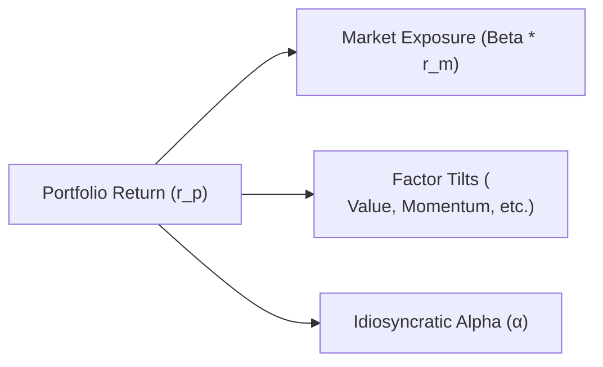

## Understanding Structural Efficiency

Structural efficiency in a portfolio, at its core, is all about designing and operating your investment strategy so that you minimize friction, hidden costs, and unintended exposures—those sneaky little drags that can whittle away returns. The idea might sound a bit abstract, but it actually has very tangible consequences for everyday performance. Picture the difference between a sloppy, haphazard collection of stocks thrown together without a plan versus a smoothly functioning and deliberate combination of positions. The more friction you have—maybe from poor trade execution, inefficient rebalancing, or random factor exposures—the harder it is to generate alpha and beat your benchmark.

I remember the first time I tried to measure inefficiencies in a small equity portfolio I was managing. I realized I was paying way too many transaction fees, crossing the bid-ask spread unnecessarily, and even taking on unintended style tilts just because I wasn’t paying close attention to how I executed trades. My returns took a haircut from all those inefficiencies. Once I cleaned things up—focused on trade timing, minimized unnecessary trades, monitored my factor exposures—suddenly my performance improved simply because I was no longer giving away “free” losses.

Structural efficiency covers many areas. These include choosing the right benchmarks that align with your investment style, ensuring your portfolio’s factor exposures are deliberate rather than accidental, planning your trades to reduce market impact, leveraging technology for risk management, and continuously monitoring your operational processes. Each of these building blocks can help you either avoid pitfalls or enhance the final net alpha your clients see.

## Translating Investment Philosophy into Alpha Sources

If you recall from our earlier discussions on active equity investing strategies (particularly from Chapter 2), alpha emerges when a manager’s insight or expertise—call it their “secret sauce”—manifests in market-beating returns. Often, that philosophy is anchored in either factor-based approaches (momentum, value, size, quality, or other factor tilts) or idiosyncratic insights (unique stock-picking, special-situations investing, or distinctive thematic bets).

• Factor-based alpha sources. Managers may systematically tilt toward factors that have historically delivered excess returns. For instance, a value tilt might entail overweighting companies with low price-to-book or price-to-earnings ratios. But eventually, if everybody and their dog piles into the same factor, performance can become crowded and the factor’s alpha may dwindle.

• Idiosyncratic alpha. This is that truly proprietary insight that arises from original research and the ability to act on information not widely recognized by the market. Maybe you’ve discovered a unique pattern in certain industries or you maintain a world-class analyst network providing local market intel. When done well, that idiosyncratic edge can protect you from factor-crowding risks because it’s genuinely distinctive.

The portfolio structure must align with whichever alpha sources you embrace. If you think your edge lies in selecting undervalued mid-cap technology stocks, for instance, your portfolio’s structural efficiency should support that process (skilled analysts, timely data, optimal portfolio weighting rules) and keep out unnecessary exposures or factor tilts that dilute your alpha. In essence, portfolio structure isn’t just an afterthought—it’s a reflection of your core philosophy and the path you believe leads to outperformance.

## Distinguishing Between True Skill and Luck in Returns

We all know that markets have an element of randomness, especially in the short term. One quarter’s outperformance could just be random luck. You might remember years where a dart-throwing monkey portfolio (or so they say) beats professional managers. The key is to parse out what portion of returns is driven by genuine skill and which portion is luck—or just fleeting market circumstances.

The best way to differentiate is by assessing consistency over multiple periods and market regimes. A manager who reliably exhibits alpha in both bullish and bearish markets—where that alpha doesn’t just evaporate when a favored factor cycle ends—probably has real skill. You can also check the return pattern. If it’s extremely erratic, with massive up and down swings, you might be looking at a manager who’s occasionally spectacular but not consistently skillful. Lastly, consider the breadth of their research process. A manager who carefully accumulates incremental edges across many stocks or segments is typically more likely to deliver stable performance than one who maintains a few big bets that are either home runs or total strikeouts.

Ultimately, patience and thorough analysis are required here. It’s easy to be impressed when someone outperforms for a year or two, but only repeated demonstrations of outperformance in varied conditions provide real evidence of skill. Bringing this all back to the concept of structural efficiency: a well-structured portfolio, consistently run, will produce fewer “fluky” results because the manager’s structure is built to deliver on the alpha thesis again and again.

## The Art of Performance Decomposition

Breaking down your portfolio returns is like dissecting a well-made meal from a fancy restaurant. You want to figure out which ingredient accounted for which flavor. Performance decomposition helps you identify:

• Market-Related Returns (Beta). 
• Factor Tilts (Style-Based Returns).  
• Selection Skill (Idiosyncratic Alpha).

One simple way to look at this is through the lens of a multi-factor regression model. In such a model:

Let rᵖ be the portfolio return, and let rᶠᵢ represent each factor’s return. Then you can estimate:

$$
r_p - r_f = \alpha + \sum_{i=1}^{n} \beta_i \bigl(r_{f_i} - r_f\bigr) + \varepsilon
$$

Where r_f is the risk-free rate and α is your estimated average alpha. Each βᵢ captures the exposure to a particular factor (value, growth, momentum, etc.), and you measure whether any residual alpha remains after accounting for these factors.

So, if your portfolio is heavily tilted toward value stocks, you might see a high β for the value factor. If your performance is fully explained by that factor, you could argue that your alpha is really factor-based. On the flip side, if significant alpha remains unexplained by the common factor tilts, that suggests unique insights or stock picks are adding genuine value.

Below is a simple diagram to illustrate how portfolio return breaks down:

The goal is to isolate that last piece—idiosyncratic alpha—because that’s typically where genuine skill resides. It’s not always obvious: sometimes a manager may appear to have a wonderful alpha, but rigorous decomposition reveals the returns came mostly from a momentum or growth tilt.

## The Value of Peer-Group Comparisons

Peer-group comparisons are another angle for evaluating whether your portfolio’s alpha is truly a reflection of skill or whether you’re just riding a hot style wave. If you look at a group of funds employing similar strategies—like small-cap value funds—and you see that many of them outperformed during the same time period, it could reflect a favorable environment for small-cap value rather than your manager’s brilliance. On the other hand, if your portfolio consistently ranks in the top quartile or decile among its peers, over multiple stages of the market cycle, that’s more convincing evidence of genuine skill.

Of course, peer-group analysis has its challenges: no two funds are truly identical, classification systems can be fuzzy, and survivorship bias can distort historical data if underperforming funds die off or merge. Nevertheless, a well-developed peer-group comparison, using robust data, is a decent reality check. You might consider performance persistence studies as well—these look at how often top-quartile managers remain in the top quartile in subsequent periods. A strong manager with real alpha sources is more likely to sustain top-tier performance than one who simply got lucky.

## Dynamic Alpha Rebalancing

Markets change, factors get crowded, and once-little-known opportunities become widely popular—sometimes with painful consequences for those who remain too long. Dynamic alpha rebalancing is the practice of continuously assessing your alpha sources and, if needed, rotating or readjusting them. It’s not about impulsively chasing every new fad; rather, it’s a disciplined recognition that alpha generation is time-varying. 

For instance, if you believe you have a special advantage in emerging markets’ consumer stocks, awesome. But if new entrants flood that niche, causing valuations to spike and competition to intensify, you might see your advantage fade. Rather than stubbornly holding onto that approach, a dynamic rebalancer would actively shift emphasis to newer edges. This might mean developing coverage in another geography, building a small team to explore the mispricing of convertible bonds, or pivoting to a different factor tilt that’s still underexploited.

There’s a tricky balance here. You don’t want to keep jumping from strategy to strategy—incurring large transaction costs and diluting your expertise. But ignoring or denying that your alpha source is under pressure can be worse. Dynamic alpha rebalancing requires a clear head, good data, and a willingness to adapt while still safeguarding your overarching process. It’s definitely easier said than done, but it can be a crucial aspect of maximizing long-term alpha.

## Factoring in Transaction Costs, Fees, and Short-Lending Expenses

Even if you produce robust gross alpha on paper, by the time the real world does its bite—via transaction costs, management fees, performance fees, bid-ask spreads, and short-lending expenses (for long-short strategies)—your net alpha might look significantly smaller. These seemingly mundane details can make a difference between a manager who outperforms and one who underperforms.

• Transaction Costs. High turnover can be a killer if your market is illiquid or your position sizes are large, creating a higher market impact. Using advanced execution techniques (algorithmic trading, limit orders, crossing networks) can minimize these costs.

• Management Fees. Some specialized alpha strategies demand higher fees due to the labor-intensive research or market niche they occupy. But if the fee structure is too high and the alpha isn’t consistently surpassing it, that’s a net loss for investors.

• Short-Lending Costs. In a market with limited short supply, the cost of borrowing certain securities can be huge. If your strategy depends on shorting expensive-to-borrow stocks, you’ll need to ensure the expected alpha is enough to justify that cost.

• Performance Fees. Hedge-fund-like vehicles often charge performance fees in addition to base management fees. While this can incentivize managers to go after big alpha, it also can eat away at net returns if the manager is only modestly successful in generating alpha.

All of this highlights a fundamental principle: the only alpha that truly matters to an investor is net alpha—what shows up in their account after all these fees, costs, and other frictional expenses. A strong manager always keeps these costs in mind while structuring the portfolio, and ensures that any alpha claims are robust enough to overcome them.

## The Role of Operational Efficiency in Enhancing Net Alpha

Think of operational efficiency as the “engine room” ensuring all the manager’s good ideas aren’t derailed by sloppy processes. This includes everything from technology infrastructure (for data gathering and trade execution) to having a well-trained operations team that reconciles trades and updates risk systems in real time. Poor operations can lead to compliance issues, data errors, or just plain confusion—ultimately hurting performance.

But there’s a more direct link to net alpha too. If your operation isn’t efficient, you might face slow or incomplete data. That can cause delayed trading decisions or inaccurate portfolio risk analytics, leading to suboptimal trades. Or maybe your operational back-end fails to track short-lending rates effectively, resulting in higher borrowing costs. Even small mistakes, repeated frequently, subtract from your alpha. 

It might sound dull, but operational excellence can provide a subtle competitive advantage. Some managers heavily invest in technology that automates tasks, reduces human errors, and speeds up research processes. The bottom line: a well-oiled operational machine ensures the alpha that’s generated by the portfolio management team doesn’t evaporate through the cracks of inefficiency.

## Conclusion and Best Practices

Portfolio structural efficiency and alpha evaluation may seem like a mouthful, but they’re actually all about systematically making sure your portfolio is designed to represent your best ideas in the least costly, most purposeful way possible. A few takeaways:

• Regularly measure and decompose your returns into market (beta), factor exposures, and pure alpha.  
• Keep an eye on factor crowding—if the crowd’s piling in, your factor-based alpha might suffer.  
• Distinguish skill from luck by tracking performance over multiple market regimes.  
• Be prepared to adapt your alpha sources (dynamic alpha rebalancing) if conditions shift.  
• Always consider transaction costs and other real-world frictions when calculating your net alpha.  
• Invest in operational efficiency—good processes prevent alpha leakage.

In short, it’s not enough to have a good idea for beating the market. You’ve got to structure your portfolio around that idea in a way that’s efficient and can withstand the challenges of changing market conditions. That’s what truly moves the needle for investors and fosters long-term success.

## References

• Sorensen, E., Hua, R., & Qian, E. (2007). “Multiple Alpha Sources and Active Management.” Journal of Portfolio Management.  
• Clarke, R., de Silva, H., & Thorley, S. (2002). “Portfolio Constraints and the Fundamental Law of Active Management.” Financial Analysts Journal.  
• CFA Institute. (2025). “Alpha Evaluation Techniques.” Curriculum readings.  
• Bodie, Z., Kane, A., & Marcus, A. (2018). Investments (11th ed.). McGraw-Hill.  
• Grinold, R., & Kahn, R. (2000). Active Portfolio Management (2nd ed.). McGraw-Hill.  

## Test Your Knowledge: Evaluating Efficiency and Potential Alpha in Portfolio Structures



### Which of the following best describes structural efficiency in a portfolio?

- [ ] A method for identifying the lowest possible market beta.  
- [ ] The practice of rapidly shifting between different factor exposures.  
- [x] How effectively a portfolio is built and managed to minimize costs and unintended exposures while focusing on desired investments.  
- [ ] The ability to generate ongoing alpha by identifying mispriced assets.  

> **Explanation:** Structural efficiency is about minimizing frictions, costs, and unintended bets, so that your intended exposures can generate alpha without unnecessary drag.

---

### What does it generally indicate if a manager’s returns are fully explained by a known factor, such as value or momentum?

- [ ] It suggests the manager has significant unrewarded idiosyncratic risk.  
- [ ] It proves the manager has no skill whatsoever, regardless of performance persistence.  
- [x] The manager’s returns might be due to factor tilts rather than unique selection skill.  
- [ ] It means the manager should always hold a market-neutral portfolio.  

> **Explanation:** When a manager’s performance is mostly explained by known factors, it implies that the source of returns is factor-based rather than purely idiosyncratic. That can dilute the claim of “true alpha.”

---

### A manager consistently outperforms during both rising and falling markets over multiple years. Which of the following interpretations is most likely?

- [ ] The performance is primarily explained by a factor that only emerges during volatility.  
- [x] The manager may have reliable skill that transcends individual market cycles.  
- [ ] The manager’s luck probability simply repeats in all types of market conditions.  
- [ ] The manager’s strategy likely involves zero transaction costs.  

> **Explanation:** Genuine skill often manifests as consistent outperformance across different market regimes, reducing the likelihood that outperformance is purely luck.

---

### Which of the following descriptions fits idiosyncratic alpha?

- [ ] The performance a manager achieves by tracking a market-cap-weighted benchmark.  
- [x] Excess returns linked to insights or actions specific to the manager, distinct from market or factor exposure.  
- [ ] Returns that occur solely due to broad factor exposures, such as value or growth.  
- [ ] The negative component of portfolio volatility.  

> **Explanation:** Idiosyncratic alpha refers to unique manager skill that isn’t explained by general market moves or systematic factor tilts.

---

### What is “factor crowding”?

- [ ] When all portfolios in a peer group share the same idiosyncratic risk.  
- [x] The risk that many managers chase the same factor, decreasing its return potential.  
- [ ] A measure of how many factors simultaneously affect a portfolio.  
- [ ] The practice of overallocating to a single factor to maximize alpha.  

> **Explanation:** Factor crowding happens when too many market participants chase the same factor exposure, often reducing the profitability of that strategy.

---

### Dynamic alpha rebalancing primarily involves:

- [x] Proactively adjusting your alpha sources if they become crowded or less effective.  
- [ ] Routinely eliminating all factor tilts at the end of each quarter.  
- [ ] Averaging your positions over the past five years to set the next quarter’s allocations.  
- [ ] Focusing only on short-selling to capture momentum.  

> **Explanation:** Dynamic alpha rebalancing requires actively monitoring alpha sources and rotating out of stale or crowded strategies into more promising ones, when justified.

---

### Which of the following is true about transaction costs and their impact on alpha?

- [ ] They usually amount to zero if your portfolio is sufficiently diversified.  
- [ ] They only matter in high-frequency trading strategies.  
- [x] They reduce the manager’s realized (net) alpha, sometimes significantly.  
- [ ] They can be ignored when analyzing historical performance.  

> **Explanation:** Transaction costs affect realized returns and must be accounted for when calculating net alpha. Even a well-designed strategy can underperform if transaction costs are excessive.

---

### Why is peer-group analysis relevant for evaluating a manager’s alpha?

- [ ] It isolates a manager from investor sentiment and cyclical returns.  
- [x] It helps distinguish whether outperformance stems from unique skill or simply a common style bias.  
- [ ] It demonstrates that the manager only invests in niche markets.  
- [ ] It replaces factor analysis by default.  

> **Explanation:** Comparing performance within a peer group with a similar style or mandate shows whether a manager’s returns stand out beyond common style effects or market contexts.

---

### What is a major advantage of operational efficiency for an investment manager?

- [ ] It allows the fund to bypass regulatory requirements.  
- [ ] It guarantees higher returns in all market environments.  
- [ ] It ensures the easiest strategy pivot options for speculative derivatives.  
- [x] It reduces errors, improves data processing, and preserves alpha that might otherwise be lost to inefficiencies.  

> **Explanation:** Strong operational efficiency helps the manager maintain accurate, timely data and minimize trading errors or resource waste, preserving alpha and enhancing competitiveness.

---

### True or False: A manager’s net alpha is generally unaffected by factors such as broker fees and short-lending costs.

- [ ] True  
- [x] False  

> **Explanation:** Broker fees, short-lending costs, and other frictional costs directly reduce a manager’s realized alpha, making them critical considerations for any active strategy.


