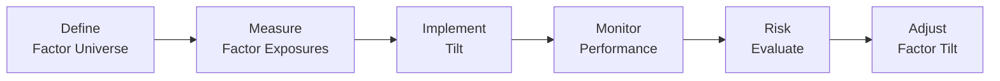

## Introduction

So, factor tilt management—I have to say, it's one of the most fascinating areas of portfolio construction. Essentially, you take the concept of a broad equity market portfolio (like the S&P 500 or some global index), and you purposefully dial up or dial down your exposure to certain style factors—like value, momentum, size, quality, or low volatility. In other words, you’re telling your portfolio, “Hey, I see potential in these particular flavors of the market, so let's position ourselves to benefit.” Factor tilts can help you harvest unique risk premia or even exploit behavioral tendencies in the marketplace.

I remember the first time I tried to incorporate a momentum tilt. I was super excited by all these backtests that, well, looked great in those upward-trending markets. But I learned quickly that identifying and timing factors is trickier than it sounds—momentum crashed during a certain period (remember 2009?), and I had to defend my positions to an extremely skeptical investment committee. It taught me that factor tilts aren’t a set-it-and-forget-it proposition. You have to remain vigilant, keep your eyes on the economic cycle, and align your strategy with your risk tolerance. Let’s walk through how you might do that in a methodical (but still, hopefully, not too boring) way.

## Understanding Factor Tilts

Factor tilts, also known as style tilts, refer to deliberate overweights or underweights in exposures to certain factors relative to a benchmark. For instance:

• Value: Tilt toward companies with relatively low price multiples (e.g., price-to-book)  
• Momentum: Tilt toward stocks that have shown positive relative performance over a recent lookback window  
• Quality: Tilt toward firms with strong balance sheets, high returns on capital, stable earnings, and minimal debt  
• Low Volatility: Preferring stocks with lower historical return variability or lower beta  
• Size: Overweighting (or underweighting) smaller-cap companies relative to a standard market‑cap benchmark  

### Why Tilt at All?

Factors commonly come from either risk-based or behavioral explanations. Risk-based theories suggest you should earn a premium for holding certain risk exposures—think small-cap or value. Behavioral arguments propose that market inefficiencies or irrational investor behavior create mispricings that can be systematically exploited—momentum is a classic example. In either case, factor exposures can enhance your return potential, but each factor brings unique drawbacks as well, such as periods of underperformance and additional volatility.

## Factor Tilts and the Economic Cycle

One of the big reasons factor investing is so exciting is that factor performance tends to be cyclical. Value stocks might outperform during a recovery phase, while quality stocks—those steady-eddies with robust profit margins—may offer more resilience in a downturn. Momentum can thrive in stable “grind-up” markets, but can stumble during sharp inflection points.

Now, deciding precisely when to overweight each factor is easier said than done, but we can talk about themes:

• During economic recoveries, value and size may do well (companies that are beaten down often rebound sharply).  
• In expansions, momentum and quality might look attractive—momentum because strong get stronger, quality because earnings remain consistent.  
• In downturns, historically, minimum volatility and quality have often offered defensive traits, helping you avoid the worst of the carnage.  

Of course, I wouldn’t recommend simply overhauling your entire portfolio every time some economist waves a new forecast. But having a broad awareness of how factors might behave in different market regimes is valuable. If you believe we’re near the peak of a cycle, for instance, you might start leaning more toward stable, profitable names (a form of a quality tilt).

## Implementing Factor Tilts in an Active Equity Portfolio

Let’s outline a structured process—like a mini recipe—for implementing factor tilts in a real portfolio. Imagine you’re an active manager looking to incorporate factor tilts systematically rather than making purely discretionary calls.

### Robust Definitions and Measurements

Defining the factor might seem trivial, but it’s crucial:

• Value Factor: Maybe you use price-to-book, or price-to-earnings, or enterprise-value-to-EBITDA. Each measure can yield slightly different sets of “value” stocks, so consistency is key.  
• Momentum Factor: Typically built from trailing total returns over a specific time window (e.g., 6 or 12 months). You might exclude the most recent month to avoid the short-term reversal effect.  
• Quality Factor: Return on equity, debt-to-equity, profit margins, or earnings stability can all feed into your quality metric.  
• Low Volatility: Some managers look at historical standard deviation of returns, others might look at beta.  

It’s like picking your favorite sauce for your pasta—make sure you know how it tastes and that it’s consistently made, or your dinner guests (investors) will be in for a surprise.

### Determining the Magnitude of the Tilt

The next step is figuring out how big a tilt to put on. This is where your risk and tracking error (TE) budgets come into play. If your client or your fund guidelines suggest you can’t deviate more than, say, 3% tracking error from the benchmark, you obviously can’t go hogwild. You might choose a mild tilt, or combine multiple moderate tilts (e.g., a bit of value, a bit of momentum) to keep your overall TE in check.

One approach is to use an optimizer that constrains your portfolio to maintain diversification while meeting a desired factor exposure. Alternatively, you might do a simpler approach that systematically overweights stocks that rank highly on your chosen factor, subject to risk constraints—like sector or industry neutrality, so that you don’t inadvertently load up on cyclical energy names just because they look “cheap.”

### Monitoring Factor Exposures

After you implement the tilt, you can’t just walk away whistling. You have to keep a close watch on factor exposures, as correlations and performance drivers can shift quickly. For example, value could become extremely correlated with the energy or financial sector in certain environments. If those sectors run into trouble, you could find your “value tilt” is more like a “highly concentrated bet on a shaky industry.” That’s obviously not ideal.

In practice, managers might produce a monthly or quarterly report on factor exposures, including summary metrics like active weights by sector, factor loadings relative to the benchmark, and a forward-looking risk assessment. This helps them see if their intended tilt is still in line with the desired risk profile.

The diagram above shows a simplified flow for factor tilt management. It starts with carefully defining the factor universe, measuring exposures, implementing the tilt, monitoring performance, evaluating risks, and then adjusting as needed.

## Factor Timing or Dynamic Factor Allocation

Some managers try to shift factor exposures dynamically based on expected changes in the macro environment or market sentiment. For instance, you may overweight value when you believe a cyclical rebound is imminent, or pivot to low volatility if you foresee a major slowdown.

I’ll be honest: factor timing can be more art than science, and it carries significant risk. If you’re early or your macro outlook is off, you can face deep drawdowns. On the other hand, being “static” with your factor exposure also has pitfalls—value can stay cheap for a painfully long time, and momentum can break down suddenly during market reversals.

In practice, a balanced approach might be to maintain a “core” factor exposure that fits your long-term beliefs (e.g., “I believe in value for the long run”), and then make small, controlled adjustments around that core when signals appear compelling. Perhaps you incorporate signals from the yield curve, credit spreads, or sector rotation models. Or maybe you prefer a purely quantitative approach that looks at historical relationships between factor performance and macro data. The key is to keep your tracking error budget in mind, because dynamic factor shifts can amplify active risk quickly.

## Factor Crowding and Capacity Constraints

Now, about capacity and crowding—when too many investors chase the same factor, the alpha opportunity can diminish (or even reverse, if prices overshoot). If you’re a manager with large assets under management (AUM) and you start allocating billions into a small-cap value strategy, well, you might end up moving the market. Let’s say you’re used to investing in small caps that only trade a few million dollars a day. Suddenly you’re a big fish in a small pond, and your own trades can distort prices, or maybe you can’t build positions quickly enough without taking on major transaction costs.

These capacity constraints matter for performance. In other words, it might be easy to run a $50 million factor strategy with strong returns, but a $50 billion version of exactly the same strategy might not replicate those results. Keep an eye on liquidity, as well as the overall flows into factor-based funds. Markets adapt, and what once worked can become too “hot” if everyone piles on.

## Risk Management: Avoiding Unintended Concentrations

Factor tilts sound nice, but watch out for unintended consequences. A tilt is basically a bet that a certain style factor will outperform. If that factor hits a rough patch, you can face some nasty underperformance. I’ve seen managers who had a big momentum tilt get hammered when the market abruptly pivoted—stocks that had soared suddenly plummeted, while “loser” stocks started catching bids.

Try to manage drawdown risks by:

• Diversifying across multiple factors with relatively low correlation.  
• Setting exposure limits (e.g., no single factor tilt can exceed a certain threshold).  
• Stress-testing your portfolio for possible tail events—like a major market rotation out of growth/momentum into value.  
• Maintaining enough liquidity so you can exit or rebalance quickly if conditions shift.  

It’s often helpful to consider scenario analysis: “What if interest rates spike and cyclical value stocks jump for six months while high-growth tech gets hammered?” Would your factor tilts help or hurt? How big is the potential drawdown?

## Aligning Factor Tilts with Client Constraints

One detail that often gets overlooked: your clients (or if you’re running an institutional portfolio, your stakeholders) might have constraints. For example, if you incorporate ESG screening, that might remove or alter certain sectors. A “value” style with heavy weighting in “dirty” energy companies might conflict with an ESG or sustainability mandate. Or you could be restricted from carrying large positions in certain industries, making your factor tilt more challenging to implement.

Another sometimes-overlooked dimension is liquidity mandates. If a client wants daily liquidity but you’re tilting heavily into small-cap or micro-cap stocks, that’s a mismatch. Work closely with compliance, legal, and your client’s guidelines to ensure your factor tilt approach still respects any such boundaries.

## Some Tips for the CFA Exam

• Understand the definitions: For example, how do you measure a factor like “value”? The CFA exam might test whether you know the difference between using price-to-book, price-to-earnings, or something else.  
• Keep the economic cycle link in mind: They could present a scenario about a turning business cycle or changing yield curve environment and expect you to identify which factor might be favored.  
• Monitoring exposures: Be prepared to do simple factor load calculations or interpret factor exposure tables.  
• Risk control and capacity: Understand how large scale could reduce returns or lock you into illiquid positions.  
• ESG or other constraints: The exam might show how constraints disrupt or limit your ability to tilt effectively.  
• Factor timing pitfalls: They could offer a scenario where momentum is turning, and you have to comment on the risk of reversal.

## Key Terms

• Factor Tilt: Deliberately overweighting or underweighting exposures to specific style factors (e.g., value, size, momentum) relative to a benchmark.  
• Momentum Factor: Positioning in stocks with positive price or earnings trends, under the rationale that winners continue to win (until they don’t).  
• Quality Factor: Emphasizing companies with robust fundamentals, stable earnings, and strong balance sheets.  
• Low Volatility Factor: Seeking stocks with lower historical volatility or beta in hopes of avoiding major drawdowns.  
• Factor Timing: Dynamic strategy of adjusting factor exposures based on cyclical or market conditions.

## References

• Ilmanen, A. (2011). Expected Returns: An Investor’s Guide to Harvesting Market Rewards. Wiley.  
• Asness, C., Frazzini, A., & Pedersen, L. H. (2013). “Quality Minus Junk.” AQR Capital Management.  
• CFA Institute. (2025). Factor Investing and Factor Tilts in Equity Portfolios. Curriculum readings.

--------------------------------------------------------------------------------

## Factor Tilt Management in Equities: Practice Questions



### 1. Which of the following best describes a “factor tilt” in an equity portfolio?

- [ ] Measuring beta relative to a benchmark without altering the stock selection process.  
- [x] Purposefully overweighting or underweighting exposures to specific style factors.  
- [ ] Holding more cash than usual to manage market drawdowns.  
- [ ] Implementing a purely passive replication of the S&P 500 Index.  

> **Explanation:** A factor tilt explicitly involves adjusting weights based on style factors such as value, momentum, or quality, rather than simply matching the benchmark or altering cash levels.

### 2. In assessing which factor(s) to tilt toward in anticipation of an economic expansion, a portfolio manager would most likely consider:

- [x] Increasing exposure to small-cap value stocks.  
- [ ] Hedging all factor exposures using derivatives.  
- [ ] Overweighting high-dividend-yielding telecom stocks for defensive positioning.  
- [ ] Reducing exposure to international equities entirely.  

> **Explanation:** Small-cap value stocks have historically performed well in economic recoveries, making them a common candidate for a tilt when growth prospects improve.

### 3. Which metric would be most indicative of a “momentum” factor tilt?

- [ ] A low price-to-book ratio  
- [ ] A low long-term debt-to-equity ratio  
- [ ] A high dividend payout ratio  
- [x] A strong trailing 6- or 12-month price performance  

> **Explanation:** Momentum involves focusing on stocks with a recent history of positive returns, typically over a 6‑ to 12-month window.

### 4. What is a primary risk associated with factor crowding?

- [ ] Reduced volume in equity markets leading to less transparency.  
- [x] Diminished return potential when too many market participants chase the same factor.  
- [ ] Excessive tracking error relative to the benchmark being minimized.  
- [ ] Increased diversification because of a broader pool of stocks in the factor.  

> **Explanation:** When many investors follow the same factor strategy, it can drive prices to a point where the factor’s expected return advantage weakens or reverses.

### 5. When implementing factor tilts, a portfolio manager seeks to keep the tracking error within a specified range. This range:

- [x] Limits how much the portfolio’s performance can deviate from the benchmark’s performance.  
- [x] Maintains adherence to a risk budget set by the investment mandate.  
- [ ] Ensures the factor tilt is neutralized by derivatives.  
- [ ] Guarantees consistently higher returns than the benchmark.  

> **Explanation:** Tracking error measures how much a portfolio can deviate from its benchmark. Managers often have a risk budget that constrains that deviation. However, it does not guarantee outperformance.

### 6. A portfolio manager believes a market downturn is imminent. Which factor tilt would traditionally be viewed as more defensive?

- [x] Low volatility  
- [ ] Momentum  
- [ ] Size  
- [ ] Leverage  

> **Explanation:** Low volatility stocks have historically exhibited defensive characteristics during market downturns, although no factor performs consistently in all conditions.

### 7. Which of the following is a recommended best practice for monitoring factor tilt exposures?

- [x] Generating regular factor load reports to analyze active exposures.  
- [ ] Relying exclusively on raw sector weightings without deeper analysis.  
- [x] Tracking correlation changes among factors to avoid unintended overlaps.  
- [ ] Rebalancing only once every five years.  

> **Explanation:** Managers should regularly produce reports showing factor loadings and track correlations among factors to avoid unintended risk concentrations. Periodic rebalancing (more than every five years) is also recommended.

### 8. In the context of factor timing, which statement is correct?

- [ ] Factor returns are random and cannot be predicted under any circumstance.  
- [x] Factor performance can be cyclical, suggesting some managers attempt to rotate among factors over time.  
- [ ] Factor timing hinges entirely on short-term proprietary volatility forecasts.  
- [ ] A purely static approach to factor tilting outperforms all dynamic strategies.  

> **Explanation:** Factor performance indeed tends to be cyclical, and certain managers do attempt to rotate among factors (though with varied success).

### 9. A manager employing a quality factor tilt is most likely to overweight securities with:

- [x] High return on equity and stable profit margins.  
- [ ] High historical price momentum and short interest.  
- [ ] Low average daily trading volume but high broker coverage.  
- [ ] Aggressive earnings estimates and uncertain cash flows.  

> **Explanation:** The quality factor tilt emphasizes financially strong companies characterized by stable profitability, conservative balance sheets, and robust cash flows.

### 10. A factor tilt focused on “value” typically emphasizes stocks that:

- [x] Trade at lower multiples, such as price-to-book or price-to-earnings, relative to the market.  
- [ ] Exhibit unusually high volatility compared to their peers.  
- [ ] Are included in both growth and quality indexes simultaneously.  
- [ ] Always outperform momentum-based factors in all market conditions.  

> **Explanation:** Value factors target stocks trading at comparatively low valuations, while outperformance is not guaranteed and depends on market conditions.


