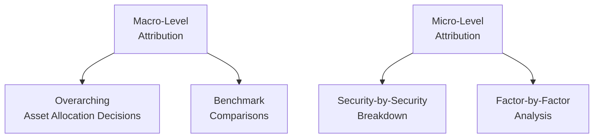

## Introduction

I remember the first time I tried to explain performance attribution to a friend over coffee. I mean, that might not sound like standard coffee-talk, but sometimes it’s the best place to explore these concepts, right? Well, halfway through, she looked at me like she was lost in a giant maze of “contribution” and “allocation.” And you know what? It was a good reality check. Performance attribution can be daunting at first, even for experienced finance folks. But once you see how it actually helps pinpoint where (and how) we’re adding value in a portfolio, it’s a game-changer. 

This section focuses on the exciting (yes, exciting!) world of attribution methodologies for active equity performance. We’ll explore the rationale behind standard return-based attribution, factor-based approaches, holdings- vs. transaction-based methods, and micro- vs. macro-attribution. And if any of that sounds overwhelming, trust me, we’ll take this step by step.

## Overview of Performance Attribution

Performance attribution, in essence, tries to answer one big question: Where did our returns actually come from? In active equity management, we typically measure performance against a benchmark, such as a broad market index. Did we do better or worse than that benchmark? Furthermore, which decisions caused these differences?

We can categorize attribution into:

• Return-Based Attribution  
• Factor-Based Attribution  
• Holdings-Based vs. Transaction-Based Attribution  
• Micro-Attribution vs. Macro-Attribution  

While they each dissect performance differently, the overarching goal is the same: break down and classify sources of return in a meaningful, repeatable way, so that we can either replicate successes—or avoid repeated mistakes.

Anyway, let’s get started with return-based attribution, which is often the foundation for many managers.

## Standard Return-Based Attribution

Return-based attribution is probably the easiest way to get a high-level feel for how a manager’s choices influenced portfolio performance. It typically breaks total return into a few big parts:

• Asset Allocation Effect  
• Sector (or Industry) Selection Effect  
• Security Selection Effect  

This method is called “return-based” because we are looking at overall returns, both of the portfolio and of a benchmark, without necessarily diving into granular transactions. We compare how the portfolio’s allocation to different sectors or industries differs from the benchmark, and how that difference contributed (positively or negatively) to total return.

### Asset Allocation Effect

Suppose you had a benchmark that’s 60% stocks and 40% bonds, but you decided to put 70% in stocks and 30% in bonds. Your portfolio’s performance can deviate from the benchmark’s simply because you allocated more to equities versus the benchmark’s weighting. That difference in weighting is the “Asset Allocation Effect.” 

If stocks outperform bonds over that period, you gain a positive “Asset Allocation Effect.” If the reverse happens, well, it’s going to generate a negative effect.

### Sector or Industry Selection Effect

Within the equity portion, you might bet heavily on technology. Or maybe you prefer consumer staples to a broader index weighting. Each difference in relative weighting across sectors or industries is examined here. If you overweighted technology and it soared, you’d see a positive “Sector (or Industry) Selection Effect.”

### Security Selection Effect

Finally, we focus on the performance gap from the specific stocks chosen within each sector or industry. Even if you matched the index sector weights perfectly, you could still generate active returns (positive or negative) by investing in different stocks than those in the benchmark. That difference is the “Security Selection Effect.”

### A Simple Math Example

Let’s do a tiny example (in simplified form). Suppose you have only two sectors: Tech and Health Care. Here’s a table of hypothetical weights and returns:

| Sector      | Portfolio Weight | Benchmark Weight | Portfolio Return (%) | Benchmark Return (%) |
|-------------|------------------|------------------|----------------------|----------------------|
| Tech        | 55%             | 50%             | 12.0                | 10.0                |
| Health Care | 45%             | 50%             | 9.0                 | 8.5                 |

The portfolio also has an overall return of about 10.7%. The benchmark, with 10% return for Tech and 8.5% for Health Care at the 50/50 weight, returns approximately 9.25%. So we outperformed the benchmark by 1.45%.

We can break this 1.45% outperformance into two major pieces:

1. Allocation Effect: The difference in the weight of each sector multiplied by the difference in the sector’s benchmark return from the total benchmark return. 
2. Selection Effect: The difference in returns for each sector multiplied by that sector’s portfolio weight.

For Tech, the allocation difference is +5% overweight, and the Tech sector’s benchmark outperforms the total benchmark. For Health Care, we are underweight by –5%, and relative performance is somewhat smaller. The math can get a bit more complicated with other return-based attribution formulas, but that’s the gist: it’s all about decomposing the difference in final returns between the portfolio and the benchmark.

Return-based attribution is straightforward but can lack the precision that more granular methods (like transaction-based) bring. However, it’s perfectly fine if you simply want a high-level performance decomposition.

## Factor-Based Attribution

Next, let’s take the conversation up a notch. Factor-based attribution breaks the portfolio’s performance into systematic risk factors (like value, growth, momentum, size, sector, or even country exposures). This method says, “Hey, the stock market’s performance can be largely explained by these factors. So let’s see how much of our portfolio’s return came from these factor tilts—and how much came from pure stock-specific skill!”

### Common Factors

• Value (low price-to-book, price-to-earnings, etc.)  
• Growth (high earnings growth companies)  
• Momentum (stocks with high recent returns)  
• Size (small-cap vs. large-cap)  
• Quality (low debt, stable earnings, etc.)  
• Sector or Country Exposure  

If your equity portfolio systematically overweights small-cap stocks (relative to a broad large-cap benchmark), you might see big swings in performance if small-caps do extremely well (or poorly). Factor-based attribution tries to isolate the effect attributable to that small-cap tilt, so you get a clearer picture of how your active bets on certain factors contribute to total performance.

### Equation Form

A robust factor-based attribution model might look at a linear equation of the form:

Rᵣ = α + β₁ F₁ + β₂ F₂ + β₃ F₃ + … + ε

Where:

• Rᵣ is the active return (relative to the benchmark).  
• Fᵢ are the factor returns (like the SMB factor for size, HML factor for value, etc.).  
• βᵢ measure the exposure (sensitivity) to each factor.  
• α is the risk-adjusted out- or underperformance that isn’t explained by factor exposures.  
• ε is a random error term.

The goal is to see if your performance is mostly explained by, say, a big tilt to momentum, or if there’s some extra secret sauce (α) that indicates genuine stock-picking skill beyond these known risk exposures.

## Holdings-Based vs. Transaction-Based Attribution

Alright, now we dive deeper. How precisely we calculate attribution depends on the frequency and detail of data. Here, we have two broad approaches:

### Holdings-Based Attribution

Holdings-based attribution uses snapshots of portfolio holdings at set intervals (like end-of-month or end-of-quarter). It looks at the weights of each security in the portfolio and the securities’ returns over the same interval to figure out how much each holding contributed to the portfolio’s overall performance.

• Pros: Easier to gather data (just the holdings and their prices).  
• Cons: It can miss what happens in between snapshot dates. If you trade heavily within the month, or if the timing of trades is key to capturing returns, holdings-based methods might “smooth out” reality.

### Transaction-Based Attribution

Transaction-based attribution, on the other hand, tries to incorporate every single trade throughout the period, including the exact timing and size of each transaction. It’s more precise but also more data-intensive. 

• Pros: Directly accounts for the contribution of each transaction, including partial periods and changes in weights.  
• Cons: Requires detailed transaction records and more complex calculations.

If you’re an active manager making frequent intra-month trades, transaction-based attribution typically yields a more accurate picture of how your decisions contributed to performance. If you don’t trade too often, or if your intervals are short enough that you capture important trades anyway, holdings-based might suffice. 

Anyway, if sheer precision is essential (maybe you’re an algorithmic trader making dozens of trades a day), transaction-based is your friend.

## Micro-Attribution vs. Macro-Attribution

Another perspective is the level at which we apply the analysis: the micro or the macro.

### Micro-Attribution

Micro-attribution is the bottom-up view, focusing on either:

• Individual security or position-level attribution (How much did each stock in the portfolio contribute to my overall performance in that period?)  
• Factor-by-factor attribution (In a factor-based model, how much did my tilt to the technology sector help or hurt me?)

This approach is more granular, so many managers find it super handy for identifying which trades or positions worked well and which ones flopped.

### Macro-Attribution

Macro-attribution is a top-down, big-picture synthesis. It’s about overarching asset allocation decisions, major investment themes, or even policy decisions at the highest level. Instead of diving into the day-to-day impact of each stock, you look at your overall allocation plan: how it differs from the strategic benchmark or policy portfolio, and how those big calls shaped performance.

Below is a quick visual representation of how micro- and macro-attribution break down:

Macro-attribution is handy for institutional clients (like large pension funds), where the high-level asset mix is often the main driver of returns. Micro-attribution is more useful if you want to hone in on specific positions, trades, or factor tilts.

## Integrated Risk and Return Attribution

One lesson that took me years (and a few misadventures) to fully appreciate is that performance can never be fully understood without looking at risk. You might have a dazzling return in a month, but was it driven by a huge unintentional factor bet? To get the “big picture,” many managers now integrate risk and return attribution. 

For example, you slice your performance by factor exposures, but then you also examine the ex-ante (i.e., forecasted) and ex-post (i.e., realized) risk each factor contributed. Let’s say you discover that your tilt to momentum delivered a great return, but also it was the biggest contributor to your portfolio’s volatility. Armed with that knowledge, you might decide to limit that exposure next time if your risk budget is tight, or if you’re concerned that a momentum crash might occur.

## Interpreting Attribution Results for Improvement

Now, analyzing the numbers is one thing, but the real gold is using them to enhance your investment process. Suppose you observe that your factor-based attribution indicates a consistently negative alpha over multiple periods while your factor exposures do just fine. That might signal a repeated weakness in security selection. Or maybe you’re consistently skillful at one factor (like value) but less savvy with growth stocks, so you might consider focusing your research resources more heavily on value or building a team with stronger growth expertise.

You can also use micro-attribution to see which hedge or overlay trades contributed to your performance in a big way—positively or negatively. In addition, macro-attribution might show that you’re systematically under-allocating to an asset class that historically provides a strong diversification benefit. So, you might adjust your top-down policy decisions.

## Best Practices and Common Pitfalls

Here are a few do’s and don’ts I’ve gleaned from both personal experience (some of it painful!) and industry best practices:

• DO ensure your benchmarks are relevant and consistent. A poorly matched benchmark often leads to incorrect attribution analyses.  
• DO keep your data clean and consistent over time. The old saying “garbage in, garbage out” applies here.  
• DO interpret results in the context of your investment philosophy. For example, if you’re a high-turnover momentum manager, a holdings-based approach that updates monthly may miss critical intraperiod trades.  
• DON’T rely on a single methodology. Factor-based, return-based, and holdings-based approaches each bring unique insights.  
• DON’T ignore your performance attribution results. They can confirm or outright refute your beliefs and assumptions.  
• DON’T forget about transaction costs. Sometimes you’ll discover that rebalancing or frequent trading has cost more than the alpha you’re generating.

Anyway, the best practice is to keep iterating—use a combination of methods, track them consistently, and feed the insights back into your strategy. 

## Concluding Thoughts

Performance attribution can get as simple or as complex as you want, from plain return-based attribution (asset vs. sector vs. security selection) to factor-based breakdowns (value, growth, momentum), to super-detailed transaction-based calculations that put you right in the driver’s seat of every trade. Whether you’re a fundamental or quantitative manager—or somewhere in between—understanding the nuance helps ensure you’re getting the “why” behind your portfolio’s results.

Finally, it’s essential to remember that an attribution analysis is only as useful as its implementation. Seeing that you have a negative factor tilt is one thing; actually doing something about it is another. So, do your attribution checks regularly, interpret them carefully in light of market conditions and your own style, and refine your process accordingly.

---

## References

• Bacon, C. (2021). “Practical Portfolio Performance Measurement and Attribution.” Wiley.  
• Spaulding, D. (2016). “Investment Performance Measurement.” CFA Institute Investment Series.  
• CFA Institute. (2025). “Performance Attribution and Manager Evaluation.” Curriculum readings.  

---

## Test Your Knowledge: Equity Attribution Methods



### Which of the following best describes the primary purpose of performance attribution in an actively managed equity portfolio?

- [ ] To confirm that the portfolio’s absolute returns are higher than the benchmark.
- [x] To explain how individual elements of portfolio construction contribute to the overall return vs. a benchmark.
- [ ] To forecast future market returns based on historical performance patterns.
- [ ] To calculate the time-weighted rates of return over multiple periods for compliance reports.

> **Explanation:** Performance attribution breaks down the active portfolio’s return into various decisions (asset allocation, selection, factor tilts, etc.) so managers can identify where their skill or underperformance originated.

---

### In a standard return-based attribution model, which of the following components typically captures the difference in returns from choosing specific companies within each sector?

- [ ] Sector selection effect
- [x] Security selection effect
- [ ] Asset allocation effect
- [ ] Timing effect

> **Explanation:** Security selection effect isolates the impact of picking particular securities, whereas the sector selection effect isolates over- or underweighting particular sectors.

---

### A manager notices that her portfolio’s factor-based attribution indicates a strong exposure to value stocks. What does this imply?

- [ ] Her portfolio’s performance relies mostly on broad market returns.
- [x] A large portion of her returns is likely explained by performance differences between value and non-value stocks.
- [ ] She will always outperform the market when growth stocks lag.
- [ ] She holds no growth stocks at all in the portfolio.

> **Explanation:** Factor-based attribution shows that a significant share of her active returns or risk is tied to the value factor. However, it doesn’t guarantee outperformance or performance outcomes in all market environments.

---

### Which statement about holdings-based attribution is most accurate?

- [ ] It is more precise than transaction-based attribution since it requires a snapshot of daily returns.
- [x] It can miss intraperiod trading and may not capture the exact timing of trades.
- [ ] It’s automatically more accurate for high-turnover portfolios than transaction-based methods.
- [ ] It requires actual transaction logs to function properly.

> **Explanation:** Holdings-based attribution uses snapshots of the portfolio (e.g., month-end), so it can overlook trades that occurred in the middle of those intervals.

---

### In micro-attribution analysis, what is the primary focus?

- [ ] Evaluating how the broad asset allocation tails off relative to policy benchmarks.
- [ ] Assessing strategic allocation differences at the plan sponsor level.
- [x] Measuring returns at the individual security (or factor) level within the portfolio.
- [ ] Comparing the portfolio's overall performance to a single corporate wellness index.

> **Explanation:** Micro-attribution drills down to individual components, such as specific securities or factors driving performance.

---

### Which best describes macro-attribution in performance analysis?

- [ ] Breaking out the contribution from every single security in the portfolio.
- [ ] Evaluating how day-to-day trading has contributed to the overall active return.
- [ ] Benchmarking each industry’s return independently of overall policy decisions.
- [x] Focusing on upper-level asset allocation and overarching investment policy decisions.

> **Explanation:** Macro-attribution takes a top-down approach, attributing performance to policy decisions and broad asset-level allocations rather than individual securities.

---

### Why might transaction-based attribution yield more accurate performance analysis than holdings-based attribution for a high-frequency trader?

- [ ] It relies on the same monthly snapshots used by standard indexing approaches.
- [x] It accounts for the exact trades and their timings, revealing intra-month opportunities and costs.
- [ ] It completely ignores realized gains and losses from short-term trades.
- [ ] It merges factor and return-based methods into a single blended approach.

> **Explanation:** Transaction-based approaches track all trades as they occur, providing a fine-grained and accurate picture of a high-frequency trader’s performance.

---

### Which of the following is an advantage of factor-based attribution?

- [ ] It requires minimal data and can be done without a benchmark return series.
- [ ] It ignores systematic risks and focuses only on security-specific risks.
- [x] It identifies the portion of returns linked to known systematic factors, distinguishing them from stock-specific alpha.
- [ ] It automatically detects all transaction costs without requiring additional adjustments.

> **Explanation:** Factor-based methods attribute portfolio performance to specific risk factors, separating out alpha that cannot be explained by those factors.

---

### When interpreting performance attribution results, which practice is most likely to improve long-term investment outcomes?

- [x] Using the results to adjust asset allocations, factor exposures, or security selection processes.
- [ ] Immediately closing out all positions that performed below the benchmark and never revisiting them.
- [ ] Doubling down on the worst-performing factor exposures to attempt a contrarian trade.
- [ ] Ignoring the results as long as the portfolio’s absolute return is positive.

> **Explanation:** Attribution results are valuable only if applied. Adjusting the investment process in response to attribution insights can enhance future performance and risk management.

---

### An integrated risk and return attribution analysis primarily helps active equity managers to:

- [x] Understand how various risk exposures (factors) contributed to the realized performance.
- [ ] Eliminate any volatility in the portfolio by removing all factors that caused underperformance.
- [ ] Guarantee that the next period’s returns will match or exceed the current period’s achievements.
- [ ] Focus solely on security selection contributions while discarding top-down decisions.

> **Explanation:** Integrating risk and return attribution enables managers to see which factors drove both performance and the overall risk profile, informing more balanced portfolio decisions.


