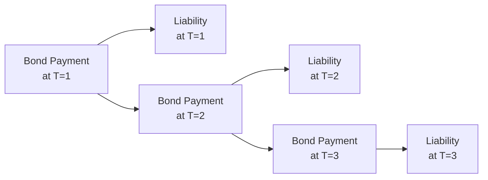

## Introduction

When an investor or institution faces explicit future liabilities—like the pension obligations of a defined-benefit plan, or an insurance company’s promised payouts to policyholders—it’s natural to wonder: “How do we make sure we have enough money at the right time to meet these obligations?” Fixed income instruments are often the backbone of this plan. They can offer predictable coupon payments, final principal redemptions, and a stable risk‑return profile that makes them particularly handy in covering known or estimated liabilities. In other words, if you’re trying to align your outflows with your inflows (and sleep well at night), fixed income is often the first place to look.

But let’s not assume that simply throwing a bunch of bonds into a portfolio is enough. In the world of liability-driven investing (LDI), there are specialized strategies—immunization, partial immunization, and cash-flow matching, among others—that help us systematically manage interest rate risk, liquidity constraints, timing mismatches, and a host of other real-world concerns. We’ll dig into these approaches, talk about the key concepts of duration and convexity, and explore practical ways to construct and monitor a liability-driven portfolio.

## Rationale for Liability-Driven Investing

Institutions such as pension funds, insurance companies, and even certain endowments need to prioritize liability coverage above all else. If you’ve got to make a series of guaranteed payments over time, you want to reduce the chance that interest rates will jump around and derail your plans. That’s the essence of LDI: manage assets so that they consistently meet liabilities. 

You might recall times when, say, a pension plan faced a funding crisis because market rates changed unexpectedly, or a pandemic shifted actuarial assumptions about life expectancies. LDI tries to handle these surprises by structuring fixed income holdings—perhaps supplemented with derivatives—so that changes in interest rates (or other economic factors) have minimal net effect on the surplus (i.e., assets minus liabilities).

In practice, LDI can be more nuanced. We might aim for a full match between our assets and liabilities, or we might “partially” hedge our liability exposures if we’re also looking for some upside. We’ll look at these approaches in more detail next.

## Key Strategies in Liability-Driven Investing

### Immunization 

Immunization aligns the duration of the fixed income portfolio with the duration of the liabilities so that changes in interest rates have a minimal effect on the net position. This approach can feel a bit I-wish-this-was-magical, but it’s really about using durations and present value calculations to offset interest rate risk. 

In simplified mathematical terms, if we let Dᴀ represent the duration of assets and Dₗ represent the duration of liabilities, full immunization typically sets:
  

D_A \approx D_L


so that a small parallel shift in interest rates has a relatively minimal effect on the surplus.

One trick, though: immunization usually presumes a parallel shift in the yield curve. Real life is rarely that simple; the curve might twist, slope, or shift in a non-parallel pattern. For that reason, advanced immunization strategies employ key rate durations or consider convexity—a second-order measure of how bond prices react to rate changes beyond a linear approximation.

### Partial Immunization

Partial immunization is a hybrid approach that doesn’t fully lock in on exact matching of duration or fail to consider potential future returns. Practitioners often combine a core portfolio that’s dedicated to liability matching (or partially so) with a “return-seeking” portfolio that pursues higher yield, alpha, or alternative investments. 

You might have encountered pensions that keep a big chunk of assets in a traditional immunized bond portfolio while also investing in equities or alternative credit to generate surplus returns. Partial immunization is all about balancing the safety of matching liabilities with the desire to earn a little extra. However, it introduces the possibility that these riskier assets won’t behave as planned, especially in volatile markets.

### Cash-Flow Matching

Cash-flow matching is conceptually straightforward: select bonds (or derivatives) whose principal and coupon payments occur in the same amount and at the same time as the required liability outflows. That means, theoretically, you do not need to worry as much about market fluctuations because you hold your bonds until maturity and redeem them to pay the liability.

In reality, it’s uncommon to find a perfect set of bonds to match every liability date—especially if you have complicated patterns of outflows or very long maturities. Meanwhile, the opportunity cost can be high because you may be narrowing your security selection to a subset of the fixed income market that precisely fits your desired schedule.

Below is a simple conceptual diagram of how cash-flows from bonds line up against liability outflows:

In this stylized example, each date’s liabilities are matched by bond payments at the exact same time. Straightforward in theory—tricky in practice, but it can be a powerful approach for institutions with very predictable liabilities.

## Duration and Convexity Considerations

Because interest rate changes are the single biggest factor influencing bond prices, duration is the central concept in LDI. Duration measures a bond’s or portfolio’s price sensitivity to changes in interest rates:


\text{Duration (Macaulay)} = \frac{\sum_{t=1}^{T} t \times CF_t \times v^t}{\sum_{t=1}^{T} CF_t \times v^t}


● CFₜ: coupon or principal cash flows at time t  
● vᵗ: present value discount factor (i.e., 1 / (1 + YTM)ᵗ)  

When the durations of assets and liabilities match, a parallel shift in rates should, in theory, produce equal offsetting gains or losses on each side. Of course, practice is messier: the yield curve rarely shifts in perfect parallel, which is why we look at key rate duration (exposure to different points on the curve) and convexity (the rate of change of duration with respect to rates).

Convexity measures the bond’s—or portfolio’s—sensitivity to changes in interest rates beyond what duration alone captures. In general, higher convexity is a good thing when rates fluctuate significantly because it means the bond’s price doesn’t depreciate as quickly when rates rise—and tends to appreciate slightly faster when rates fall.

## Asset–Liability Management (ALM) Perspectives

ALM goes beyond matching durations. It integrates risk management for liquidity, reinvestment, currency exposures (if liabilities are in multiple currencies), and regulatory constraints. 

Think of ALM as a dynamic balancing act. Even if you carefully match durations at the outset, your portfolio’s duration can drift over time for two reasons:

1) Liabilities change as life events or interest rates shift.  
2) Bond durations shorten as time passes or as interest rates and yields move unpredictably.  

Hence, an ALM engine typically tracks how assets and liabilities evolve through time. For example, a pension plan’s liability might suddenly get longer if employees live longer or if there’s a drop in discount rates. Without real-time or periodic rebalancing, a once-perfectly immunized portfolio might become misaligned.

### Liquidity Risk

Imagine you’re an insurer that must pay claims from natural disasters; you can’t just rely on the idea that your bonds will eventually mature. You need enough liquidity to handle large surges of payments. Incorporating short-term, highly liquid instruments—like T-bills or money market securities—can mitigate the risk that you have to sell a longer-term, less liquid bond at a bad time.

### Reinvestment Risk

Another subtlety is that as coupons and principal come in, you must reinvest them to maintain the original strategy—especially if you’re focusing on immunization over a long horizon. If interest rates are lower than expected, your reinvestment yields will decrease, affecting the portfolio’s ability to keep up with the liability stream.

### Timing and Cash Flow Gaps

Of course, your liability payments might not arrive in perfectly uniform increments. A life insurer could have lumps of outflows if, say, a major event triggers a large number of claims. Or a pension plan might ramp up benefits as more employees retire. Aligning bond coupon schedules—or employing derivative overlays to cover mismatch risk—can help ensure you’re not constantly short.

## Diversification in LDI

The old adage “don’t put all your eggs in one basket” definitely applies. Even a purely bond-focused approach can benefit from diversifying across:

• Government bonds of varying maturities.  
• High-grade corporate bonds or mortgage-backed securities.  
• Inflation-linked bonds, such as TIPS (U.S. Treasury Inflation-Protected Securities) or linkers in other markets, to hedge inflation risk.  
• Other instruments, like interest rate swaps, to fine-tune interest rate exposure.  

Diversification can help cushion the portfolio if any one segment of the bond market takes an unexpected turn, or if credit spreads widen in a certain sector. Of course, any foray beyond government securities introduces additional risk factors—like corporate credit risk or prepayment risk in mortgage-backed securities.

## Monitoring and Rebalancing the LDI Portfolio

Even the most carefully designed portfolio can drift from its liability coverage objectives as time passes and markets move. Changing market conditions, updated actuarial assumptions, or shifts in policy targets (e.g., new government regulations or accounting requirements) might all require rebalancing.

Rebalancing can be challenging. If market rates rise, you may need to extend duration to realign with your liabilities—but bond prices will have fallen, causing opportunity losses. Alternatively, if interest rates drop, your liabilities might become more expensive. Many LDI managers also use derivatives like interest rate swaps to quickly adjust the portfolio duration without large-scale bond trading. These swap overlays can provide a cost-effective method to maintain the portfolio’s “immunized” posture.

## Stress Testing and Scenario Analysis

We all know real-life events rarely unfold as expected. That’s why liability-bearing institutions frequently employ stress tests that look at:

• Yield curve flattening or steepening scenarios.  
• Economic recessions with falling interest rates and widening credit spreads.  
• Rapid inflationary environments with rising interest rates.  
• Tail events, such as geopolitical crises or pandemics.  

In each scenario, the LDI manager calculates the portfolio’s hypothetical gains or losses and compares them to the liabilities. The question is always: “Do we still have enough coverage, or is there a significant funding gap?” If the tests reveal vulnerabilities, the manager works to close them, possibly by adding hedges, changing the bond mix, or adjusting credit exposure.

## Practical Example: Pension Fund Case

Imagine a pension plan with obligations stretching 25–30 years out, some of them inflation-linked, and a workforce that’s 80% mid-career employees. The plan invests in a mix of long-term government and corporate bonds. Initially, the plan fully immunizes its interest rate risk by matching the total duration of its asset portfolio to the duration of liabilities. However, after a few years:

• Some employees retire, changing the shape of future payments.  
• Interest rates fall 200 basis points, increasing the present value of liabilities more significantly than expected.  
• The plan manager also invests in opportunistic corporate bonds to boost returns.  

Now the plan’s net duration (and convexity) relationship with liabilities has changed. It might require a new interest rate swap or a shift in the bond composition to restore alignment. Alternatively, the manager might adopt a partial immunization approach if they believe corporate spreads are attractive enough to justify taking on a bit of risk.

## Best Practices and Common Pitfalls

• Regularly update liability assumptions. Life expectancy, discount rates, and pension formula changes can transform your liability profile dramatically.  
• Use derivative overlays with caution. Swaps or futures can be cost-effective, but they also have counterparty risk and margin requirements.  
• Watch out for yield curve twists, as immunization often assumes parallel moves. Employ key rate duration strategies to hedge exposures to different maturities.  
• Maintain adequate liquidity. Especially in uncertain environments, you don’t want to be forced to sell long-dated, illiquid bonds.  
• Avoid ignoring credit risk. A simpler approach might be purely government bond-based immunization, but many institutions prefer some credit exposure to enhance returns or match the credit sensitivity of liabilities (e.g., if liabilities are discounted at a corporate bond spread).  

## Conclusion

At the heart of liability-driven investing is a simple challenge: making sure your money meets your obligations, no matter what the markets do. Fixed income instruments, with their predictable structure and wide variety of maturities, are often the ideal tool. But effective LDI is no walk in the park. It demands careful design—whether through immunization, partial immunization, or cash-flow matching—plus diligent monitoring, rebalancing, and stress testing. 

Practitioners must strike the right balance between minimizing interest rate risk and pursuing returns that keep the plan affordable and well-funded. By leveraging duration and convexity concepts, modeling future liability streams accurately, and embracing both diversification and dynamic rebalancing, a well-managed LDI strategy provides stability and confidence. 

## Exam Tips

• Understand the differences among immunization, partial immunization, and cash-flow matching. Be prepared for questions about matching durations, or how to mitigate interest rate risk under parallel vs. non-parallel shifts.  
• Be ready to apply duration and convexity math. The CFA exam may include item sets or constructed-response questions that require computing the new duration of a bond or portfolio.  
• Make sure you know how to interpret and perform scenario analyses or stress tests. Exam prompts often simulate real-world shocks to see if you can evaluate the effect on liabilities and portfolio assets.  
• Know how to handle shortfalls or surpluses if interest rates move contrary to your expectations. The exam might test your awareness of the rebalancing mechanics and the use of derivatives.  
• Watch for multi‑step item sets. For instance, the question might begin with an existing LDI setup and then throw in a shift in the yield curve or a regulatory change, prompting you to re-evaluate the portfolio’s alignment with liabilities.  

## References

• Fabozzi, F. J. (ed.). (2016). “Bond Markets, Analysis, and Strategies.”  
• Tuckman, B., & Serrat, A. (2011). “Fixed Income Securities: Tools for Today’s Markets.”  
• CFA Institute. (2025). “2025 Level III Curriculum, Volume 4: Derivatives and Risk Management” and “Volume 1: Asset Allocation.”  
• Journal of Portfolio Management, “Liability-Driven Investing” issues (case studies and empirical analyses).  

## Test Your Knowledge: Liability-Driven Fixed Income Strategies Quiz



### Which of the following is generally the primary aim of liability-driven investing (LDI)?

- [ ] Maximizing total returns through active claims on equity markets.
- [ ] Avoiding default risk in high-yield bond positions.
- [x] Matching or managing interest rate exposures so that assets reliably meet liabilities.
- [ ] Constraining bond maturities to less than five years.

> **Explanation:** LDI’s focus is to ensure that an investor’s assets closely track its liabilities, minimizing mismatch in interest rate risk and cash flow timing.

### What is immunization intended to achieve in a portfolio?

- [ ] Eliminate all credit risk.
- [ ] Generate higher yield by focusing on the longest-duration assets.
- [ ] Create a bond portfolio with a high degree of convexity to benefit from volatile rates.
- [x] Match the duration and characteristics of liabilities so changes in interest rates have minimal impact on net surplus.

> **Explanation:** Immunization is about precisely aligning a portfolio’s duration with that of the liabilities, thus mitigating the effect of rate changes on the surplus or deficit.

### Which description best characterizes partial immunization?

- [x] A hybrid approach that hedges some liability exposures while pursuing additional returns.
- [ ] A strategy that exclusively relies on short-term bonds to generate liquidity.
- [ ] A quantitative model that focuses on deriving forward rates from the yield curve.
- [ ] A technique that locks in a fixed yield for the entire duration of a bond portfolio.

> **Explanation:** Partial immunization combines liability-matching principles with return-seeking investments, balancing risk reduction with the possibility of higher returns.

### When employing cash-flow matching, how do bond payments relate to liability outflows?

- [ ] Bond interest payments are reinvested automatically, ignoring liability timing.
- [ ] Bond coupons are sold at market prices and replaced with new maturities each quarter.
- [x] Each liability payment is directly paired with a specific bond’s coupon or principal payment.
- [ ] Short-term bond funding is used to roll over liabilities to the next payment cycle.

> **Explanation:** Cash-flow matching specifically aligns bond payment dates and amounts with liability outflows, aiming to remove the uncertainty of reinvestment rates and market price fluctuations.

### In the context of liability-driven investing, which factor sometimes requires “rebalancing” of the immunized portfolio?

- [x] A shift in interest rates that alters asset or liability durations.
- [ ] Corporate actions such as stock splits.
- [x] Changing actuarial assumptions about longevity or discount rates.
- [ ] An improvement in equity market valuations.

> **Explanation:** An immunized portfolio stays in sync with liabilities only if its duration aligns with liability duration. Significant rate changes or changes in liability assumptions can shift that alignment, requiring rebalancing (or a new hedge) to maintain the LDI goal.

### Why can yield curve twists present challenges in immunization?

- [x] Immunization often assumes a parallel shift in rates, so a curve twist creates mismatches at specific maturities.
- [ ] Twists in the curve reduce transaction costs on defaulted bonds.
- [ ] Yield curve twists eliminate the need for partial immunization.
- [ ] A flattening yield curve always leads to bond price appreciation.

> **Explanation:** A twist is a non-parallel shift, meaning some maturities’ yields move more than others. Basic immunization strategies may not fully hedge these changes, exposing the portfolio to shape risk.

### Which best describes the role of convexity in a liability-driven portfolio?

- [ ] Convexity ignores second-order rate risks.
- [ ] High convexity always reduces your exposure to every interest rate environment.
- [x] It captures the rate of change of a bond’s duration as yields change, improving estimates for large rate shifts.
- [ ] Convexity is irrelevant for portfolios with matched durations.

> **Explanation:** Duration is a first-order approximation of bond price changes; convexity refines this by reflecting how duration itself changes when interest rates move, which can significantly affect performance in large rate shifts.

### Which statement is true of the “partial immunization” approach?

- [ ] It completely removes interest rate risk from the portfolio.
- [x] It typically involves a core portfolio matched to liabilities plus an additional sleeve for alpha or extra returns.
- [ ] It ignores the importance of bond duration.
- [ ] It always excludes any derivative usage.

> **Explanation:** Partial immunization typically combines a core liability-matching portfolio with a return-seeking segment, allowing some upside while maintaining a base level of immunization.

### Why is liquidity planning essential for an insurer using an LDI approach?

- [ ] Because liabilities never include unexpected, large cash outflows.
- [ ] So the insurer can move all capital into private equity if conditions worsen.
- [ ] Because short-term bond funds always outperform alternative assets.
- [x] The insurer might face large unexpected claims that require quick access to cash, avoiding forced asset sales.

> **Explanation:** An LDI approach must incorporate liquidity to handle sudden or atypical liability events—especially for insurers dealing with natural disasters or other unpredictable claims.

### A pension fund invests in a mix of long government bonds and uses swaps to adjust duration. Is this likely consistent with an LDI strategy?

- [x] True
- [ ] False

> **Explanation:** Employing government bonds and using swaps to fine-tune the fund’s duration is a common, practical method for aligning assets with pension liabilities under an LDI framework.


