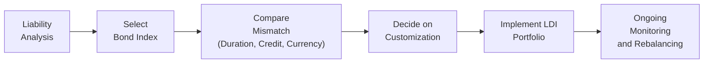

## Overview

Imagine, for a moment, that you operate a pension fund with obligations to retirees stretching out over the next 30 years. Your key concern is ensuring that the portfolio can meet those liabilities precisely when they come due—no more, no less. Sounds straightforward, right? In reality, figuring out how to handle the interplay between asset returns, liability cash flows, and the myriad risks that come with the fixed income space is no small feat. This is where Liability-Driven Investing (LDI) steps in, offering a systematic way to match the liabilities’ interest-rate sensitivity, credit risk dimensions, and maturity structure. Within an LDI framework, choosing the correct bond index to benchmark those investments is both the first step and a crucial one. 

Now, I remember working with a small insurance company that was absolutely fixated on the Bloomberg U.S. Aggregate Bond Index. They insisted that their liabilities were “basically in line with what the broad market looks like.” But about a year in, they noticed big mismatches in duration and sector exposures. That mismatch introduced an unexpected volatility in the surplus (assets minus liabilities). Over time, they realized that the broad-market index just wasn’t capturing their true liability profile. It was a complicated lesson, but it helped them understand that the right index can make or break an LDI strategy.

Below, we’ll look into the nuances of bond index selection—both the theoretical considerations and the practical, real-world constraints. We’ll cover why broad-market indexes may not suffice, how to tailor indexes to match liability cash flows, and what to do if you have exposure to multiple currencies or specialized types of liabilities.

## The Role of the Bond Index in an LDI Strategy

Before we get into the detailed selection process, let’s clarify how bond indexes fit into LDI:

• Benchmarking: The bond index typically serves as a performance and risk reference, guiding how well the portfolio is matching (or diverging from) its liability structure.  
• Construction Blueprint: The chosen index helps define the target duration, sector allocation, credit quality, and geographical exposure.  
• Risk-Return Profile: Effective LDI requires calibrating the portfolio’s risk-return profile to the liabilities’ requirements. That means the less your portfolio looks like your liability structure, the more risk you’re running that asset performance might deviate from future obligations.  
• Rebalancing Reference: If the benchmark changes, whether in duration or composition, it can drive portfolio rebalancing decisions, which can be costly. 

In simpler terms, if your liabilities act like a 20-year corporate bond, you might logically compare your portfolio to a 20-year corporate bond index, so you don’t inadvertently drift into, say, 5-year Treasuries or highly speculative high-yield bonds. Skewing away from the relevant index can be done strategically, but it needs careful scrutiny so you’re aware of additional risks.

## Matching Liability Characteristics

### Duration and Convexity Alignment

One of the most critical metrics in an LDI approach is duration. At a high level, duration indicates the sensitivity of a bond (or bond portfolio) to changes in interest rates. For an LDI-compatible benchmark, the goal is often to mirror the duration of the liabilities closely. If liabilities have a duration of 15 years, for instance, a benchmark with a roughly 15-year duration may allow your portfolio to respond similarly to interest rate shifts.

A simplified (though powerful) formula for portfolio duration is:


D_{\text{Portfolio}} = \sum_{i=1}^{N} w_i \times D_i


where:  
• \\( D_{\text{Portfolio}} \\) is the overall portfolio duration.  
• \\( w_i \\) is the weight of the i-th bond (or sub-portfolio).  
• \\( D_i \\) is the duration of the i-th bond.

Beyond duration (which measures the first-order sensitivity to interest rates), convexity adjustments can matter for large changes in interest rates. If the liabilities are highly convex (as with long-dated pension liabilities), you may need an index or combination of indexes that aligns well with that convexity profile.

### Credit Quality and Sector Composition

Suppose your liability structure doesn’t carry inherent credit risk—for example, certain pension obligations that are guaranteed and not linked to default events. Holding riskier corporate bonds might create unneeded credit risk in your LDI portfolio. In this scenario, a government (Treasury-focused) bond index could be more aligned with the overall risk structure of the liabilities.

On the other hand, if your liabilities are somewhat credit-linked—maybe your obligations themselves hinge on corporate survival or are somewhat sensitive to broader corporate credit conditions—then a corporate bond index, or at least a blend of government and corporate sectors, might be warranted. 

### Geographical or Currency Exposure

In an increasingly global financial world, some liabilities might be denominated in multiple currencies (e.g., a multinational corporation that owes pensions in USD, EUR, GBP). One broad-based bond index probably won’t capture all those exposures with the right weighting. You might find yourself layering multiple currency-specific indexes or a multi-currency global bond index, then hedging or partially hedging currency risk as appropriate.

## Potential Mismatch With Broad-Market Indexes

A prominent example is the Bloomberg U.S. Aggregate Bond Index, one of the most well-known broad-markets for U.S. bonds. While it’s a fantastic proxy for the “average” investment-grade bond market, it might differ greatly from certain liability profiles in:

• Duration: The U.S. Aggregate Index typically has a duration in the 6–7 year range, far shorter than many pension obligations.  
• Sector Mix: Roughly two-thirds might be government-related and securitized (e.g., mortgage-backed securities). Liabilities might require heavier corporate or municipal weighting.  
• Credit Quality: A broad index may contain large allocations to very high-grade instruments (AAA to A), leaving limited representation for certain credit exposures.

When your liabilities are more akin to 20-year corporate cash flows, you can see how a 6-year, government-heavy index might fail to align your duration and credit risk. 

### Long-Duration Indexes

If your liabilities extend 15 years or beyond, long-duration indexes (e.g., Bloomberg Long Credit Index) become an attractive option. These indexes hold bonds with longer maturities (often 10+ years), offering a higher duration that matches later-dated liabilities more snugly. The trade-off, of course, is volatility: long-duration instruments are more sensitive to interest rate movements, and that can cause bigger swings in portfolio values. In LDI, though, the goal is to match the liability swings—so bigger swings aren’t necessarily a con, provided they move in tandem with the liabilities.

### Custom Liability Benchmarks

Sometimes none of the standard indexes fits perfectly. In such cases, you might craft a custom liability benchmark reflective of the cash flow structure of the obligations. This can be complicated. You typically:

1. Project your liability cash flows.  
2. Determine the mix of bond durations and sectors that best replicate those future payments.  
3. Compile or design an index-based representation, with weights that reflect the liability profile.  

This approach can yield a near-perfect alignment, but rebalancing may be frequent and costly if the liability structure or market conditions shift quickly. Also, custom indexes can limit transparency or comparability against peer groups.

## Index Methodology: Weighting Schemes and Historical Stability

### Market-Cap Weighting vs. Alternative Weighting

A commonly used approach is market-cap weighting—bonds are weighted in the index in proportion to their total outstanding par value. That’s straightforward, but it can lead to scenarios where highly indebted issuers (governments or corporations) dominate the benchmark. If your liability structure doesn’t mirror that concentration, you’ll have a mismatch risk.

Alternative weighting, such as fundamental weighting (based on issuer size, revenues, or other fundamentals) or risk-based weighting (where the index is structured around factors like duration or spread risk), can sometimes provide a more stable or customized approach. For instance, if you require minimal credit concentration risk, you might adopt an index that caps exposure to individual issuers.

### Historical Stability and Rebalancing

Selecting an index with a proven track record of methodical rebalancing can be vital. Benchmarks that frequently remove or add securities might churn your portfolio’s composition. In LDI, minimal turnover is often ideal because you’re aiming to match stable obligations—frequent index turnover could result in trading costs and realized capital gains taxes (depending on the tax environment) that are inconsistent with a stable liability profile.

## Treasury-Focused vs. Corporate Bond Indexes

### Government or Treasury Indexes

If your liabilities have minimal credit risk (e.g., they’re legally guaranteed or linked to inflation rather than default), a Treasury-focused index can be appealing for the following reasons:

• Duration targeting: Government indexes often come in different maturity segments. You can choose short, intermediate, or long segments.  
• Credit risk alignment: If you don’t need extra credit risk, these indexes keep you relatively insulated from corporate default risk.  
• Liquidity: Treasury indexes typically track very liquid instruments, facilitating easier trades and lower bid-ask spreads.  

### Corporate Bond Indexes

If your obligations tie to broader corporate performance or carry some inherent corporate credit risk, selecting a corporate bond index might reduce mismatch. Keep an eye on sector exposures (e.g., financials, industrials, utilities) within the index to ensure you’re aligned with your liability structure. Credit rating distributions within these indexes can vary. A mismatch in credit quality can lead to undesired volatility in your surplus calculation.

## Cross-Currency Liabilities

### Multi-Currency Benchmarks

For institutions with obligations in multiple currencies, a global or multi-currency aggregate bond index can be the starting point. For example, some benchmarks combine global government and corporate bonds across developed (and sometimes emerging) markets. 

### Currency Hedging

Let’s say your main liabilities are in EUR, but you’re investing in a U.S.-dollar-denominated bond index. Currency fluctuations can overshadow interest rate or credit risk. Many liability-driven portfolios adopt currency hedging solutions—foreign exchange forwards, futures, or swaps—to eliminate unwanted currency exposure. The cost of hedging can vary, especially if interest rates differ widely between the home currency and the investment currency. Sometimes, you might only partially hedge if you desire some foreign currency exposure.

## Tracking Error and Customization Trade-Offs

### Balancing Index Fidelity and Liability Matching

Tracking error is basically the volatility of the difference in returns between a portfolio and its benchmark. In an LDI context, the more important concept might be “liability tracking error”: how well does your portfolio track the liabilities themselves? If a standard index doesn’t match your liabilities perfectly—different duration, different credit risk—your liability tracking error can be high, even if your official portfolio tracking error (relative to the standard index) is low. 

In other words, you could track a broad benchmark closely but still fail to meet your obligations. So, in many LDI strategies, the impetus is to reduce mismatch risk with the liabilities rather than simply reduce tracking error relative to a broad-market index.

### Rebalancing to Maintain Alignment

Over time, liabilities evolve, particularly as new participants enter or existing participants retire (in the case of pensions), or as the macro environment changes. Meanwhile, indexes also change constituents over time. More frequent rebalancing helps maintain close alignment, but it can increase transaction costs. Many institutional investors strike a balance—rebalancing either when significant duration or spread changes occur, or on a set schedule.

Here’s a simplified diagram illustrating the general thought process:

## Practical Considerations and Best Practices

• Conduct a thorough liability cash flow analysis: If you skip a detailed projection, you could end up with the wrong index or the wrong custom benchmark.  
• Mind liquidity: Even if you find a perfect duration match in a niche market, a lack of liquidity can spike trading costs or hamper your ability to rebalance.  
• Evaluate issuer concentration: If an index is heavily weighted toward a small group of issuers, you might inadvertently increase credit concentration risk.  
• Cross-reference to other chapters: For example, in “4.3 Managing Interest Rate Risk Under Different Yield Curve Scenarios,” you’ll learn how yield curve shifts can affect your chosen benchmark. Meanwhile, “4.6 Incorporating Credit Risk in Liability‑Driven Portfolios” can complement this discussion by drilling deeper into credit analysis.  
• Keep it simple if possible: Overly complex solutions can be tricky to manage, and operational burdens can compound in volatile markets.  

## Personal Take: 
I’ve seen folks over-engineer their LDI benchmarks to the point that no one but the lead portfolio manager truly understood the structure. Then, when that manager left, the rest of the team was scratching their heads. My best advice? Aim for clarity and repeatability. If your liabilities are extremely specialized, by all means create a custom benchmark—but also ensure that it’s well-documented, easy to communicate, and cost-effective to maintain.

## Exam Tips and Common Pitfalls

• Focus on the logic behind index selection. The CFA exam often asks scenario-based questions: “Given these liabilities, which index is most appropriate and why?” Be prepared to articulate your reasoning, specifically tying the liability characteristics (duration, credit, currency) to your index selection.  
• Understand the trade-offs of a custom benchmark. Yes, it can reduce mismatch risk, but weigh that against higher rebalancing costs and lower transparency.  
• Incorporate Rebalancing Triggers. If you do pursue a custom benchmark, be able to discuss how frequently you’d rebalance and how you’d handle major market or liability changes.  
• Don’t ignore currency risk. If the liabilities differ in currency from the chosen index, highlight how you’d handle hedging.  
• Beware of superficial mismatch. A broad-market index might keep your portfolio “vanilla,” but it won’t necessarily shield you from mismatch risk if your obligations are nuanced.

As with most LDI topics, the exam can push you to explore “why” behind each decision. Memorizing definitions won’t be enough—demonstrating understanding of the interplay between bond market mechanics and liability characteristics is critical.

## Final Advice for the Exam

• When constructing a short-answer or essay-style response, show the cause-and-effect relationship: “Because the liabilities have a duration of 10+ years, the broad-market index is too short. Therefore, a long-duration index better aligns interest rate exposures.”  
• Remember to connect your approach to risk management frameworks. Unwarranted mismatch risk can cost a plan dearly.  
• Allocation among government, corporates, and possibly inflation-linked bonds can be tested, so know how to justify each based on liability specifics.  
• Time management: In the essay portion, set aside enough time to explain your rationale. Don’t just state “use a corporate index” without explaining the liability-linked credit risk.  

## References

• CFA Institute. (2025). “2025 Level III Curriculum—Asset Allocation.”  
• Antti Ilmanen. (2011). “Expected Returns.” Sections on bond market benchmarks and mismatch risks.  
• Bloomberg Indices. “Index Methodology Guides.” (bloombergindices.com)  
• Morningstar. (n.d.). “How Bond Indexes Are Designed.”

--------------------------------------------------------------------------------

## Test Your Knowledge: Bond Index Selection for LDI



### A plan sponsor with a 20-year average liability duration is using the Bloomberg U.S. Aggregate Bond Index (AVG duration = ~6 years). Which of the following is the greatest risk they face?

- [ ] Excess credit risk relative to liabilities.
- [x] Significant interest rate mismatch.
- [ ] Lack of applicable historical data.
- [ ] Excess currency exposure.

> **Explanation:** The broad-market index has a duration of about 6 years, while the liabilities have ~20 years. The biggest issue is a duration mismatch, exposing the sponsor to interest rate risk.

### An institution with minimal credit risk on its liabilities wants to hedge interest rate risk exclusively. Which type of bond index is generally most appropriate?

- [x] Treasury-focused index that matches liability duration.
- [ ] High-yield corporate bond index.
- [ ] Multi-currency global index.
- [ ] Senior loans index with floating rates.

> **Explanation:** If the liability doesn’t have credit risk, a Treasury-focused index is most aligned, ensuring minimal credit mismatch. Matching duration is also critical.

### A custom liability benchmark is most beneficial when:

- [x] The liability structure differs significantly from common broad-market indexes.
- [ ] The liabilities are short-term and highly liquid.
- [ ] The plan sponsor desires simpler performance comparisons.
- [ ] The sponsor wants the broadest exposure possible.

> **Explanation:** Custom benchmarks are typically designed when off-the-shelf indexes don’t align well with liability profiles. They’re especially helpful for unique or long-dated liabilities.

### An index with a high weighting in long-term corporate bonds would be most appropriate for:

- [ ] A pension plan with short-dated obligations.
- [ ] A short-term operating cash flow reserve.
- [x] A pension with 25-year average duration and some credit risk exposure.
- [ ] A sponsor with no credit risk at all in liabilities.

> **Explanation:** Long-term corporate bonds can align with extended-dated liabilities—particularly those that carry some corporate credit sensitivity.

### Which statement correctly compares the goal of minimizing portfolio tracking error vs. minimizing liability mismatch?

- [ ] They are always the same objective.
- [x] Minimizing portfolio tracking error doesn’t necessarily reduce liability mismatch.
- [ ] Minimizing liability mismatch always increases portfolio tracking error.
- [ ] They have no relationship and are considered independently.

> **Explanation:** A low tracking error relative to an index might not mean the liabilities are adequately hedged if that index differs from the liability characteristics.

### A sponsor with multi-currency liabilities is selecting a bond index. Which step is most critical?

- [ ] Using only the domestic bond index to reduce transaction costs.
- [ ] Avoiding currency hedges to prevent cost drag.
- [x] Choosing a multi-currency or combination approach, then evaluating currency hedging.
- [ ] Selecting the broadest global index and letting currency risk remain.

> **Explanation:** With multi-currency liabilities, it’s essential to match currency exposures via a global or multiple local indexes, and often incorporate currency hedging for precision.

### Which of the following is least likely to impact the frequency of index rebalancing for an LDI portfolio?

- [ ] Liability cash flow changes.
- [ ] Major shifts in interest rates.
- [x] The fund manager’s personal preference for a stable portfolio.
- [ ] Significant credit rating changes of index constituents.

> **Explanation:** Index rebalancing is typically driven by liability changes, rate shifts, and credit events. A manager’s personal preference alone is rarely a valid driver.

### If you have a constant stream of long-term inflation-linked liabilities, which index is most relevant?

- [ ] A short-duration Treasury index.
- [ ] A corporate bond index without inflation protection.
- [x] An inflation-linked government bond index (e.g., TIPS).
- [ ] A money market index.

> **Explanation:** Inflation-linked liabilities are best served by an inflation-linked bond index, like TIPS, matching both duration and inflation sensitivity.

### One main drawback of a custom liability-based index is:

- [ ] It automatically reduces mismatch risk.
- [ ] It simplifies peer comparison.
- [ ] It reduces trading costs.
- [x] It may require frequent and potentially expensive rebalancing.

> **Explanation:** While a custom index can reduce mismatch risk, it often needs frequent updating to track changing liabilities, which can be costly.

### True or False: Market-cap weighting can create concentration risk if certain issuers or sectors have large amounts of outstanding debt.

- [x] True
- [ ] False

> **Explanation:** If an issuer has a large amount of debt, market-cap weighting will tilt the index heavily toward that issuer or sector, creating potential concentration risk.


