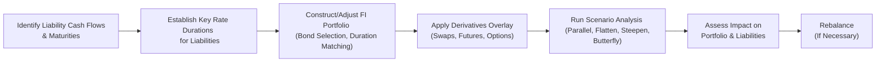

## Introduction

Sometimes, when I first started working with fixed income portfolios—way back in my early days at a small asset management firm—I would glance at the yield curve movements and think, “Well, how complicated can this be?” I found out pretty quickly that it’s often more complicated than you’d hope. You may have a portfolio that’s carefully crafted to match the overall duration of your liabilities. Then the yield curve flattens or steepens in ways you didn’t predict, and suddenly your well-laid plans need to be re-examined.  

Anyway, I’m sure many of you can relate to that feeling of seeing your positions behave differently than expected just as rates move in ways you didn’t anticipate. In this part of our discussion on Liability-Driven and Index-Based Fixed Income Strategies, we’ll take a deep dive into managing interest rate risk under various yield curve scenarios. Our aim is to help you build portfolios that can weather these shifts and still meet liability-matching goals.  

## Why Yield Curve Movements Matter for Liability-Driven Investing

A liability-driven approach to fixed income means your primary focus is on ensuring that your portfolio aligns with future cash obligations. For most institutional investors—like pension funds, insurance companies, or endowments with fixed payout schedules—this is a big deal. Liabilities often have specific timing and present-value sensitivities to interest rates. A mismatch between the portfolio’s sensitivity to rate changes and that of the liabilities can prove disastrous for funding status.

When we talk about the yield curve, we’re essentially looking at how bond yields (or rates) vary with maturity. Different yield curve scenarios can alter the portfolio’s value relative to the present value of liabilities. Getting it wrong might mean big deviations from your targeted funding levels.

## Common Yield Curve Movements

Yield curves rarely move in unison across all maturities, but textbooks often describe four “classic” types of movements:

• Parallel Shifts  
• Flattening  
• Steepening  
• Butterfly Shifts  

Let’s examine each briefly and see why it’s so crucial for liability-driven portfolios.

### Parallel Shifts

In a parallel shift scenario, the entire curve moves up or down by the same number of basis points. If the yield curve rises 50 basis points (bps) across every maturity from short-term to long-term, that’s called an upward parallel shift. Conversely, a 50 bps drop across the curve is a downward parallel shift.

The good news: if your portfolio and your liabilities have the same effective duration, a perfectly parallel shift might leave your net position mostly unchanged. The bad news: yield curves don’t always move so uniformly.  

### Flattening

Flattening means shorter-maturity yields rise relative to longer-maturity yields, or the long end falls relative to the short end, compressing the slope. Flattening can happen because investors anticipate tighter monetary policy in the short run, or because of flight-to-quality dynamics on the long end.  

From an LDI perspective, flattening often implies that shorter-duration liabilities will require higher discount rates compared to longer-duration liabilities, potentially altering the present value of near-term obligations more dramatically than the long-term ones.  

### Steepening

In a steepening scenario, the opposite occurs. Long-term yields rise relative to short-term yields, or short-term yields fall relative to long-term yields. This scenario’s distinct effect on liabilities depends on where the bulk of your cash flows reside. Steepening can mean the portion of your liability stream that is longer term may become heavily discounted (due to higher yields) compared to near-term liabilities.

### Butterfly Shifts

Butterfly shifts (sometimes called a “bowing” of the yield curve) occur when the short and long ends of the yield curve move in one direction, while the intermediate section moves in another. For example, short and long rates might go up, while the middle portion goes down. Depending on where you have concentrated your bond exposures, you may see surprising results in performance.  

For institutions that rely heavily on intermediate maturities (maybe you have a big slug of liabilities expected in 6–10 years), butterfly shifts can cause material mismatches if your portfolio wasn’t prepared for them.

## Key Rate Durations (Partial Durations)

Key rate duration is a concept that addresses this intricacy directly. Rather than looking solely at the overall duration, we break down the portfolio (and liabilities) into how sensitive they are at specific maturities along the curve. Let’s see how it works in practice:

Say you have a portfolio holding:  
• 30% in a 5-year bond,  
• 40% in a 10-year bond, and  
• 30% in a 20-year bond.

A single measure of “duration” lumps these together into one average though they’re quite different instruments. Key rate (or partial) durations examine how each portion of the portfolio reacts if yields at a particular maturity bucket (e.g., the 2-year, 5-year, 10-year, 20-year points) move by, let’s say, 25 bps while other maturities remain unchanged.

By matching these partial durations to the partial durations of your liabilities, you can hedge more precisely against flattening, steepening, and butterfly shifts. For instance, if your liabilities are especially sensitive around the 10-year point, you might want to ensure you have matching partial duration in the portfolio.  

### Matching Key Points on the Curve

Think of it like a puzzle. Your liability profile might be heavily weighted in the short term (like a pension plan anticipating big payouts over the next five years for a wave of retirees), or maybe it’s heavily weighted in the 15–20 year region (like an insurance company offering long-dated annuity products). By using a more targeted approach, you can “lock in” immunization at the intervals that matter most.

## Classic Techniques for Interest Rate Risk Management

### Duration Matching

Duration matching, at its simplest level, attempts to align the overall (modified or effective) duration of the portfolio with that of the liabilities. In an ideal world, if a purely parallel shift happens, the portfolio value and liability value would move in tandem. But in reality—even if you get the overall duration perfect—non-parallel moves might cause a mismatch.

Sometimes, practitioners describe this approach as the “first line of defense.” It is necessary, but it might not be fully sufficient for all yield curve scenarios.

### Key Rate (Partial) Duration Matching

Key rate duration matching takes it to the next level by focusing on multiple maturities. Instead of aligning one “single number” for portfolio duration, you align the portfolio’s exposure at each major point (or set of points) along the yield curve to the liability’s exposure at those points.  

This approach is more complicated because you need either:  
• A well-diversified bond portfolio that can be fine-tuned to match partial durations, or  
• Derivative overlays that let you adjust exposures quickly.

### Derivatives Overlays

Let’s say your liabilities are strongly sensitive over the 10-year maturity point, but the rest of your portfolio is pretty well aligned. Instead of rebalancing your physical bond positions significantly (which could be costly), you might implement an interest rate swap overlay.  

• If you need additional 10-year rate exposure, you might enter a pay-floating/receive-fixed swap positioned around the 10-year maturity point.  
• If you have too much 5-year exposure, you might do the opposite.  

Interest rate futures and options can serve similarly if you’d rather position or hedge around certain segments of the curve.  
 
Derivatives overlays are especially valuable for large, complex portfolios matching complicated liability streams. Tweak those exposures with less friction—and fewer transaction costs—than selling a big slug of existing long-term bonds and buying short-term bonds (or vice versa).

## Scenario Analysis and Stress Testing

Scenario analysis is the backbone of LDI risk management. You can do a “what if” for each potential yield curve shape. For instance:  

• +50 bps parallel shift  
• +25 bps short-end with no change in the long-end (flattening)  
• -25 bps short-end with +25 bps long-end (steepening)  
• Butterfly scenario: +20 bps short- and long-end, -10 bps in the middle  

And so on. For each scenario, recalculate:  
1. The new value of your fixed-income portfolio.  
2. The new present value of your liabilities (discounting future cash flows at the new rates).  
3. The net effect on your surplus or funded ratio.  

Stress testing is a more extreme version of scenario analysis. For instance, you might test a 100 or 200 bps movement in certain segments, or a reversion to an inverted curve, or a scenario reminiscent of a historical meltdown (like 2008) to see how robust your current positioning might be under intense market pressures.  

## Multi-Currency Yield Curve Management

Things get a whole lot more complex when you or your liabilities extend beyond a single currency. You’ll need to track different yield curves across currencies—like USD, EUR, GBP, or JPY—and each currency’s unique discount factors for liability valuations.  

Then you might have to manage cross-currency basis swaps, currency forwards, or futures to ensure consistency with your liability currency exposures. If your liabilities are, say, 50% USD-based, 30% EUR-based, and 20% GBP-based, you must ensure that each portion of your portfolio aligns with the relevant yield curve for that currency.

## Bringing It All Together with a Diagram

Here’s a simple Mermaid diagram showing how a portfolio manager might integrate yield curve scenario analysis with liability-driven objectives:

The workflow is: (1) figure out your liabilities, (2) measure their sensitivity (duration) at key points, (3) build or adjust the portfolio, (4) apply derivatives if needed for fine-tuning, (5) run scenario analysis, (6) measure new outcomes, and (7) rebalance or refine. Then the cycle repeats as markets or liability profiles change.

## Practical Example: Pension Fund That Prioritizes Medium-Term Liabilities

Let’s take a hypothetical example to illustrate everything we’ve just covered:

• A mid-sized pension fund expects a significant wave of retirements in 8–10 years. So, a large chunk of liabilities is centered around the intermediate portion of the curve.  
• After analyzing the liability stream, the fund manager identifies that the liability’s 8–10 year partial duration is twice as high as the rest of the curve combined.  
• The manager invests in a combination of 5-year, 10-year, and 15-year Treasuries (and corporate bonds for yield pickup) to keep the overall portfolio duration aligned with liabilities.  
• But the manager also implements a receive-fixed interest rate swap at the 7-year point to really fine-tune the exposure there.  

When the yield curve undergoes a small flattening (where short-term rates rise), the portfolio remains less affected. At the same time, if there’s a butterfly shift that affects the 5- to 10-year segment more aggressively, the manager has the right overlay in place to hedge intermediate maturities better.  

## Best Practices and Common Pitfalls

• Regular Calibration: Liability profiles evolve as time passes (people get older, corporate actions change, new regulations appear). Make sure you revisit partial durations as needed.  
• Over-Reliance on a Single Scenario: Don’t just fixate on parallel shifts. In practice, flattening, steepening, or butterfly moves can happen.  
• Neglecting Execution Costs: Derivatives can be cost-effective, but watch out for bid-ask spreads, margin requirements, and rollover costs.  
• Ignoring Cash Flow Timing: Focusing purely on durations can sometimes obscure real-world liquidity needs if a portion of your liabilities must be paid out earlier than planned.  
• Lack of Stress Testing: Sure, normal scenario analysis is crucial, but you also want to see how your approach handles extreme events.  

## Final Exam Tips

• Linking Duration to Liability Cash Flows: Be ready to demonstrate how to match durations or partial durations effectively with liability schedules.  
• Scenarios and Surplus Analysis: Expect exam questions that require you to show how a given yield curve change affects both assets and liabilities.  
• Derivatives Understanding: Swaps, futures, and options can all be used to shape or reshape yield curve exposure quickly. You’ll want to be prepared to outline or calculate how these overlays function.  
• Key Rate Duration vs. Regular Duration: The exam often focuses on partial durations to test whether you can handle non-parallel shifts.  
• Communicating the Strategy: Be prepared to explain to a hypothetical client or board how scenario analysis demonstrates the strength of your approach.

## References

• Tuckman, B., & Serrat, A. (2011). “Fixed Income Securities: Tools for Today’s Markets.” Chapters on yield curve strategies.  
• CFA Institute. (2025). “2025 Level III Curriculum—Derivatives and Risk Management.”  
• Journal of Fixed Income, various articles on partial duration and LDI scenario analysis.

## Test Your Knowledge: Managing Interest Rate Risk Under Different Yield Curve Scenarios



### When implementing a key rate duration approach, which of the following is the primary benefit compared to a single overall duration measure?

- [x] Greater precision in hedging non-parallel shifts.  
- [ ] Lower transaction costs in all scenarios.  
- [ ] Reduced liquidity in the short end of the curve.  
- [ ] Elimination of rebalancing requirements when rates shift.  

> **Explanation:** Key rate duration focuses on sensitivity at specific maturities, making it more effective in responding to flattening, steepening, and butterfly yield curve shifts.

### In a steepening yield curve scenario, which portion of the yield curve generally increases more significantly?

- [ ] Short-term yields.  
- [x] Long-term yields.  
- [ ] Intermediate-term yields.  
- [ ] All maturities move uniformly.  

> **Explanation:** A steepening curve typically means yield increases are more pronounced at longer maturities relative to shorter ones.

### Which statement best describes a butterfly shift?

- [ ] Short and intermediate yields move identically, while long yields remain unchanged.  
- [x] The yield curve’s short and long ends move in one direction, while the middle moves differently.  
- [ ] Rates along the whole curve move by a fixed basis point amount.  
- [ ] The yield curve experiences a random fluctuation in credit spreads.  

> **Explanation:** A butterfly shift is characterized by opposite yield movements in the short and long ends relative to the middle segment.

### Why might a pension fund heavily reliant on intermediate-term liabilities choose to employ interest rate swaps?

- [x] To more precisely match partial duration exposures in the 7- to 10-year segment.  
- [ ] To guarantee zero cost over the life of the liability.  
- [ ] To eliminate all interest rate risk across all maturities.  
- [ ] To comply with short-term regulatory capital rules.  

> **Explanation:** Swaps are often used for fine-tuning exposure along the yield curve. If liabilities are concentrated in the 7- to 10-year space, swaps can align that particular partial duration.

### Scenario analysis in LDI typically includes which of the following?

- [x] Projecting portfolio and liability values under multiple yield curve assumptions.  
- [ ] Only upward parallel shifts of 200 basis points.  
- [x] Considering flattening, steepening, and butterfly shifts.  
- [ ] No variations in discount rates for liabilities.  

> **Explanation:** Scenario analysis is all about testing different yield curve movements (including non-parallel moves) and seeing how both the portfolio and liabilities change under those conditions.

### In a flattening yield curve environment, what happens to the slope of the curve?

- [x] The slope decreases because shorter-term yields rise (or fall less than long-term yields).  
- [ ] The slope increases due to a parallel upward shift.  
- [ ] The slope remains unchanged.  
- [ ] The slope becomes negative only at the short end.  

> **Explanation:** A flattening typically occurs when the shorter maturities increase faster than the long maturities or the long end decreases. Thus, the slope from short to long shortens.

### Which of the following accurately reflects the workflow when using partial durations in an LDI strategy?

- [x] Identifying key rate durations of liabilities -> Constructing or adjusting fixed-income portfolio -> Running scenario analyses -> Rebalancing if needed.  
- [ ] Identifying only overall duration of liabilities -> Eliminating derivative usage -> Testing no alternative scenarios.  
- [x] Considering derivative overlays for precise alignment.  
- [ ] Assuming a single scenario for the entire investment horizon.  

> **Explanation:** Proper partial duration matching involves measuring the liabilities’ sensitivity across maturities, tailoring the portfolio (with potential derivative overlays), and then stress testing or rebalancing as needed.

### If short-term rates rise by 30 bps while long-term rates fall by 10 bps, which yield curve movement is most representative of this phenomenon?

- [x] Flattening scenario.  
- [ ] Parallel shift.  
- [ ] Butterfly shift.  
- [ ] Liquidity-driven curve inversion.  

> **Explanation:** An increase in short-term rates with a decrease (or smaller increase) in long-term rates effectively flattens the slope, commonly referred to as a flattening scenario.

### Which statement about multi-currency yield curve management is correct?

- [x] It often requires cross-currency basis swaps and careful tracking of different yield curves.  
- [ ] It only involves adjusting domestic portfolios for foreign currency risk.  
- [ ] It is simpler than single-currency yield curve positioning.  
- [ ] It involves matching durations exclusively to the domestic risk-free rate.  

> **Explanation:** Managing yield curve risk across multiple currencies can be quite complicated, necessitating cross-currency swaps and knowledge of diverse yield environments.

### In stress testing for an LDI portfolio, which of the following statements is generally TRUE?

- [x] Stress testing uses extreme hypothetical or historical scenarios to identify vulnerabilities.  
- [ ] Stress testing assumes all future yield curve movements remain minimal.  
- [ ] Stress testing is optional and rarely adds additional insight.  
- [ ] Stress testing eliminates the need to measure partial durations.  

> **Explanation:** Stress testing is specifically designed to see how the portfolio performs under severe or historically rare changes, thereby revealing potential weaknesses.


