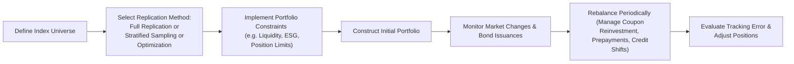

Introduction  
Sometimes, when I chat with fellow investors about bond index investing, I like to admit that it took me a long time to fully appreciate just how intricate these portfolios can be. I remember once trying to replicate a fairly broad government bond index for a small institutional client and thinking, “Oh, well, let’s just buy every bond. Problem solved!” But I soon realized that the bond market’s labyrinthine nature—constantly shifting liquidity, new issuances, and those pesky prepayment quirks—makes “just buy everything” more challenging than it sounds. In the preceding sections, we explored how bond portfolios fit into liability-driven approaches. Here, we shift focus to constructing index-based bond portfolios and making them work in practice.

Key Considerations in Bond Index Construction  
Bond indexing sounds straightforward in theory—just replicate a benchmark and reap the returns. But in reality, bond markets can complicate everything from your day-to-day trading costs to how you manage credit risk. For instance, while equity indexes might rebalance quarterly, bond benchmarks may face monthly rebalancing plus constant new issuance. This constant influx of bonds and changes in the outstanding pool can make indexing a dynamic masterpiece rather than a static painting. Also, not all bonds trade frequently, so the illiquid corners of the market can come with wider bid–ask spreads, hampering your ability to trade at favorable prices.

Moreover, bond indexes are typically quite large, holding thousands of securities covering multiple maturities, credit qualities, and sectors (treasuries, mortgage-backed securities, corporates, asset-backed securities, and more). Trying to mirror all of those positions in a single portfolio can become a logistical and cost nightmare, especially if you’re dealing with smaller allocations. Think about it: you might have to buy a fraction of a million-dollar bond issuance. That’s just not so easy in the real world.

Full Replication in Bond Portfolios  
Full replication is the process of holding every single bond in the benchmark index in the exact proportion as the index weighting. Conceptually, this approach delivers the smallest theoretical tracking error against the benchmark—because, well, you physically own each piece of the puzzle. But in practice, it can be a huge undertaking:

• Liquidity and Trading Costs. Some bonds trade once a week or even less frequently. If a bond is illiquid or trades at a large spread, including it in your portfolio might cause substantial transaction costs. Meanwhile, certain securities from small or older issues can be nearly impossible to acquire at a fair price.  
• Large Universe Size. Think about a broad U.S. bond index with thousands of securities. If your portfolio is not enormous, you’ll still have to wade through hundreds (or thousands) of line items, each requiring custodial and operational overhead.  
• Frequent Rebalancing. Since bond indexes can turnover monthly, you’ll find yourself needing to rebalance more often, increasing transaction frequency and possibly taxes.  

Despite those challenges, full replication can be a viable strategy for very large institutional asset managers who have the scale to handle specialized trading desks, large custody networks, and direct relationships with primary dealers. They might be able to negotiate better spreads and handle big rebalancing efforts. But let’s be honest: if you’re advising a mid-sized or smaller institution or a large retail fund, full replication might not make sense.

Stratified Sampling  
Stratified sampling is the middle ground between “own everything” and “own just a handful.” The idea is to break the index down into sub-portfolios that match key exposures of the index. For instance, you might divide the index into duration buckets (e.g., 0–3 years, 3–7 years, 7–10 years, and so on), credit-quality sectors (investment grade vs. high yield), or perhaps sub-sectors like mortgage-backed securities (MBS) vs. government debt. The manager then chooses representative bonds within each bucket, aiming to replicate the broad risk factors of the index:

• Reduced Complexity. By focusing on representative bonds, a stratified sampling approach drastically cuts the number of positions. Maybe instead of 2,000 bonds, you hold 200.  
• Manageable Costs. Fewer trades and less rebalancing effort can minimize transaction costs.  
• Potential Tracking Error. Stratified sampling can lead to deviations if your chosen representative bonds move differently than what’s in the index. For example, you might hold a corporate bond with slightly different call features than the typical bond in that sector.  

There’s an art to deciding how granular to get. Too few buckets and you risk big mismatches vs. the index. Too many, and you’re edging closer to full replication. It can feel a bit like walking a tightrope.

Optimization  
If stratified sampling is an art, then portfolio optimization can feel like both an art and a science experiment rolled into one. With optimization, you rely on quantitative models that try to match the index’s factor exposures—e.g., duration, credit spreads, sector weights, convexity, and more—while simultaneously minimizing expected tracking error. You typically start with a risk model that measures how much any given bond or bond sector might move relative to the overall index. Then you set constraints:

• Liquidity constraints, ensuring you don’t load up on illiquid bonds.  
• Maximum single position sizes, to ensure diversification.  
• ESG requirements, if your client or mandate excludes certain issuers or industries.  
• Sector constraints, so you don’t overweight or underweight a major portion of the index by too large a margin.  

The optimizer then spits out an “ideal” portfolio designed to track the index as closely as possible, subject to your constraints. That said, optimization models hinge on assumptions. Garbage in, garbage out. One major risk is that the model might rely on historical relationships that change over time—especially during market stress, when correlations can spike or shift unpredictably. So, it’s crucial to stress test your optimizer’s outputs, regularly update factor exposures, and watch for model drift as new bonds come into the market.

Managing Tracking Error  
Even after selecting your replication method, you’ll likely worry about tracking error. Bond indexes can shift around for several reasons:

• Credit Rating Changes. If large companies get upgraded or downgraded, your portfolio exposures might differ from the index’s new credit distribution.  
• Prepayments and Call Features. Mortgage-backed securities and callable corporate bonds might pay back principal earlier than anticipated, especially if interest rates drop. This can cause you to hold “extra” cash while the index is still holding the mortgages or bonds—leading to mismatch.  
• Unexpected Cash Flows. Reinvestment of coupon payments (not to mention principal if you have MBS) can cause your portfolio’s duration to drift. A big chunk of un-invested coupon cash can lead to an underexposure to interest rates unless you quickly reinvest or use derivatives.  

Often, managers employ a “cash equitization” strategy—basically using bond futures, interest rate swaps, or forward rate agreements to keep leftover cash from hurting your index alignment. If your benchmark is, say, a U.S. Treasury index, you could purchase futures on Treasuries to replicate that exposure. That way, you don’t lose ground while searching for the exact security to purchase.

I recall a time when I forgot to equitize coupon cash for a small client—well, it wasn’t a total catastrophe, but the performance lagged, and we had a conversation about “missing out” on an uptrend in bond prices. Execution matters a lot in indexing, so little operational oversights can lead to significant drags on returns.

Mortgage-Backed Securities and Other Complex Instruments  
Many bond indexes include mortgage-backed securities (MBS) and asset-backed securities (ABS), which can exhibit prepayment risk. If interest rates drop, homeowners tend to refinance, leading to higher prepayments on mortgage-backed pools. That means you get an earlier-than-expected return of principal, while the index might be rebalanced in a way that invests differently than your immediate reinvestment.  

Plus, many MBS instruments have unique pooling structures, and they may not be standardized or as liquid as Treasuries. That can cause trades in MBS to be more expensive or slow to settle. Likewise, you may see frequent new issuance from government agencies or GSEs (Government-Sponsored Enterprises). The upshot? Constant vigilance. As an index-based manager, you need to keep an eye on each bond’s call date, coupon reset features, or extension risk, so you don’t inadvertently create big mismatches vs. the index.

ESG Constraints and Customization  
In the modern era, it’s increasingly common to hear: “Our clients want an ESG tilt or an exclusion list.” Bond indexing with ESG constraints might mean you exclude bonds from certain industries or limit your exposure to issuers with questionable sustainability practices. That’s great from a social or environmental perspective, but it can cause tracking error to widen if those industries or issuers happen to be a large chunk of the benchmark. So, many asset managers build custom ESG bond indexes or contract with index providers who handle it. Another approach is to overlay negative screens or best-in-class selection on top of the standard replication strategies.

I’ve personally worked on a custom ESG bond index that excluded certain fossil-fuel heavy companies. The challenge was that the original index weighting in that sector was quite large, so we ended up needing to overweight other industries to maintain duration and yield. The result? A slightly higher tracking error. But the client was happy to align their investments with their values, so it was worth it. 

Practical Example: The Implementation Process  
Let’s imagine a scenario: You’re managing a fund that wants to replicate the Bloomberg U.S. Aggregate Bond Index. This index boasts thousands of securities across Treasuries, agencies, mortgage-backed products, corporates—some liquid, some less so. You decide pushing for full replication is unfeasible given the portfolio’s size. Instead, you opt for a combined approach: stratified sampling for the core government and corporate allocations, plus an optimization overlay that targets MBS and ABS exposures precisely. You:

• Create sub-portfolios for Treasuries, corporate investment-grade bonds, and MBS.  
• Within each sub-portfolio, use factor modeling (duration, spread duration, convexity, etc.) to choose representative securities—balancing liquidity with index coverage.  
• Apply constraints around maximum exposure to illiquid corporate bonds and also incorporate an ESG screen that excludes certain high-emission issuers.  
• For the MBS portion, use an optimization model that tries to match the index’s key-rate durations and prepayment characteristics, focusing on TBAs (To-Be-Announced MBS) for liquidity.  
• Once everything is purchased, set up a process to sweep new coupons into short-term instruments or equitize them with bond futures during monthly rebalancing.  

Over time, you measure tracking error using a formula such as


\text{Tracking Error} = \sqrt{\frac{1}{T}\sum_{t=1}^{T}(R_{p,t} - R_{b,t})^2},


where \\( R_{p,t} \\) is the portfolio return in period \\( t \\), \\( R_{b,t} \\) is the index return for the same period, and \\( T \\) is the total number of periods observed. By closely monitoring changes in interest rates, credit spreads, or prepayment rates, you can identify sources of deviation and refine your holdings accordingly.

A Visual Representation  
Here’s a simple Mermaid diagram to show how these strategies come together in an index-based bond portfolio. It’s not an overly complex flowchart—just a snapshot of how a manager might go from selecting an index replication method to rebalancing the portfolio.

In practice, each stage is iterative and will involve more detailed sub-steps, especially for MBS risk management or advanced optimization constraints.

Best Practices and Pitfalls  
• Stay on Top of Issuer Events. A downgrading from AAA to BBB can transform a hold-or-sell decision. If the index reclassifies the bond, you might have to reclassify it quickly as well.  
• Prepayment Modeling. If you’re holding MBS, use robust models (and perhaps stress test them) so you can anticipate the need for reinvestment or consider capturing a premium.  
• Technology Investment. Bond indexing can be data-intensive, especially if you’re optimizing or have large, global coverage. Good data feeds and analytics software can pay for themselves quickly by preventing errors.  
• Trading Relationships. Building strong relationships with primary dealers and multiple counterparties can reduce transaction costs, especially when you’re dealing with less liquid credits.  
• Custom Benchmarks. If you have an ESG or custom filter, watch out for the possibility that your custom index might deviate from mainstream indexes in ways you didn’t anticipate—like different sector weights or durations.

Exam Tips  
When facing exam questions about constructing index-based bond portfolios, you might get scenario-driven prompts like, “You run a $300 million bond strategy wanting to track the Bloomberg U.S. Aggregate with minimal costs. Evaluate the pros and cons of full replication vs. stratified sampling.” Or perhaps you’ll be asked to propose a method to handle prepayments in MBS. Remember to:

• Address practical constraints (like liquidity and trading costs).  
• Discuss how to manage or reduce tracking error.  
• Recognize the complexities unique to bonds (calls, prepayments, coupon reinvestment).  
• Consider the impacts of ESG overlays on tracking error.  

For constructed-response questions, structure your answer so each step references a risk or factor relevant to the question. For instance, if you see “the manager wants an ESG screen,” highlight that restricting certain issuers might lead to increased tracking error. Show you understand how to mitigate that risk—e.g., by rotating to alternative industries with correlated price movements.

References  
• Fabozzi, F. J. (ed.). “Bond Portfolio Management,” chapters on index replication.  
• CFA Institute. (2025). “2025 Level III Curriculum—Portfolio Construction.”  
• BlackRock. (n.d.). “Index Investing in Fixed Income: A Guide to Bond Index Construction.”

Test Your Knowledge: Constructing Index‑Based Bond Portfolios



### A fixed-income manager wants to replicate a broad investment-grade bond index but is concerned about high transaction costs and illiquid securities. Which replication strategy would likely be the most suitable?

- [ ] Full replication
- [x] Stratified sampling
- [ ] Traditional buy-and-hold
- [ ] Equitizing bond futures

> **Explanation:** Stratified sampling reduces the number of holdings by selecting representative bonds within each major sector and duration bucket. This approach is often best for minimizing transaction costs and dealing with illiquid securities while maintaining reasonable tracking.

### Which of the following is a key advantage of full replication in bond indexing?

- [x] Minimizes tracking error by holding every bond in the index
- [ ] Requires very little data and analytical support
- [ ] Completely eliminates liquidity risk
- [ ] Negates the impact of new bond issuances

> **Explanation:** Full replication tends to produce the lowest theoretical tracking error because all index securities are held in proportional weights. It does not eliminate liquidity risk or the challenges posed by constant new issuance.

### A manager employing bond index optimization sets constraints on maximum issue size, credit exposure, ESG criteria, and liquidity thresholds. What is the primary goal of adding these constraints?

- [x] To balance low tracking error with realistic portfolio construction limits
- [ ] To avoid capturing the benefits of index movements
- [ ] To guarantee zero tracking error
- [ ] To ensure only one bond is held

> **Explanation:** In an optimization process, these constraints ensure the resulting portfolio is both representative of the index and practical to implement, striking a balance between tracking precision and real-world limits like ESG criteria or liquidity.

### In an index-based bond portfolio, which risk is significantly amplified by mortgage-backed securities?

- [ ] Extension risk
- [x] Prepayment risk
- [ ] Yield curve risk
- [ ] Default risk from AAA-rated Treasuries

> **Explanation:** MBS instruments carry significant prepayment risk because homeowners can refinance their mortgages, altering the timing of principal payments and impacting cash flow.

### A bond index is rebalanced monthly, and an investor is only rebalancing their portfolio quarterly. Which of the following is most likely to occur?

- [ ] Perfect alignment of sector exposures
- [ ] Consistent outperformance relative to the benchmark
- [x] Potential increase in tracking error
- [ ] Elimination of coupon reinvestment issues

> **Explanation:** Delayed rebalancing may lead to deviations in sector weights, duration, and yield curve positioning compared to the monthly-updated index, resulting in higher tracking error.

### An advantage of using an optimization approach over stratified sampling for constructing index-based bond portfolios is:

- [x] It systematically minimizes expected tracking error subject to specified constraints
- [ ] It requires no computational resources to run
- [ ] It perfectly predicts future bond market correlations
- [ ] It eliminates transaction costs in illiquid credit segments

> **Explanation:** Optimization uses advanced models to systematically align factor exposures to the index and minimize expected tracking error, although it usually demands significant computational resources and robust assumptions about correlations.

### Which of the following describes the practice of “cash equitization” in bond portfolios?

- [x] Using derivatives or short-term instruments to maintain bond-like exposure for temporarily uninvested cash
- [ ] Allocating more cash to equity instruments for higher returns
- [ ] Shifting assets into guaranteed bank deposits
- [ ] Purchasing precious metals futures to hedge against inflation

> **Explanation:** Cash equitization involves using instruments like bond futures or interest rate swaps to replicate index returns on cash holdings, preventing performance drag while awaiting more permanent investment.

### Why might a bond index portfolio manager choose to rely on multiple dealers and trading platforms?

- [ ] To ensure regulatory arbitrage
- [ ] To avoid paying any bid–ask spread
- [ ] To extend settlement times indefinitely
- [x] To reduce transaction costs and improve liquidity access

> **Explanation:** By working with multiple dealers and trading venues, the manager can compare prices, improve liquidity, and potentially lower transaction costs in illiquid segments.

### In constructing an ESG-oriented bond index portfolio, which outcome is likely?

- [ ] Zero tracking error compared to the standard benchmark
- [ ] Elimination of all high-yield bonds
- [x] Higher tracking error compared to a traditional bond index
- [ ] Automatic improvement in credit quality

> **Explanation:** Applying ESG restrictions or screening can significantly change the composition of the holdings versus the standard benchmark, which can increase tracking error because certain sectors or issuers are excluded.

### In the context of mortgage-backed securities, extension risk refers to:

- [x] The risk that declining prepayments lead to a longer-than-anticipated maturity
- [ ] The risk that loans are prepaid too quickly
- [ ] The risk that coupons reset too frequently
- [ ] The risk of government agencies taking over mortgages

> **Explanation:** Extension risk emerges when prepayment speeds slow (e.g., if interest rates rise), causing MBS investors to hold the security longer, potentially at lower coupon rates relative to new-market instruments.


