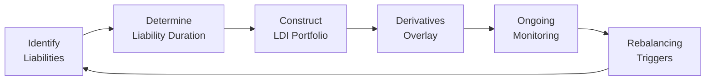

## Understanding Liability‑Driven Investing

Liability‑Driven Investing (LDI) is one of those topics that feels pretty straightforward at first glance—match your assets to your liabilities so you’re not surprised by big interest rate swings or unexpected payments. But, um, once you dig in, it can quickly get complicated. In short, LDI is a strategy that prioritizes meeting future liabilities above all else, often by aligning asset cash flows and durations with anticipated outflows. It’s particularly popular among institutions like pension plans and insurance companies that want to make sure they have enough resources when obligations fall due.

LDI has been around for decades. I remember chatting with a pension fund manager who said, “You know, the moment we realized that the pension liabilities were moving with interest rates more than our assets were, that’s when we decided to adopt LDI.” The goal is to minimize the risk that your assets won’t keep pace with your liabilities if interest rates, credit spreads, or inflation assumptions shift. Anyway, let’s explore some of the best practices, typical pitfalls, and the frameworks institutions use to pull off a successful LDI strategy.

## Core Principles of LDI

There are a few fundamental ideas that define LDI:

• Precisely measuring and modeling liabilities: Many liabilities, like pension benefits or insurance claims, have durations that can stretch years—or even decades.  
• Hedging interest rate risk: Often with high-quality bonds or derivatives, you try to ensure that interest rate changes affect liabilities and assets as similarly as possible.  
• Recognizing inflation exposure: Salary-based liabilities or healthcare costs might rise with inflation. If your bond portfolio doesn’t provide inflation protection, you might be in trouble.  
• Maintaining adequate liquidity: You don’t want to be forced to sell assets into an illiquid market right when you need cash.  

When done right, LDI helps institutions reduce the risk of underfunding or costly capital injections. In many cases, LDI also clarifies how governance and rebalancing decisions should be made.

## Best Practices in Liability‑Driven Investing

### Regular Asset–Liability Studies

Conducting an asset–liability study isn’t a one‑and‑done deal. It’s more like going to the doctor for regular checkups. As the demographic profiles of beneficiaries evolve (think changes in life expectancy or retirement patterns) or as the nature of the liabilities shifts, you want to revisit the assumptions. For example, a pension plan might see that participants are retiring earlier with bigger lumps sums. That obviously affects the timing and sizing of outflows.

• Practical Tip: Consider scenario testing once or twice a year, or whenever there’s a major change in economic or demographic assumptions. And watch those mortality tables—people sometimes live longer than we think.

### Governance Framework and Role Definition

It’s amazing how many well‑intentioned LDI efforts fail because nobody’s sure who’s in charge. A robust governance framework lines up responsibilities, risk tolerances, and triggers for rebalancing. If the plan sponsor, investment committee, and external asset managers aren’t on the same page, confusion abounds.

• Real Experience: I once saw an investment committee allowing the plan to run well below target duration for months because they thought the sponsor would hedge with derivatives. The sponsor believed the asset manager was already handling it. Result? The liabilities got hammered by a rate drop. A good governance framework would have spelled out exactly who does what.

### Derivatives Usage Guidelines

Derivatives can be your best friend or, well, a bit of a dangerous buddy if you’re not careful. Often you need interest rate swaps to dial in the precise duration match or to hedge reinvestment risk. LDI practitioners routinely use interest rate swaps, Treasury futures, and swaptions to manage the shape and sensitivity of the portfolio’s exposure. But you should have clear guidelines about how big the positions can be, what collateral is required, and how often you’ll rebalance or roll positions over.

• Example: Suppose your portfolio’s asset duration is 7 years, but your liabilities have a duration of 12. You could use an interest rate swap to receive fixed (short position) and pay floating (long position) to extend the effective duration of your assets closer to 12. If you don’t have guidelines on the notional amounts or a way to handle margin calls, it gets messy.  

### Periodic Stress Tests and Scenario Analyses

The lesson from big financial shocks is that the actual extremes can exceed anything we predict. This is why regular stress tests—like simulating a 200 basis point interest rate change or an extreme widening of credit spreads—are crucial. Even if you think your portfolio is well‑matched, a curve flattening or an unanticipated correlation shift can blow your coverage ratio wide open.

• Quick Example: Let’s say you run a scenario in which the yield curve steepens by 150 basis points. You find that your short-term bond holdings hold up well, but your long-term liabilities balloon in present value. You might need to re-hedge or add long-dated bonds or swaps to keep that duration match intact.

### Align Investment Horizons with Liability Durations

LDI typically means you match the overall duration of your portfolio to your liabilities, but it’s also about matching the cash flows. If you’ve got a big chunk of liabilities expected in five years, but your portfolio is mostly 30-year bonds, you might be forced to sell them early—potentially at unfavorable prices. By aligning horizons, you reduce the chance of forced sales and liquidity crises.

## Common Pitfalls in Liability‑Driven Investing

### Overlooking Basis Risk

Basis risk arises when the benchmark you’re using to hedge doesn’t actually match how your liabilities behave. You might hedge with government bonds, but your liabilities discount rate is tied to something else—like a corporate bond index or a blend that includes inflation. That mismatch leaves you exposed to changes in the spread between these curves.

• Real-World Mishap: An insurer used high‑grade corporates to hedge liability movements but didn’t realize their actual liability reference curve was heavily influenced by mid-grade exposures. As credit spreads shifted, the hedge barely helped.

### Underestimating Inflation

Some liabilities—like final salary pensions or healthcare benefits—increase with inflation. If your portfolio is purely nominal bonds, you’re going to face a shortfall if inflation rises significantly. Inflation-linked instruments like TIPS (Treasury Inflation‑Protected Securities in the US) or other index‑linked bonds can mitigate this risk.  

### Ignoring Sponsor Covenant Strength and Funding Levels

In corporate pension schemes, the LDI posture depends heavily on the sponsor’s creditworthiness. If the sponsor’s financial condition deteriorates, it might not be able to top up an underfunded pension plan. That means you might need a more conservative (i.e., heavily hedged) LDI strategy. It’s easy to forget this or to assume sponsor support will always be there.

### Overcomplicating the Derivatives Overlay

Adding derivatives to your LDI structure is kind of like seasoning soup—you want enough to make it tasty but not so much that you can’t tell what’s in there. Overly complex interest rate or cross‑currency swaps can create layers of operational and counterparty risk.  

• Common Issue: A fund with multiple overlay strategies (interest rate, currency, credit) that all demand rolling futures or margin calls might lose track of how each piece interacts. Operations folks can get burned by conflicting margin requirements.

### Delaying Rebalancing

LDI is not “set it and forget it.” If you wait too long to adjust your hedge ratios after big interest rate moves, the cost to rebalance can become huge. Markets send signals—like changes in the shape of the yield curve or credit deterioration—and ignoring them is a surefire way to bleed value.

## Numerical Illustration of LDI

Let’s say you manage a pension plan with a present value of liabilities at $100 million. The average duration of these liabilities is 15 years. Currently, your pension assets total $95 million, with a duration of only 5 years, heavily in short-term bonds and some equity. A 1% drop in interest rates could:

• Increase the liabilities by roughly 15% × 1% × $100M = $15M (approx.), making liabilities $115M.  
• Increase bond assets slightly, but not enough—maybe 5% × 1% × $95M = $4.75M, so assets become around $99.75M.  

Now your shortfall jumps from $5M to more than $15M. To remedy this, you might add longer-duration assets (e.g., long Treasuries) or enter into swaps—extending your effective duration closer to 15 years.  

## Visual Representation of an LDI Strategy

Below is a simple diagram illustrating a typical LDI cycle—from identifying liabilities to continuously monitoring and rebalancing.

## Key Considerations for Implementation

• Regulatory and Accounting Context: Under certain accounting frameworks (IFRS or US GAAP), pension deficits show up directly on the sponsor’s balance sheet, influencing how aggressive or conservative an LDI strategy can be.  
• Market Liquidity: It’s easy to talk about rebalancing, but what if the bond market dislocates, or swap markets freeze up? Always factor in normal and stressed liquidity conditions.  
• ESG Dimensions: An emerging theme is incorporating ESG factors into LDI, especially for plan sponsors who have sustainability mandates. However, focusing too narrowly on ESG might lead to misalignment with liabilities if those ESG bonds don’t offer the necessary duration or credit spread.  

## Exam-Relevant Perspectives

For CFA Level III, expect scenario questions: you might be given a pension plan or insurance company with certain liabilities, a partial duration mismatch, and a set of potential strategies. You’ll be asked to propose solutions and discuss the impact on risk measures, or maybe show how basis risk or sponsor covenant risk affects the recommended approach.

• Time Management Tip: For essay‑type questions on LDI, structure your answer around identifying the mismatch (duration, inflation, liquidity) and propose a hedge or an asset allocation shift. Then highlight constraints like covenant strength, sponsor risk appetite, or regulatory guidelines.

## Final Thoughts and Cautionary Notes

LDI might sound like a magic bullet, but it’s not immune to poor execution or unforeseen market moves. Perhaps the best advice is to keep it simple and systematic. Align the durations, use derivatives cautiously, and watch that governance structure closely. And if you’re building an LDI strategy for your firm—or for a client—make sure you maintain open lines of communication with all stakeholders.  

## Key Terms and Concepts

• Asset–Liability Study: A regular process that projects future liabilities and weighs the impact of different investment allocations, typically measuring funding ratios under various scenarios.  
• Governance Framework: Clear policies and oversight ensuring accountability for strategy implementation.  
• Basis Risk: The mismatch that arises when the hedge’s underlying benchmark differs from how the actual liabilities value changes.  
• Sponsor Covenant: The financial ability and readiness of a plan sponsor to support underfunded liabilities when needed.  
• Operational Risk: Risks tied to internal processes, systems, or external disruptions affecting derivative management, settlements, and day-to-day LDI operations.

## References

• Leibowitz, M. (1987). “Inside the Yield Book.” A foundational text on bond dynamics, yield measures, and duration.  
• PIMCO. (n.d.). “Liability‑Driven Investing: A Comprehensive Approach.” (research.pimco.com)  
• OECD Guidelines for Pension Plan Governance and Risk Management.

---

## Test Your Knowledge: Best Practices and Pitfalls in Liability‑Driven Investing Quiz



### Liability-Driven Investing focuses primarily on:

- [ ] Maximizing short-term gains in fixed income portfolios 
- [x] Aligning investments to meet projected liabilities 
- [ ] Outperforming benchmark indices regardless of liability structure 
- [ ] Speculative use of derivatives for quick returns  

> **Explanation:** LDI primarily seeks to align investment strategies with existing or forecasted liabilities to ensure obligations are met.

### Which of the following best practices helps maintain a consistent LDI strategy over time?

- [ ] Avoiding asset–liability studies to reduce costs 
- [x] Conducting ongoing asset–liability studies and adjusting as needed 
- [ ] Replacing all fixed estimates with strictly variable models 
- [ ] Ignoring changes in demographics for stable duration  

> **Explanation:** Regular asset–liability studies ensure the portfolio remains aligned with evolving liability assumptions.

### Basis risk occurs when:

- [ ] The portfolio uses interest rate swaps that perfectly hedge liability movements 
- [x] The hedge’s underlying index differs from how liabilities are actually valued 
- [ ] The sponsor ignores its governance framework 
- [ ] The plan sponsor’s financial condition deteriorates  

> **Explanation:** Basis risk is the mismatch between the hedge proxy (e.g., a government bond index) and the actual behavior of liabilities (e.g., a corporate yield curve).

### One common way to address underestimating inflation in an LDI approach is:

- [ ] Rely solely on nominal bonds 
- [ ] Dismiss inflation entirely 
- [x] Incorporate inflation-linked bonds, such as TIPS 
- [ ] Only use equity positions to hedge inflation  

> **Explanation:** Inflation-linked securities help hedge against rising costs associated with liabilities that increase with inflation.

### Which statement about derivatives usage guidelines in LDI is most accurate?

- [ ] Complex overlays are always preferable for maximum hedge benefits 
- [x] Well-defined notional amounts, collateral requirements, and rebalancing protocols are crucial 
- [ ] Using derivatives is not recommended in LDI strategies 
- [x] Multiple overlay strategies never create operational risks  

> **Explanation:** Clear guidelines around derivatives’ notional amounts, collateral, and rebalancing are essential to avoid excessive operational and counterparty risk.

### A key element of governance in LDI is:

- [x] Defining responsibilities and rebalancing triggers 
- [ ] Delegating all decisions to a single junior analyst 
- [ ] Eliminating oversight committees to minimize complexity 
- [ ] Ignoring sponsor inputs on risk tolerance  

> **Explanation:** A robust governance framework assigns clear roles, risk limits, and triggers for rebalancing the investment strategy.

### How does sponsor covenant strength factor into LDI decisions?

- [ ] It holds no relevance for liability coverage 
- [x] A weaker covenant typically requires a more conservative LDI strategy 
- [x] A stronger covenant implies the sponsor can provide more funding if shortfalls arise 
- [ ] Covenant strength only affects short-term liquidity decisions  

> **Explanation:** Covenant strength can influence how aggressively or conservatively a pension plan hedges its liabilities. A weak sponsor might not afford to bail out large deficits.

### Delaying rebalancing in an LDI program can lead to:

- [x] Missing key market signals and increased mismatch risk 
- [ ] Lower transaction costs over time 
- [ ] Immediate improvements in risk-adjusted returns 
- [ ] Elimination of standard deviation risk  

> **Explanation:** Failure to rebalance regularly might cause the hedge to drift from target levels, exposing the plan to greater risk and potential losses.

### Stress testing an LDI portfolio involves:

- [x] Simulating extreme market conditions (e.g., steep rate hikes) 
- [ ] Focusing only on normal market scenarios 
- [ ] Using purely historical average returns 
- [ ] Assessing only equity market volatility  

> **Explanation:** Stress tests help identify vulnerabilities in the portfolio under extreme interest rate or spread shocks not captured by ordinary models.

### True or False: Aligning the average maturity of liabilities and assets is sufficient for a perfect LDI match.

- [x] True 
- [ ] False  

> **Explanation:** While matching average maturity is one step, perfect LDI alignment generally also requires precise matching of durations, cash flows, and inflation exposures. However, as a simplified statement, ensuring close maturity alignment is often a primary step. Real-world attainment of a “perfect” match still demands deeper analysis of interest rate sensitivities, credit spreads, and other factors.


