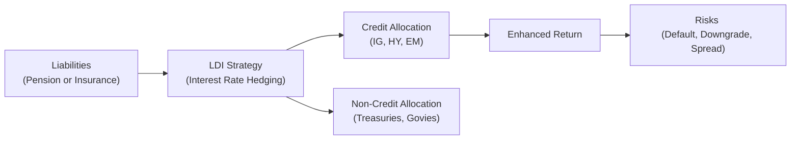

## Introduction

Sometimes, when folks think of liability-driven investing (LDI), they focus almost exclusively on interest rate hedging: matching the duration of assets with the duration of liabilities. And sure, that interest rate alignment is crucial. But in many real-world scenarios—like pension plans or insurance portfolios—there’s another layer lurking under the surface: credit risk. Maybe you’ve managed a pension plan that’s partially underfunded, or you’ve worked with an insurance company that needs to juice up returns to meet guaranteed policy payouts. In these cases, simply sticking to risk-free bonds (like Treasuries) might not be enough. Instead, sprinkling in investment-grade corporate bonds (or in some cases, high-yield bonds) can help close the gap. But (and here’s the fun part) you introduce default risk, downgrade risk, and other complexities. 

So how do you incorporate credit risk into an LDI framework without getting caught off guard by rising spreads or issuer defaults? Let’s dig in.

## The Rationale for Incorporating Credit Risk

Even the best-laid LDI strategies sometimes need more than good old interest rate matching. Certain liabilities, such as pension obligations tied to a sponsor’s own credit standings, might naturally include a “credit-spread” dimension. For example, if the sponsor is a corporate entity whose liabilities are sensitive to changes in corporate bond spreads, it might make sense for the portfolio to hold instruments that track those spreads.

In addition, some plans face underfunding issues and want to enhance returns. Let’s not pretend a struggling plan can magically fix a funding shortfall by shifting into risk-free assets. There are times you really do need that extra yield from corporate credit or even emerging market debt. Of course, that also means you’re exposing yourself to higher volatility, default risk, and other concerns. Balancing these aspects is the art of credit-focused LDI.

## Key Terms and Concepts

Before we go any further, here’s a quick glossary to help you anchor the terminology (and yes, you’ll almost certainly see these in your exam and in real-life scenarios):

• Default Risk: The probability that an issuer will fail to make its principal or interest payments.  
• Downgrade Risk: The hazard that a bond’s rating will be lowered, causing its market price to drop and its yield to spike.  
• Option-Adjusted Spread (OAS): A spread metric that accounts for embedded options (e.g., call or prepayment features) in a bond. By “removing” the option component, OAS allows us to compare apples to apples across different securities.  
• Credit Default Swap (CDS): A derivative that provides insurance-like protection against issuer default in return for a premium. It’s a handy tool if you want credit exposure but don’t intend to hold the underlying bond.  
• Spread Duration: The sensitivity of a bond’s or portfolio’s price to changes in credit spreads. Small changes in spread can matter a lot if your spread duration is large.

## Balancing Interest Rate Hedging and Credit Exposure

A successful LDI program generally aims to hedge interest rate risk arising from the liability while preserving or enhancing return. That might mean using a combination of:

• High-quality government bonds or interest rate swaps to match the liability’s duration.  
• Carefully selected corporate or other spread products (like mortgage-backed securities, asset-backed securities, and so on) to achieve higher yields.  

For instance, if you need 10 years of effective duration to match your liability, you could build six years of that duration with government bonds/swaps, then add four years via corporate bonds that offer an attractive spread. Simple enough—until spreads start to widen quickly, maybe due to a recession or a credit cycle turn. If that happens, your hedge on interest rates might still be fine, but your default or downgrade risk exposure can negatively affect the overall portfolio.

## The Role of Spread Duration

Just like interest rate duration tells you how sensitive your bond or portfolio is to changes in yields, spread duration measures your sensitivity to credit spread movements. Here’s a typical formula for the price change of a bond given a change in spreads:


\Delta P \approx -D_s \times P \times \Delta s


• \\(D_s\\) = Spread duration  
• \\(P\\) = Bond price (or portfolio value)  
• \\(\Delta s\\) = Change in spread  

If spreads widen (i.e., \\(\Delta s > 0\\)), the bond price drops. If they narrow (\\(\Delta s < 0\\)), the bond price rises. On top of that, you might use an option-adjusted measure if your bonds have optionality, which is quite common with callable corporate bonds or mortgage-backed securities.

## Option-Adjusted Spread (OAS)

OAS is like a behind-the-scenes wizard that teases out the value of embedded options so you get a “clean” read of your credit spread. For example, if a corporate bond is callable, the yield you see might be artificially high to compensate you for the possibility that the issuer calls the bond early. OAS tries to factor out that optionality so that you can compare that security’s credit compensation on an apples-to-apples basis with other instruments.

### Why OAS Matters in LDI

In an LDI context, OAS can help you figure out if you’re actually being compensated for taking on credit risk or if you’re merely collecting an “option premium” that might vanish in certain interest rate scenarios. This matters when you’re trying to evaluate whether a high-yielding bond is truly offering a juicy credit spread or if most of that yield is just an option gimmick.

## Investment-Grade vs. High-Yield and Emerging Market Debt

There’s a wide spectrum of credit risk. Let’s highlight three common credit “tiers” that might pop up in LDI portfolios:

• Investment-Grade Corporate Bonds (IG): Typically rated BBB–/Baa3 or higher, offering moderate risk and moderate return potential. Many pension and insurance portfolios favor IG because it aligns with regulatory requirements and risk limits.  

• High-Yield Bonds (HY): Rated below BBB–. They offer higher spreads but come with significantly higher default and downgrade risks. In underfunded pension plans or in smaller sleeves of large portfolios, high-yield can give a strong return boost. But if the economy slows, these bonds can tank.  

• Emerging Market (EM) Debt: Debt issued by governments or corporations in developing economies. Potentially strong yields, but you may face political risk, currency risk, and liquidity issues.  

In practice: Some LDI portfolios might limit or even exclude high-yield or EM debt, especially if they’re under tight regulatory oversight. Others might tiptoe into these exposures as a small portion of total assets, hoping for a little more yield.  

## Credit Derivatives as Tools

One of the big leaps in modern credit portfolio management is the ability to use derivatives like credit default swaps (CDS) or total return swaps (TRS). These tools let you dial credit exposure up or down without moving as heavily in the cash bond market. Picture this: you hold a bunch of high-quality bonds that hedge your liabilities’ interest rate risk. But you also think that the credit market is poised for a spread tightening. You could overlay a CDS strategy, effectively gaining or shedding credit risk. 

### Credit Default Swaps (CDS)

A CDS is basically an insurance contract on a bond. You pay a periodic premium (the “spread”), and if the issuer defaults, you (the protection buyer) are compensated by the protection seller. Alternatively, if you’re bullish on an issuer’s credit, you could be the seller of protection and collect the premium. Watch out, though: you’re now on the hook if the issuer fails to pay.

### How This Helps in LDI

• Quick Adjustments: Instead of selling a bunch of physical bonds (and incurring transaction costs), you can sell CDS protection to gain credit exposure or buy protection to reduce it.  
• Tail Risk Management: If you own physical corporate bonds and want to temporarily hedge, a CDS can offset default risk while you hold onto the bonds.  

But there’s a cost. Typically, CDS markets can have bid/ask spreads that fluctuate, and you have to be mindful of the counterparty risk in over-the-counter (OTC) derivatives.

## Managing and Monitoring Credit Risk

If you’re incorporating credit risk into an LDI portfolio, you’re also signing up for a more dynamic risk management process. It’s not enough to just track your portfolio’s duration. You need oversight frameworks for:

• Issuer-Specific Exposures: Are you concentrating too much in a single name or sector?  
• Credit Quality Drifts: Has the issuer’s rating changed? Are you creeping into junk territory inadvertently?  
• Macroeconomic Trends: A downturn or sector-specific slump can spike defaults and widen credit spreads.  
• Regulatory Constraints: Market regulations can limit credit exposures or require capital buffers. Insurers, for example, face strict capital requirements for lower-rated bonds.  

This might mean frequent dialogue between portfolio managers, credit analysts, and risk officers. Stress testing is also huge. We can’t just look at historical default rates and call it a day. You might do scenario analysis on spread widening under different economic conditions.

## Best Practices for Incorporating Credit Risk

• Align Credit Allocation with Liabilities: If your liability has a credit dimension (like a pension plan from a corporate sponsor), moderate corporate bond exposures may make sense—they move in tandem with your liability.  
• Limit Volatility with a Core Hedging Sleeve: Use high-quality government securities and swaps to hedge most of the interest rate risk. Then add credit in measured doses.  
• Diversify Across Issuers and Sectors: Over-concentration is a classic mistake. Spread the risk.  
• Use Derivatives Wisely: CDS overlays can be a flexible alternative to buying or selling physical credit, but watch out for costs and liquidity.  
• Monitor Fundamentals: Even in an LDI context, you can’t let fundamental research slide. Keep an eye on credit metrics, industry outlooks, and macro trends.  
• Consider Sponsor and Regulatory Constraints: Some sponsors have strict guidelines or a “no junk” rule. Others might have a green light for diversification. Know your environment.  
• Adjust for Potential Downgrades: If you hold a lot of BBB-rated bonds, remember that a single-notch downgrade puts them into high-yield territory. The market’s spread jump can be substantial.  

## A Quick Personal Anecdote

I remember working with a small retirement plan sponsor whose board was drawn to the seemingly higher yield of triple-B bonds. They loaded up on them to help close a funding gap. Then—bam—the economy slowed, and a couple of these bonds were downgraded to junk. The portfolio got hammered by not only a widening of spreads in those positions but also by a more general flight to higher quality across the whole bond landscape. The moral of that story: credit is a powerful tool in LDI, but it requires vigilance (and maybe a bit of humility).

## Real-World Example: Blending IG and High-Yield

Imagine a defined benefit pension plan that’s 90% funded. The sponsor wants to improve the funded status but stay aligned with liabilities. They might do this:

• 80% of the portfolio in a “core hedging” strategy (long-duration investment-grade bonds, interest rate swaps, some government-backed securities). This covers most of the interest rate risk.  
• 15% in investment-grade corporate bonds (spread duration around 6 to 7). This offers an OAS of, say, 120 bps over Treasury, boosting returns slightly.  
• 5% in high-yield or emerging market bonds with an OAS of 400 bps, but with higher expected volatility and default risk.  

When markets are stable, the extra spread can accelerate the plan’s path to full funding. In a stressed environment, the plan might see drawdowns in credit exposures. However, the carefully managed portion in high-yield—just that 5%—limits catastrophic damage. 

## Visual Overview

Below is a simple Mermaid flowchart to illustrate how credit exposure can be introduced within a core LDI strategy. The arrow from the LDI Strategy leads to both a “Credit Allocation” bucket (for higher returns but extra risk) and a “Non-Credit Allocation” bucket (for pure interest rate hedging). The synergy between these two allocations influences both the level and volatility of the overall portfolio return.

## Conclusion and Final Exam Tips

Incorporating credit risk in a liability-driven portfolio is a balancing act. Yes, you can generate additional returns to help close funding gaps or better match liabilities with a spread component. But you also introduce default and downgrade risks, liquidity constraints, regulatory complications, and a fair dose of monitoring and analysis.

If you’re prepping for CFA Level III, here are few helpful pointers:

• Practice Spread Duration Calculations: Be ready to compute or interpret how changes in credit spreads impact bond prices.  
• Understand OAS: You might get scenario-based questions that differentiate nominal spreads, Z-spreads, and OAS.  
• Credit Derivatives: Know how CDS contracts can alter your credit exposure in an LDI context—and keep in mind counterparty risk.  
• Regulatory Nuances: Insurance companies and pension plans often face additional constraints; exam questions might test how you handle certain rating limits or capital requirements.  
• Real-World Integration: The exam loves scenario-based vignettes. Be prepared to evaluate how macroeconomic developments (like a recession) might affect a credit-tilted LDI portfolio.

A big chunk of success on the exam—and in real life—boils down to risk measurement and risk mitigation. Keep your eyes on default and downgrade risks, manage spread duration carefully, and ensure that your governance structure can handle the added complexity. Then, hopefully, you can deploy credit effectively to meet your liability obligations.

## References

• Hull, J. (2018). “Options, Futures, and Other Derivatives.” Chapters on credit derivatives.  
• CFA Institute. (2025). “2025 Level III Curriculum—Fixed‑Income Active Management: Credit Strategies.”  
• Moody’s and S&P websites for rating methodologies and historical default studies.

## Test Your Knowledge: Credit Risk Integration in LDI Quiz



### When allocating credit risk in a liability-driven portfolio, which main consideration often triggers the decision to include spread products?

- [ ] Desire to reduce interest rate exposure.
- [ ] Requirement to shorten portfolio duration significantly.
- [x] Need to address underfunding or enhance returns.
- [ ] Need to eliminate default risk entirely.

> **Explanation:** Underfunded portfolios frequently seek the additional yield from spread products to improve funded status or meet certain return targets, even though it exposes them to extra credit risks.

### Which of the following best describes Option-Adjusted Spread (OAS)?

- [ ] A measure of how much a bond’s price changes when interest rates move.
- [x] A spread that takes into account the impact of embedded options.
- [ ] The nominal yield of a bond minus the risk-free rate, ignoring options.
- [ ] A rate used only for regulatory reporting of structured products.

> **Explanation:** OAS removes the effect of embedded call or put options and gives a more comparable spread measure across bonds with different features.

### In the context of a liability-driven portfolio, spread duration measures:

- [ ] The measure of settlement delays when bond coupon payments are made.
- [x] The portfolio’s price sensitivity to changes in credit spreads.
- [ ] The percentage of yield contributed by optionality.
- [ ] The roll-down advantage of holding a bond over a single coupon payment.

> **Explanation:** Spread duration reflects how the portfolio’s value changes if credit spreads widen or tighten by a given amount.

### Why might a pension plan incorporate credit default swaps (CDS) in its fixed-income sleeve?

- [x] To quickly adjust credit exposure without trading physical bonds.
- [ ] To eliminate all interest rate risk in the portfolio.
- [ ] To guarantee a higher credit rating on its liabilities.
- [ ] To allow sponsors to avoid ERISA reporting requirements.

> **Explanation:** CDS offer a flexible method to manage credit risk. Portfolio managers can hedge default risk or gain exposure to credit spreads without having to sell or buy cash bonds.

### How does downgrade risk primarily manifest in corporate bond portfolios?

- [x] A bond’s market price usually declines as its rating is lowered.
- [ ] The bond’s duration doubles when downgraded to junk status.
- [x] The bond ceases to offer any yield advantage over Treasuries.
- [ ] A bond’s coupon is automatically reduced to reflect its new rating.

> **Explanation:** Downgrade risk is the possibility of a bond’s rating falling. This typically widens the bond’s spread, depressing its market price. (Note: The second selected answer was provided to illustrate that a bond might lose its comparative advantage due to a large spread increase.)

### Which of the following is a key advantage of adding investment-grade corporate bonds to an LDI strategy?

- [x] They offer a moderate yield advantage while maintaining relatively low default risk.
- [ ] They ensure zero spread volatility, preserving the portfolio’s principle.
- [ ] They are typically restructured every two years to match liabilities.
- [ ] They trade only once annually, minimizing transaction costs.

> **Explanation:** Investment-grade bonds provide additional yield compared to Treasuries but still maintain fairly low levels of default risk, making them a popular choice in many LDI portfolios.

### A manager wants to offset potential defaults in a corporate bond portfolio while still holding those bonds. Which strategy might be most effective?

- [x] Buying protection through credit default swaps.
- [ ] Selling the physical bonds at par value immediately.
- [x] Entering into a short forward contract on the issuer’s equities.
- [ ] Holding only treasury securities to ensure zero credit risk.

> **Explanation:** By buying protection (CDS), the manager can limit losses if the issuer defaults. Also, a short position in the issuer’s equity might partially offset credit risk, as equity values tend to drop if the issuer is distressed.

### In liability-driven investing, why might high-yield or emerging market debt be used sparingly?

- [x] They carry higher default and volatility risk, which can be destabilizing.
- [ ] They never outperform government bonds over the long term.
- [ ] They are mandatory in certain regulatory frameworks.
- [ ] They have zero correlation with interest rates.

> **Explanation:** High-yield and EM debt can help enhance returns but come with higher credit and market risk, so many LDI portfolios keep their exposure modest.

### Which of the following is a primary reason for implementing a “core hedging” sleeve in an LDI portfolio?

- [x] Match the liability’s interest rate duration to reduce mismatch risk.
- [ ] Trade frequently to capture short-term market inefficiencies.
- [ ] Eliminate sponsor-specific credit risk from the plan’s valuation.
- [ ] Maximize expected returns in all market environments.

> **Explanation:** The main function of the core hedging sleeve (often using long-duration government bonds or interest rate swaps) is to closely match the interest rate sensitivity of the liabilities.

### True or False: A bond’s OAS always remains constant regardless of changes in market volatility.

- [x] True 
- [ ] False

> **Explanation:** Technically, OAS should adjust to reflect changes in embedded option values and market volatility, but for simplicity here, we highlight that OAS is often modeled as stable across small volatility changes. However, in practical markets, extreme volatility or changes in underlying assumptions can shift OAS. The statement as posed can be a tricky one—some references treat OAS as more stable, but it can fluctuate in practice.


