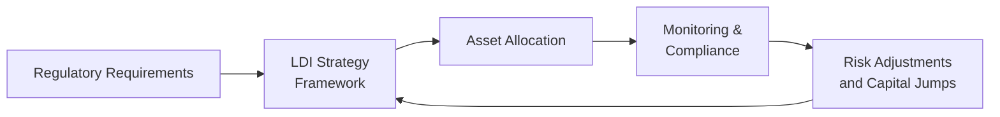

Regulatory constraints can shape—and sometimes outright redefine—how institutions structure liability-driven investing (LDI) strategies. For many organizations, especially pension funds and insurance companies, these rules are not mere formalities; they can literally dictate what assets can be held and in which proportions. And if you’ve ever witnessed the behind-the-scenes scramble to meet those solvency requirements at quarter-end, you know it’s not trivial. Sometimes, an LDI strategy might look perfect on paper, but the moment regulatory demands for additional capital or strict matching requirements come into play, you’re forced to pivot. Let’s talk through how these frameworks work, why they’re in place, and how to navigate them—hopefully without too many sleepless nights.

Regulations regarding liability-driven fixed income strategies vary by jurisdiction, but the core premise is consistent: to ensure that pensions, insurers, and other institutions remain solvent under adverse conditions and meet their obligations to beneficiaries or policyholders. We’ll explore the major global frameworks (like Solvency II in Europe and Risk-Based Capital requirements in the U.S.), discuss how valuation standards (e.g., IFRS or local GAAP) can affect portfolio construction, and examine how these rules limit (or permit) the use of derivatives to manage interest rate risk.

Regulatory Framework Overviews  
––––––––––––––––––––––––––––––  
In most markets, regulations aim to strike a balance between risk-taking and securing stakeholders’ interests. We see this across a broad spectrum of regimes:

• Solvency II (European Union): Introduced for insurance companies, it is a risk-based framework designed to protect policyholders by setting minimum capital requirements. Under Solvency II, the concept of the “Solvency Capital Requirement” (SCR) is central, ensuring insurers hold sufficient capital to withstand significant financial shocks.  
• Risk-Based Capital (U.S.): In the United States, insurers face RBC requirements that set minimum capital thresholds proportional to the risk profile of assets and liabilities. RBC frameworks consider credit risk, market risk, off-balance-sheet exposures, and a variety of other risk factors.  
• Pension Fund Regulations: Across multiple jurisdictions, pension regulators impose currency matching rules (e.g., the assets must be substantially in the same currency as the liabilities), along with constraints on credit quality and permitted asset classes.

In my experience working alongside a pension fund that was heavily invested in U.S. Treasuries—partly because the fund’s liabilities were denominated in U.S. dollars—regulatory guidelines basically forced them to maintain a certain portion of their portfolio in “safe” assets, even though the investment committee sometimes toyed with higher-yielding emerging market debt. The regulatory capital cost of holding riskier debt simply outweighed the potential return benefits.

Impact on LDI Portfolio Construction  
––––––––––––––––––––––––––––––––––  
Regulatory constraints can influence portfolio design in several ways:

• Capital Charges: Under many regimes, higher capital charges are placed on assets with greater credit or market risk. This can push institutions to load up on investment-grade bonds or even government securities, dampening the potential yields but also reducing capital volatility.  
• Currency Matching Requirements: Agencies may require assets to match the currency of liabilities closely. For example, a U.K.-based insurer with sterling liabilities may find holding dollar- or euro-denominated bonds more expensive in capital terms if they significantly deviate from currency match guidelines.  
• Duration Matching: Insurers and pension funds often attempt to match the duration of their liabilities with the duration of assets. Regulators may further mandate certain maximum mismatch thresholds. Essentially, if your liability profile has a 10-year duration, the regulator might raise an eyebrow if your asset portfolio sports a duration of only four.  
• Concentration Limits: Some frameworks impose upper bounds on how much you can hold of a single issuer, sector, or geography. Even when an LDI strategy might recommend a large tilt toward a certain “safe” sector, concentration limitations may force diversification.

In practice, an LDI manager might prefer to rely heavily on interest rate swaps to adjust duration, or credit default swaps (CDS) to hedge specific sector risks. But that’s easier said than done because many regulators impose extra capital charges or collateral requirements for derivative positions.

Use of Derivatives and Collateral Requirements  
––––––––––––––––––––––––––––––––––––––––––––––  
Derivatives can be an excellent tool for liability-driven investors, allowing them to fine-tune interest rate exposure, hedge unwanted risks, or even gain tactical positions without drastically altering the underlying portfolio. But let’s be real—regulatory environments can complicate matters. Often, insurers or pension funds must demonstrate that they have enough liquid assets set aside for collateral posting.  

One time, I recall discussing with a risk manager at an insurance company: They had a near-perfect swap overlay strategy, well-tailored to their liability profile, but the RBC framework’s collateral ratio requirement made them keep a large chunk of “cash or cash-like” instruments on hand. That effectively lowered their overall portfolio returns—definitely an unintended cost of compliance.

Additionally, regulations might require derivatives to be centrally cleared, which intensifies collateral calls. In high-stress market environments, margin calls can escalate quickly, creating liquidity stress. This is why some institutions limit derivatives usage to ensure they won’t be forced into a fire sale of assets to meet margin requirements at an inopportune moment.

Marking Liabilities and Assets: IFRS, Local GAAP, and Volatility  
––––––––––––––––––––––––––––––––––––––––––––––––––––––––––––––  
Another critical aspect of regulatory constraints is the interplay with accounting standards such as IFRS (International Financial Reporting Standards) or local GAAP (Generally Accepted Accounting Principles). The way an institution marks its liabilities—and the assets that back those liabilities—directly affects how stable the balance sheet looks from one reporting period to the next.  

Some standards require mark-to-market accounting for most financial instruments. Meanwhile, certain liability valuations might be discounted at a prescribed (often low) rate, inflating reported liabilities and placing additional pressure on the institution to hold matching, low-volatility assets.  

Consider a pension fund that is governed by IFRS. If the liabilities are valued using a specific discount rate that’s pegged to high-grade corporate yields, the plan sponsor might prefer to hold high-grade corporate bonds or interest rate swaps to dampen the volatility mismatch. If a mismatch arises—say the discount rate changes but the bond holdings do not track that change closely—pension deficits can balloon in the financial statements.  

When deficits spike on the books, sponsors may need to contribute more capital, or regulators may step in. This is actually why many plan sponsors that adopt IFRS also implement robust LDI strategies: they want to avoid abrupt hits to their reported funded status.  

Below is a simplified Mermaid diagram illustrating how regulatory requirements influence LDI strategy construction:

As you can see, it’s an ongoing cycle. Once an institution sets its LDI strategy with regulatory constraints in mind, it must continually monitor compliance. If new rules tweak capital requirements, or if solvency metrics slip, the cycle loops back to the beginning, and strategic shifts may be needed.

Local Jurisdictions, Taxation, and Permissible Instruments  
––––––––––––––––––––––––––––––––––––––––––––––––––––––––  
No two jurisdictions are the same. What’s permissible in one region might be frowned upon in another. For instance, certain countries specifically restrict the use of equity derivatives or limit short-selling. Others might allow a broader range of instruments but impose steep taxes or transaction costs on them.  

Taxation can also play a role in shaping LDI choices—especially if a specific jurisdiction offers preferential tax treatment for certain fixed income investments or if hedging activities get taxed differently. This is particularly common when cross-border flows are involved. If a pension fund in Canada invests in U.S. Treasuries but decides to hedge the currency risk using derivatives, the tax implications on realized/unrealized gains in the hedge can be a factor in overall strategy design.

Practical Example: Solvency II and Currency Requirements  
––––––––––––––––––––––––––––––––––––––––––––––––––––––  
Imagine a European insurance company subject to Solvency II. Its liabilities are primarily in euros, but an actuary suggests diversifying into U.S. credit markets for yield pick-up. The insurer notices that Solvency II imposes a capital requirement for foreign exchange (FX) risk. That additional capital cost might offset the yield advantage.  

To mitigate this, the insurer could hedge the FX exposure with currency forwards or cross-currency swaps, but derivative usage triggers further capital charges and collateral requirements. Navigating this labyrinth can mean doing a cost-benefit analysis: is the extra yield from U.S. credit worth the capital charges plus the cost of the FX hedge? Sometimes yes, sometimes no—and that’s how deeply regulatory constraints can shape real portfolios.

Common Pitfalls and Challenges  
–––––––––––––––––––––––––––––  
• Overlooking Collateral Dynamics: A perfect LDI plan on paper might become unwieldy if derivatives require too much collateral.  
• Over-Concentration in “Safe” Assets: In seeking to satisfy capital constraints, some managers might over-allocate to low-yielding assets, failing to generate sufficient returns to meet liability growth.  
• Misaligned Duration: Even if regulators demand strict duration limits, failing to revisit the liability duration assumptions can lead to underhedged or overhedged positions.  
• Neglecting the Accounting Impact: Sometimes it’s not just about capital solvency but also the volatility of reported earnings or funded status, which can create stakeholder angst.  

Implementation Best Practices  
––––––––––––––––––––––––––––  
• Stress Testing: Conduct robust scenario analyses to see how the balance sheet reacts under different yield curves, credit spreads, or currency movements. This is particularly vital in RBC frameworks where capital adequacy might plummet in stress scenarios of high correlation.  
• Dynamic Hedging: Keep derivative usage flexible but mindful of regulatory capital implications. Periodically adjusting the hedge ratio can help optimize performance, but track your margin calls closely.  
• Asset Quality Monitoring: If your regulations stipulate minimum ratings, ensure you have controls in place to detect rating downgrades promptly. Falling ratings can trigger capital surcharges.  
• Holistic Risk Budgeting: Integrate regulatory constraints into a broader risk budgeting framework. Don’t isolate them in a silo; the cost of capital, liquidity risk, and performance goals must all be balanced.  
• Open Dialogue with Regulators: Sometimes, clarity is best achieved by engaging in active discussions with the relevant regulatory bodies—especially for innovative or complex strategies. Early feedback can help shape your LDI approach in a way that’s less likely to be derailed by a surprise ruling.

Case Study: A Pension Fund Confronts Regulatory Caps  
–––––––––––––––––––––––––––––––––––––––––––––––––––  
A mid-sized pension fund in Asia invests heavily in high-grade corporate bonds. When local regulations change to tighten concentration limits, it suddenly finds itself exceeding the permitted exposure to a few corporate issuers. The task of rebalancing is urgent because just waiting for maturities could lead to regulatory penalties.  

After a quick de-risking, the fund sets up a derivative overlay with interest rate swaps to fine-tune its interest rate exposure. However, derivative usage triggers additional RBC charges. The result is a puzzle: on the one side, the pension must remain diversified; on the other, it’s forced to hold more capital due to the derivatives. The final solution is a moderate use of derivatives to lengthen duration, combined with a reallocation to government securities for safety. The pension fund managers accept a somewhat reduced expected return overall, but they remain firmly within compliance thresholds—and avoid that dreaded regulatory letter in the mail.

Exam Tips: Applying Regulatory Concepts to LDI Strategies  
––––––––––––––––––––––––––––––––––––––––––––––––––––––  
• Know the Terminology: If an exam question references RBC, Solvency II, or IFRS guidelines on asset/liability valuation, be prepared to discuss not just definitions but the direct impact on portfolio choices.  
• Scenario Analysis: Exam prompts often ask about the effect of a yield curve shift or credit downgrade on capital requirements. Demonstrate you can map these to changes in RBC or solvency positions.  
• Derivatives and Collateral: Be ready to show how additional margin postings might reduce the net advantage of a hedge.  
• Policy Implications: Sometimes, the question might focus on the interplay between accounting approaches (like IFRS) and the selection of fixed income instruments in an LDI context.  

References for Further Exploration  
–––––––––––––––––––––––––––––––––  
• EIOPA Guidelines on Solvency II (EIOPA)  
• NAIC Risk-Based Capital Requirements (naic.org)  
• IFRS Guidelines – International Accounting Standards Board (ifrs.org)  
• Basel Committee on Banking Supervision (basel.int)  

Learning about these regulations can feel like memorizing an extensive rulebook. But in practice, it’s all about weaving these constraints into a coherent strategy that balances risk, return, and solvency protection. It might not sound thrilling, but ensuring your fund doesn’t blow up under regulatory scrutiny is definitely a big deal—just ask anyone who’s had to fill out those compliance forms at 2 a.m.

## Quiz: Regulatory Challenges in Liability‑Driven Fixed Income



### Which of the following best describes the function of capital charges under Solvency II or RBC frameworks?

- [ ] They encourage large-scale speculative trading by lowering capital requirements for high-volatility assets.
- [ ] They apply equally to all types of assets, irrespective of credit quality or market risk.
- [ ] They do not affect liability-driven investing strategies, only equity investing.
- [x] They require institutions to hold additional capital for higher-risk assets, influencing portfolio allocation decisions.

> **Explanation:** Under both Solvency II and RBC frameworks, higher-risk assets generally require more regulatory capital. This influences an LDI manager’s decision-making process regarding which assets to include.

### Under many regulatory frameworks, why might currency risk be a concern for liability-driven investors?

- [ ] Currency exposure has no impact on solvency capital requirements.
- [x] A mismatch in currency between assets and liabilities can lead to additional capital charges.
- [ ] Regulators typically prohibit purchasing foreign currency bonds outright.
- [ ] Currency risk is irrelevant if interest rates are properly hedged.

> **Explanation:** When liabilities are denominated in one currency but assets are in another, it introduces foreign-exchange risk. Regulators often require additional capital to cover that risk.

### What is one potential drawback of using derivatives in an LDI strategy within a strict regulatory environment?

- [ ] Derivatives never help in hedging interest rate risk effectively.
- [ ] Derivative losses are not recognized by regulators.
- [x] Required collateral postings or margin calls increase liquidity needs.
- [ ] Derivatives eliminate all liability mismatch risk.

> **Explanation:** Regulatory requirements frequently mandate collateral or margin postings for derivative positions, which can tie up a significant portion of liquid assets and create additional complexities in LDI strategies.

### How can accounting standards like IFRS influence LDI strategy regarding liability valuations?

- [ ] They typically eliminate the need for matching the duration of liabilities and assets.
- [ ] They only apply to equities, making them irrelevant for fixed income strategies.
- [x] They can cause liability measurements to be more sensitive to changes in discount rates, increasing the pressure to hedge interest rate risk.
- [ ] They provide no guidance on marking assets or liabilities to market.

> **Explanation:** IFRS often requires liabilities to be discounted at market-based rates. Fluctuations in these rates can cause volatility in reported liabilities, incentivizing institutions to adopt LDI strategies that reduce such volatility.

### Under certain regulatory regimes, what might be the motivation for imposing concentration limits in an LDI portfolio?

- [x] To prevent excessive exposure to a single issuer or sector.
- [ ] To ensure that all assets are held in only one currency.
- [x] To encourage diversification and reduce catastrophic losses due to default.
- [ ] To guarantee a higher yield for institutional investors.

> **Explanation:** Concentration limits encourage diversification of risk by preventing an over-reliance on any single issuer or sector, thereby contributing to a more stable solvency position.

### Why do some regulators require that assets be held in the same currency as liabilities?

- [x] It reduces currency mismatch risk, which could otherwise require higher capital.
- [ ] It raises the institution’s foreign exchange volatility.
- [ ] It ensures zero interest rate risk in the portfolio.
- [ ] It guarantees a fixed return.

> **Explanation:** By aligning asset and liability currencies, regulators aim to minimize FX risk. A mismatch could introduce significant currency exposures, thus additional capital requirements.

### What is the main reason pension and insurance regulators scrutinize derivative usage?

- [x] Derivatives introduce potential leverage and increased liquidity risk through margin calls.
- [ ] Derivatives are always more expensive than physical bonds.
- [x] Derivatives reduce the complexity in portfolio management.
- [ ] Regulators discourage all forms of hedging.

> **Explanation:** Derivatives can significantly alter the risk profile by introducing potential leverage and margin requirements, leading regulators to impose stricter guidelines or additional capital charges.

### In the context of RBC requirements, which factor often increases an institution’s capital needs?

- [x] Holding assets with higher credit risk.
- [ ] Investing solely in government bonds.
- [ ] Eliminating hedging strategies altogether.
- [ ] Achieving perfect duration matching.

> **Explanation:** RBC frameworks assign higher capital requirements to riskier assets (e.g., high-yield bonds or credit derivatives), reflecting their greater likelihood of volatility or default.

### Which of the following is a common pitfall when implementing an LDI strategy under strict regulatory constraints?

- [x] Failing to account for collateral requirements, leading to unexpected liquidity issues.
- [ ] Over-allocating to illiquid private equity positions.
- [ ] Misreporting IFRS data to regulators.
- [ ] Exceeding concentration limits to boost yield.

> **Explanation:** Overlooking the need for collateral in derivatives-based LDI strategies can quickly lead to liquidity shortfalls and potential regulatory non-compliance.

### True or False: Under Solvency II, an insurer’s required capital is largely unaffected by the credit risk of its portfolio.

- [ ] True
- [x] False

> **Explanation:** Solvency II’s risk-based approach actively considers the credit risk of an insurer's portfolio, which affects the required capital levels.


