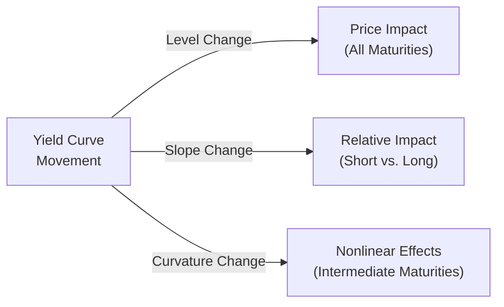

## Introduction

Well, I remember the first time I held a bond portfolio that was super sensitive to tiny rate changes—a few basis points up or down and, bam, my daily P&L would swoop around like a roller coaster. It took me a while to realize that the yield curve itself is at the heart of a lot of this drama. The yield curve is just a shape on a graph showing how yields differ by time to maturity. But as straightforward as that might sound, it’s got a whole bag of tricks up its sleeve—parallel shifts, slope transformations, curvature wiggles—that can make or break a fixed-income strategy. And I’m not kidding: understanding how yield curve movements affect bond returns is essential if you’re working on liability-driven portfolios, indexing, or active strategies.

In this section, we’ll dig right into how yield curve movements—shifts in level, slope, and curvature—impact portfolio returns. We’ll see how the roll-down effect helps generate stable returns when nothing else changes, how convexity influences bond price responses, and how you can measure your sensitivity to yield curve changes. If you’ve ever wondered why your bond portfolio sometimes behaves like it’s got a mind of its own, much of the answer lies right here.

## Yield Curve Basics

A yield curve is a snapshot of yields (or interest rates) on bonds of different maturities but similar credit quality, typically government bonds. If you plotted them on a graph with maturity on the horizontal axis and yield on the vertical axis, you’d see the now-classic “curve” shape. Usually, it’s upward sloping, meaning longer maturities have higher yields than shorter maturities. But watch out for flattening or even inversion in certain market environments—those are times when short-term yields might exceed long-term yields, often signaling future economic trouble.

Here’s a quick visual representation of how yield curve changes can affect different maturities:

• A “level” change, or parallel shift, might move the entire curve up or down by the same number of basis points.  
• A “slope” change refers to the difference between yields at the short end and some longer maturity.  
• A “curvature” change hits the middle differently than the wings, producing a butterfly effect.

## Parallel Shifts

A parallel shift occurs when short-term and long-term rates shift roughly by the same amount. For instance, if the entire curve goes up by 50 basis points (bps), you’ll see bond prices drop for short-, medium-, and long-term bonds in line with their durations. It’s like raising the entire floor of interest rates, so existing bonds—which locked in lower coupon rates—become less attractive.

• If you hold a 5-year bond with a duration of about 4.5, and the yield curve sees a 100 bps parallel upward shift, you might expect your bond’s price to drop roughly 4.5%.  
• Conversely, a downward parallel shift of 100 bps might *raise* the price by about 4.5%.  

Of course, no shift is *perfectly* parallel in real markets, but many multi-factor yield curve models initially assume some portion of the movement is in this “level” factor.

## Slope Changes

Even if the entire curve doesn’t move in unison, it might “steepen” or “flatten” based on changes in short-term or long-term yields. Steepening typically means short-term rates remain relatively low while long-term rates climb. Flattening is the opposite: short-term yields rise or long-term yields fall (or both).

Bond managers often position themselves with steeper or flatter trades:

• A “steepener” trade might be long long-duration bonds and short shorter-duration bonds, expecting an increase in the slope (long rates up more than short rates). Actually, you could also benefit from a steepener by reversing the trade—there are multiple ways. The key is you want the spread between, say, 2-year and 10-year yields to widen.  
• A “flattener” trade is the opposite, benefiting if the gap between short- and long-term rates shrinks.

Over the years, folks have used slope changes as indicators of the policy environment. A flattening curve, for instance, often implies that the market expects the central bank to tighten monetary policy in the near term. If you’re holding a bunch of long-duration bonds, flattening might help if that is driven by short-end rates going higher but the long end staying stable.

## Curvature Changes

Sometimes, changes in interest rates are more nuanced than just a level or slope alteration. You can get “butterfly” shifts, referred to as curvature changes. Essentially, the yields in the short and long ends may move differently from the intermediate segment, forming an upward or downward “bow.”

• In a “positive” butterfly, short and long ends rise (in yield), while the middle remains stable or falls, making the curve look more "hump-backed."  
• In a “negative” butterfly, the short and long ends fall (up in price), while the middle rises.  

Strategies keyed to curvature changes often revolve around bullet vs. barbell positions:

• A bullet strategy focuses most of the portfolio around one particular maturity band—let’s say 5-year Treasuries.  
• A barbell strategy invests heavily at two extremes, short-term and long-term maturities, skipping the intermediate.  

When interest rates in the middle part of the curve move differently from the ends, the barbell or bullet can out- or underperform depending on how they’re structured. If you suspect a “butterfly” where intermediate yields rise relative to the ends, you might pick a barbell rather than a bullet to capitalize on that.

## Roll-Down Effect

Imagine you’ve got a bond trading on an upward-sloping curve. Over time, as that bond gets closer to maturity, in a stable market, it “rolls down” the yield curve to progressively lower yields (because shorter-term bonds typically yield less if the curve is upward sloping). So if yields remain the same, you get price appreciation as you move along the curve.

Here’s a quick example:  
• Suppose a 5-year bond yields 3%. A 4-year bond of the same credit quality might yield 2.8%. After one year, if the yield curve shape doesn’t change, your now 4-year bond might be priced using a 2.8% yield instead of 3%. That can drive a price gain—beyond whatever coupons you collected—often called “pull to par” or “roll-down” return.  

This effect can be surprisingly material in stable markets. Actually, many buy-and-hold strategies quietly rely on roll-down to generate total returns that exceed the bond’s simple yield.

## Convexity Implications

Bonds aren’t purely linear in their price-yield relationship. They have “convexity,” which accounts for the curvature in the price response to changing yields. A bond with higher convexity will gain more in price if yields go down and lose less if yields go up (compared to a lower-convexity bond with the same duration).

• Mortgage-backed securities, for example, have negative convexity in certain environments, meaning that if rates drop, prepayments accelerate, and you don’t benefit as much from the price increase because you’re effectively getting your principal returned earlier to reinvest at lower rates.  
• A long-duration Treasury bond typically has positive convexity. In big yield curve shifts, that can significantly alter the expected risk and return.  

Investors who want more cushion in a volatile rate setting often favor securities with higher positive convexity—like government bonds. If yields shift in a big, lurching manner, these securities usually hold up better than negative convexity instruments.

## Empirical Observations and Historical Patterns

Markets are never static. Historically, the yield curve has moved through cycles corresponding to monetary policy, inflation expectations, and economic growth phases. For instance, a hawkish central bank might hike short-term rates quickly, flattening the curve, or even inverting it. Conversely, in expansions, demand for capital can push up longer-term yields.

Some practitioners claim the slope of the yield curve has predictive power over future recessions. While it’s not a perfect crystal ball, it’s common to see significant flattening or inversion (like negative 2y/10y spreads) before recessions. From a returns standpoint, these patterns can shape how managers adjust durations and position themselves in anticipation.

A practical approach is to regularly check historical data, such as that provided by the Federal Reserve Economic Data (FRED). You might examine how your hypothetical bond strategy would have weathered, say, the interest rate cycles of the early 2000s, the global financial crisis of 2008, or the quantitative easing era.  

## Measuring and Managing Portfolio Sensitivity

Given that the yield curve can shift in multiple ways, you need tools that capture different dimensions of interest-rate risk. Here are a few:

• Duration: Measures the price sensitivity of a bond (or portfolio) to small parallel changes in yields.  
• Key Rate Durations (Partial Durations): Break the curve into discrete segments (e.g., 2-year, 5-year, 10-year) to see how the portfolio reacts if yields move in those specific maturity buckets.  
• Scenario Analysis: Models a variety of hypothetical yield curve shifts—parallel shifts, steepenings, flattenings, butterflies—to estimate potential portfolio gains or losses.  
• Convexity: Evaluates the second-order sensitivity to yield changes, important when yields move a lot.

### Example of a Simple Duration-Based Calculation

Let’s say your portfolio has an average duration of 7.0 and yields rise by 50 bps across the curve. You might expect a price drop of roughly:

ΔPrice ≈ − (Duration) × (ΔYield) × (Price)

So that’s about −3.5% (assuming no major convexity or spread effects). Not perfect, but it’s a good starting estimate.

### Key Rate Duration Example

Maybe in your scenario analysis you see the short end rising by 25 bps while the long end rises by 40 bps. Your partial duration to the short end might be 2.0, while your partial duration to the long end is 4.5. This breakdown helps you gauge the unique impact on each portion of your portfolio, especially if you’re constructing barbell or bullet strategies.

## Conclusion

Yield curve shifts can be subtle or dramatic, and they’re rarely uniform. Understanding parallel shifts, slope changes, curvature moves, the roll-down effect, and convexity is absolutely crucial if you want to manage a fixed-income portfolio successfully. Personally, I’ve found that carefully measuring *where* you’re vulnerable along the curve can save you a lot of sleepless nights. By dissecting your exposures to level, slope, and curvature factors, you’ll be better equipped to react—to either mitigate risk or capitalize on changing rate conditions.

## Final Exam Tips

• Make sure you can break down a yield curve into separate factors—level, slope, and curvature—and articulate how each impacts bond portfolios.  
• Practice short numeric exercises on how parallel shifts affect bond prices given a duration metric. Don’t forget to factor in convexity for large shifts.  
• Be prepared for item-set questions that show partial durations or scenario analyses. The exam often loves to test your ability to reason about different yield curve scenarios (steepening, flattening, butterfly) and how they affect various strategy types like barbell vs. bullet.  
• Keep an eye out for discussions of roll-down return—sometimes the exam will ask you to compare total return expectations under stable vs. shifting yield conditions.  

## References and Further Reading

- Fabozzi, F. J., “Bond Markets, Analysis, and Strategies.”  
- CFA Institute, 2025 Level III Curriculum (Fixed-Income Topics).  
- Tuckman, B. and Serrat, A., “Fixed Income Securities: Tools for Today’s Markets.”  
- Sundaresan, S., “Fixed Income Markets and Their Derivatives.”  
- Historical Yield Curve Data: Federal Reserve Economic Data (FRED).

## Evaluate Your Understanding: Impact of Yield Curve Movements on Portfolio Returns



### Which best describes a parallel shift of the yield curve?

- [ ] A move in which short-term yields rise, while long-term yields decline.
- [ ] A move in which intermediate yields remain static, while short-term yields change significantly.
- [x] A uniform shift in yields across all maturities by the same number of basis points.
- [ ] A move in which long-term yields rise, but short-term yields fall.

> **Explanation:** A parallel shift occurs when the entire curve (short, intermediate, and long maturities) moves uniformly by roughly the same basis point amount.

### When the yield curve steepens, which strategy tends to benefit?

- [ ] A flattener trade that is long short-duration bonds and short long-duration bonds.
- [x] A steepener trade that is long long-duration bonds and short short-duration bonds (or another combination that profits from the slope increasing).
- [ ] A barbell strategy that only focuses on intermediate maturities.
- [ ] A bullet strategy concentrated around the 30-year point.

> **Explanation:** Steepening means the spread between short- and long-term rates widens. A steepener trade profits when the difference between short-term and long-term yields increases.

### In a positive butterfly shift, where do yields tend to move the most?

- [ ] The intermediate maturities only.
- [ ] The middle of the curve rises strongly, while the ends remain unchanged.
- [x] The short and long ends rise, while the middle remains stable or falls.
- [ ] All maturities move by the same magnitude.

> **Explanation:** A positive butterfly happens when yields at the short and long ends move up more than the intermediate part, creating a more pronounced “hump” shape on the curve.

### What is the roll-down effect?

- [ ] The loss caused by a bond's yield rising as it approaches maturity.
- [ ] The curve flattening when moving from short-term to long-term.
- [ ] The effect of convexity on a bond’s price when yields change sharply.
- [x] The gain in a bond’s price if yields remain stable and the bond rolls down an upward-sloping yield curve.

> **Explanation:** The roll-down effect refers to a bond’s price appreciation as it “moves” to a lower-yield part of the curve over time (in a normal, upward-sloping environment).

### A bond with higher positive convexity compared to another bond of equal duration:

- [x] Increases more in price when yields fall and decreases less when yields rise.
- [ ] Decreases more in price when yields fall and increases less when yields rise.
- [ ] Has no effect on portfolio risk.
- [ ] Always has lower yield to maturity compared to a negative convexity bond.

> **Explanation:** Positive convexity amplifies gains and moderates losses. For the same duration, a higher convexity bond is generally more preferable in volatile rate environments.

### Which of the following is a primary driver of a flattening yield curve?

- [ ] Short-term interest rates dropping more than long-term interest rates.
- [x] Short-term interest rates rising or long-term interest rates falling, thereby reducing the yield spread.
- [ ] Long-term interest rates rising, while short-term remain unchanged.
- [ ] The entire yield curve shifting upward by the same amount.

> **Explanation:** A flattening happens when the spread between short- and long-term yields narrows, often due to short rates climbing faster than long rates or long rates declining more than short rates.

### In a barbell strategy, the portfolio is typically tilted toward:

- [x] Short-term and long-term maturities.
- [ ] Intermediate-term maturities exclusively.
- [x] Avoiding the “belly” of the yield curve.
- [ ] Overconcentration in 30-day T-Bills.

> **Explanation:** A barbell invests heavily at very short and very long maturities. It largely avoids intermediate maturities to exploit potential curvature changes, among other strategies.

### A bullet strategy would prevail in which scenario?

- [x] When intermediate maturities outperform both short and long maturities.
- [ ] When short and long maturities experience the most yield movement.
- [ ] In a perfectly parallel shift environment.
- [ ] When short-term interest rates are zero.

> **Explanation:** A bullet strategy concentrates on a single maturity segment, often the middle (intermediate). If yields in the middle drop relative to the ends, the bullet can outperform.

### Which measure is most helpful in capturing interest rate sensitivity specific to different maturity segments?

- [ ] Standard duration.
- [ ] Yield to maturity.
- [x] Key rate durations (partial durations).
- [ ] Option-adjusted spread.

> **Explanation:** Key rate durations break down duration into individual maturity “key rates,” helping managers see how their portfolio might respond to changes in particular yield curve segments.

### The main reason yield curve slope changes are closely watched is because:

- [x] They can signal changes in monetary policy or economic outlook.
- [ ] They are irrelevant to fixed-income portfolio decision-making.
- [ ] They guarantee outperformance for short-term bond investors.
- [ ] They always cause negative returns for all bondholders.

> **Explanation:** Slope and its changes are often taken as indicators of economic and policy shifts, and they directly affect the relative performance of different maturities.


