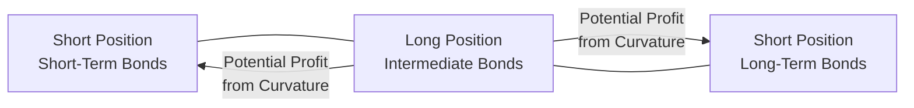

This section dives into the multifaceted world of positioning strategies based on forward rates and yield curve dynamics—an essential toolkit for any active fixed-income manager. The idea here is straightforward (or so it seems!): the slope and shape of the yield curve rarely stand still, and forward rates give us clues about where the market expects rates to be in the future. Armed with these insights, managers seek to structure their portfolios to profit (or hedge) as the reality of interest rates unfolds. 

Along the way, we’ll talk about why forward rates matter, how to interpret them in practice, and how to turn these interpretations into profitable strategies—like riding the yield curve, steepeners, flatteners, and butterfly trades. We’ll also highlight the importance of risk controls, plus reallife examples that show just how easily a central bank announcement can flip your best-laid plans upside down. Feel free to grab a cup of coffee (or tea) and settle in, because yield curve positioning is one of the more fascinating aspects of bond portfolio management.

Understanding Forward Rate Interpretation  
Forward rates are the market’s estimate of future short-term interest rates based on the current yield curve. People often describe them as “implied rates,” meaning that if you see a two-year and one-year yield, folks can back out what the yield on a one-year bond starting one year from now should be—given no arbitrage and certain assumptions about reinvestment rates. 

Mathematically, if S₁ is the 1-year spot rate (annualized) and S₂ is the 2-year spot rate (annualized), the 1-year forward rate one year from now (denoted F₍1,2₎) can be approximated by:


F_{1,2} = \left(\frac{(1 + S_{2})^{2}}{(1 + S_{1})}\right) - 1


In reality, you can extend this formula for any segment on the curve. The forward rates that emerge from spot curves essentially reflect what today’s bond prices say about tomorrow’s rates. If the market expects short rates to rise sharply, forward rates in the near term will be noticeably higher. 

I’ll never forget my first time layering a forward rate analysis over my bond portfolio. I was a junior analyst, so of course I spent hours just triple-checking the math. Eventually I realized that the math is only half the story. The real action is in how you use those forward rates to guide your trades—where to overweight and underweight along the curve to exploit anticipated changes. The calculations themselves are straightforward once you get the hang of it, but the combination of strategy and execution is a juggling act.

Riding the Yield Curve (Roll-Down Strategy)  
Let’s talk about “riding the yield curve,” sometimes called a roll-down strategy. This approach exploits the potential for a bond’s yield to decline—and its price to rise—simply because time passes and it moves closer to maturity. If the yield curve is upward sloping, a five-year bond’s yield might be higher than a four-year bond’s yield right now. But in 12 months, that five-year bond you bought today effectively becomes a four-year bond—and if the curve shape doesn’t change drastically, it will “roll down” to the yield appropriate for a four-year maturity, presumably at a lower yield and a higher price.

Bond managers might say something like: “We want to buy a portion of the curve that offers a really juicy roll-down. The yield is higher upfront, but if conditions stay the same, we can earn not just that higher coupon but also additional price appreciation as the bond transitions down the slope.”

Example: Suppose the yield on a 5-year Treasury note is 3.0%, while the yield on a 4-year Treasury is 2.7%. If in one year the curve remains roughly the same, the original 5-year bond will now be a 4-year bond. We get the coupon and also may see a price gain if yields shift from 3.0% to something closer to 2.7%.

However, watch out for curve shifts. If the curve flattens or inverts, that sweet ride may not be so sweet. Timing matters, and the slope of the yield curve can be quite fickle in times of monetary policy uncertainty.

Steepener vs. Flattener Trades  
One of the biggest calls a bond manager can make is whether the yield curve will steepen or flatten. It sounds fancy, but trust me, it normally starts with macroeconomic research: Are we heading into a recession, where central banks might slash short-term rates (flattening or inverting the curve)? Or is the economy heating up, with rising longer-term inflation expectations, pushing up long-end yields instead (steepening)?

• Steepener Trade: You expect the yield curve to get steeper, meaning the spread between long-term and short-term yields will widen. One common approach is to buy longer maturity bonds (or receive fixed on long-end interest rate swaps) and simultaneously fund that position by shorting or paying fixed on shorter maturities. If the curve does steepen, your long-end position should outperform the short-end hedge.

• Flattener Trade: You expect the yield curve to flatten, so you might do the opposite: short the long maturity and go long the short maturity. Since a flattening implies a decrease in the yield differential, you’re effectively profiting from the compression of yields along the curve.

In practice, these trades can be constructed with futures, swaps, or physical bonds. Options on interest rates can be incredibly useful if you want to maintain a certain optionality around your position. However, derivatives come with their own margin, collateral, and regulatory complexities, so check your risk management guidelines if you go that route.

Butterfly Trades  
A butterfly trade is a more nuanced approach. The “wings” of the butterfly are typically short positions (or longs, depending on the trade setup) at the short and long ends of the curve, while the middle “body” is a long position in an intermediate maturity. You’d do this if you expect the yield curve to become more “hump-shaped”—basically if you think the middle of the curve will outperform both extremes. Or you can do the reverse trade (long the wings and short the belly) if you expect the curve to invert in the middle.

You can think of it like the wings of an actual butterfly. If the wings (short-tenor, long-tenor yields) move in one direction and the belly (the intermediate yields) moves in the other, your trade can profit from that structural curvature change. 

Anyway, I remember the first time I saw a butterfly done at scale. I was with a more senior mentor, and he set up a “50-50-50” trade that involved shorting some 2-year notes, shorting some 10-year notes, and going long the 5-year portion. The portfolio ended up benefiting from a rally in the mid-curve, precisely as expected. But of course, in fixed income investing, nothing is guaranteed—especially if central banks throw out a surprise statement or economic numbers come in hot or cold.

A quick illustration may help. Below is a simple Mermaid diagram showing a butterfly structure with short positions in the short and long ends, balanced by a long position in the intermediate:

You can flip these positions around if you think the intermediate yields will underperform relative to the wings.

Comparative Advantage of Forwards  
Forward contracts and interest rate swaps can sometimes be more capital-efficient ways to implement these trades than physically transacting in cash bonds. Why? Well, physically buying or selling bonds requires a significant outlay of capital, plus you incur transaction costs and might have constraints from the custodian or from the portfolio guidelines. 

With an interest rate swap, you can pay fixed or receive fixed and effectively replicate the yield exposure you want along the curve, typically using just a fraction of your portfolio’s capital. That said, swaps come with credit risk to the counterparty (though central clearing mitigates this somewhat) and margin requirements. 

In many cases, you see managers build “carry-efficient” strategies using forward rate agreements (FRAs), dynamic swap overlays, or futures because they can quickly adjust exposures if expectations change. The advantage of more flexible instruments is exactly that: some folks prefer them so they can pivot quickly without a massive cost. However, it requires robust risk systems—nobody wants to get margin-called for a trade that was meant to be low-risk.

Curve Dynamics and Monetary Policy  
Monetary policy is the giant puppet master behind short-term rates. Central banks adjust their policy rates, which directly impacts the front end of the curve. Because the yield curve’s front end is an expression of investor expectations about the path of monetary policy, if the central bank suggests it will raise rates aggressively over the next few meetings, the curve can flatten (the short end moves up sharply) or invert if markets anticipate an economic slowdown further out.

When COVID-19 hit, central banks around the world cut rates to near zero or negative in record time. The short end of many curves essentially anchored near zero, while the longer end responded to inflation or growth uncertainties. That environment was a field day for curve strategies, with managers plowing into steepeners or even constant maturity swaps to monetize the big slope differences. But you had to keep a close eye on global economic data that telegraphed future rate hikes or new rounds of quantitative easing.

Economic Indicators  
Economic growth, inflation, and employment levels are huge drivers of yield curve shape. If inflation is predicted to accelerate, the long end may rise in yield, steepening the curve. If recessionary signals appear, short rates might drop (or remain anchored by near-zero policy rates) while long rates also fall, possibly flattening or even inverting the curve. 

A typical process for forward-rate-based trading includes regularly updating macroeconomic forecasts, analyzing central bank communications, and mapping out different yield curve scenarios. For instance, if the Federal Reserve strongly hints at an upcoming rate hike cycle (like 25 bps increments over the next year), you might see forward rates shift upward, particularly near the short to intermediate part of the curve.

While all indicators are relevant, keep in mind that markets can react violently to big data releases. A stronger-than-expected inflation print could push yields higher across the board, but typically it’s the longer yields that might move more if it signals a structural inflation shift. Alternatively, a shocking negative jobs report can quickly flatten the curve if it implies an upcoming rate cut. Being nimble is key.

Risk Controls  
Here’s where everything can unravel in a hurry if you aren’t careful. It’s easy to get burned by a surprising shift in investor sentiment or an unexpected announcement from the central bank. The yield curve is dynamic—a single macroeconomic data point can cause markets to price in drastically different forward rates.

A few best practices for controlling risk:

• Scenario Analysis and Stress Testing: Analyze curve shifts of various magnitudes: a parallel shift, a steepening, a flattening, or a butterfly twist. If your portfolio is highly leveraged with a big position in an advanced derivatives overlay, you must see what happens if the curve moves 50 bps in a day (something that can, in rare cases, happen).  
• Diversification of Strategies: Combine multiple yield curve views with other return drivers—credit spreads, for instance. Don’t put all your eggs in one single maturity bucket.  
• Monitoring Liquidity: For large institutional portfolios, it’s not only the shape of the curve that can shift risk but also market liquidity. If you hold positions that are difficult to unwind, a sudden yield spike or drop can magnify losses when you can’t exit.  
• Policy Constraints: If you’re running money for an institutional client—like a pension or insurance company—you might need to maintain certain duration or maintain a tight limit on tracking error. Overstepping these constraints to place big yield curve bets can cause compliance or reputational headaches.

Real-World Example: In late 2024, imagine markets are anticipating a “soft landing,” meaning the central bank can gradually raise rates to combat mild inflation without triggering a recession. In that scenario, you could see moderate upward moves in short rates but not a massive reaction in the long end. A flattener position might have done well if the short end rose faster than the long end. But if the data turned south and the central bank pivoted to cutting rates again, your flattener might suddenly become that dreaded trade that’s out-of-favor in a steepening environment. The moral of the story: keep your ear to the ground, watch the data, and always have a plan B.

Practical Considerations and Pitfalls  
• Overconfidence in Forward Rates: Markets occasionally project forward curves that are extremely steep or extremely flat, and less experienced managers might interpret them too literally. Forward rates are not guaranteed paths; they’re just the sum of market participants’ best guesses (and risk premia).  
• Inaccurate Forecasting: Macroeconomic forecasting is notoriously difficult, with “black swan” events lurking. If your entire trade depends on an extremely precise forecast of next year’s inflation, you might want to build in some healthy margin of error.  
• Transaction Costs: Even with derivatives, you’re paying bid-ask spreads, broker fees, and incurring margin financing. An otherwise brilliant trade might turn unprofitable if you trade too frequently or in illiquid buckets.  
• Curve Shape Shifts vs. Parallel Shifts: If you prepare for a flattener but the entire curve lifts parallel by 50 bps, your returns might be minimal or even negative. The total return can get overshadowed by the overall yield shift.

Encouragement to Keep Learning  
Positions that exploit forward rate expectations and yield curve dynamics are at the heart of advanced fixed-income management. It’s a domain that’s constantly evolving, shaped by everything from a central banker’s throwaway comment to breakthroughs in inflation data. It can be a little nerve-wracking—believe me, I’ve had more than one day where I felt like my carefully curated positions were on the chopping block after a single press conference. But it’s also pretty exhilarating, especially when you figure out how to align your macro view with your micro-level positions in a way that captures alpha while protecting downside risk.

Exam Tips for CFA Level III Candidates  
• Practice your forward-rate calculations. The exam might give you spot rates and ask for the implied forward. You’ll need to know the formula.  
• Be ready to explain the rationale for implementing a steepener or flattener trade and how you’d set it up with futures or swaps.  
• Scenario questions around macroeconomic data, central bank policy, and yield curve changes are common. Understand how to do a quick scenario analysis of your portfolio.  
• Don’t forget the risk dimension—CFA Level III loves to explore how you’d hedge or manage risk in an active fixed-income strategy.  

References and Further Reading  
• CFA Institute, 2025 Level III “Fixed-Income & Derivatives” Materials  
• Diermeier, J., “Yield Curve Analysis.”  
• Fabozzi, F. J., “Fixed Income Mathematics.”  
• BIS (Bank for International Settlements) Papers on Forward Rate Agreements  
• Common forward curve analysis research from sell-side analyst reports  

--------------------------------------------------------------------------------
## Test Your Knowledge: Forward Rates and Curve Dynamics



### Which of the following best describes a key benefit of analyzing forward rates derived from the current yield curve?
- [ ] They precisely predict future short-term rates with zero uncertainty.
- [ ] They eliminate most transaction costs associated with bond trading.
- [x] They provide a market-based indication of where rates may be headed.
- [ ] They help central banks directly set official interest rates.

> **Explanation:** Forward rates derived from the yield curve reflect the market’s collective view of future rates, though they’re not a guaranteed forecast.

### When implementing a roll-down strategy (riding the yield curve), which outcome typically leads to higher returns?
- [ ] The yield curve flattens drastically across all maturities.
- [ ] The yield curve inverts, with short rates above long rates.
- [x] The yield curve remains stable or steep, allowing bond prices to appreciate as they roll down in maturity.
- [ ] The coupon is not paid on the bond.

> **Explanation:** Roll-down strategies profit when the bond’s yield declines naturally with the passage of time and a stable or upward-sloping curve.

### In a steepener trade, an investor anticipates:
- [ ] Short-term rates to decrease at a faster rate than long-term rates.
- [ ] All rates to move in the same direction, yielding parallel shifts.
- [x] A larger yield differential between long-term and short-term maturities.
- [ ] A decreasing slope between short and long maturities.

> **Explanation:** A steepener trade aims to benefit from the spread between short and long maturities getting larger.

### A butterfly trade typically involves:
- [x] Positioning in short, intermediate, and long maturities to profit from changes in the curve’s curvature.
- [ ] Only long positions in the short end of the yield curve.
- [ ] Only short positions across all maturities.
- [ ] A combination of long and short futures in the front month contract.

> **Explanation:** Butterfly trades capitalize on relative changes among three segments of the curve, typically short, intermediate, and long maturities.

### Why might a bond manager prefer using swaps instead of physical bonds when implementing yield curve strategies?
- [x] Swaps can require less capital outlay and can be more flexible to adjust positions.
- [ ] Swaps completely eliminate counterparty risk.
- [ ] Physical bonds are illegal in most countries.
- [ ] Swaps have no transaction costs at all.

> **Explanation:** An interest rate swap can replicate desired exposures along the curve with less capital than purchasing physical bonds, but they don’t eliminate all costs or risks.

### Which of these is an example of a flattener trade in the bond market?
- [ ] Buying long-term Treasury bonds and shorting short-term T-bills.
- [ ] Buying T-bills with leftover cash while ignoring the rest of the curve.
- [ ] Ignoring monetary policy signals and betting the curve remains stable.
- [x] Shorting a long-term bond while going long a short-term bond.

> **Explanation:** A flattener benefits from the yield 

differential shrinking between short-term and long-term bonds. That usually involves shorting the long end and going long the short end.

---

### How do central bank announcements typically influence forward rates?
- [x] They can rapidly change expectations for short-term rates, causing shifts in the curve’s front end.
- [ ] They only impact currency values, not bond yields.
- [ ] They have no effect on bond prices because bonds are driven by supply and demand only.
- [ ] They generally raise all yields by the same percentage at once.

> **Explanation:** Central bank announcements often revise the market’s outlook on short-term rates, which ripples through the curve and thus affects forward rates.

### Which of the following best characterizes the curve effect of strong GDP growth and rising inflation expectations?
- [ ] The yield curve typically disappears entirely.
- [x] The yield curve is likely to steepen if the market expects higher long-term inflation.
- [ ] No changes take place because GDP doesn’t affect rates.
- [ ] The short end of the curve may turn negative while the long end remains stable.

> **Explanation:** A robust economy and rising inflation expectations often push long-term yields higher relative to short-term yields, making the curve steeper.

### What is a key risk of over-relying on forward curves as a forecast for interest rates?
- [ ] Forward curves are always accurate for the first 12 months only.
- [x] Market expectations can shift abruptly and forward rates contain risk premia that may deviate from actual future rates.
- [ ] They fail to incorporate any existing supply and demand considerations in the bond market.
- [ ] They cannot be calculated for intermediate maturities.

> **Explanation:** Forwards are driven by market supply, demand, and risk premia; they do not represent pure guesses of the market about future rates with certainty.

### True or False: A common approach to risk control in yield curve strategies is to run scenario analyses that test multiple parallel shifts and twists of the yield curve.
- [x] True
- [ ] False

> **Explanation:** Stress testing multiple potential yield curve movements, such as steepening, flattening, or parallel shifts, is a common and prudent risk management practice.


