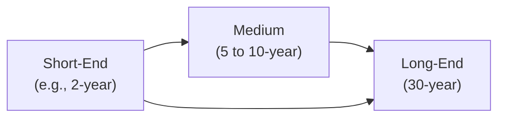
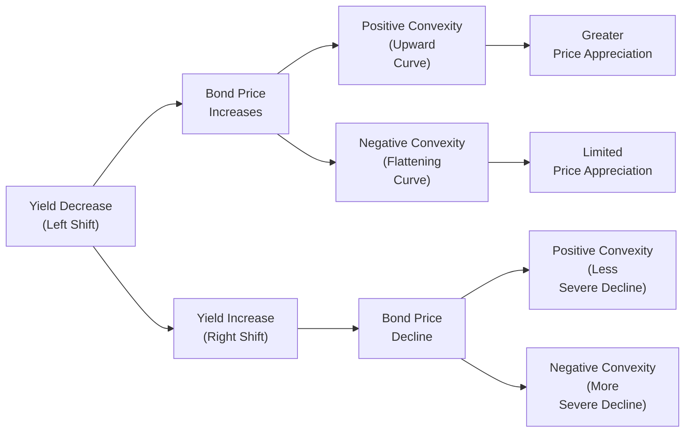

Imagine you’re chatting with a friend who’s super excited about building a bond portfolio (I know, not everyone’s idea of fun, but let’s go with it). They keep hearing terms like “duration,” “convexity,” and “key rate duration,” and they’re feeling a bit overwhelmed. Sometimes, they just nod and smile, but you can see it in their eyes—it’s all swirling around. Today, we’ll demystify these concepts. So pull up a chair, and let’s walk through how portfolio managers and aspiring CFA professionals use duration, key rate duration, and convexity to measure and manage interest rate risk in fixed-income portfolios.

Understanding the Basics of Duration  
Duration is, at its core, a single number that tells us how sensitive a bond (or a bond portfolio) is to changes in interest rates. The official definition often sounds fancy: it’s the weighted average time to receive a bond’s cash flows. In simpler terms, think of it as a measure of how quickly you can get your money back, adjusted for the time value of money. The longer the duration, the more sensitive the bond’s price is to interest rate fluctuations.

• If interest rates go up, bond prices usually go down. The higher your portfolio’s duration, the bigger the drop when rates climb.  
• If interest rates go down, bond prices typically go up. Higher duration means more significant price increases when yields decline.

But a single measure for interest rate sensitivity can be a bit limiting, especially when you’re dealing with a complex yield curve that doesn’t always shift in a neat parallel fashion. That’s where key rate duration comes in.

Key Rate Duration for More Nuanced Risk Assessment  
Key rate duration dissects the yield curve into separate maturity segments (like the 2-year, 5-year, 10-year, and 30-year “key” rates) and calculates how sensitive your bond or portfolio is to changes in each segment. Instead of just telling you that “on average, if rates move by 1%, this is how my portfolio might react,” key rate durations let you say, “if the 5-year point on the curve moves by 0.25%, how does that affect my portfolio’s value?”  

Key rate durations can be especially helpful if you anticipate non-parallel shifts—like the belly of the curve rising faster than the wings, or a pivoting around some midpoint. This approach helps you position your portfolio for a flattening or steepening yield curve, or for more localized movements at, say, the 10-year point. Who needs guesswork when you can see the precise effect at each part of the curve?

Convexity: Why Price Movements Aren’t Linear  
If you’ve ever graphed a bond’s price against interest rates, you might have noticed that the relationship isn’t a straight line. That’s because bonds, especially those with embedded options (like callable bonds or mortgage-backed securities), often have curvature to their price/yield relationship. This curvature is called convexity.

• Positive convexity means that as yields move, the bond’s price performs better than you’d expect just from duration alone.  
• Negative convexity—commonly found in callable bonds or MBS—means that price gains slow down (and sometimes even reverse) when rates fall, because the embedded call option or prepayment option becomes more likely to be exercised.

Effective Duration vs. Traditional Duration  
When we talk about convexity and bonds with embedded options, we often switch from “modified duration” to “effective duration.” Effective duration (or option-adjusted duration) factors in how likely it is that the embedded option will alter the bond’s cash flows.  

Just imagine a mortgage-backed security (MBS) with a big prepayment option. If rates drop significantly, homeowners might refinance, accelerating principal payments. Suddenly, the security’s duration shortens faster than you’d predict with a plain-vanilla duration model. Effective duration tries to keep track of that possibility, reflecting actual interest rate sensitivity more accurately.

Managing Aggregate Duration  
So, how do we put these concepts into action? Whether you’re running a liability-driven strategy (where the key is matching the durations of assets and liabilities) or trying to beat a benchmark, controlling your portfolio’s overall duration is a primary lever for managing interest rate risk.

Portfolio managers can:  
• Buy or sell longer-duration bonds (e.g., 10-year or 30-year Treasuries) to tilt duration.  
• Use derivatives like interest rate futures, interest rate options, or swaps to quickly adjust interest rate sensitivity without having to sell existing bonds.  
• Shift into shorter-duration securities if they expect rates to rise—or into longer-duration securities if they forecast rates to fall.

An Anecdote About Misjudging Duration  
Years ago, I was working with a colleague who loved ultra-long bonds—he was convinced interest rates would go lower. He loaded up on 30-year Treasuries in his personal investment account, ended up being wrong about the immediate timing, and the rates spiked for a bit. The drop in bond prices was painful. Eventually, rates did come down, but the short-term swings taught him a lesson about the risk of a high-duration portfolio. He told me he went three days without sleeping well. That’s the emotional side of messing with duration—sometimes real money is on the line, and break-even points for being “right” can be steep.

Sector and Quality Spreading  
Another layer on top of this is how interest rates interact with credit spreads—particularly if you hold corporate bonds. Credit spread durations measure how susceptible the bond’s price is to changes in yield due to changes in spreads, not just changes in the risk-free rate. During economic cycles, credit spreads might widen or tighten. A 5-year investment-grade corporate bond and a 5-year high-yield bond can each behave quite differently from a Treasury even if they have the same effective duration to the Treasury curve.  

It’s definitely worth noting that we can incorporate credit spread duration into the same key rate framework. Each maturity bucket can have a different credit spread sensitivity. This can matter big time if you’ve got a barbell structure with some short maturity high-yield and some long maturity AAA corporates, for instance.

Hedging with Derivatives  
If you’re trying to make quick changes to your portfolio’s duration—maybe you’re expecting a short-term spike in yields—you could either sell bonds or buy derivatives. Selling bonds is fairly direct but can trigger capital gains taxes, transaction costs, or disrupt your asset allocation.  

Using derivatives like:  
• Interest rate futures: Let you go short or long on a standardized contract that tracks a specific rate (like the 10-year Treasury note).  
• Interest rate swaps: Commonly used to pay fixed or receive fixed, altering your portfolio’s sensitivity to interest rate movements.  
• Options on interest rate futures: Provide a way to limit downside while enjoying upside (if you think yields might move a certain way but aren’t 100% certain).  

These tools allow you to dial in your desired duration, often with lower transaction costs and minimal portfolio disturbance.

Laddering Key Rate Exposures  
One advanced strategy is to manage exposures so that each key rate bucket aligns with the manager’s forecasts. For example, you might want overweight exposure around the 10-year key rate if you believe the middle of the curve will rally next quarter. Or maybe you prefer a barbell that focuses on exposures at the short-end (2-year) and long-end (30-year). With key rate durations, you can see how your holdings line up with each part of the yield curve.

The diagram below provides a conceptual overview of how different bonds (or bond buckets) might align with key points along the curve:

In practice, you’d place actual securities (or derivative exposures) in each bucket to achieve your target key rate durations.

Convexity Adjustments and Gamma  
Another technical idea is gamma, which is basically the rate of change of a bond’s delta (or price sensitivity). This matters a lot in options. For instance, interest rate swaptions (options on swaps) can have complex gamma exposures. It’s enough to say that if you have instruments that exhibit high gamma, your portfolio’s duration can shift more dramatically if interest rates move beyond certain thresholds. This can be good or bad, depending on if you own or have sold the option.

Stress Testing: Because Markets Don’t Move in a Vacuum  
A major best practice is to test your portfolio under various scenarios. Maybe you want to see what happens if the yield curve experiences a parallel shift up by 2%, or if the front end surges by 1% but the tail end remains pinned. By applying these scenarios, you see how your aggregate duration and key rate durations behave when yields shift in unexpected ways.  

Common pitfalls here include underestimating the impact of negative convexity in volatile markets or ignoring possible flight-to-quality dynamics that could compress or widen credit spreads. Another big risk is assuming correlation stability. In a crisis, correlations between different bond sectors (e.g., Treasuries, corporates, and emerging markets) can drastically change. Stress testing helps you see those correlations break in hypothetical extremes.

Example: Parallel Shift vs. 2s–10s Flattening  
Suppose your portfolio is long corporate bonds in the 5-year maturity sector with some exposure to 30-year Treasuries:

1. In a 100 bp parallel rise scenario, you check how your portfolio’s value changes. Duration gives you a quick estimate, but you also want to see how the spread might widen under stressful conditions if economic growth concerns arise.  
2. In a 2s–10s flattening scenario, you might see the 2-year yield rise by 0.50%, but the 10-year yield rise by only 0.20%. This scenario can be especially important if you have overweight positions in the 10-year bucket relative to the 2-year bucket. By analyzing key rate durations, you’ll figure out the net impact on your portfolio.  

If you see big negative outcomes in a flattening scenario, you might consider rebalancing or layering on a derivative hedge in the short end.

Practical Steps to Implement Duration and Convexity Management  
• Regularly recalculate your portfolio’s duration, key rate durations, and convexity, especially if you hold bonds with embedded options.  
• Confirm that your strategic duration target aligns with your liabilities (if liability-driven) or your total return objectives (if benchmark-driven).  
• Apply scenario analysis to capture the real-world possibility of non-parallel shifts, credit spread changes, and big rate moves.  
• Adjust your exposures accordingly: maybe use bond ladders, barbells, bullets, or a mix.  
• Monitor transaction costs, liquidity, and any constraints from your investment mandate or from the CFA Institute’s Code and Standards (for instance, ensuring your recommended trades align with a client’s risk tolerance).

Avoiding Common Pitfalls  
• Overlooking the impact of negative convexity, especially when dealing with mortgage-backed securities or callable bonds.  
• Relying solely on a single measure of duration and ignoring the distribution of maturities.  
• Neglecting credit spread duration, which can move independently of interest rate duration in certain environments.  
• Failing to manage or monitor derivative exposures properly—like forgetting that writing options can introduce negative convexity.  
• Inconsistent rebalancing that leads to mismatch between your risk exposure and your intended strategic targets.

A Quick Visual of Bond Price Sensitivity  
Below is a simplified illustration of bond price sensitivity to yield changes. Notice how the curve(s) can shift and how negative convexity differs from positive convexity:

In real portfolios, these changes can be subtle or extremely dramatic, depending on the instruments you hold.

Exam-Relevant Tips  
• Know your formulas for duration. The standard formula for modified duration is:


\text{Modified Duration} = \frac{\text{Macaulay Duration}}{1 + y}


  Where y = yield per period.  

• For instruments with embedded options, effective duration approximates the bond price sensitivity by taking into account possible changes in cash flows (like prepayments or calls). In practice, this is often derived from advanced modeling techniques or from vendor systems.  

• Memorize or deeply understand how key rate durations work. You might see an exam question that asks how to interpret or calculate the price impact for a 25 bp change at the 5-year key rate.  

• Watch out for scenario-based questions: the exam might hand you data on differences in short-end and long-end yield changes.  

• Use a consistent sign convention: yields go up, bond prices go down, everything else held constant. If an exam question flips this and introduces an extra variable, read carefully.  

Wrapping It All Up  
Duration, key rate duration, and convexity management aren’t just technical concepts for the sake of theory—they’re crucial for controlling portfolio volatility, fulfilling liabilities, and achieving outperformance, especially in the realm of active fixed-income management. By keeping a close watch on these metrics, portfolio managers can better navigate the ups and downs of interest rates, position for yield curve shifts, and use derivatives to fine-tune the risk/return profile.

If you’re studying for the CFA Level III exam, this stuff is a core building block of how fixed-income managers think and act. Even if it feels like you’re drowning in acronyms (OAS, MBS, CDS, etc.), keep practicing. Over time, you’ll see why these measures are so central to practically every serious fixed-income discussion out there.

References and Further Exploration  
• Fabozzi, F. J., “Dynamic Strategies for Managing Interest Rate Risk.”  
• Tuckman, B., “Fixed Income Securities” (for advanced duration and convexity modeling).  
• CFA Institute, Level III Curriculum on Key Rate Durations.  
• Research by various global asset management firms on convexity hedging.  
• Nelson-Siegel model (and its variants) for multi-factor yield curve analysis.  

Test Your Knowledge: Duration, Key Rate Duration, and Convexity Quiz



### Which metric best captures the bond’s sensitivity to non-parallel shifts in the yield curve?

- [ ] Modified Duration
- [x] Key Rate Duration
- [ ] Macaulay Duration
- [ ] Yield to Maturity

> **Explanation:** Key rate duration measures how the bond responds to changes at specific maturities on the curve, unlike modified or Macaulay duration, which usually assume parallel shifts.

### What is effective duration primarily designed to capture in bonds with embedded options?

- [ ] The time to recover the principal
- [x] Changes in cash flows when interest rates move
- [ ] The shape of the yield curve at specific maturities
- [ ] Market liquidity constraints

> **Explanation:** Effective duration incorporates the potential change in cash flows due to the exercise of embedded options, such as prepayments in mortgage-backed securities.

### Which of the following is a likely downside of a bond with significant negative convexity?

- [x] It limits the bond’s price appreciation when rates fall
- [ ] It enhances the bond’s price appreciation when rates rise
- [ ] It reduces interest rate risk
- [ ] It eliminates credit risk

> **Explanation:** Negative convexity (common in callable or MBS mortgages) caps gains when rates fall because the bonds are likely to be called or prepaid.

### In a barbell strategy, the portfolio is mostly allocated to:

- [x] Bonds at the short and long ends of the curve
- [ ] Bonds around a single maturity
- [ ] Medium-term maturity bonds only
- [ ] Bonds in the non-investment-grade sector

> **Explanation:** Barbell strategies concentrate holdings at the extremes, combining short- and long-term bonds while often reducing allocations to mid-maturities.

### When managing duration using interest rate derivatives, what is the advantage of swaps over selling physical bonds?

- [x] Swaps can adjust duration without altering the underlying bonds
- [ ] Swaps have zero transaction costs
- [x] Swaps never introduce counterparty risk
- [ ] Swaps aren’t influenced by yield curve shifts

> **Explanation:** Swaps enable duration adjustment without having to sell or buy physical bonds. However, they do have counterparty risk and come with transaction costs, though these might be smaller than fully trading out of bonds.

### If a bond portfolio's convexity is high and positive, how might the portfolio behave when rates move significantly?

- [x] It will experience larger price gains if rates fall and smaller price drops if rates rise
- [ ] The portfolio will lose more value if rates fall
- [ ] The bond prices will remain unchanged
- [ ] The rate environment won’t affect the portfolio at all

> **Explanation:** Positive convexity means the bond’s price is more favorable relative to linear duration estimates in both rising and falling rate environments.

### Which of the following scenarios best highlights the use of key rate durations?

- [x] Monitoring the portfolio’s sensitivity to a 5-year yield spike
- [ ] Calculating the time-weighted average of bond cash flows
- [x] Focusing only on the portfolio’s overall interest rate sensitivity
- [ ] Ignoring potential yield curve twists

> **Explanation:** Key rate durations allow a manager to isolate how changes in various segments of the yield curve affect the portfolio. Calculating a single duration or ignoring yield curve twists wouldn’t accomplish that.

### In scenario analysis for an expected flattening of the yield curve, which yields are likely to rise more?

- [x] Short-term yields
- [ ] Long-term yields
- [ ] Yields across all maturities equally
- [ ] None of the above

> **Explanation:** Flattening often involves short-term yields increasing more than long-term yields, reducing the slope of the curve.

### A mortgage-backed security exhibiting negative convexity may:

- [x] Exhibit limited price upside when yields fall due to prepayments
- [ ] Show unlimited price upside if interest rates drop sharply
- [ ] Resist price gains altogether if yields drop
- [ ] Be unaffected by movements in interest rates

> **Explanation:** Prepayment risk reduces the MBS’s price appreciation potential when yields drop, thus negative convexity.

### If a portfolio manager expects a parallel shift in the yield curve downward but wants to limit major downside risk in case rates rise unexpectedly, which derivative tool might be most appropriate?

- [x] Buying interest rate call options (calls on bonds or futures)
- [ ] Selling interest rate futures
- [ ] Paying fixed in an interest rate swap
- [ ] Writing put options on bonds

> **Explanation:** Owning call options allows the manager to profit if rates fall (bond prices rise) but limits losses if rates go up because the option can simply expire.


