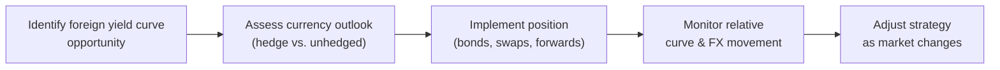

## Overview

Multi-currency yield curve strategies might sound super fancy at first glance, but in many ways, they’re just what you might expect: They combine yield curve positioning with currency management in an effort to capture cross-border interest rate differentials. Admittedly, that’s a mouthful. Essentially, when you buy bonds across different countries, you’ll face two principal risks: interest rate risk and foreign exchange (FX) risk. Even if the underlying yield curves for two countries appear similar, the currencies can introduce starkly different return profiles (and risk). In this section, we’ll navigate these strategies step by step, discussing concepts like covered interest rate parity, cross-currency spreads, and the role that central bank policies can play. We’ll also look at hedging techniques, diversification benefits, and how to identify global relative value opportunities.

I remember being a new analyst on a global fixed-income desk: I naively thought that owning a high-yielding emerging-market bond was all that mattered if I wanted to earn a bit more yield. Then—boom—the local currency moved against our portfolio, wiping out those interest gains nearly overnight. It taught me that ignoring currency risk can be like paddling upstream in the wrong boat.

## The Currency Dimension in Global Fixed-Income

In a domestic portfolio, investors focus on interest rate shifts, sector exposures, or credit risk. Once you cross borders, you must separate the bond’s performance from how the currency might behave. In practice, you can invest away from your home country if you believe there’s value in the yield curve shape—or because you like the macroeconomic prospects of that foreign economy—but your ultimate return can be heavily influenced by currency fluctuations.

For instance, a U.S.-based investor might buy a 10-year German Bund if they believe the European Central Bank (ECB) policy will drive rates even lower. However, any depreciation in the euro relative to the U.S. dollar could erode (or even negate) gains from the yield curve movement. Likewise, if the euro were to appreciate, that same currency exposure could boost returns beyond what the yield and price changes would indicate.

## Covered Interest Rate Parity

One key theoretical idea is covered interest rate parity (CIP). The logic says there shouldn’t be a free lunch from simultaneously buying a foreign currency bond and hedging the currency in the forward market. Mathematically, CIP can be expressed as:

$$
(1 + i_D) = \frac{F}{S} \times (1 + i_F)
$$

where:

• \\( i_D \\) is the domestic interest rate  
• \\( i_F \\) is the foreign interest rate  
• \\( S \\) is the current (spot) exchange rate in units of domestic currency per unit of foreign currency  
• \\( F \\) is the forward exchange rate

In a perfect frictionless world—no transaction costs, no capital constraints—this equation means you shouldn’t be able to lock in an arbitrage profit by investing in foreign denominated assets and covering your currency exposure in the forward market. Of course, real markets have transaction costs, capital requirements, occasional liquidity crunches, and so forth. So you might see minor deviations from CIP, represented by the so-called “FX basis.” Investors who know these markets intimately sometimes exploit those basis differentials via cross-currency swaps or other instruments.

## Cross-Currency Spreads and Relative Curve Analysis

While domestic yield curve strategies revolve around positioning along the curve (e.g., a “barbell” vs. “bullet” strategy), multi-currency approaches add another dimension: comparing yield curves across different countries. That includes measures like the spread between U.S. Treasuries and German Bunds, or JGBs (Japanese government bonds) and Gilts (UK). Tracking these cross-currency sovereign spreads offers insight into how bond markets respond to distinct economic conditions or monetary policies.

If you see, for example, that U.S. Treasuries yield 4% while Bunds yield 2%, you might wonder why. It could reflect interest rate expectations (the Fed might be on a tightening path while the ECB is easing), inflation differentials, or broader risk premiums. Some cross-currency opportunities arise when these spreads deviate from historical patterns or from your macro outlook. You can go “long” the country whose yield you believe will fall relative to the other, effectively anticipating a convergence in spreads.

Additionally, you can consider whether to hedge out the currency exposure of the bond you’re buying or keep it partially or totally unhedged—depending on whether you expect currency appreciation or depreciation.

## Tools for Hedging Currency Exposure

It can be fascinating (and a bit nerve-racking) juggling currency risk with yield curve positioning. If the currency risk is not part of your strategy, you typically want to hedge it away through instruments like forward FX contracts or cross-currency swaps.

• Forward FX Contracts. You agree today to exchange currency in the future at a prespecified rate. This helps you lock in the currency conversion and reduces or eliminates the uncertainty of unfavorable currency moves.

• Cross-Currency Swaps. You effectively exchange one set of interest and principal payments in one currency for another set in a different currency. For example, if you hold a euro-denominated bond but don’t want euro risk, a cross-currency swap can replicate a “synthetic” domestic bond by swapping your interest and principal flows back into your home currency.

You might, of course, choose to leave the exposure unhedged if your analysis suggests the currency could appreciate or, in the short run, provide positive carry. But that’s obviously higher risk because currency can sometimes move more quickly than bond yields.

## Diversification and Multi-Currency Yield Curves

One of the beautiful things about building a global fixed-income portfolio is diversification. Different economies go through different cycles. When the U.S. is in a tightening phase, the Bank of Japan might still be on ultra-accommodative monetary policy. Or maybe the European Central Bank is in the midst of quantitative easing while the People’s Bank of China is leaning on reserve requirements to influence the domestic market.

Because yield curves in these countries might not all move in tandem, exposure to multiple currency yield curves can even out the bumps in performance, especially if you hedge away the currency risk you don’t want. The result can be a more stable portfolio return profile—though remember that diversification is never a guarantee of higher returns or lower risk.

## Central Bank Policies and Yield Curve Divergence

In analyzing multi-currency strategies, it’s crucial to monitor central banks, each with its own mandates and tools:

• U.S. Federal Reserve focuses on dual mandates of full employment and stable prices.  
• ECB has an objective of price stability and typically shows caution around inflation in the Eurozone.  
• Bank of Japan historically battles deflation and implements yield curve control.  
• People’s Bank of China relies on a mix of interest rate policy, reserve requirements, and currency controls.  

All these policy differences can produce yield curve shapes that diverge significantly. If the ECB is employing negative rates while the Fed is raising rates, you might see dramatic differences in the slope and shape of their respective yield curves. This can create spread or curve trades: for instance, going long Bunds and short U.S. Treasuries if you expect the yield differential to narrow.

## Emerging vs. Developed Markets

Managing a multi-currency yield curve strategy in developed markets (DM) is often a little more predictable. Central banks in these regions have well-established policy frameworks, fairly transparent communication channels, and deep bond markets.

Emerging markets (EM), on the other hand, can offer higher yields—who doesn’t like more yield, right?—but they come with higher volatility. They’re sensitive to capital flows, geopolitical events, local liquidity constraints, and sometimes abrupt changes in policy direction. Currency swings can be intense. So, if you consider EM yield curve plays, you must weigh the potential for capital appreciation or yield windfall against the risk of a sharp currency move or an unexpected rate hike by the EM central bank.

## Relative Value Analysis Across Borders

To do relative value analysis, many managers use multi-factor models that combine:

1. Interest Rate Differentials: Which central bank is in a tightening vs. easing cycle? Where is the carry more attractive?  
2. Curve Shape: Are you expecting a steepening or flattening of a particular yield curve relative to another?  
3. Currency View: Do you see one currency strengthening or weakening due to macro or flow-related factors?  
4. Market Liquidity: Is one bond market more liquid than another, giving you better exit opportunities?  

A typical approach might be:  
• Identify a country where short rates seem poised to fall and yield-curve flattening is likely.  
• Evaluate the currency outlook.  
• If you’re bullish on the currency, consider leaving it unhedged. If not, put on a hedge.  
• Compare it to another market you suspect will remain static or whose yields might rise relative to your target.  
• Build your trade structure around that differential.  

Profit (if successful) comes from improvements in relative yield curve position and possibly from currency changes—if you keep that exposure.

## A Visual Overview of Multi-Currency Strategies

Below is a simple flowchart to illustrate how an investor can think about multi-currency yield curve strategies, from identifying the opportunity to deciding on hedging or not:

## Practical Examples

Let’s consider a straightforward scenario: You’re a euro-based investor and expect that U.S. Treasury yields will decline because you foresee an upcoming Fed rate cut. Currently, the 10-year U.S. Treasury yields 4%, while the 10-year German Bund yields 2%. Let’s assume the EUR/USD spot is 1.10, and the forward EUR/USD for one year is 1.08, reflecting the higher U.S. interest rate environment.

• If you buy U.S. Treasuries, you can either hedge that 4% yield back into euros or remain unhedged.  
• If you use a forward to hedge, you lock in an FX conversion at approximately 1.08 in a year. The forward might significantly reduce your net pickup, thanks to covered interest rate parity.  
• If you stay unhedged and the dollar falls against the euro (the rate moves from 1.10 to say 1.15), your euro conversion on maturity might yield fewer euros, offsetting your bond gains. Conversely, if the USD appreciates to 1.05, it could amplify your total return in euro terms.  
• Making your decision requires analyzing both interest rates and currency outlook.  

In practice, there might be partial hedges. Maybe you hedge half of your position, so you retain some currency upside but reduce the total risk. Active managers frequently tweak the hedges based on currency models or evolving macroeconomic data.

## Common Pitfalls

• Ignoring Transaction Costs: Currency forwards and swaps have bid-ask spreads and sometimes carry additional costs, especially in less-liquid currencies.  
• Overlooking Local Regulations: In some EM countries, derivatives might be tightly regulated or restricted.  
• Underestimating Correlation Shifts: Just because two yield curves historically moved in sync doesn’t guarantee they always will. The correlation can break down in certain macro environments.  
• Overexposure to One Currency: Make sure you’re well diversified and aren’t inadvertently doubling-down on the same currency or region.  

## Best Practices and Implementation Tips

• Define explicit currency views and decide, in advance, which exposures you’ll hedge and why.  
• Use scenario analyses and stress tests—particularly for EM exposures—because currencies can swing wildly.  
• Monitor central bank communications. Even subtle hints of a policy shift can cause big moves in yields and exchange rates.  
• Document your cross-currency hedges carefully. Cross-currency swaps can be complex, so ensure you fully understand the net effect on your portfolio.  

## Exam Tips for CFA Candidates

• Focus on how covered interest rate parity formulas might show up in both item sets and constructed responses. You might be asked to calculate implied forward rates or identify arbitrage opportunities.  
• Understand how to interpret cross-currency spreads and the rationale for hedged vs. unhedged positions in exam scenarios.  
• Be ready to discuss how central banks’ divergent policies lead to shape differences in yield curves—and how that ties into multi-currency portfolio strategies.  
• If emerging markets come into play, think about the interplay of higher yields, currency volatility, and capital flow constraints.  
• Time management in the exam is critical: If you see a multi-part question about building a global fixed-income strategy, break down each step (interest rate expectation, currency outlook, hedging approach, etc.) and address them systematically.

## References and Further Reading

• CFA Institute, “Currency Management: An Introduction,” Level III curriculum.  
• Papadia, F. & Välimäki, T., “Central Banking in Turbulent Times.”  
• Fabozzi, F. J., “Bond Portfolio Management in a Global Context.”  
• BIS Working Papers on multi-currency yield curve modeling.  
• IMF Publications on emerging market debt strategies.  

---

## Test Your Knowledge: Multi-Currency Yield Curve Strategies Quiz



### Which statement best describes the currency dimension in a global bond portfolio?

- [ ] Currency differences often have no impact on returns because of interest rate parity.
- [x] Currency fluctuations can materially affect total returns, sometimes more than interest rates.
- [ ] Currency risk only matters if hedges are unavailable.
- [ ] Currency risk usually cancels out over long-term horizons.

> **Explanation:** Even if interest rate parity suggests no free lunch in theory, real-world markets show currency swings can significantly impact total returns over any practical investment horizon.

### Which of the following correctly reflects the concept of covered interest rate parity?

- [ ] Spot rate equals forward rate.
- [x] (1 + i₍D₎) = (F / S) × (1 + i₍F₎).
- [ ] All currencies must appreciate at the same rate.
- [ ] One cannot hedge currency exposures.

> **Explanation:** Covered interest rate parity states that the forward premium or discount should offset the interest rate differential, formalized by (1 + i_D) = (F/S) × (1 + i_F).

### A US investor purchases Japanese government bonds (JGBs) due to an expected BoJ rate cut. What is a key additional factor to consider?

- [x] How to manage USD/JPY currency exposure via forwards or swaps.
- [ ] How to maximize the portfolio’s exposure to US Treasuries.
- [ ] The potential for negative rates in the Eurozone.
- [ ] Duration of US MBS securities.

> **Explanation:** A US investor must decide whether to hedge or remain exposed to fluctuations in USD/JPY because currency moves can overshadow the yield advantage.

### Which of the following is an advantage of multi-currency yield curve strategies?

- [ ] They guarantee profits when a single yield curve flattens.
- [x] They can provide diversification benefits when different economies follow different interest rate cycles.
- [ ] They eliminate all FX risk automatically.
- [ ] They are only suitable for government securities.

> **Explanation:** Different countries’ yield curves may not move in tandem, which can smooth portfolio returns—an essential diversification benefit.

### When would an investor prefer to leave currency exposure unhedged?

- [x] If the investor has a positive outlook on the foreign currency and wants potential FX gains.
- [ ] If the foreign currency is expected to fall significantly.
- [x] If they anticipate significant correlation benefits from the foreign currency movement.
- [ ] When facing extremely high transaction costs.

> **Explanation:** Investors might remain unhedged if they seek currency appreciation gains or diversification benefits. However, this increases overall risk.

### Emerging market yield curve strategies typically involve higher yields coupled with:

- [x] Higher currency volatility and geopolitical risk.
- [ ] Minimal default risk.
- [ ] Predictable regulatory environments.
- [ ] Invariably stronger currencies than developed markets.

> **Explanation:** EM bonds can offer attractive yields, but you must weigh that against higher currency volatility, geopolitical, and policy risks.

### Cross-currency swaps are used primarily for:

- [x] Exchanging principal and interest in one currency for principal and interest in another currency.
- [ ] Eliminating default risk in an EM bond.
- [x] Converting foreign-currency cash flows into a preferred domestic currency.
- [ ] Locking in equity returns.

> **Explanation:** Cross-currency swaps let you exchange cash flows in different currencies, effectively hedging currency exposure or creating synthetic exposures.

### A portfolio manager expects US yields to rise and Eurozone yields to drop. Which strategy might they pursue?

- [x] Short US Treasuries, long German Bunds, hedging or selectively exposing EUR/USD.
- [ ] Long both Treasuries and Bunds, fully unhedged.
- [ ] Avoid cross-currency trades entirely to minimize effort.
- [ ] Short Bunds in anticipation of ECB rate hikes.

> **Explanation:** If the manager forecasts diverging yields—US yields up, Eurozone yields down—they can profit from a relative value approach, e.g., short Treasuries and long Bunds.

### Which is an example of a cross-currency sovereign spread trade?

- [x] Long Japanese government bonds vs. short German Bunds, based on anticipated yield differential changes.
- [ ] Buying only 2-year US corporate bonds for carry.
- [ ] Purchasing exclusively EM local currency debt.
- [ ] Taking a directional bet on one single yield curve.

> **Explanation:** A cross-currency sovereign spread trade involves going long one country’s government bonds while shorting another’s, hoping the yield differential moves in your favor.

### True or False: Carry trades aim to borrow in a high interest rate currency and invest in a low interest rate currency to profit from rate differentials.

- [ ] True
- [x] False

> **Explanation:** A carry trade typically targets borrowing in a low-yield currency and investing in a high-yield currency, seeking profit from the yield spread.




