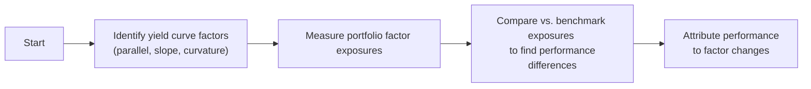

## Introduction and Context

Have you ever looked at your fixed-income portfolio’s return and wondered how much of it was driven by, say, overall shifts in interest rates versus subtle changes in the shape of the yield curve? I remember the first time I tried breaking down these components. It felt like peeling layers off an onion—each layer represented something like duration exposure, curve slope, or credit risk. And once I started peeling, I realized there were even more layers, like residual factors I couldn’t explain.

Measuring and attributing performance from yield curve positioning is all about understanding which parts of the yield curve contributed (or detracted) from your returns. This practice helps fix-income managers fine-tune their strategies, identify strengths or weaknesses, and present clear explanations to clients or stakeholders.

Below, we’ll explore performance attribution basics, yield curve factor models, residual returns, frequency considerations, data essentials, risk adjustment, and best practices for reporting. Whether you’re new to the subject or a seasoned portfolio manager, hopefully you’ll come away confident about how to measure yield curve contributions—and maybe have a few personal anecdotes to share next time, too.

## Performance Attribution Basics

When we talk about performance attribution in bond portfolios, it’s basically slicing your total return pie into distinct slices: interest rate (duration) effect, yield curve shape effect, credit effect, currency effect (if you’re dabbling in multi-currency markets), and possibly more. The further you break it down, the better you understand the “why” behind your performance.

• Interest Rate (Duration) Effect:  
  This is the portion of your return (or loss) that comes from overall changes in interest rates. If the entire yield curve shifts up or down in parallel, your duration exposure will determine how much it hurts or helps your portfolio.

• Yield Curve Shape Effect:  
  Not every yield curve move is parallel. Sometimes shorter maturities move up while longer maturities stay flat, or vice versa. Shape changes (often categorized into slope and curvature) can be a major source of active returns if you position the portfolio to benefit from these changes.

• Credit Effect:  
  Even if it’s a government bond, there’s often a little spread difference between sovereign issues. For corporate bonds, municipal bonds, or emerging market debt, the credit spread portion might be large. The question is whether or not your credit selections, over-weights, or under-weights contributed to higher returns relative to your benchmark.

• Currency Effect:  
  In a multi-currency bond portfolio, currency fluctuations can overshadow yield curve effects. Sometimes you can hedge that currency risk, or maybe you choose to hold it. Either way, you want to isolate how these exchange rate movements contributed to performance.

A well-structured attribution system (or software) breaks down your total portfolio return into these building blocks, letting you see where you—intentionally or otherwise—earned returns.  

## Yield Curve Attribution Models

Now, let’s dig into the heart of yield curve attribution. Many fixed-income shops use multi-factor risk models to break down performance into parallel shifts, slope changes, or curvature changes. On top of that, some folks use key rate durations, also known as partial durations, to see how different maturity segments contributed.

### Key Rate Durations and Partial Durations

Key rate durations measure how sensitive your portfolio is to yield movements at specific maturities, such as 2-year, 5-year, 10-year, and 30-year points on the curve. They’re like magnifying glasses that focus on only one section of the curve at a time. If the 5-year portion of the curve changes by five basis points while other segments remain unchanged, the partial duration at that key rate captures the immediate impact on portfolio value.

Mathematically, one approach is:


\Delta \text{Value} \approx - \sum_{k=1}^{K} \left( D_{k,\text{portfolio}} \times \Delta y_k \times \text{(Market Value)} \right)


Where:  
• \\( D_{k,\text{portfolio}} \\) is the partial or key rate duration at the kth node (e.g., 2-year node).  
• \\( \Delta y_k \\) is the yield change at that node.  
• \\( K \\) is the number of key rate nodes used.  

By attributing the return (or change in the market value) across these nodes, we can see exactly which parts of the yield curve helped or hurt us.

### Parallel Shifts, Slope, and Curvature

Alternatively, some multi-factor models define factors (or betas) for parallel shift, slope, and curvature. For instance:  
• Parallel shift factor: Weighted average effect of the entire yield curve shifting up or down.  
• Slope factor: The difference in yields between two points on the curve, like 2-year vs. 10-year.  
• Curvature factor: The difference between short, intermediate, and long rates (for example, a “butterfly” strategy).

In practice, you might see all three factors in action simultaneously. If you’re short duration at a time when rates rise across all maturities (parallel shift), you might outperform or underperform depending on how big those changes are. If you’re betting on a flattening yield curve (slope), you focus on a specific part of the curve, maybe overweighting 10-year bonds and underweighting 2-year bonds.

## Benchmark Comparison

Of course, none of this means much unless you compare your performance to a relevant benchmark. A simple example might be:  
• Benchmark: Bloomberg U.S. Aggregate Bond Index  
• Portfolio: Active bond strategy with slight overweight in long-duration Treasuries  

When you measure performance, break down the difference between your portfolio’s return and the benchmark’s return (that’s the “active return”). Then map your active return to yield curve positions:

• Did you have a different duration stance than the benchmark?  
• Did you emphasize a mid-curve slope position the benchmark didn’t have?  
• Did you hold a different credit mix?

By explaining how each factor contributed to the performance gap between your portfolio and the benchmark, you can highlight good calls while acknowledging the ones that went sideways.  

Below is a simple flowchart that outlines the overall thought process from identifying curve factors to final attribution:

## Residual Returns

No matter how sophisticated your model is, you’ll usually find some part of the return that doesn’t fit neatly into known yield curve or credit factors. That’s the “residual return.” It could reflect:

• Model Limitations: Maybe your factor model doesn’t account for intraday volatility or certain exotic bond features.  
• Trading Costs: Real trades incur bid-ask spreads, transaction costs, or price impacts.  
• Unique Security Features: Callable or putable bonds, mortgage-backed securities, or structured notes often have optionality that standard factor models don’t handle well.  
• Alpha (hopefully): If you consistently see residual returns and you trust your model, those “mystery” returns might be your manager skill. Or maybe they’re a combination of unknown risk exposures that the model didn’t capture.

Monitoring these residual returns helps you figure out if your model is missing something or if you truly generated skill-based alpha. If the same “unexplained” portion shows up every month, you might want to refine your approach or add factors to your model.

## Periodic vs. Continuous Attribution

Yield curves don’t just move once a quarter—they can move daily or even multiple times a day if something triggers a massive market reaction. So, how frequently should you do attribution?

• Periodic (Monthly or Quarterly): This is the most common approach. You measure moment-in-time performance at month-end (or quarter-end) and decompose it. This method is simpler and doesn’t require capturing minute-by-minute data. But you might miss short-term moves that reversed within the period.

• Continuous: A more sophisticated (and data-intensive) method that tracks daily changes in yields, durations, and positions. You see exactly how certain trades or short-term adjustments contributed, but it can be time-consuming. In practice, many managers do monthly or weekly reporting but track daily data for internal diagnostics.

For exam or theoretical discussions, remember that the more frequent your attribution, the more granular your insights—but the heavier the data demands.

## Data Requirements

Let’s be honest: if your yield and price data are inaccurate, your attribution results will be useless. Even a five basis point error in the data can drastically distort partial duration estimates or factor exposures. I once had a scenario where an incorrect feed for a specific corporate bond left us scratching our heads—only to find we were using stale yield data. That taught me the importance of triple-checking data feeds.

Key data points include:

• Accurate yield curves across maturities  
• Bond-level prices, accrued interest, and factor loads (e.g., duration, convexity)  
• Benchmarks’ underlying bond exposures  
• Any relevant spread or credit rating information  
• Currency rates if your portfolio has foreign exposures  

Automated systems that feed real-time or end-of-day data from a reliable provider (e.g., Bloomberg) are common, but always do sanity checks.

## Risk-Adjusted Performance

Sometimes we only look at absolute or relative returns. But we should also measure how much additional risk was taken to achieve them. Did you load up on interest rate risk (duration) or credit risk just to beat the benchmark? Is that outperformance worth it when adjusted for volatility or Value at Risk (VaR)?

• Volatility-based measures: Compare the standard deviation of returns or the portfolio’s beta to the yield curve factors.  
• VaR-based measures: Use historical or parametric VaR to see how likely a big drawdown could be when yields or spreads move unexpectedly.  
• Sharpe or Information Ratios: You might see if a manager’s yield curve plays produce better risk-adjusted returns than a simple buy-and-hold approach.

It’s great if you outperformed your benchmark by 50 basis points, but the next question is always: “At what cost, in terms of risk?” That’s why risk-adjusted attribution can be even more illuminating.  

## Performance Reporting and Best Practices

So you’ve done your analysis, crunched the yields, pinned down duration bets, and found your residual alpha. How do you present these findings in a clear, meaningful way?

• Include a Factor Breakdown Table: Show each factor (parallel shift, slope, curvature, credit, currency) with associated contributions.  
• Highlight Over- or Underweight Positions vs. the Benchmark: A simple bar chart can do wonders visually.  
• Provide a Short Narrative: Summarize why certain positions succeeded or failed and discuss forward-looking views.  
• Discuss Residual or Unexplained Returns: Acknowledge that some portion might be due to model limitations or that it’s truly alpha.  
• State Risk Measures Alongside Returns: Show standard deviation of returns, maybe a Sharpe ratio, or relative VaR.  

In practice, you might present this monthly or quarterly in board meetings, client meetings, or internal strategy sessions. Transparency builds trust, and it educates stakeholders about the complexities (and skill) involved in fixed-income management.

## Putting It All Together

At the end of the day, yield curve performance measurement and attribution is about connecting the dots from your portfolio’s strategy—like “I’m going to overweight the 30-year segment”—to the realized return you generate. It’s about providing a narrative that ties together positions, outcomes, and any ineffable alpha. 

Sure, it can get complicated. But the clarity it provides is worth the effort. You’ll spot where you excel, where you might need to improve, and how external factors (like macro-driven yield curve shocks) fit into the puzzle. 

## References

• CFA Institute, “Performance Evaluation” readings in Level III.  
• Grinold, R. & Kahn, R., “Active Portfolio Management.”  
• Bloomberg tutorials on fixed-income attribution analysis.  
• GARP (Global Association of Risk Professionals) references on risk-adjusted performance.  
• Investopedia (on partial duration, performance measurement).

## Exam Tips

• Make sure you know how to decompose returns attributable to parallel shifts, slope, and curvature using either key rate durations or factor-based approaches.  
• Practice with a variety of sample bond portfolios vs. benchmarks—especially focusing on how to interpret results.  
• Watch out for “unexplained residual” returns. The exam might ask for reasons behind them and potential remedies.  
• Understand how to handle multi-currency portfolios; the currency effect can overshadow yield curve changes.  
• Be prepared to discuss how frequency (monthly vs. continuous) changes the results or the complexity of attribution analysis.  

And remember: the more precisely you can measure what drives returns, the better you can steer your strategy in the future.

---

## Test Your Knowledge: Yield Curve Positioning Performance Quiz



### In performance attribution for fixed-income portfolios, which of the following is typically separated out from the yield curve shape effect?

- [x] Duration effect
- [ ] Convexity effect
- [ ] Currency effect
- [ ] Leverage effect

> **Explanation:** Typically, the duration (interest rate) effect is treated separately from the yield curve shape effect. Duration quantifies the overall sensitivity to parallel shifts, while the shape effect captures slope or curvature changes.

### When using key rate durations, which maturity segment typically gets highlighted for analyzing a flattening strategy?

- [x] Short-term vs. long-term rates (e.g., 2-year vs. 10-year)
- [ ] The difference between high yield and investment grade
- [ ] The nominal yield compared to real yield
- [ ] The difference between corporate bonds and sovereign bonds

> **Explanation:** A flattening strategy usually focuses on differences between short-term and long-term rates, such as 2-year vs. 10-year. Key rate durations help isolate these sensitivities.

### In a multi-factor yield curve model, the “curvature” factor is best described as:

- [ ] An overall parallel shift in interest rates
- [x] A factor that measures the “bend” in the yield curve around intermediate maturities
- [ ] A factor capturing default risk
- [ ] A factor explaining day-count conventions

> **Explanation:** Curvature captures how the middle of the curve moves relative to the short and long ends, often referred to as a butterfly effect.

### Which of the following would most likely increase the residual return in a yield curve attribution analysis?

- [ ] A well-calibrated factor model
- [x] Uncaptured optionality or trading costs
- [ ] A consistent parallel yield curve shift
- [ ] Inclusion of advanced slope and curvature factors

> **Explanation:** Residual returns often arise from optionality (such as embedded calls) or transactional frictions not incorporated in the model.

### Regarding the frequency of performance attribution, which statement is most accurate?

- [x] More frequent attribution captures tactical moves but increases data demands
- [ ] More frequent attribution is less accurate and more prone to error
- [x] Less frequent attribution may obscure short-term portfolio decisions
- [ ] Continuous attribution is rarely used by any professionals

> **Explanation:** Frequent (e.g., daily) attribution reveals how short-term decisions play out, but requires more robust data-tracking. Less frequent (monthly or quarterly) is simpler but can miss short-lived fluctuations.

### Suppose a portfolio’s active return from yield curve strategies is higher than the benchmark by 25 basis points, but with significantly higher volatility. Which measure would you consult to determine if the outperformance is worthwhile?

- [x] Sharpe or Information Ratio
- [ ] Tracking error alone
- [ ] Credit rating improvements
- [ ] The slope factor

> **Explanation:** Risk-adjusted measures (like the Sharpe or Information Ratio) show whether the extra return justifies the added volatility.

### In yield curve attribution, partial durations are useful for:

- [x] Evaluating the sensitivity to discrete segments of the yield curve
- [ ] Capturing the entire yield curve with a single factor
- [x] Breaking out performance aligned with individual maturities
- [ ] Ignoring the shape of the curve

> **Explanation:** Partial durations (or key rate durations) let you analyze individual maturity segments, highlighting which specific areas contributed to performance.

### When comparing a bond portfolio’s yield curve performance to a benchmark, the active return is generally:

- [x] Portfolio return minus benchmark return
- [ ] The portfolio’s overall standard deviation
- [ ] The portion of returns from currency changes only
- [ ] The alpha from credit selection

> **Explanation:** Active return is the straightforward difference between the portfolio’s return and the benchmark’s return during the same period.

### A residual return that appears consistently positive in each reporting period might indicate:

- [x] Skill-based alpha or missing model factors
- [ ] A data quality issue that randomly shifts returns negative sometimes
- [ ] An inverse relationship with slope factors
- [ ] Zero credit risk in the portfolio

> **Explanation:** A consistently positive residual suggests it might be actual alpha—assuming your model is otherwise robust—or it could mean you haven't accounted for important risk factors.

### In yield curve attribution, a portfolio manager’s success with slope positioning means:

- [x] True
- [ ] False

> **Explanation:** If the manager’s slope bets (e.g., anticipating a steepening or flattening) contributed positively to the performance differential relative to the benchmark, we can consider that a success in slope positioning.


