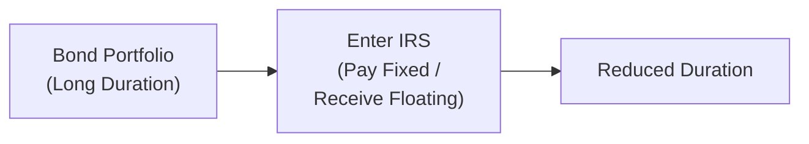
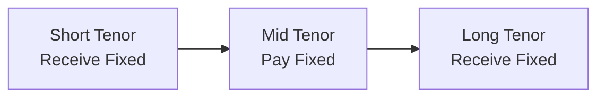

## Overview

When you think about actively managing fixed-income portfolios, one of the first questions you might ask is: “How do I control the risk that comes from changing interest rates without constantly buying or selling large batches of bonds?” Enter interest rate swaps and other overlay strategies. These tools let you adjust your portfolio’s sensitivity—or duration—to interest rate movements in a more nimble, cost-effective manner than always reshuffling physical securities.

You might recall moments in your career (or studies) when market fluctuations happened so fast that physically trading bonds wasn’t feasible, or perhaps the liquidity just wasn’t there. I’ve been there too. That’s pretty much where swaps can step in to help. They’re called “overlay strategies” because they layer on top of your existing positions without requiring you to change the actual bond holdings below.

Below we explore the most common interest rate swaps, compare them with futures, discuss forward rate agreements (FRAs), walk through curvature overlay trades (like “butterfly” strategies), show how credit swaps can come into play, and cover important risk monitoring and regulatory considerations. If it sounds a bit mind-bending, don’t worry—we’ll break it down step by step.

## Interest Rate Swaps: The Foundation

An interest rate swap usually involves exchanging fixed-rate payments for floating-rate payments (or the other way around). Let’s define it more concretely:

• Pay Fixed/Receive Floating: You agree to pay a fixed interest rate on a notional amount and receive a floating rate (often tied to LIBOR, SOFR, or another reference). If rates go up, your position gains because you’re receiving a higher floating rate. Meanwhile, your fixed payment remains the same. This effectively reduces the overall duration of your portfolio.  
• Receive Fixed/Pay Floating: You lock in a fixed rate you receive, and you pay the floating rate. If interest rates go down, you benefit because the floating rate you pay decreases, while your fixed rate is locked in. That means you effectively increase your portfolio duration.

Conceptually, executing an interest rate swap is somewhat like adjusting the “dial” on your interest rate exposure. Let’s say you manage a big corporate bond portfolio with an average duration of seven years, and you anticipate an upward move in rates. Instead of scrambling to sell a bunch of bonds (possibly at poor prices), you can enter a pay-fixed swap to offset part of your duration. You might keep your original portfolio intact—still earning coupon income—and simply overlay a pay-fixed swap to reduce overall duration. That’s the real magic: you haven’t touched your underlying bonds at all.

Here’s a simple diagram of how this swap overlay can look:

A bond portfolio has a long duration (A). By entering a pay-fixed, receive-floating interest rate swap (B), the manager reduces overall duration (C) because receiving floating rates can offset losses if rates rise.

## Overlay Strategies: The Big Picture

Swap overlays are powerful because they let you maintain your core cash positions—like corporate bonds, Treasuries, or mortgage-backed securities—and then quickly implement a tactical shift in interest rate exposure. This concept is often referred to as a “portfolio overlay” or “derivatives overlay.”

One scenario that’s pretty common: let’s say your fundamental research indicates rates are poised to rise soon. You might do a pay-fixed swap to offset your duration. If, on the other hand, your forecast says rates will drop, you could do a receive-fixed swap to turbocharge your exposure to that falling rate environment.

But there’s more to yield curve management than simply lengthening or shortening your duration across the board. You can also use overlays to manage exposure to different parts of the yield curve (short end vs. long end) or to exploit changes in the shape of the curve (steepening vs. flattening). That might mean combining multiple swaps at different maturities, or even employing “curvature” trades like butterflies. 

## Pay Fixed vs. Receive Fixed: Tying It to Duration

• Pay Fixed/Receive Floating → Decrease Duration  
• Receive Fixed/Pay Floating → Increase Duration  

One easy way to remember this is to consider that paying a fixed rate locks in a cost if rates rise, so that’s beneficial when you expect higher rates. Meanwhile, receiving fixed is advantageous when you think rates might fall because you’re locked into a higher fixed rate compared to what might become a lower floating rate environment.

In a more advanced scenario, you might do a combination—pay fixed at the short end of the curve while receiving fixed at the long end—if you expect a certain part of the curve to move differently from another. We’ll talk about that in the curvature overlay section.

## Swap vs. Bond Futures

Swaps aren’t the only game in town when it comes to overlaying or hedging duration. Bond futures (e.g., Treasury futures) can also get the job done, but each approach comes with pros and cons:

• Customized Exposure:  
  – Swaps can be more precisely tailored to a specific maturity or cash flow structure.  
  – Futures typically come in standardized maturities (e.g., 2-year, 5-year, 10-year, 30-year) and may not match exactly what you need.

• Collateral Requirements:  
  – Futures require posting initial margin and daily variation margin with an exchange.  
  – Over-the-counter (OTC) swaps involve bilateral collateral agreements with counterparties or central clearing requirements—often with mark-to-market margin calls as well.

• Liquidity:  
  – Bond futures are usually very liquid in major markets; you can enter and exit quickly.  
  – OTC swaps might be less liquid in certain currencies or maturities, though the interest rate swap market—especially in major currencies—can also be quite deep.

• Basis Risk:  
  – Using bond futures can create basis risk if the deliverable bond underlying the future doesn’t match the characteristics of your portfolio.  
  – Swaps may better align with the exact portion of the curve you want to target. But you also face potential differences between your floating reference rate and your actual returns.

• Transaction Costs:  
  – Commission for futures is typically low, but you might face “roll” costs if you hold positions across contract expirations.  
  – Swaps can have embedded fees in the swap spreads; you negotiate the fixed rate, and the dealer sets the terms.  

In practice, the choice often comes down to which market is more efficient at the time and the precise nature of your strategy. Large institutions frequently employ both.

## Forward Rate Agreements (FRAs)

FRAs are, in many ways, simplified interest rate swaps focusing on a single future period of short-term interest rates. If you’re concerned about short-term rates rising or falling, an FRA can lock in the rate for a specific period. Here’s an example: 

• If you want to hedge or gain exposure to a 3-month interest rate starting in six months, you can enter a 6×9 FRA (which covers the period from 6 months to 9 months in the future).  
• If the FRA rate is 4.0%, and the actual reference rate at the start of that period is 5.0%, the FRA buyer receives a profit from the FRA seller—and vice versa if the reference rate is below the FRA rate.

FRAs are often used for short-end or money-market positioning where you want to lock in, say, Libor or SOFR-based funding costs for a specified window.

## Curvature Overlay Trades

Managing yield curve risk isn’t always about a straightforward bull or bear view on rates. Sometimes, you anticipate changes in the shape—or curvature—of the yield curve. These changes might involve short rates staying put while the long end moves, or the belly of the curve bouncing around.

A “butterfly” swap position is one way to express a curvature trade:

• You receive fixed at the short and long maturities.  
• You pay fixed in the middle maturity.  

This can make money if the middle part of the curve yields rise relative to the wings, or if the wings drop relative to the middle, depending on the exact structure you pick. Curvature trades usually require careful modeling of key rate durations (the sensitivity of your portfolio to interest rate changes at specific maturities).

Here’s a high-level depiction:

By combining these positions, you can position your portfolio to benefit from expected shifts in how the curve bends or twists, rather than just from a uniform increase or decrease in interest rates across all maturities.

## Credit Swaps in Yield Curve Management

People usually think about interest rate swaps when they hear “swap overlay,” but credit default swaps (CDS) can also come into play if you want to manage credit risk alongside your curve strategy. Consider a scenario where you’re heavily invested in corporate bonds, but you’re worried about both interest rates and credit spreads widening:

• You can overlay a pay-fixed swap (to manage interest rate duration).  
• Simultaneously, you can buy protection via a CDS on an index (or a single name) to hedge rising credit spreads.

Alternatively, if you feel strongly that corporate spreads will tighten but want to remain duration-neutral, you might do an interest rate swap to effectively neutralize your duration exposure, while taking a long position in corporate credit via a CDS overlay. This dual overlay approach (IRS + CDS) isolates credit exposure from interest rate risk. It’s a crafty way to fine-tune each risk dimension separately.

## Risk Monitoring

Using swaps is not a “set-it-and-forget-it” proposition. You’ve got a few key types of risk to keep a close eye on:

• Mark-to-Market (MTM) Exposure:  
  – Swaps are marked to market regularly. If the value of the swap moves in your favor or against you, you may have to post collateral to cover potential losses.  
  – Large swings in rates can create margin calls (in the case of centrally cleared swaps) or collateral calls (in bilateral agreements).

• Counterparty Risk:  
  – In an OTC swap, there’s the chance your counterparty can’t make good on their obligations. Regulation has pushed many standard swaps to central clearinghouses to reduce this risk, but bilateral agreements still exist.  
  – Credit support annexes (CSAs) typically require collateral to mitigate credit risk.  

• Liquidity Risk:  
  – Although interest rate swaps in major currencies are very liquid, some specialized structures can be less so. If you need to exit a swap quickly, you could face wide bid–ask spreads or difficulty finding a counterparty.

• Basis Risk:  
  – The floating rate you receive (e.g., 3-month SOFR) might not perfectly match the actual funding or re-investment rate you need.  
  – The difference can cause outcomes that deviate from your original hedge or strategy plan.

## Regulatory Considerations

Swaps used to be heavily over-the-counter (OTC) with minimal standardized oversight. Post the Global Financial Crisis, regulators worldwide have introduced stricter rules:

• Central Clearing: Many standardized swaps now clear through central counterparties (CCPs), reducing bilateral counterparty risk but adding margin requirements.  
• Margin and Collateral Requirements: Even for uncleared swaps, there are stricter rules for initial and variation margin.  
• ISDA Documentation: The market standard for swaps is governed by ISDA (International Swaps and Derivatives Association) Master Agreements. These specify terms, netting arrangements, collateral rules, and default protocols.  
• Reporting Requirements: Many jurisdictions require transparent reporting of swap positions to trade repositories.

Always keep these matters top of mind. Violating margin or reporting standards can be extremely costly (and embarrassing) from a regulatory standpoint. If you’re implementing advanced strategies with sizable positions, your compliance, legal, and risk teams should be fully plugged in.

## Bringing It All Together with a Practical Example

Let’s walk through a hypothetical scenario:

• You manage a $100 million core bond portfolio with a modified duration of 7. You and your research team strongly think the Federal Reserve is about to tighten monetary policy, causing yields to spike. You’d like to trim overall duration to about 5, but you don’t want to sell your existing bonds, as they’re specifically selected for fundamental reasons.  
• You estimate that reducing your portfolio’s duration by 2 years requires a notional swap overlay of around $30 million, set on a 5-year tenor swap.  
• You enter a pay-fixed, receive-floating swap for $30 million notional. The fixed rate you pay is 3.5%, and you receive a floating rate pegged to 3-month SOFR +/- a spread.  
• If interest rates indeed rise, your physical bond portfolio will likely lose value; however, your swap position should offset some of this loss because you’re receiving higher floating payments and your fixed payment is locked in at 3.5%.  
• Net effect: your overall portfolio now behaves like it has a duration of 5 instead of 7.

If rates instead fall, you lose on your swap overlay. But that loss is balanced by big gains on your bond holdings, which have a higher duration (7). You might regret being so conservative, but that’s the nature of hedges. The central point is that you adjusted your risk to align with your best forecast, all without rebalancing your entire bond portfolio.

## Practical Insights & Best Practices

• Remember to watch the “carry” on your swap. Paying fixed often means you lock in a certain outflow, which can affect your portfolio’s net income. Sometimes a negative carry is perfectly acceptable if it hedges a big price risk.  
• If you’re deploying more complex trades, like a yield curve butterfly, think carefully about how the three legs (short maturity, belly maturity, long maturity) interact. Stress-testing with different yield curve shift scenarios is always helpful.  
• Consider liquidity. Even if swaps in major currencies (USD, EUR, GBP) are liquid, you might find it trickier in smaller markets (like some emerging currencies).  
• Keep an eye out for margin calls. If rates move significantly, the variation margin on your cleared swaps can create large liquidity demands.  
• Maintain close communication with legal/compliance teams to ensure compliance with Dodd-Frank in the U.S., EMIR in the EU, or other local regulations, depending on your jurisdiction.

## Final Exam Tips

• Expect scenario-based item sets or constructed-response questions that ask you to determine the impact on portfolio duration from entering or unwinding a given swap position.  
• Be ready to calculate the swap’s notional amount required to achieve a target duration. This might involve the formula:

  Dᵣₑq = Dₚ - (DV01ₛ / DV01ₚ) × (Swap Notional / Portfolio Notional),

  where Dᵣₑq is the desired duration, Dₚ is the current duration, DV01 represents the dollar value of 1 basis point per amount for the swap (s) and the portfolio (p).  
• You could be asked to compare and contrast the advantages of using swaps vs. bond futures for hedging a short-duration or long-duration outlook.  
• Make sure you know the difference between a pay-fixed vs. receive-fixed swap position, how each affects your portfolio’s duration, and how the net gains/losses might flow through in a rising or falling rate environment.  
• Stay mindful of ethical and risk management angles: the CFA Institute Code and Standards emphasize prudent risk oversight, especially in derivatives usage.

## References & Further Reading

• CFA Institute Level III Curriculum (Derivatives and Risk Management sections)  
• Fabozzi, F. J., Interest Rate, Term Structure, and Valuation Modeling  
• Tuckman, B., Fixed Income Securities: Tools for Today’s Markets  
• ISDA (www.isda.org) – Documentation, standardization, and regulatory updates  
• PIMCO and BlackRock White Papers on Derivatives Overlays  

--------------------------------------------------------------------------------

## Test Your Knowledge: Yield Curve Swap Overlay Strategies



### You want to reduce your portfolio’s interest rate exposure quickly without selling long-term bonds. Which swap position typically achieves this goal?

- [ ] Receive fixed, pay floating
- [ ] Receive floating, pay floating
- [x] Pay fixed, receive floating
- [ ] Pay floating, receive floating

> **Explanation:** Paying fixed and receiving floating reduces your duration, thereby lowering interest rate risk.

### Which of the following is a key advantage of an interest rate swap over a bond future for a duration overlay?

- [x] A swap can be structured to match the portfolio’s exact desired maturity and cash flow profile.
- [ ] A swap always has lower collateral requirements than futures.
- [ ] A swap cannot experience basis risk.
- [ ] A swap is exchange-traded and thus always more liquid.

> **Explanation:** One advantage of swaps is that they can be uniquely tailored for a specific maturity and coupon profile. This helps reduce mismatch risk.

### What is the typical net effect on a portfolio’s duration when you receive fixed and pay floating in a swap?

- [x] Duration increases for the portfolio.
- [ ] Duration decreases for the portfolio.
- [ ] Duration remains unchanged.
- [ ] Duration can only change if the swap is centrally cleared.

> **Explanation:** Receiving fixed in a swap and paying floating effectively adds duration, benefiting you if rates fall.

### If an investor expects the yield curve to steepen at the short end while flattening at the long end, which curvature trade could potentially capitalize on that view?

- [ ] Pay fixed in all maturities.
- [x] A butterfly swap: receive fixed at short and long maturities, pay fixed in the belly.
- [ ] A swaption collar on short-end rates.
- [ ] A 6×12 FRA to lock in short rates.

> **Explanation:** A butterfly swap (receiving at short and long maturities, paying in the belly) can be structured to benefit from changes in the curve’s shape.

### Which of the following is one reason to use a forward rate agreement (FRA) instead of a full-blown interest rate swap?

- [x] You only need exposure (or a hedge) for a single, short-term interest rate period.
- [ ] You want a large notional contract with multi-year duration impact.
- [ ] You prefer to trade on an exchange rather than OTC.
- [ ] You aim to manage credit spreads in corporate bonds.

> **Explanation:** An FRA is a simpler agreement that covers a single future interest rate period (e.g., 3-month Libor in 6 months), which is ideal for short-term hedging or exposure.

### A portfolio manager uses a pay-fixed swap to hedge duration. If interest rates rise significantly, the swap value to the manager most likely:

- [x] Increases, partially offsetting losses from the bond portfolio.
- [ ] Decreases, amplifying losses from the bond portfolio.
- [ ] Indicates no effect since the floating rate also rises.
- [ ] Reverses after a 3-month lockup.

> **Explanation:** Paying fixed in a swap means you gain if rates increase, helping offset some losses in a long-duration bond portfolio.

### Which of these statements about credit default swaps (CDS) as an overlay is correct?

- [x] CDS can be used alongside interest rate swaps to neutralize duration and isolate credit exposure.
- [ ] CDS are always exchange-traded, negating counterparty risk.
- [x] CDS do not require collateral or margin.
- [ ] CDS set the floating rate at a fixed premium.

> **Explanation:** A CDS can hedge credit risk (or provide credit exposure) while a rate swap manages interest rate duration. They’re often used in tandem to precisely target both risks.

### What is “basis risk” in the context of using interest rate swaps?

- [x] It’s the risk that the floating reference rate on the swap differs from the actual rate you’re trying to hedge.
- [ ] It’s the risk that your fixed rate payments will exceed the bond coupon.
- [ ] It’s the risk that your swap will not be centrally cleared.
- [ ] It’s the risk that the notional amount is too large.

> **Explanation:** Basis risk arises when the benchmark rate of your swap doesn’t move perfectly in sync with the rate you want to hedge.

### Which of the following is a collateral management consideration in using OTC interest rate swaps?

- [x] You may need to post collateral if the mark-to-market goes against you, creating liquidity demands.
- [ ] No collateral is needed because swaps never move in value.
- [ ] You only post collateral at the final maturity date.
- [ ] Collateral is optional for all standardized swaps.

> **Explanation:** Under most ISDA agreements, a swap’s daily value changes require ongoing collateral posting to limit counterparty risk.

### When receiving fixed on a swap (duration extension), which statement is typically TRUE?

- [x] The position benefits if rates decrease.
- [ ] The position benefits if rates increase.
- [ ] The position is neutral to interest rate changes.
- [ ] The floating leg always has a longer maturity than the fixed leg.

> **Explanation:** Receiving fixed adds duration, so you profit when rates fall because your locked-in rate is higher than the new, lower market rates.


