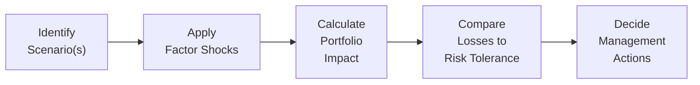

## Definition of Scenario Analysis
Scenario analysis is the process of exploring “what-if” environments to understand potential changes in portfolio value if certain market conditions (e.g., shifts in the yield curve) occur. Imagine a restless market where the central bank unexpectedly hikes rates by 100 basis points (bps). If we’ve done thorough scenario testing, we have a good grip on how our portfolio value might react. Sounds like magic? It’s just methodical planning for an uncertain future—so we’re not caught off guard when yields decide to play rollercoaster.

In the context of yield curve strategies, scenario analysis typically involves:
• Parallel shifts in the yield curve (e.g., everything moves up or down by 50 bps).  
• Changes in the slope (steepening or flattening).  
• Alterations in curvature (e.g., the belly moves differently from the short and long end).  

While these moves may look purely theoretical, they can capture plausible day-to-day or month-to-month changes that could significantly affect fixed-income holdings. We frequently combine scenario analysis with other risk metrics (such as key rate durations—see Section 5.3 for more) to refine our understanding of precise vulnerabilities.

## Historical Versus Hypothetical Scenarios
When we say “historical scenario,” we’re talking about replaying market conditions from specific periods, like the 2008 credit crisis or the 2013 “taper tantrum.” It’s almost like you’re running your portfolio back in time to see how it would have fared against the storms of past events. Historical scenarios are useful because they utilize real data: we already know how interest rates, credit spreads, and market liquidity behaved during those crises.

Hypothetical scenarios, on the other hand, come from your imagination—though hopefully informed by experience and market analysis. Maybe you worry about a sudden inflation spike triggered by supply chain breakdowns or a liquidity freeze due to a cyber-attack on major clearing banks (not an everyday occurrence, but you never know). By modeling these hypothetical conditions, you can see how your portfolio might respond if the world veers off an unexpected cliff.

Balancing both historical and hypothetical scenarios helps ensure you’re neither stuck in the past nor ignoring patterns that might arise in the future.

## Factor Shocks
Sometimes we’re not just dealing with a single, sweeping change in rates. Instead, multiple factors might shift in isolation or simultaneously. The concept of “factor shocks” refers to specifically nudging certain dimensions of the yield curve or macro environment to see how each factor alone affects the portfolio.

Yield curve factors often come down to:
• Level (the overall shift up or down).  
• Slope (the difference between short-term yields and long-term yields).  
• Curvature (the way the middle of the curve behaves relative to the ends).  

By shocking these factors individually—say, a 20 bps increase in short rates but unchanged long rates—you can isolate precisely where your portfolio is most sensitive. For instance, a position heavily concentrated in mid-duration securities might be more vulnerable to curvature shocks than a barbell strategy.

## Multi-Factor Stress Testing
Real-world crises rarely feature just one factor in isolation. Instead, you might see interest rates rise, credit spreads widen, and exchange rates go haywire all at once. In multi-factor stress testing, you incorporate multiple shocks simultaneously to mimic these more realistic scenarios.

For instance, consider a combined stress test that models:  
• A 75 bps parallel shift in the yield curve (level change).  
• A 20 bps steepening at the long end (slope change).  
• Widening credit spreads by 50 bps.  
• A partial freeze in liquidity, making it difficult to offload risk quickly.

Running these integrated shocks can unmask vulnerabilities that might not appear in single-factor analyses. While it’s a bit mind-boggling at times—especially if you have a large portfolio with numerous bond positions—this approach helps you see the bigger picture. I’ve seen situations where each individual shock looked manageable, but once we combined them, the result was anything but pretty.

## Identification of Vulnerabilities
Alright, so we’ve run these analysis routines. Now what? The main outcome is identifying parts of your portfolio that are in line for a potential “haircut.” Is your short-duration bucket too large? Do you hold a chunk of BBB-rated bonds that could see a bigger spread blowout if the economy stumbles? By pinpointing which exposures are at greatest risk, you can inform your next steps:

• Adjust hedges (e.g., use interest rate swaps to neutralize duration risk on the long end).  
• Sell or minimize positions that produce outsized losses in certain scenarios.  
• Diversify across different maturities or even across currencies, if appropriate.  

The key is to align your portfolio with your risk tolerance. If your scenario analysis reveals you’re overly exposed to a flattening yield curve, you might lighten up on the intermediate maturities or add some barbell elements to cushion your risk.

## Reverse Stress Testing
Reverse stress testing flips the script: rather than specifying a scenario and measuring resultant losses, you designate the loss threshold you’re terrified of exceeding—then figure out which market conditions would cause that outcome. It’s like going, “Okay, if I can’t afford to lose more than 5% in a month, what kind of yield curve shift would lead to a 5% drop?” or “Which combination of interest rate and credit spread changes would break my risk tolerance?”

I recall a situation in my early years handling a small fixed-income portfolio: we discovered that only a modest steepening in the yield curve plus a small credit-market hiccup could push us past our dreaded 5% maximum drawdown. That forced us to tighten up our positions, reduce some credit risk, and improve overall liquidity. Think of reverse stress testing as a great wake-up call.

## Risk Tolerance & Management Responses
Great, you’ve identified vulnerabilities and tested them backward and forward. The puzzle then becomes: “What’s the plan?” Typically, asset managers or risk teams will define thresholds—like a maximum 5% decline in net asset value or a maximum limit for daily drawdown. If scenario results predict that under certain conditions you might breach these limits, you take action before the markets do it for you.

Some typical management responses include:
• Rebalancing the portfolio to reduce overall market sensitivity.  
• Setting up derivative overlays, like interest rate swaps or swaptions, to limit downside.  
• Changing liquidity profiles by holding more cash-like instruments or ensuring easier exit options.  
• Engaging crisis committees or higher-level risk oversight if the scenario indicates catastrophic potential losses.  

## Reporting & Governance
All that analysis doesn’t mean much if you’re not communicating it effectively. Portfolios owned by institutional investors—like pension funds or insurance companies—often must show scenario analysis results to risk committees or external regulators. Documenting assumptions, methodologies, and data sources (especially for hypothetical scenarios) is crucial.

Some best practices for reporting:
• Clear summary of the main stress scenarios tested.  
• Graphical representations of portfolio performance under each scenario versus your risk thresholds.  
• Explanation of any limitations (e.g., model assumptions or correlation estimates).  
• Potential remediation steps or recommended actions, if needed.

Regular communication fosters transparency, encourages stakeholder buy-in, and can enhance the overall governance process—nobody likes surprises when big money is at stake.

## A Quick Visual of the Scenario Analysis Workflow

The diagram above shows a simplified iteration:

1) Identify the scenario or stress event (historical, hypothetical, or multi-factor).  
2) Apply factor shocks (e.g., yield curve level, slope, curvature).  
3) Calculate how the portfolio’s value changes under these shocks.  
4) Compare the resulting exposure to your firm’s risk tolerance (or reverse stress test from an unacceptable loss).  
5) Decide on management actions, such as hedging or rebalancing.

## Glossary
Scenario Analysis: A forward-looking simulation of portfolio outcomes under a specific set of assumptions or market conditions.  
Stress Testing: The application of extreme (but plausible) shocks to assess potential losses and test portfolio resilience.  
Historical Replay: Using the market moves from actual past crises or events to estimate how today’s portfolio might perform under similar circumstances.  
Hypothetical Scenario: A constructed event not solely based on a single historical period but imagined future outcomes (e.g., inflation spikes, liquidity freezes).  
Factor Shock: A sudden, significant change in one or more risk factors—like interest rates or spreads—used to see how a portfolio might react.  
Reverse Stress Test: A method where you start from a severe loss level and deduce which market conditions must occur to produce that loss.  
VaR (Value at Risk): A statistical measure estimating potential loss over a certain time horizon at a given confidence level.  
Drawdown Limit: A risk policy constraint specifying the maximum acceptable portfolio loss over a certain period.

## References & Further Reading
• CFA Institute, “Risk Management” and “Yield Curve Strategies” sections of the Level III curriculum.  
• Jorion, P., “Value at Risk: The New Benchmark for Managing Financial Risk.”  
• Basel Committee on Banking Supervision guidelines on stress testing.  
• Risk.net articles highlighting best practices for scenario construction and real-life case studies.  
• The Journal of Fixed Income for scholarly articles on multi-factor yield curve modeling.

## Exam Tips
• In the constructed-response (essay) portion, be ready to describe both the methodology and rationale behind choosing certain scenarios (historical vs. hypothetical).  
• Practice short numerical examples: for instance, quantifying the portfolio’s mark-to-market change given a 50 bps parallel shift.  
• Understand reverse stress testing thoroughly—it’s a common area for conceptual questions.  
• Incorporate risk governance and threshold topics when explaining how to respond to potential scenario losses.  
• Time management: organize your approach so that you clearly present scenario assumptions, calculations, outcomes, and recommendations in a fluid manner.

------------------------

## Test Your Knowledge: Scenario Analysis & Stress Testing in Yield Curve Strategies



### Which best describes the primary purpose of scenario analysis in yield curve strategies?

- [ ] To maximize returns in a bullish bond market
- [x] To explore potential portfolio outcomes under various market conditions
- [ ] To model only historical crises
- [ ] To eliminate volatility entirely

> **Explanation:** Scenario analysis is employed to understand how a portfolio might behave under different yield curve movements and market conditions. It doesn’t guarantee higher returns or eliminate risk; rather, it identifies how exposures might perform if specific events occur.

### What is the key distinction between a historical scenario and a hypothetical scenario?

- [ ] Historical scenarios are only about predicting the future.
- ["] Hypothetical scenarios are based solely on real past events.
- [x] Historical scenarios use actual past market data; hypothetical scenarios are constructed projections of possible future events.
- [ ] Hypothetical scenarios are limited to stable interest rate environments.

> **Explanation:** Historical scenarios replay real events, such as the 2008 crisis, while hypothetical scenarios imagine situations that may not have occurred but are plausible based on current market dynamics.

### A factor shock focusing exclusively on the slope of the yield curve is most likely to:

- [ ] Shift all maturities upward by the same amount.
- [x] Steepen or flatten the yield curve while leaving its overall level the same.
- [ ] Increase interest rates at short and long maturities more than in the middle.
- [ ] Decrease credit spreads in the entire bond market.

> **Explanation:** A slope-focused shock adjusts short-term rates or long-term rates relative to each other, thereby steepening or flattening the curve.

### Multi-factor stress testing differs from a single-factor approach because it:

- [ ] Ignores credit spreads.
- [ ] Considers only currency effects.
- [x] Combines multiple simultaneous risks (e.g., yield curve shift + spread changes + liquidity pressures).
- [ ] Eliminates the need for scenario analysis.

> **Explanation:** Multi-factor stress testing incorporates a variety of shocks (rate, currency, spreads, liquidity, etc.) in one integrated scenario, providing a more realistic picture of risk.

### Which investment position is most vulnerable if a reverse stress test indicates severe losses when the yield curve steepens significantly?

- [ ] A portfolio concentrated entirely in ultra-short Treasury bills
- [x] A leveraged long position in intermediate-term corporate bonds
- [ ] A portfolio of inflation-protected securities
- [ ] A well-hedged combination of short- and long-duration bonds

> **Explanation:** Leveraged intermediate-term corporate bonds can experience sizable losses if the curve steepens and credit spreads widen under stressed conditions.

### One major goal of reverse stress testing is:

- [x] Determining the market conditions that lead to an unacceptable loss.
- [ ] Ensuring 100% guarantee of no portfolio drawdowns.
- [ ] Estimating the approximate yield at which the portfolio will break even.
- [ ] Automating all investment decisions based on historical data.

> **Explanation:** Reverse stress testing starts with identifying a critical loss threshold and works backward to uncover the market environment that could produce such a loss.

### Why might limited liquidity in a market crisis exacerbate losses found in a scenario analysis?

- [ ] Liquidity usually improves during crises.
- [x] Forced selling in illiquid conditions can lead to unfavorable execution prices.
- [ ] Lower liquidity typically raises bond prices.
- [ ] It never affects real portfolio losses.

> **Explanation:** When liquidity dries up, selling positions at fair value becomes challenging, sometimes forcing managers to accept large discounts, boosting realized losses beyond original estimates.

### When scenario results indicate the portfolio is likely to exceed its drawdown limit in a certain event, the recommended approach is typically:

- [ ] Ignore it because the event is unlikely to happen.
- [ ] Increase leverage to boost returns.
- [x] Adjust the portfolio structure or hedge exposures to maintain risk within acceptable thresholds.
- [ ] Permanently close all positions to eliminate risk.

> **Explanation:** If a scenario suggests that risk thresholds might be breached, prudent portfolio managers will reduce or hedge those risk exposures rather than ignore them or leverage further.

### Which statement best reflects a best practice in reporting scenario analysis to stakeholders?

- [x] Provide clear explanations, including key assumptions, scenario definitions, and potential portfolio impacts.
- [ ] Deliver only a short bullet-point list without data to avoid confusion.
- [ ] Hide any adverse findings.
- [ ] Perform scenario analysis irregularly to ensure few internal questions arise.

> **Explanation:** Best practice involves transparency about the stress test methodology, data inputs, assumptions, and results to enhance trust and risk awareness among all stakeholders.

### True or False: Scenario analysis and stress testing entirely eliminate the risk of losses in fixed-income portfolios.

- [x] True
- [ ] False

> **Explanation:** Trick question here. Actually, it’s false that scenario analysis can eliminate risk. Scenario analysis and stress testing help you understand and plan for potential losses but can’t guarantee the complete elimination of risk in real markets. (The correct statement is “False.”)


