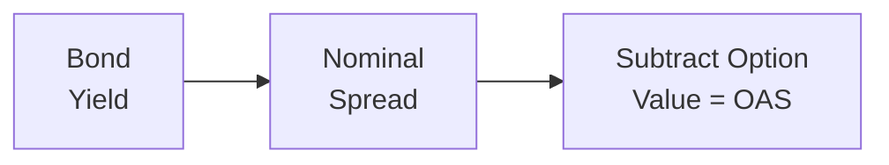

## Introduction and Motivation

So, I remember the very first time I tried to wrap my head around spreads in the credit market. I was an intern, fresh out of undergrad, looking at rows of data on corporate bonds. My senior colleague would mention “nominal spreads,” “OAS,” “prepayment risk,” and all that stuff in the same breath. Honestly, it was kind of overwhelming at first. But once it clicked—once I finally saw how critical these spreads are to evaluating fixed-income securities—it was like a light turned on. My entire approach to analyzing credit risk changed.

Anyway, if you’ve ever looked at a corporate bond or even a mortgage-backed security (MBS) and wondered why yields aren’t always apples-to-apples with government benchmarks, you’re in the right place. In this section, we’ll dig into the nuts and bolts of spread-based fixed-income portfolios and see why nominal spreads and option-adjusted spreads (OAS) matter so much. We’ll talk about how these spreads behave, what drives them, and how you, as an active portfolio manager, might lean on them to optimize your strategies. Let’s get into it.

## Defining Nominal and Option-Adjusted Spreads

### Nominal Spread Basics

The nominal spread is basically the raw difference between the yield of a bond (or any credit instrument) and the yield of a risk-free benchmark, typically a government bond of the same or similar maturity. Think of it as a quick-and-dirty measure of the extra yield investors demand for taking on credit risk, liquidity risk, or other complexities relative to a risk-free instrument.

• Example: If a five-year corporate bond is yielding 5.0% and the corresponding five-year treasury is at 3.0%, then the nominal spread is 2.0% (i.e., 200 basis points).  
• Advantages: It’s straightforward, easy to compute, and always quoted in market color—especially for securities without embedded options.  
• Limitations: It doesn’t factor in any potential call, put, or prepayment features that can significantly alter the bond’s true risk/return profile.

In plain terms, the nominal spread is often the first stop for a quick read on how “cheap” or “rich” a bond might be. But if there are wrinkles—like embedded options or prepayment risk—nominal spreads can be misleading.

### Option-Adjusted Spread (OAS)

So, how do we handle those wrinkles? That’s where the option-adjusted spread (OAS) comes in. The OAS is the spread that excludes the value of any embedded options in the bond. This “strips away” option-related uncertainties—such as a callable feature or prepayment risk—leaving a cleaner view of credit and liquidity risk. You might think of the OAS as the spread you’d get if you could wave a magic wand and say, “No calls, no puts, no early redemptions—just the bond’s inherent risk.”  

• Key Idea: Subtract the embedded option’s value (or cost) from the bond’s yield to isolate the credit and liquidity risk components.  
• Why it Matters: OAS is especially crucial for bonds where the probability of early redemption or extension is non-trivial—like mortgage-backed securities that can be prepaid if interest rates fall or callable bonds that can be redeemed if rates drop.

In practice, calculating OAS is more sophisticated. We typically leverage interest rate models, volatility assumptions, and a range of possible future paths for rates or prepayment speeds. But once we obtain the OAS, we get a more accurate sense of the bond’s relative value—and that can be golden for making investment decisions.

## The Importance of Spread Analysis

In fixed-income portfolio management, spreads essentially serve as the barometer of the bond’s relative attractiveness. If spreads are “wide,” it may indicate a bond is undervalued (or that the market is perceiving substantial risk). If spreads narrow or tighten, it typically signals the market is more comfortable with that risk or has higher expectations for the issuer’s creditworthiness.

### Identifying Investment Opportunities

• Widening Spreads: Could point to a market panic, a sector-specific credit event, or simple illiquidity. Experienced managers sometimes step in here to capture an attractive entry point—assuming they have a strong view on credit risk.  
• Tightening Spreads: Typically signals that credit conditions are improving or the market appetite for risk is robust. If you already hold those bonds, you may sit on capital gains. But it might also be time to reduce positions if you think the tightening has gone too far.

### Sector Rotation

Spread analysis is also central to “sector rotation” within the credit universe. For example, a manager might compare the OAS of investment-grade corporate bonds to that of mortgage-backed securities with a similar credit rating:

• If MBS OAS is notably wider relative to corporate bonds—adjusting for the presence of prepayment risk—then MBS might be a more compelling buy.  
• If asset-backed securities (ABS) offer a better OAS relative to corporate bonds of similar credit risk, you might shift part of your allocation to ABS instead.

By continuously evaluating spreads across various sectors, you’re effectively looking for pockets of mispricing—an essential ingredient for generating alpha.

## Modeling Interest Rate Volatility

Now, let’s address a factor that often confuses new credit analysts: interest rate volatility. When interest rate volatility rises, the value of embedded options—especially calls and puts—changes significantly. In particular, the cost of a call option embedded in a bond grows as volatility rises, because there’s a higher probability that the issuer will execute that option if rates drop. This dynamic:

• Increases the difference between a nominal spread and an OAS  
• Can reduce or increase the bond’s price, depending on whether the embedded option is advantageous or detrimental to the investor

If you only look at nominal spread, you might underestimate or overestimate the embedded option’s impact, leading to poor investment decisions. OAS, on the other hand, attempts to price in that volatility so you see what your “pure” credit spread is after adjusting for the call feature.

## Risk and Return Implications

Let’s be real: we’re in the business of returns, and the risk that stands in our way is the flipside of the coin. Spread changes can significantly alter your portfolio’s performance. When you anticipate a spread widening, you might decide to scale back positions in high-yield or more illiquid segments to avoid the capital losses that come with higher risk premiums. Conversely, if your view is that spreads will tighten, you may be more aggressive in your positioning, leaning into those instruments that might see the greatest price appreciation when demand surges.

### Liquidity: The Often-Overlooked Factor

It’s not just about credit or optionality; liquidity risk is huge. In calmer markets, liquidity might be barely noticeable—spreads remain tight for bonds with decent daily trading volumes. But in stressed conditions, illiquid bonds see their spreads balloon, partly as compensation for the sheer difficulty in offloading those positions without major price concessions.

Analyzing OAS vs. nominal spread can highlight liquidity considerations:  
• If a bond has a wide OAS but no embedded options to speak of, that might be a liquidity premium.  
• If the OAS is suspiciously higher compared with similar bonds, be mindful that you might be walking into a liquidity trap if conditions deteriorate.

## Visualizing Nominal Spread vs. OAS

Below is a simple diagram illustrating the relationship among the bond’s yield, the risk-free benchmark, and how we strip away embedded option costs to arrive at the OAS.

In this diagram, the nominal spread is the difference between yield on the bond and the yield on a risk-free benchmark. Then we subtract the “option value” (the value/cost the issuer or the investor would pay for the embedded option) to isolate the Option-Adjusted Spread (OAS).

## Practical Example

Let’s say you have two corporate bonds, both with the same credit rating and maturity:

• Bond A (no embedded option):  
  – Yield: 5%  
  – Treasury Yield for Similar Maturity: 3%  
  – Nominal spread = 2% (200 bps)  
  – OAS = 2% (since there’s no option to adjust for)

• Bond B (callable):  
  – Yield: 5.1%  
  – Treasury Yield for Similar Maturity: 3%  
  – Nominal spread = 2.1% (210 bps)  
  – After modeling potential call exercise (value of call = 0.3% in yield terms)  
  – OAS = 1.8% (180 bps)

From a superficial standpoint, Bond B looks more attractive using nominal spreads alone (210 bps vs. 200 bps). However, once you factor in the value of the embedded call, the real credit/liquidity spread is only 180 bps. That’s actually less attractive than Bond A’s 200 bps. Hence, Bond A might be the better choice if you want higher compensation purely for credit risk and liquidity risk—and you don’t want to worry about the bond being called away at inopportune times.

## Portfolio Positioning Using Spread Metrics

### Defensive vs. Offensive Postures

• Defensive Posture: If you predict a recession or credit deterioration (implying spreads widen), you might shorten duration, increase credit quality, and tilt toward sectors that traditionally perform better under stress (like higher-quality corporate bonds or certain government-backed MBS).  
• Offensive Posture: If you believe the economy is stable or improving, you might hold longer-duration credit exposure, tilt into high-yield, or buy sectors whose spreads haven’t yet tightened. Identifying situations where OAS is out of line with fundamentals can be a powerful way to earn alpha during stable or improving markets.

### Spread “Curve” Positioning

Much as yield-curve strategies exist for Treasuries, you can position yourself along the “spread curve.” For instance, you might:

• Favor short-dated credit if front-end spreads are abnormally wide due to liquidity constraints.  
• Favor longer-dated credit if you believe the market is overestimating long-term default or extension risk.  

A thorough credit strategy often means analyzing how spreads behave across maturities, not just within a single point on the curve.

## Common Pitfalls in Spread Analysis

1. Ignoring Embedded Options  
   You don’t want to rely solely on nominal spreads when analyzing a callable or putable bond. Doing so often paints an inaccurate picture of relative value.

2. Misjudging Credit Migration  
   Let’s say you buy a bond with an attractive OAS, only to watch the company’s fundamentals deteriorate. The subsequent rating downgrade might push spreads even wider. So, always factor in potential changes to the issuer’s credit rating.

3. Overlooking Liquidity  
   Being stuck holding illiquid positions during a market selloff can be painful, as spreads could blow out rapidly. Make sure that the spread premium genuinely compensates for the liquidity risk.

4. Inconsistent Modeling of Volatility  
   If your interest rate or prepayment model is off (and they often can be if you’re too optimistic or if the environment changes), your OAS calculations might be misleading. Preparing for multiple volatility regimes is wise.

## Best Practices for CFA® Level III Candidates

• Always check for embedded options: The OAS measure is crucial for items like MBS or callable bonds.  
• Stay current on credit ratings and fundamental signals: Changes in fundamentals can lead to abrupt changes in spreads.  
• Keep an eye on liquidity conditions: In times of stress or regulatory change, liquidity can dry up quickly, impacting spreads.  
• Use scenario analysis: Evaluate how changes in interest rates and volatility might affect both nominal spreads and OAS.  
• Monitor cross-sector relative value: Don’t just look at one sector in isolation. Compare corporate bonds, MBS, ABS, or emerging market debt to find the best risk/reward.  
• Integrate risk management: Tools like Value at Risk (VaR), credit VAR, or spread duration can help you keep an eye on your overall exposure to spread movements.

## Exam Tips

1. Formulas and Definitions  
   Be prepared to explain or interpret the difference between nominal spread and OAS. You might be asked to show how to adjust nominal yield for the embedded option’s value.

2. Scenario-Based Questions  
   The CFA Level III exam often gives you a scenario with rumored credit downgrades or anticipated interest rate volatility. You’ll need to interpret how spreads might react and how you’d adjust portfolio positions.

3. Time Management  
   In the constructed response section, plan your answers before you start writing. Show your reasoning clearly, step-by-step.

4. Potential Traps  
   – Overlooking option features is a common pitfall.  
   – Confusing nominal and OAS in calculations.  
   – Failing to address liquidity or credit fundamentals in your solution.

## References

• Fabozzi, F.J. “Bond Markets, Analysis, and Strategies.”  
• CFA Institute Investment Series: “Fixed Income Analysis.”  
• Tuckman, B. & Serrat, A. “Fixed Income Securities: Tools for Today’s Markets.”  
• Journal of Fixed Income: http://jfi.pm-research.com/

## Test Your Knowledge: Spread-Based Credit Strategies



### Which of the following best describes the nominal spread of a bond?  
- [x] The difference between the bond’s yield and the yield of a risk-free benchmark.  
- [ ] The yield spread accounting for all embedded option features.  
- [ ] The measure of liquidity risk only.  
- [ ] The difference in yield between two callable bonds.  

> **Explanation:** The nominal spread is simply the difference between the yield on the credit security and a comparable risk-free benchmark, without adjusting for embedded options or other complexities.

### When would the option-adjusted spread (OAS) be most relevant?  
- [x] When evaluating bonds with callable or putable features or MBS with prepayment risk.  
- [ ] When comparing only high-yield bonds with no embedded features.  
- [ ] When analyzing a treasury bond’s relative yield.  
- [ ] When gauging rating agency methodology changes.  

> **Explanation:** OAS is used to account for the value of embedded options, so it’s crucial in assessing callable, putable, or mortgage securities.

### If a bond has a nominal spread of 150 bps but an OAS of 130 bps, what does the 20 bps difference primarily represent?  
- [x] The cost/value of embedded options in the bond’s structure.  
- [ ] The expected default rate over the next year.  
- [ ] The spread for inflation protection.  
- [ ] Liquidity risk not accounted for in the nominal spread.  

> **Explanation:** The reduction from nominal spread to OAS generally reflects the bond’s embedded option value. That’s the difference that is stripped out to get a pure measure of credit and liquidity risk.

### Which statement is true regarding OAS and nominal spreads for mortgage-backed securities (MBS)?  
- [x] OAS typically provides a clearer measure of risk, given the MBS’s frequent prepayments.  
- [ ] Nominal spreads are more accurate for MBS.  
- [ ] OAS is not relevant for pass-through securities.  
- [ ] Nominal spreads do not include compensation for liquidity risk.  

> **Explanation:** MBS have prepayment risk, which requires modeling interest rate paths to isolate credit and liquidity risk. OAS is essential for this modeling.

### You notice a callable corporate bond trading at a nominal spread of 220 bps. After adjusting for the call feature, the OAS is 180 bps. Which conclusion is most justified?  
- [x] The embedded call feature is costing investors approximately 40 bps of spread.  
- [ ] The corporate bond is undervalued and should be bought immediately.  
- [ ] The company is likely to default.  
- [ ] The bond is risk-free.  

> **Explanation:** The difference of 40 bps (220 bps – 180 bps) represents the option cost to the investor. It doesn’t necessarily mean the bond is absolutely undervalued or overvalued—it’s just the cost of the call.

### In a scenario where interest rate volatility increases, how are nominal spreads and OAS likely affected for a callable bond?  
- [x] The difference between the nominal spread and OAS typically widens because the option value increases.  
- [ ] Nominal and OAS spreads both remain the same.  
- [ ] OAS becomes larger than the nominal spread.  
- [ ] OAS remains unchanged, but nominal spreads fall.  

> **Explanation:** Rising volatility typically increases the value of the embedded call option, widening the gap between nominal spreads and OAS.

### If spreads are tightening across the corporate bond market, a portfolio manager might:  
- [x] Increase credit exposure to capture additional price gains from spread tightening.  
- [ ] Reduce all credit positions to zero.  
- [x] Re-evaluate sector allocations to see where spreads have not yet tightened fully.  
- [ ] Shift everything into short-duration treasuries.  

> **Explanation:** When spreads tighten, some managers see it as an opportunity for further potential gains if the credit outlook remains strong. However, you might also look for areas or sectors where the full spread compression hasn’t materialized yet.

### A bond with an attractive OAS but very low trading volume might indicate:  
- [x] A higher liquidity premium included in the spread.  
- [ ] A negligible default risk.  
- [ ] An impending upgrade by rating agencies.  
- [ ] That it is a risk-free investment.  

> **Explanation:** Low trading volume can widen the spread due to liquidity concerns, resulting in a higher OAS that might appear “cheap,” but you must assess whether you can exit the position easily.

### One of the main pitfalls when using nominal spreads for callable bonds is:  
- [x] Failing to account for the embedded call option.  
- [ ] Overestimating the liquidity premium.  
- [ ] Underestimating the credit rating.  
- [ ] Mixing up short- and long-duration securities.  

> **Explanation:** Nominal spreads don’t factor in the embedded call’s impact, which might lead to mispricing or misunderstanding the bond’s true yield potential.

### True or False: Option-adjusted spreads (OAS) are lower than nominal spreads whenever an embedded call feature exists.  
- [x] True  
- [ ] False  

> **Explanation:** By stripping out the call option’s value (which benefits the issuer), the net compensation for credit and liquidity risk (the OAS) is typically smaller than the nominal spread.


