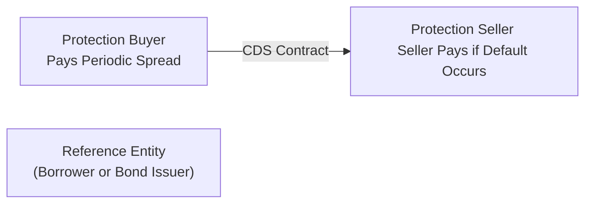

## Introduction

I still remember the first time I heard about Credit Default Swaps (CDS): I was chatting with a colleague (a total fixed-income enthusiast, by the way), and she casually said, “CDS are sorta like insurance for bonds.” At first, that statement caught me off guard because, well, insurance policies and bond investing never seemed directly related in my mind. But once I dug in, I realized credit default swaps are a pretty neat tool for managing credit risk—especially when you want to hedge or speculate without trading the actual underlying bonds. 

Anyway, let’s get into the details, shall we? The idea here is to provide a thorough overview of how CDS and other credit derivatives, like total return swaps (TRS) and synthetic CDOs, can be used in active fixed-income management. We’ll look at single-name CDS, index CDS, ways to structure trades, common pitfalls, and the frameworks—like ISDA—that keep these transactions stable. By the end, I hope you’ll have a good behind-the-scenes tour of how these things work and how you might use them when constructing credit-centric investment strategies.

## How Credit Default Swaps Work

A credit default swap is essentially a bilateral contract between two parties: the protection buyer and the protection seller. The buyer pays periodic spreads (like an insurance premium), and in return, if the underlying reference entity (e.g., a corporate bond issuer) defaults or experiences another specified credit event, the seller compensates the buyer. That’s the high-level gist: the buyer wants to be compensated if the reference entity fails to uphold its obligations, whereas the seller is collecting spread income in exchange for bearing that risk.

To visualize it briefly:

• The protection buyer pays a spread (or premium) until maturity or credit event.  
• The protection seller agrees to pay par value (or an agreed-upon settlement amount) if a default or specified credit event occurs.  

Investors typically use CDS to hedge existing exposures or to take a view on the credit quality of an entity. If you own a corporate bond and it’s making you nervous, you can buy a CDS to hedge your default risk. If you think a certain issuer’s default risk is overstated, you might sell CDS for the extra yield.

Mathematically, the fair spread on a CDS can be viewed (in a simplified sense) as:

$$
\text{CDS Spread} \approx \frac{(1 - R) \times P_\text{default}}{\sum_{t} D(t) \times \big(1 - P_\text{cumulative default up to } t\big)},
$$

where:  
• \\(R\\) is the recovery rate (the percentage of par value one expects to recover if default happens).  
• \\(P_\text{default}\\) is the probability of default.  
• \\(D(t)\\) is the relevant discount factor for future periods.  

In practice, the exact pricing often involves more nuance—like default timing, interest rate curves, accrued payments, and contract specifics—but the big idea is that the spread should balance the expected loss from default and the time value of money.

## Single-Name vs. Index CDS

While single-name CDS focuses on one specific reference entity (e.g., a single corporate bond issuer), you might use index CDS to gain or hedge exposure to a diversified basket of issuers. Popular index CDS products—like CDX in North America or iTraxx in Europe—have standardized liquidity, making them a go-to choice for portfolio-level hedging or macro credit bets.

The general mechanics are the same: you pay (or receive) a spread based on the index’s overall credit risk. But index CDS are influenced by the correlations among the individual issuers in the basket. If you expect a broad-based economic downturn, shorting the index (i.e., buying protection in the index CDS) can be a cost-effective way to hedge an entire portfolio. On the flip side, if you’re bullish on corporate credit, you might sell protection on the index to collect the spread. 

Here’s a quick comparison:

| Feature                              | Single-Name CDS              | Index CDS (e.g., CDX, iTraxx)                 |
|--------------------------------------|------------------------------|-----------------------------------------------|
| Reference Entities                   | Single issuer                | Basket of multiple issuers                    |
| Liquidity                            | Highly variable              | Generally standardized, more liquid           |
| Purpose                              | Hedge or speculate on one issuer  | Hedge or speculate on overall market          |
| Correlation Considerations           | Less relevant, single issuer | More relevant, basket correlation matters     |
| Settlement                           | Physical or cash             | Typically standard cash settlement procedures |

## Hedging and Speculating with CDS

CDS are a flexible hedging tool. Suppose you hold a portfolio of corporate bonds. You love the yield, but you’re worried about a near-term economic slowdown. You might buy protection on that bond or group of bonds to offset potential losses if credit spreads blow out or defaults rise. Instead of unloading each bond individually, you can keep your broader strategy in place and ensure that a chunk of your downside is protected. 

On the speculative side, maybe you suspect that an issuer is on the brink of a turnaround—markets think they’re about to default, but you believe they’ll pull through just fine. By selling CDS protection, you can collect premium income. If you’re right, you keep that premium, and the entity avoids default. But if your crystal ball is wrong and the issuer defaults, the buyer of protection typically delivers the bond (in physical settlement) or triggers a cash settlement process, forcing you to pay.

**Practical Example**  
Let’s say you’ve got a hypothetical corporate bond from XYZ Corp that trades at par and yields 6%. You’re concerned about near-term volatility but don’t want to dump it. You check the CDS market: the spread to buy protection for XYZ’s bond is 120 basis points. By paying 1.20% of notional in premium, you can lock in default protection. You reduce your net yield to 4.8% (6% minus 1.2%), but you also significantly mitigate default risk during that protection period.  

## Pricing, Liquidity, and Valuation of CDS

CDS markets are typically over-the-counter (OTC), and while there are efforts to enhance transparency and move some trade clearing to centralized platforms, pricing can still be less transparent compared to, say, trading Apple shares on the stock exchange. You’ll often see quotes expressed in basis points of the notional amount. 

Valuation can be more art than science if liquidity is patchy. Dealers quote certain standardized maturities (like 5-year or 10-year CDS), and if you want off-the-run maturities, pricing might be less straightforward. Subtle differences in contract terms (e.g., what events trigger the payoff, or differences in restructuring clauses) can also cause confusion. Some standardization has certainly helped—now we have fairly well-established “Doc clauses” and protection definitions—but it’s still wise to do extensive due diligence on any CDS price you’re quoted.

## Correlations Among Issuers and CDS Indices

As we saw earlier, index CDS are basically clumps of single-name CDS exposures. That means their moves hinge on how correlated the underlying names are. During stable times, each issuer’s credit risk might be fairly idiosyncratic. In a crisis, though, everything can converge (or diverge) more dramatically than expected. You’ll occasionally see mispricings or dislocations if correlation assumptions change quickly; strategic credit arbitrageurs love to spot these. But watch out—just because you think certain bonds “should” be uncorrelated doesn’t guarantee they’ll remain that way. 

If you’re dealing with correlation bets in an index, you might offset with single-name CDS to exploit the difference. For instance, if you feel that one issuer in the index is priced to fail but you disagree with that assessment, you might sell single-name protection on that issuer while buying protection on the overall index. This strategy tries to isolate a specific credit’s outperformance relative to the rest of the index.

## Other Derivatives for Credit Exposure

### Credit-Linked Notes (CLN)

Credit-linked notes are structured products embedding credit exposure with bond-like characteristics. An investor buys a note paying some coupon, but if a credit event occurs (on some reference entity or basket), the note’s principal is reduced or fully lost (depending on the terms). It’s basically bundling a regular note with a CDS—they can be neat for yield enhancement, but obviously come with more complexity and credit risk.

### Total Return Swaps (TRS)

A total return swap allows you to receive (or pay) the total return from a reference asset—maybe a corporate bond index—without actually owning it outright. In exchange, you pay a floating rate (like LIBOR or SOFR plus a spread). So you can synthetically gain exposure to the bond’s price appreciation, coupon, or spread tightening. Meanwhile, if the underlying bond defaults, you’d bear the losses under the TRS terms. TRS can be super useful if your investment guidelines restrict you from directly buying certain assets, or if you want to generate leveraged credit exposure with smaller capital outlay.

### Synthetic CDOs

A synthetic CDO uses CDS contracts instead of physically holding bonds or loans. The SPV (special purpose vehicle) sells CDS protection on a pool of reference entities, collecting premium from the protection buyers. Investors in various tranches of the CDO get exposure to these reference entities (and receive the premium flows), but also bear the risk if defaults occur. You might see these referred to as “CDO-squared” in more complex structures. They can offer yield pick-up but also come with layers of complexity—like correlation risk among reference credits, reliance on rating agency assumptions, and the nuances of how default losses get allocated across tranches.

## ISDA Agreements and Counterparty Risk

These CDS, TRS, and other credit derivatives are typically documented under the ISDA Master Agreement. In my experience, the typical conversation about “ISDAs” is always a bit dry; it’s basically the legal and operational backbone of the OTC derivatives market. But it’s crucial. ISDA spells out how defaults are defined, how netting of payments works, how margin or collateral is posted, and other key details. 

Counterparty risk is a big part of any CDS or swap. Even if you’re correct about the credit of XYZ Corp, if your swap counterparty itself goes insolvent, that contract might fail right when you need it the most. Collateral posting and netting arrangements hopefully mitigate a chunk of that risk, but it’s never zero. That’s part of why, after the 2008 crisis, there’s been a push for more standardized clearing houses, further margin requirements, and better transparency.

## Best Practices and Pitfalls

• **Matching Tenors:** Make sure your CDS maturity or swap maturity lines up with how long you plan to hold the underlying exposure. A mismatch can leave you exposed when your hedge rolls off.  
• **Documentation:** Know the definitions: does your CDS pay out for a “failure to pay,” “bankruptcy,” “restructuring,” or “repudiation/moratorium”? Precisely which triggers matter can be crucial.  
• **Liquidity Issues:** Thinly traded single-name CDS can get wide bid-ask spreads—underestimating these can blow up your P&L quickly.  
• **Correlation Surprises:** Even if you carefully calculated correlation assumptions for a basket or index, real-world events can deviate significantly, especially in stress conditions.  
• **Counterparty Risk:** The best hedge in the world loses its value if your swap counterparty can’t make good on the contract.

## Practical Example: Hedging a High-Yield Bond Portfolio

Imagine you manage a high-yield bond portfolio. It’s got eight corporate issues across technology, energy, and consumer staples, each with a rating around BB or B. You see rising credit risk in the energy sector but prefer to keep exposure to all your bonds rather than selling them outright (think of capital gains taxes, transaction costs, and slippage if you want to re-enter the market). Instead, you buy protection on an iTraxx Crossover index (in Europe) that’s heavily weighted toward high-yield names, including the type you hold. If the default wave hits, that CDS contract should offset a significant portion of your losses. Once the storm passes, you can terminate (offset) the CDS position if you feel comfortable carrying unhedged exposure again.

## Real-World Case Study

During the financial crisis of 2007–2008, many participants used CDS on subprime mortgage-backed securities or on corporate debt they believed to be vulnerable. Some made large profits, but others found themselves on the hook for massive payouts—like some big insurance companies that sold protection liberally. That’s the classic “heads I get the premium, tails I pay out a lot more.” The meltdown forced everyone to examine the systemic risk of these instruments. And it hammered home the lesson that understanding these derivatives is absolutely crucial for proper risk management.

## Key Takeaways

• Credit Default Swaps are a go-to for hedging (buying protection) or speculating (selling protection) on an issuer’s credit risk.  
• Single-name CDS target a specific name, while index CDS allow broad credit market exposures.  
• Total Return Swaps, Credit-Linked Notes, and Synthetic CDOs all provide ways to manage or gain credit exposure without physically holding the underlying bonds.  
• Liquidity and fair pricing can be challenging due to the OTC nature of CDS; robust due diligence is key.  
• ISDA documentation underpins contract terms and reduces legal uncertainty but doesn’t eliminate counterparty risk.  
• Correlation matters—a lot! Especially when dealing with baskets, indexes, or synthetic structures.  

## Final Exam Tips

• On the CFA exam, be ready to explain why you’d use CDS rather than simply selling a bond. Typically, it’s about transaction costs, liquidity, and the ability to fine-tune exposure.  
• You might see item-set or essay questions describing a scenario where an investor must hedge a corporate bond position. Know how to compare “buying a CDS on the bond” vs. “buying an index CDS.”  
• Understand the main triggers for payout in a CDS contract because the exam might test your ability to identify if a credit event is covered by your hedge.  
• Keep track of net payments—CDS might require an upfront payment or a periodic spread. The exam loves to see if you can do the math on a partial-year accrual or final settlement.  
• Don’t forget the best practice of matching maturities and analyzing the cost vs. benefit of the hedge.  

## References

• Choudhry, M. “An Introduction to Credit Derivatives.”  
• Hull, J. “Options, Futures, and Other Derivatives.”  
• CFA Institute Investment Series: “Fixed Income Analysis,” chapters on structured products.  
• ISDA (https://www.isda.org/) for updated documentation and best practices.  

## Test Your Knowledge: Credit Default Swaps and Credit Derivatives



### When an investor buys protection via a credit default swap (CDS), which statement best describes the investor’s position?

- [ ] The investor will receive coupon payments until the maturity of the reference bond.
- [ ] The investor is obligated to pay the counterparty if a credit event happens.
- [x] The investor pays a periodic spread and receives a payoff if the issuer defaults.
- [ ] The investor receives a periodic spread and pays nothing in the event of default.

> **Explanation:** Buying protection on a CDS means you pay a periodic premium (spread) to the protection seller. If the bond issuer defaults or faces a covered credit event, you get compensated by the protection seller.

### Which of the following derivatives typically references a basket of underlying issuers rather than a single issuer?

- [ ] Single-name CDS
- [x] Index CDS
- [ ] Total Return Swap
- [ ] Interest Rate Swap

> **Explanation:** Index CDS (like CDX or iTraxx) provide credit protection (or exposure) across a basket of issuers, whereas single-name CDS involves just one issuer.

### In a credit default swap, what is the main factor that influences the CDS spread for a given reference entity?

- [ ] Recovery rate only
- [x] Probability of default and expected recovery rate
- [ ] The regulatory framework of the issuer
- [ ] Exclusively the issuer’s stock price volatility

> **Explanation:** The CDS spread is primarily driven by the probability of default and the expected recovery rate if default occurs.

### An investor wants to synthetically gain the total return of a high-yield bond index without owning it directly. Which derivative instrument is most suitable?

- [ ] Single-name CDS
- [x] Total Return Swap (TRS)
- [ ] Interest Rate Swap
- [ ] Forward Rate Agreement

> **Explanation:** A total return swap allows the investor to receive (or pay) the total return of the reference asset—perfect for gaining synthetic exposure without holding the physical bonds.

### Which of the following is a key similarity between buying a single-name CDS and buying an index CDS?

- [ ] Both are limited to sovereign credit risk only
- [x] Both represent a form of credit protection purchase
- [ ] Both require physical settlement
- [ ] Both pay monthly coupons to the protection seller

> **Explanation:** Regardless of single-name or index, buying a CDS means you’re purchasing credit protection and will be compensated if the reference entity (or any entity in the index) defaults.

### Which of these instruments integrates a derivative embedded in a bond-like structure?

- [ ] Senior unsecured corporate bond
- [ ] Repo agreement
- [ ] Interest rate futures contract
- [x] Credit-linked note (CLN)

> **Explanation:** A credit-linked note is a structured product that has an embedded derivative (CDS), which alters the note’s payout in case of a specific credit event.

### What is the primary role of an ISDA Master Agreement in CDS transactions?

- [ ] Ensures that every counterparty must clear through an exchange
- [ ] Explicitly dictates the recovery rate for all transactions
- [x] Provides standardized legal documentation and outlines contract terms across OTC derivatives
- [ ] Eliminates all counterparty risk

> **Explanation:** The ISDA Master Agreement standardizes the contractual framework for OTC derivatives, including CDS, but it doesn’t completely remove counterparty risk.

### Which of the following might occur if correlation among the issuers in a CDS index unexpectedly increases?

- [ ] The notional amount of the CDS index contract increases
- [x] Potential mispricing across single-name CDS and the index, creating arbitrage opportunities
- [ ] The protection seller automatically becomes the protection buyer
- [ ] The credit default swap dissolves if the correlation is above 1.0

> **Explanation:** When issuer correlations change abruptly, the relative pricing of the index vs. single-name CDS may fall out of sync, presenting possible arbitrage or mispricing.

### Which statement is true about total return swaps (TRS)?

- [x] They allow receiving the price appreciation and coupon of a reference bond without owning the bond.
- [ ] They guarantee principal protection in the event of default.
- [ ] They are standardized contracts traded on an exchange.
- [ ] They reference an interest rate index like LIBOR only.

> **Explanation:** A TRS passes through all economic benefits (and losses) of the underlying asset (like a bond), so the receiver of the total return has synthetic exposure.

### A synthetic CDO differs from a cash (traditional) CDO primarily because:

- [x] It uses CDS contracts on a pool of reference entities instead of holding the underlying bonds directly.
- [ ] It is regulated by the Federal Reserve while a cash CDO is not.
- [ ] It offers principal protection to investors in all tranches.
- [ ] It is only available to sovereign government issuers.

> **Explanation:** A synthetic CDO engages in selling credit protection (via CDS) on a portfolio of reference names instead of physically owning the assets, thus being “synthetic.”




