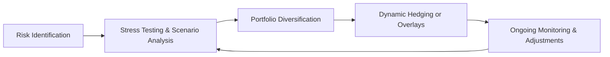

## Introduction

Sometimes, investing in credit markets feels like balancing on a tightrope—everything looks steady one moment, but then you get that sudden lurch that almost throws you off your game. That lurch, in many cases, represents tail risk in your credit portfolio. Tail risk emerges when perhaps only 1% or 5% of possible outcomes produce outsized losses, but these losses can be downright terrifying. And honestly, if you’ve ever seen how quickly bond spreads can blow out when the market panics, you probably understand exactly why tail risk is such a critical focus in credit strategies. 

This section delves into the nature of tail risk and explains how to identify and mitigate it. We’ll also explore liquidity management, because even the most carefully constructed credit strategy can unravel if you can’t trade effectively under stressful market conditions. Throughout, we’ll lean on the rest of Chapter 6 context—especially 6.2 on credit default swaps (CDS)—to expand on hedging techniques, plus references to risk measurement (see 6.1 on spread-based portfolios). Let’s walk through the key ideas step by step.

## Understanding Tail Risk in Credit Portfolios

Tail risk arises from events at the far ends of the probability distribution of returns—those “long tails” that produce unexpectedly large losses. In credit markets, that might be triggered by a sudden default, a systemic shock, a recessionary slide, or even unanticipated policy changes that cause rapid credit spread widening. The 2008 Global Financial Crisis is the classic example of tail risk realized: credit spreads exploded, liquidity evaporated, and market participants found themselves scrambling to manage losses that some never even imagined.

### Identifying Potential Tail Events

• Rapid Spread Widening: When risk aversion spikes, high-yield spreads can jump dramatically in a matter of days or even hours.  
• Default Cascades: One default can reveal hidden industry-wide vulnerabilities, leading to a domino effect in correlated sectors.  
• Systemic Meltdowns: Events like the COVID-19 pandemic or severe banking crises can create broad-based credit distress and disorderly market reactions.  
• Policy Shocks: Central bank decisions can have enormous ripple effects. For instance, surprise rate hikes or unexpected QT (quantitative tightening) can hit levered credit positions.  

It might help to maintain a structured approach to scanning for these potential triggers. Many portfolio managers build routine checklists that examine economic releases, monetary policy signals, geopolitical tensions, and market indicators (e.g., VIX levels or liquidity measures). If you’ve got a strong handle on these signals, you can at least anticipate rising storm clouds in the horizon—even if you can’t stop the rain from coming.

## Tools for Mitigating Tail Risk

### Portfolio Diversification

One classic—but often overlooked—first step is diversification: hold a range of credit instruments, industries, and maturities so you’re not dependent on just one sector or borrower. This approach spreads out vulnerability. Sure, diversification isn’t foolproof, especially in a genuine systemic meltdown when correlations spike, but it’s still one of the simplest ways to keep a bad day from becoming a catastrophe.

### CDS Overlays and Other Hedges

Look back at Section 6.2 for a thorough overview of credit derivatives. Instruments like single-name CDS or index CDS can serve as cost-effective hedges against default risk or overall credit spread movement. For instance, if you hold a heavy position in a particular sector (say, high-yield energy bonds) and you’re worried about a tail event (like a sudden oil price crash), you might buy a sector-specific CDS index to offset potential losses.

### Dynamic Hedging Strategies

Dynamic hedging involves adjusting positions as market conditions shift. Maybe you have set triggers for volatility or credit spreads. If markets stay calm, you might hold minimal hedges. But if spreads start to jump, your triggers kick in and send you to the CDS market or prompt you to lighten up certain vulnerable exposures. This can be helpful, but be aware that in stressed markets, the cost to put on hedges can rise very quickly, so it’s never a guaranteed free ride.

### Stress Testing and Scenario Analysis

Building on the fundamentals in Chapter 5 and earlier sections, scenario analysis is invaluable for revealing how your portfolio might behave if faced with a severe systemic shock:

1. Historical Stress Tests: For instance, examine how your holdings would have performed in the 2008 crisis or the 2020 pandemic meltdown.  
2. Hypothetical Scenarios: Design your own scenario for a hypothetical meltdown—like a 300-basis-point spread blowout in emerging markets plus a 100-basis-point blowout in investment-grade markets, all happening within a week.  
3. Sensitivity Analysis: Tweak one or two variables—like default rates or interest rates—to see at which point the portfolio breaches your risk threshold.

Mathematically, we often measure tail risk using Value at Risk (VaR) or Expected Shortfall (ES). For a confidence level α, we can define the expected shortfall as:


ES_\alpha \;=\; - \frac{1}{1 - \alpha} \int_{\alpha}^{1} F_{\text{loss}}^{-1}(p)\, dp,


where \\(F_{\text{loss}}^{-1}\\) is the inverse cumulative distribution function for portfolio losses. The bigger the ES, the more extensive the potential tail losses. In practice, some managers prefer simpler metric approximations, but the concept is the same—quantify your extreme downside and don’t look away.

## Distinguishing Market Liquidity vs. Funding Liquidity

One subtle but important point is that “liquidity” isn’t just one thing:

• Market Liquidity refers to how easy it is to buy or sell a position without huge price slippage or big transaction costs. In credit markets, liquidity can be patchy—particularly in high-yield or distressed segments.  
• Funding Liquidity involves whether you can borrow or refinance easily. If funding markets freeze (like they did in 2008), you might be forced to liquidate assets at fire-sale prices.  

Both matter. Even if you have access to funding, you can still face big losses if the market for your specific bonds has dried up. Or maybe you can’t roll your repo position because your counterparty is worried about your collateral. Understanding the interplay between market and funding liquidity is crucial for any credit manager.

## Managing Market Liquidity Risks

### Avoid Over-Concentration in Illiquid Bonds

Illiquid assets can become real trouble during stressed markets. Even if you think you have stable, healthy positions, once you try to exit them in a panic, you might find no buyers besides opportunistic folks lowballing you. Keeping positions sized according to each bond’s liquidity profile is a must. And, honestly, it’s easy to get lured by the higher yield in niche corners of the credit market—just remember that yields are higher for a reason.

### Dynamic Position Sizing and Limit Orders

You might use smaller positions for riskier or less liquid bonds. Or, for larger trades, you can work them into the market slowly, using limit orders that ensure you don’t get hammered by poor execution. This is where synergy with Chapter 8 (“Trade Strategy and Execution”) comes in, as it covers transaction cost analysis and benchmarks for implementation shortfall.

### Policy Changes and Liquidity

Central bank actions can meaningfully upgrade or degrade market liquidity. For instance, Federal Reserve bond-buying programs have been known to tighten credit spreads and smooth out liquidity. Conversely, abrupt policy tightening can cause liquidity to disappear. Managers should track central bank communications, or even local government announcements in emerging markets, closely. This helps anticipate potential inflection points in liquidity conditions.

## Funding Liquidity: Another Layer of Risk

Every credit portfolio typically has leverage—be it direct or indirect through derivatives. If your financing arrangement suddenly changes (think margin calls or haircuts on collateral shooting up), you face forced selling at the worst possible time. This is often how tail events become catastrophic: a leveraged portfolio meets a steep sell-off, then margin calls pile on top, forcing liquidation in an already-illiquid market. 

Maintaining sufficient cash or high-quality collateral—and winning the trust of financing counterparties—can help you withstand a short-term crunch.

## Stress Testing for Extreme Liquidity Conditions

In addition to your typical credit stress tests, consider layering on liquidity shocks. For instance:  
• Market Liquidity Stress: Model a scenario where bid-ask spreads triple or even become one-sided.  
• Funding Stress: Assume your repo counterparty demands an extra 5% in collateral or an immediate repayment of a portion of your line of credit.  
• Combined Stress: This might reflect a meltdown like March 2020, when both market accessibility and funding lines deteriorated simultaneously.

Think about how your portfolio might respond. Do you have enough short-term, easily saleable assets to cover possible margin calls? Are your largest positions also the least liquid? Answering these questions—while times are still calm—can help you navigate the inevitable storms.

## Pulling It All Together: A Comprehensive Approach

Here’s a simple flow of how one might incorporate these elements routinely:

1. Risk Identification: Spot the biggest potential tail events—industry shocks, policy shifts, global recessions.  
2. Stress Testing & Scenario Analysis: Run your portfolio through the extremes.  
3. Diversification: Spread exposures, especially in high-yield and EM debt.  
4. Dynamic Hedging: Be ready to ramp up CDS or reduce long exposures when your signals or triggers are breached.  
5. Monitoring & Adjustments: Evaluate credit spreads, liquidity indicators, and leverage levels regularly.

## Practical Example: High-Yield Corporate Bonds

Let’s say you manage a high-yield corporate bond fund that invests heavily in energy and retail. The two sectors look mouth-wateringly cheap when conditions are decent, but they can blow up if energy prices collapse or consumer spending falters. You might:

• Use an industry-specific credit index to hedge.  
• Keep an eye on funding costs (e.g., your prime broker’s margin requirements).  
• Regularly run scenarios: “What if oil prices drop 40% in three months?” or “What if a sudden policy shift hits consumer demand?”  
• Maintain a robust liquidity buffer in the form of investment-grade or government notes that can be sold quickly.  
• Periodically reduce or rotate positions if you see macro signals (like spike in short-term yields) that historically preceded a credit sell-off.

Such steps can’t guarantee zero losses—tail risk is tail risk, after all—but they can help ensure you don’t go beyond your tolerable threshold. 

## Best Practices and Common Pitfalls

• Best Practices:  
  – Maintain a disciplined approach to scenario analysis.  
  – Work with traders and risk managers to preserve liquidity buffers.  
  – Communicate with senior management and clients about your tail-risk tolerance—it’s important they understand the strategy.  

• Common Pitfalls:  
  – Ignoring or discounting extreme events as “one-offs.”  
  – Becoming complacent in stable markets and allowing leverage to drift upward.  
  – Underestimating how correlated different sectors can become in systemic crises.  

## Closing Thoughts and Exam Tips

Tail risk management and liquidity planning might sound like just another set of checkboxes on the risk manager’s to-do list. But in reality, if you get it right, it can be the difference between living to fight another day or being forced out of the game altogether. For the CFA Level III exam, an in-depth understanding of how tail risk arises—and how to mitigate it with hedging, scenario analysis, and liquidity management—can help you approach item set and short-answer questions with confidence.

Exam tip: When confronted with a scenario-based question about tail risk, be ready to propose a multi-faceted solution that includes scenario analysis, hedging, and both market and funding liquidity considerations. Show your understanding of how tail events don’t just affect returns but can also cascade via forced selling and shrinking liquidity buffers.

## References for Further Study

• International Monetary Fund, “Global Financial Stability Reports,” available at:  
  https://www.imf.org/  
• Taleb, N.N. “The Black Swan.” New York: Random House, focusing on rare, high-impact events.  
• CFA Institute, “Handbook of Fixed Income Securities and Risk Management,” for an in-depth look at tail risk analysis and hedging.  

--------------------------------------------------------------------------------

## Test Your Knowledge: Tail Risk and Liquidity Management in Credit Strategies



### Which of the following is the BEST definition of tail risk in a credit portfolio?

- [ ] The expected loss when spreads move by 10 basis points or less.
- [ ] The risk that interest rate hikes are larger than anticipated. 
- [x] The risk that rare but extreme events produce large, sudden losses.
- [ ] The risk that only one bond defaults in the portfolio.

> **Explanation:** Tail risk focuses on those low-probability but high-impact outcomes that can lead to significant losses, such as extreme credit spread blowouts or systemic crises.

### What is a primary advantage of using credit default swaps (CDS) to hedge tail risk?

- [ ] They eliminate default events entirely.
- [x] They can protect against unexpected credit events without selling the underlying bonds.
- [ ] They are risk-free instruments in all market conditions.
- [ ] They generate unlimited profits in a tail event.

> **Explanation:** CDS allow investors to hedge exposure while still holding the underlying securities. This can reduce transaction costs and preserve the fundamental investment thesis, yet limit downside risk in rapid spread-widening scenarios.

### Which scenario describes a funding liquidity crisis?

- [ ] Market-wide bid-ask spreads narrow, reducing execution costs.
- [ ] A bond can be sold quickly at a price near fair value.
- [x] A lender increases margin requirements suddenly, forcing an investor to liquidate positions.
- [ ] A new bond issues in the primary market at a favorable rate.

> **Explanation:** Funding liquidity risk emerges when lenders demand, for example, higher collateral on short notice, which may force the investor to sell positions at unfavorable prices.

### In a stress test for a credit portfolio, modeling a massive credit spread widening coupled with rising margin requirements is intended to:

- [ ] Estimate potential alpha in normal market conditions.
- [ ] Optimize a portfolio for better yield.
- [x] Evaluate how a dual liquidity and credit shock might impact portfolio value.
- [ ] Increase overall portfolio leverage.

> **Explanation:** Stress tests that combine spread widening and rising margin calls simulate catastrophic market conditions, thus identifying vulnerabilities in both market and funding liquidity.

### Which statement is MOST accurate regarding diversification and tail risk?

- [x] Diversification may mitigate losses but can fail if correlations spike in systemic crises.
- [ ] Diversification is unnecessary if you hold only high-yield bonds.
- [ ] Diversification guarantees protection against defaults.
- [x] Diversification boosts yield at no additional risk.

> **Explanation:** While diversification often lowers risk in typical market conditions, it offers less protection if correlations significantly increase during systemic events, which is common in tail scenarios.

### A dynamic hedging strategy is best described as:

- [x] Adjusting hedge ratios based on changing market indicators or volatility triggers.
- [ ] Buying bonds only when the market is going up.
- [ ] Keeping a fixed hedge ratio regardless of market conditions.
- [ ] Selling all underperforming assets during a market decline.

> **Explanation:** Dynamic hedging involves intelligent, rules-based adjusting of hedges in response to market signals—like exceeding a volatility threshold or a particular spread level.

### How can central bank actions, like quantitative easing (QE), influence tail risk in credit markets?

- [ ] They have no effect on credit markets because QE only targets equities.
- [ ] They typically widen credit spreads.
- [ ] They permanently remove all tail risk.
- [x] They can temporarily boost liquidity and reduce spreads, mitigating near-term tail risk.

> **Explanation:** Large-scale asset purchases may enhance liquidity and lower spreads. However, once these measures are reversed, tail risk may re-emerge, sometimes more severely.

### Which is an example of market liquidity risk?

- [x] Difficulty finding a buyer for a high-yield bond during a market sell-off.
- [ ] Inability to borrow funds overnight at any interest rate.
- [ ] Performing a leveraged buyout with private equity partners.
- [ ] A central bank raising interest rates by 25 bps.

> **Explanation:** Market liquidity risk refers to the challenges in selling securities quickly at fair prices. An illiquid high-yield bond in a sell-off is a prime example.

### In a sudden market downturn, an investor was forced to sell large positions quickly and realized steep discounts. This situation BEST illustrates:

- [x] Price impact due to market liquidity stress. 
- [ ] Efficient market hypothesis in action.
- [ ] A successful dynamic hedging strategy.
- [ ] An example of normal credit spread volatility.

> **Explanation:** When thin liquidity meets big selling pressure, the result is significant price impact. This is a classic depiction of market liquidity stress.

### True or False: Diversification alone can fully protect a credit portfolio from tail risk.

- [x] True
- [ ] False

> **Explanation:** Trick question—actually, it’s false that diversification alone can fully protect a portfolio. While diversification helps, in extreme systemic events, correlations often converge, and tail risk can still result in severe losses. 


