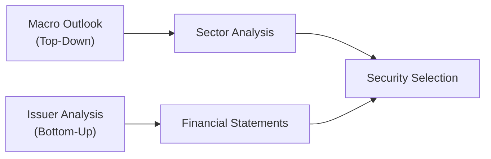

## Introduction

I remember chatting with a fellow portfolio manager who said, “I’m telling you, I get excited every time I see a fascinating new bond issue. But I also know the credit cycle can crush my sweet little pick if I ignore the big macro signals.” That little snippet actually sums up the tension between bottom-up and top-down approaches in credit investing. On one hand, we can dig into the nitty-gritty of a company’s financial statements to find hidden gems (the bottom-up approach). On the other hand, ignoring major macro shifts—like an impending recession—can make us regret ignoring top-down analysis. So yeah, it’s never a purely black-and-white decision.

This article will walk through what bottom-up and top-down investing look like in credit portfolios, as well as the pros, cons, possible hybrid solutions, best practices, and exam-specific insights for CFA® Level III candidates. If you’ve come this far in your studies, you’ve probably encountered these concepts in equity settings. Now, we’ll apply them to credit instruments—like corporate bonds, credit default swaps, and more. Ready? Let’s dive in.

## Rationale Behind Two Approaches

At its core, credit investing is about lending money to issuers and getting compensated for the risk of default or downgrade. When you lend to a corporation, a municipality, or a sovereign entity, you weigh the interest (yield) you’ll earn against the probability that the issuer might struggle to make payments. If you’re a bottom-up person, you’re heavily focused on understanding that issuer’s financials and the specifics of the deal. If you’re top-down, you’re more about the big picture—where we stand in the business cycle, the direction of interest rates, or broader market sentiment.

In practice, both approaches can help you avoid major pitfalls (like buying a bond in a cyclical sector that’s about to get hammered by an economic downturn) or can help identify promising opportunities (like spotting an undervalued bond from a profitable niche company). Since credit markets are sometimes more opaque than equity markets, the interplay between bottom-up and top-down can be crucial for constructing robust portfolios.

## Bottom-Up Methodology: The Nitty-Gritty Analysis

The bottom-up approach is about finding diamonds in the rough. You typically start with the issuer’s fundamentals:

• Financial Statements: It’s like going through all the dusty corners of an issuer’s balance sheet, income statement, and cash flow statement. Is revenue stable or growing? Is margin compression an issue?  
• Credit Metrics: Key ratios like interest coverage and leverage are top-of-mind. A high leverage ratio can be a red flag for credit risk. A common measure is:


\text{Leverage Ratio} = \frac{\text{Total Debt}}{\text{EBITDA}}


The higher this ratio, the more leveraged the company is relative to its operating earnings. Another crucial ratio is:


\text{Interest Coverage Ratio} = \frac{\text{EBIT}}{\text{Interest Expense}}


• Industry Position and Competitive Landscape: If a company has a market edge or strong financing lines from stable banks, that’s usually good news.  
• Qualitative Factors: Management’s track record, strategic direction, and corporate governance matter. Sometimes, intangible aspects can be big signals—like a sudden management shake-up or negative changes in corporate culture that might degrade performance.  

### Strengths of Bottom-Up

• Potential for Alpha: By identifying a bond that the market overlooks, you can lock in superior yield or capture price appreciation when fair value is recognized.  
• Deep Insights: You know exactly what you’re investing in: the exact business model, capital structure quirks, and the issuer’s relationship with suppliers and customers.

### Weaknesses of Bottom-Up

• Macro Blind Spots: It’s easy to love an issuer’s fundamentals and forget to watch the broader tide. If the entire sector collapses due to a global downturn, your “undervalued” bond can drop in price alongside everything else.  
• Time-Intensive: Conducting thorough fundamental research for each bond is labor-intensive. Maintaining coverage, especially in large portfolios, can be challenging.  

Anyway, if you relish rolling up your sleeves and dissecting companies inside and out, bottom-up credit investing will feel quite natural.

## Top-Down Methodology: The Big Picture

If the bottom-up person is the detective who inspects every clue at a crime scene, the top-down approach is the detective who starts with the entire city’s crime statistics. With top-down, you’re looking at:

• Macroeconomic Indicators: Is GDP growth accelerating or slowing? How about inflation trends, central bank policies, or consumer sentiment?  
• Credit Cycle Assessment: Are we in a tightening environment where riskier credits might underperform? Or are we in a recovery that bodes well for high-yield bonds?  
• Sector Rotation: If you believe oil prices will remain high, you might overweight the energy sector. If you foresee an e-commerce boom, maybe certain retail or tech segments look attractive.  
• Geographic Considerations: Some economies rebound sooner than others. In a multi-currency bond space, top-down managers might tilt their portfolios to regions that appear on upswing phases.  

### Strengths of Top-Down

• Quick Shifts: If you see signs of a looming recession, you can lighten up on high-yield or weaker credits and shift capital toward safer, high-grade corporate bonds or Treasuries.  
• Broad Coverage: You can focus your efforts on major macro drivers that typically matter for the bulk of returns in credit markets, especially in times of market stress.

### Weaknesses of Top-Down

• Missing Out on Issuer-Specific Alpha: You might select a bond simply because it fits your sector thesis, potentially ignoring an issuer’s unique catalysts or red flags.  
• Risk of Over-Reliance on Macro Forecast: Getting macro calls right is notoriously difficult—even for experienced economists. Overestimating or underestimating an economic turn can lead to big misallocations.

If you find yourself thrilled by reading the latest Federal Reserve statements and cross-referencing them with global PMI data, the top-down approach might be your playground.

## Combining Both Approaches

In reality, most professional money managers will mix the two. The interplay looks something like this: you form a top-down view of the credit cycle—maybe you conclude that investment-grade bonds are generally more appealing than high-yield at the moment. Then, within that investment-grade universe, you do bottom-up research to pick the best (or the least risky) issuers.

A concise illustration might look like:

Top-Down helps you decide which sectors or credit quality tiers to focus on. Bottom-Up refines those choices, unearthing the particular bonds you want to own.

## Pros and Cons in a Nutshell

If we compare the two approaches side by side:

• Bottom-Up  
  – Pros: Granular, may exploit specific mispricings, can generate alpha from deep-dive credit analysis.  
  – Cons: Time-consuming, can miss macro signals, might limit your perspective if big events (like commodity price shocks) overshadow individual differences among issuers.

• Top-Down  
  – Pros: Strategically nimble with macro shifts, can quickly pivot across sectors or credit ratings, strongly grounded in cyclical awareness.  
  – Cons: Potentially overlooks issuer-level opportunities, depends on the ability to forecast macro trends accurately, which is notoriously hard.

## Practical Example: Cyclical Consumer Sector

Let’s say, for instance, you suspect an upcoming recession. A top-down manager might say, “Consumer cyclical companies—like high-end retailers—stand to suffer when people cut discretionary spending.” So they reduce exposure to lower-rated consumer cyclical bonds. A bottom-up manager in that same scenario might find a niche luxury retailer with robust demand from emerging markets that still shows strong fundamentals and very low default risk. By focusing on granular fundamentals, this manager might pick a bond that in fact performs relatively well, defying the gloom in the overall cyclical space.

Who’s right? Possibly both. It depends on the ultimate severity of the downturn, consumer behavior shifts, and how well that luxury retailer handles global distribution. These real-life complexities show there’s rarely a neat, guaranteed play.

## Hybrid Implementation in Real Portfolios

Many credit portfolios these days follow a hybrid approach:

• Stage 1 – Macro/Sector Allocation: Identify which sectors or rating segments (e.g., BBB vs. BB) to overweight or underweight. This stage might be driven by your top-down insights—like expected Fed rate hikes or a supply-demand imbalance in certain industries.  
• Stage 2 – Issuer Selection: Within those favored sectors, do fundamental credit analysis of individual bonds. This stage is bottom-up. You evaluate each issuer’s financial strength, embedded options, and covenant protections.  
• Stage 3 – Ongoing Monitoring: Credit markets move quickly, and an issuer’s fundamentals may change. Also, macro signals like inflation, real GDP growth, or commodity price swings can evolve. Frequent monitoring helps ensure your portfolio remains aligned with both your top-down macro thesis and bottom-up credit convictions.

## Best Practices and Pitfalls

It’s crucial to address some best practices as well as common pitfalls that might appear on exam questions or even real investment committees:

• Consistency with Mandate: If your fund is specifically an investment-grade portfolio, you typically can’t chase a hot high-yield opportunity even if your analysis suggests strong returns. Watch for style drift—especially relevant from a Code and Standards perspective, where you must adequately inform clients of risks.  
• Duration and Spread Analysis: In a rising rates environment, top-down managers might shorten duration or shift to floating-rate instruments. Bottom-up managers must also be mindful of a bond’s sensitivity to interest rates.  
• Liquidity: Some high-yield segments can be less liquid. If you build a purely bottom-up portfolio with many niche issuers, you might struggle to exit positions in volatile markets.  
• Behavioral Biases: Overconfidence in your macro calls or in your ability to “find the next gem” can hamper returns. Stress test your assumptions.  
• ESG Factors: Growing importance is being placed on ESG and sustainability considerations. Both bottom-up and top-down managers must weigh environmental or social controversies that can spark reputational risk, or macro policies that might penalize polluting industries.  

## Applied KaTeX Formulas and Analysis

Apart from the leverage ratio mentioned earlier, top-down managers often consider the overall credit spread environment. A broad measure might be the option-adjusted spread (OAS) on a bond index. They might compare:


\text{Excess_{Spread}} = \text{OAS_{Sector}} - \text{OAS_{Benchmark}}


If \\(\text{Excess_{Spread}}\\) is sufficiently high, that sector might be favored from a top-down standpoint. The bottom-up folks, once a sector is flagged, will dig deeper into issuer-level data.

## Exam Relevance

For the CFA® Level III exam, expect scenario-based questions that blend both top-down and bottom-up elements in credit analysis. You might see an item set describing a macroeconomic environment (e.g., a slowdown in China, a rise in U.S. interest rates, plus a commodity price decline) and then ask how a manager would tilt their bond portfolio. Alternatively, you could face an essay asking you to evaluate the creditworthiness of a specific issuer within a chosen sector.

In the essay portion (constructed response), you may have to:

• Justify a recommendation to overweight or underweight a particular segment of the credit market (top-down rationale).  
• Present key credit metrics for a bond issuer (bottom-up rationale).  
• Discuss the synergy or conflict between the macro view and individual issuer fundamental analysis.  
• Illustrate how you might combine both sets of analysis into a single cohesive portfolio construction approach.  

Time management is critical. Practice synthesizing macro signals with issuer-level fundamental data efficiently. Also, re-check any ratio calculations or references to credit rating transitions to avoid small mistakes—the exam loves to see if you can handle real-time analytics under pressure.

## Personal Tip

I still recall the scramble my team went through in 2008. We freaking loved certain mortgage-backed securities from strong issuers—bottom-up analysis told us those deals were “solid.” But ignoring cracks in the broader credit markets was, well, let’s call it a “lesson.” We learned that top-down can’t be dismissed. Meanwhile, in the post-crisis environment, top-down analysis pointed to a sweeping rally in corporate credit, but that rally was uneven. So that forced us to add bottom-up research to avoid pitfalls in sectors that were shaping up to raise capital but couldn’t patch up their balance sheets. The moral? You want both eyes open: one scanning the horizon, the other focused on the details.

## References

• Fabozzi, F.J. and Mann, S.V. “The Handbook of Fixed Income Securities.”  
• Damodaran, A. “Damodaran on Valuation.”  
• Credit research reports from major global investment banks (e.g., JPMorgan, Goldman Sachs).  
• Official CFA Institute curriculum readings on Fixed Income and Portfolio Management.  

## Test Your Knowledge: Bottom-Up vs. Top-Down Approaches in Credit Investing



### Which statement best describes the difference between bottom-up and top-down approaches in credit investing?

- [x] Bottom-up focuses on individual issuer fundamentals, while top-down focuses on macroeconomic and sector-level trends.
- [ ] Bottom-up deals only with government bonds, while top-down deals only with corporate bonds.
- [ ] Bottom-up relies on forward rate analysis, while top-down primarily uses credit default swap curves.
- [ ] Bottom-up is always more profitable, while top-down yields virtually no alpha.

> **Explanation:** Bottom-up analysis centers on studying each issuer’s financial position, whereas top-down analysis looks at broad macroeconomic conditions and sector allocation decisions.

### A purely bottom-up manager might be vulnerable to which major risk?

- [ ] Buying bonds at lower yield spreads.
- [ ] Missing issuer-specific catalysts.
- [x] Ignoring important macro changes that affect entire sectors.
- [ ] Being too diversified in credit quality.

> **Explanation:** Bottom-up managers can overlook big-picture, top-down warnings such as economic downturns or cyclical shifts that impact all credits in certain industries or geographies.

### In a credit portfolio, which scenario exemplifies a pure top-down approach?

- [x] Allocating heavily toward high-yield energy bonds because oil prices are expected to remain high, with minimal issuer-specific analysis.
- [ ] Choosing a bond from a single issuer after detailed review of its balance sheet and covenant structure.
- [ ] Evaluating the interest coverage ratio for each bond before constructing the portfolio.
- [ ] Maintaining positions in a broad index to mirror average market exposures.

> **Explanation:** A top-down approach relies primarily on sector or macro themes (e.g., expecting stable or high oil prices) rather than deep analysis of individual bond issuers.

### One advantage of combining bottom-up and top-down approaches in credit investing is:

- [ ] Eliminating the need for fundamental research on issuers.
- [x] Balancing macro insights with targeted issuer-level opportunities.
- [ ] Ensuring guaranteed outperformance in all market cycles.
- [ ] Avoiding any sector rotation in the portfolio.

> **Explanation:** Hybrid strategies leverage macroeconomic research to set sector guidelines and then use bottom-up analysis to probe within those segments for specific mispricings.

### A top-down manager anticipating a tightening of monetary policy might:

- [ ] Overweight high-yield bonds to capitalize on higher spreads.
- [ ] Focus on single-B or lower-rated credits for maximum upside.
- [x] Shift to higher-quality investment-grade credits or shorter-duration instruments.
- [ ] Completely avoid bond markets.

> **Explanation:** A tightening cycle often raises borrowing costs and can negatively impact riskier credits, so a typical top-down response is to move up the quality ladder or reduce duration.

### Which of the following is a key ratio used in bottom-up credit analysis?

- [ ] The Weighted Average Cost of Capital ratio.
- [x] The Leverage Ratio (Total Debt/EBITDA).
- [ ] The Sharpe Ratio.
- [ ] The Price-to-Earnings (P/E) ratio.

> **Explanation:** The Leverage Ratio (Total Debt/EBITDA) is crucial for understanding how much debt an issuer has relative to its earnings. P/E is more relevant to equities, and Sharpe Ratio evaluates risk-adjusted returns, not issuer fundamentals.

### Why might a purely top-down approach fail to capture alpha in certain credit environments?

- [x] It may overlook issuer-specific developments that significantly impact bond valuations.
- [ ] It focuses exclusively on interest coverage ratios and growth prospects.
- [ ] It restricts the approach to stable, high-grade bonds only.
- [ ] It does not incorporate macroeconomic data at all.

> **Explanation:** Top-down managers who ignore the deep fundamental drivers of specific issuers could miss opportunities—like a bond trading at an attractive discount due to a temporary market dislocation unique to that issuer.

### How can ESG factors intersect with bottom-up credit investing?

- [ ] By focusing exclusively on top-down macro metrics like GDP growth.
- [ ] By limiting analysis to short-term spread changes only.
- [x] By examining each issuer’s environmental and social policies, which can affect long-term credit risk.
- [ ] By fully removing fundamental analysis from the security selection process.

> **Explanation:** With a bottom-up approach, investors can evaluate each issuer’s environmental, social, and governance factors to see how they influence default risk, operational resilience, and reputational issues.

### When constructing a hybrid credit portfolio, which step typically comes last?

- [ ] Determining macroeconomic indicators.
- [ ] Allocating to sectors based on the interest rate outlook.
- [ ] Evaluating fundamental credit metrics of each issuer.
- [x] Ongoing monitoring of both macro factors and issuer fundamentals.

> **Explanation:** Even after you’ve chosen the sectors and picked specific bonds, continuing to watch both macro changes and company developments is essential to manage risk and maintain alignment with your strategy.

### True or False: The CFA® Code and Standards requires portfolio managers to disclose significant changes in investment style, including a shift from top-down to bottom-up strategies.

- [x] True
- [ ] False

> **Explanation:** According to the CFA® Code of Ethics and Standards of Professional Conduct, managers must act fairly and transparently. Changing the investment style or significantly altering the risk profile of a portfolio necessitates timely disclosure to clients.


