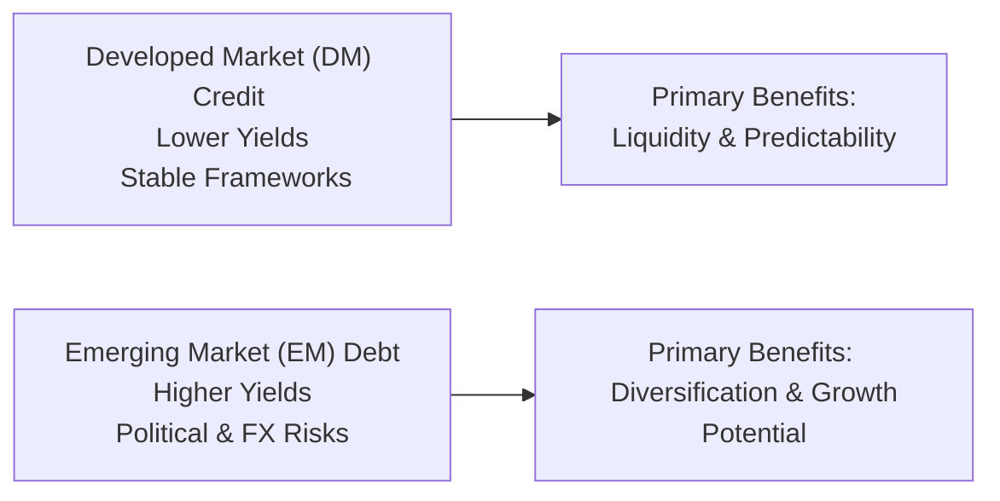
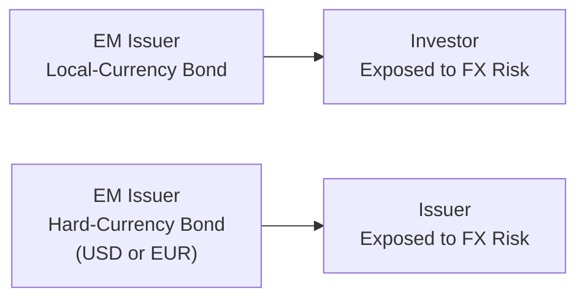

## Introduction to International Credit Markets and Emerging Market Debt

Let’s be honest for a moment: investing in international credit markets sometimes feels a bit like driving on unfamiliar roads, right? You know how in some countries, roads are meticulously maintained and the rules are crystal clear, while in others you might encounter potholes and unreliable signage? Well, developed-market (DM) credit can sometimes feel like that well-organized highway system—stable, mostly predictable, though not always brimming with excitement. Emerging market (EM) debt, on the other hand, can be like an off-road adventure, full of bumps, detours, and exhilarating scenery. That’s basically the spirit of this section: we’re delving into the rewards, risks, and strategic considerations that come with venturing into international credit, particularly in emerging markets.

## Key Distinctions: Developed vs. Emerging Markets

To manage an international credit portfolio effectively, it is essential to appreciate the ways in which developed and emerging markets diverge. Developed-market credits tend to exhibit:
• Higher credit ratings and established legal frameworks.  
• Smoother regulations and deeper market liquidity.  
• Typically lower yields (because perceived risk is lower).

In contrast, emerging-market credits often:
• Present higher yields (as compensation for higher risk).  
• Feature less predictable regulatory environments.  
• Exhibit vulnerability to political risk and structural issues like limited market depth.

On the bright side, these differences can create fantastic opportunities for portfolio diversification. While DM markets often move together given correlated macro conditions, EM debt can be influenced by factors such as commodity prices and regional political developments—potentially offering uncorrelated returns to a broader fixed-income portfolio.

Below is a simple diagram to visualize the main distinctions:

The left side highlights the typical stability found in DM credits, whereas the right side shows the heightened opportunity—and risk—associated with EM debt.

## Sovereign vs. Corporate Emerging Market Debt

Emerging market debt can be broadly divided into sovereign and corporate:

• Sovereign EM Debt: Issued by government entities in growing economies. For instance, you might come across Mexican sovereign bonds denominated in U.S. dollars, or local-currency bonds issued by Brazil’s government. Investors must watch:
  – The government’s fiscal and monetary discipline.  
  – International reserves and external debt levels.  
  – Political stability, which can sway default risk perceptions.  

• Corporate EM Debt: Issued by companies domiciled in emerging economies. For example, a large telecommunications company in India issuing debt in either local currency or a “hard” currency such as USD. Investors need to scrutinize:
  – The firm’s financial statements, typically under IFRS or US GAAP, but occasionally with less transparent disclosures.  
  – The legal environment for creditors—enforcement of claims can be trickier in certain jurisdictions.  
  – Industry and macro factors, especially if the company’s products hinge heavily on commodity prices.

Even within sovereign and corporate classes, heterogeneity abounds. Some sovereign issuers boast stable credit ratings and track records of timely debt service, while others face recurring fiscal stress or political upheaval.

Here’s a quick table that compares the two:

|                    | Sovereign EM Debt          | Corporate EM Debt                                      |
|--------------------|----------------------------|--------------------------------------------------------|
| **Issuer**         | Government                | Private or state-owned enterprise                     |
| **Default Risk**   | Tied to fiscal stability  | Varies by company fundamentals & industry outlook     |
| **Recovery Rates** | Historically moderate     | Can range from low to moderate (depends on legal recourse) |
| **Influencing Factors** | Political stability, central bank reserves | Corporate governance, competition, commodity prices  |

## Currency Risk in EM Bonds

Currency considerations are frequently front-and-center in EM investing. EM bond issuers may float debt in:
• Their local currency (e.g., Brazilian Real, South African Rand), or  
• A “hard currency” such as the U.S. dollar or euro.

### Local Currency Bonds
Local-currency bonds often provide higher yields but can expose investors to currency depreciation. Suppose you buy a local-currency bond offering 9% yield in your base currency terms, but the currency loses 10% against the U.S. dollar. This scenario could wipe out your “extra” yield.

If you want to hedge this FX risk, you can use currency forwards or currency swaps to lock in exchange rates. However, the hedge cost can eat into your yield advantage, sometimes to the point that you begin to wonder whether it was worth going local in the first place.

### Hard Currency Bonds
By contrast, EM borrowers can issue bonds denominated in U.S. dollars or euros to attract a broader base of international investors. While this mitigates one side of currency risk for the investor (you’re receiving coupons in a familiar currency), the issuer itself bears the risk of currency mismatch. If their local currency depreciates, the cost of servicing USD-denominated debt can soar, sometimes leading to defaults. If you’re investing in USD-denominated EM debt, you must still analyze macro risks: a sudden deterioration in a country’s terms of trade might reduce their capacity to repay externally funded sovereign or corporate obligations.

Below is a diagram that highlights the main currency setups:

In local-currency bonds, the investor typically faces more direct exposure to exchange rate fluctuations. In hard-currency bonds, the issuer shoulders that currency risk, although various macro factors can still impact credit quality from the investor’s perspective.

## Unique Credit Metrics for EM Issuers

Many financial ratios and metrics used in developed markets also apply in EM credit analysis—like interest coverage, debt-to-GDP for sovereigns, or EBITDA margins for corporates. But in EM investing, you usually pay extra attention to:

• Political Risk: A sudden regime change could disrupt foreign investment flows or lead to expropriation of private assets. Regularly monitor the domestic political environment and weigh the implications for bondholders.  
• External Debt Levels and Central Bank Reserves: If a sovereign or its corporate sector has debts widely denominated in foreign currency, the capacity to sustain such debt can hinge on the country’s foreign exchange reserves.  
• Commodity Dependence: Many emerging economies rely on exports of raw materials. Fluctuations in commodity prices can ripple through tax revenues, corporate earnings, and the overall ability to service debt.  

## Global Macroeconomic Indicators Influencing EM Credit

Global growth rates, interest rate differentials, and commodity trends can significantly affect EM credit spreads. If you’ve ever had a friend who runs a small business that depends on one big customer, you’ll get the dynamic: if that customer’s own business falters, your friend’s livelihood feels the shock. Similarly, if a major developed-market central bank (like the Fed) starts hiking rates aggressively, EM bond spreads can widen as investors flock back to safer assets, thereby undermining EM market liquidity and valuations.

### Notable Macro Indicators
• Commodity Indices: For instance, the Bloomberg Commodity Index can gauge broad commodity demand.  
• Trade Balances: Surpluses or deficits shape currency resilience and the availability of foreign exchange.  
• Geopolitical Tensions: Trade wars, embargoes, or alliances can pivot the fortunes of EM issuers quickly.

An example: Suppose an EM country relies on copper exports, and copper prices collapse due to a global manufacturing slowdown. In that downturn, the country’s external account might deteriorate, thus raising the cost of capital for both sovereign bonds and corporate issuers.

## Role of Rating Agencies in EM

Credit rating agencies, such as Moody’s, S&P, and Fitch, provide ratings for many EM issuers. However, coverage can be uneven, and rating changes may lag behind real-time market developments. Emerging markets might receive an upgrade or downgrade later than market sentiment suggests. An internal credit analysis framework tends to be more crucial than in the DM environment, because risks—particularly political or legal—are unique and often underappreciated by standard rating methodologies.

Hence, for many CFA professionals, the best practice is to use third-party ratings as a starting reference, then devote resources to in-house research, especially in markets lacking transparency.

## Liquidity Conditions in EM

Imagine you need to exit a position in a local-currency bond quickly if negative news breaks. In many EM markets, especially during a crisis, the path to cash out may be narrower than you’d like. It happens a lot: liquidity can dry up, bid-ask spreads can widen sharply, and local broker-dealers may be constrained.

### Best Practices for Liquidity Management
• Diversify across issuers and maturities to avoid concentration in illiquid notes.  
• Consider the use of derivatives (e.g., credit default swaps on EM indices) to manage exposures indirectly.  
• Stress-test your portfolios for liquidity during hypothetical crisis events—even if it feels uncomfortable, it yields vital insights.

## Practical Implementation: Case Examples

Let me share a quick anecdote from personal experience. I once explored an EM telecom bond that carried a juicy coupon—like, double what you would find on a U.S. investment-grade bond. Perhaps it looked almost too good to be true. When I dug deeper, I realized the company’s local government was imposing foreign exchange controls that might limit dollar remittances for coupon payments. Even though the issuer had decent fundamentals, the currency repatriation risk was a wildcard. My takeaway? Analyze not only the issuer but also the environment in which they operate, especially with regard to foreign currency outflows and government capital controls.

Another scenario might feature a government guaranteeing the bonds of a state-owned utility. At face value, it can look safer because of the sovereign backstop—but only if you trust that the sovereign in question has the means and the will to prop up the company in crisis.

## Active Management Techniques for EM Debt

### Security Selection and Country Allocation
Active managers frequently adopt a two-level approach: top-down selection of country exposures (based on macro analysis) while simultaneously focusing on bottom-up issuer fundamentals. You might be bullish on Mexico’s macro environment (stable inflation, decent growth projections) but shy away from certain energy companies that appear overleveraged.

### Hedging and Derivatives
Engaging in currency forwards, swaps, or credit default swaps can provide a partial or full hedge against credit or currency risks, though each derivative has costs. If your investment thesis is purely about interest carry, a partial FX hedge might let you lock in that yield advantage.

### Tactical and Strategic Positioning
Even among EM countries, risk premiums shift quickly. Active managers flex their exposures—say, overweighting Indonesia while underweighting Turkey, based on perceived political or macro vulnerabilities. Meanwhile, a more strategic approach might revolve around capturing a recurring premium in higher-yield credits while maintaining certain liquidity buffers.

## Best Practices and Common Pitfalls

• Best Practice: Always consider currency risk in tandem with credit risk. Don’t let an attractive yield overshadow the potential currency drawdown.  
• Best Practice: Maintain flexible liquidity, potentially via cash or easily tradable assets, to meet redemptions or opportunistic buys during times of market stress.  
• Pitfall: Overreliance on external ratings. Rely on them for initial screening, but conduct deep-dive fundamental analysis—especially on local political and legal nuances.  
• Pitfall: Ignoring regulation or capital controls. One day you might be able to move capital freely; the next, you might be stuck if new laws or controls appear.

## Exam Tips for CFA Level III Candidates

• Scenario Analysis: Expect to see item-set questions where country-specific crises or rating downgrades affect both corporate and sovereign bonds. Focus on how to manage drawdowns, interpret credit risk, or handle currency exposures.  
• Constructed Responses: Be prepared to outline a rationale for shifting allocations among various EM issuers based on macro analysis, or to propose a hedging strategy for currency risk.  
• Calculations: You might see an example requiring you to compute net yield after hedging costs. Practice those calculations—especially forward points on currency hedges.  
• Ethics & Professional Standards: Always remember the importance of the Code and Standards, particularly regarding thorough due diligence and presenting fair, balanced recommendations to clients. Emerging markets can sometimes tempt managers to rely on incomplete data.

## References for Further Exploration

• IMF World Economic Outlook (https://www.imf.org/): Great for macro-level insights and country-specific overviews.  
• Reinhart, C. & Rogoff, K., “This Time Is Different: Eight Centuries of Financial Folly”: This is a classic for understanding sovereign debt crises and historical patterns.  
• Global Financial Stability Report (often published by IMF): Contains updates on emerging-market debt trends, default risks, and liquidity conditions.

------

## Test Your Knowledge: International Credit and Emerging Market Debt



### In which scenario is local-currency EM debt most likely to outperform similar hard-currency EM debt, assuming no hedges?
- [ ] When the local country's exports decline sharply
- [x] When the local currency strengthens significantly
- [ ] When global interest rates rise sharply
- [ ] When commodity prices collapse

> **Explanation:** Local-currency EM debt stands to benefit if the local currency appreciates, enhancing foreign investors’ returns as coupon payments are converted back into a stronger currency.

### Which factor best explains why corporate EM debt can pose unique risks compared to sovereign EM debt?
- [ ] Corporate debt typically bears no currency exposure
- [ ] Corporate debt is usually risk-free because of implied government backing
- [x] Corporate issuers may face opaque legal environments and governance structures
- [ ] Corporate issuers never default on dollar-denominated bonds

> **Explanation:** Corporate issuers in emerging markets often operate within less robust legal frameworks and may provide less transparent financial disclosures, intensifying risks for investors.

### When the Fed raises interest rates significantly, how are EM bond spreads typically affected?
- [ ] EM bond spreads narrow due to increased foreign demand
- [x] EM bond spreads widen as investors often shift to safer assets
- [ ] EM bond spreads remain unchanged
- [ ] EM bond spreads tighten due to improved liquidity in EM

> **Explanation:** As U.S. rates move up, global investors frequently rotate toward higher-yielding but “safer” U.S. instruments, prompting an outflow from EM debt and thus wider spreads.

### Which key risk do investors face when holding EM local-currency bonds, but not EM hard-currency bonds?
- [ ] Price risk due to interest rate fluctuations
- [ ] Corporate default risk
- [x] An adverse movement in the exchange rate of the local currency
- [ ] Inflation risk

> **Explanation:** While there are many risks that might affect all EM bonds, local-currency bonds specifically expose the investor to direct FX changes, so a depreciating local currency can erode returns dramatically.

### Which statement is true regarding the role of rating agencies in emerging markets?
- [x] Rating agencies may lag in adjusting EM credit ratings
- [ ] Agency coverage is typically more robust in EM compared to DM
- [ ] EM sovereign ratings are determined solely by foreign-exchange reserves
- [ ] In-house analysis is unnecessary if an EM issuer is already rated investment grade

> **Explanation:** Emerging markets often have less transparent data, and rating agencies can be slower to capture rapid shifts in political or economic factors. Hence, in-house analysis is crucial.

### How might an investor hedge local-currency risk in an EM bond position?
- [ ] By diversifying into more local currency bonds
- [x] Using currency forwards or swaps to lock in exchange rates
- [ ] By buying the sovereign issuer’s equity
- [ ] By using more leveraged positions

> **Explanation:** Currency forwards and swaps are the standard tools to hedge FX exposure in local-currency bonds, helping offset possible loss from currency depreciation.

### In a severe crisis, which EM bond characteristic most commonly leads to capital losses for foreign investors?
- [x] Low market liquidity causing large bid-ask spreads
- [ ] Excessive short covering by local investors
- [x] Mark-to-market volatility due to massive sell-offs
- [ ] Guaranteed support from the central bank

> **Explanation:** Liquidity issues and dramatic changes in bid-ask spreads are frequent occurrences in an EM crisis, leading to sharp price declines and higher volatility for foreign investors.

### Which factor is often most critical when assessing an EM sovereign issuer’s default risk?
- [x] Level of FX reserves relative to external debt obligations
- [ ] Size of the local real estate market
- [ ] Percentage of the population employed by the public sector
- [ ] Central bank’s political independence alone

> **Explanation:** While multiple factors matter, an EM sovereign with high external debt must maintain sufficient FX reserves to meet obligations, making it a key metric for default risk analysis.

### Why might an EM corporate issuer with government support still present credit risk?
- [ ] Government support completely eliminates any default possibility
- [x] The sovereign may not honor implied guarantees under stress
- [ ] Corporate issuers have no external audit requirements
- [ ] Government backing ensures higher yields but lower default risk

> **Explanation:** Even if there’s a government backstop, the sovereign itself could face financial strain and decide not to honor those guarantees, leaving bondholders vulnerable to default scenarios.

### Active managers of EM debt portfolios commonly take what approach to currency exposure?
- [x] They may hedge a portion of the local-currency risk to protect alpha
- [ ] They rarely hedge currency risk, believing EM FX gains are guaranteed
- [ ] They hedge only U.S. dollar exposure
- [ ] They invest exclusively in short-term EM bonds to reduce currency volatility

> **Explanation:** Active managers often partially hedge currency exposure, balancing the desire to capture higher yields with the need to limit FX losses.


