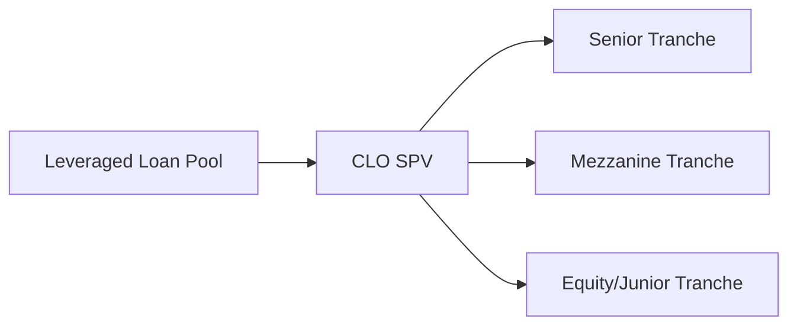

Overview  
Structured instruments can sometimes feel like that shiny new gadget you’re not entirely sure how to use. They can be incredibly powerful in a portfolio, but they seem complicated. In this section, we’ll take a close look at how these instruments—Asset-Backed Securities (ABS), Mortgage-Backed Securities (MBS), and Collateralized Loan Obligations (CLOs)—compare to your usual corporate bonds. We’ll look at their risk factors, potential for yield, and how you might integrate them in a fixed-income portfolio to capture diversification and targeted exposures.

What Are Structured Instruments?  
At the heart of a structured instrument is the idea of “pooling.” An issuer gathers a pool of loans or other assets—think mortgage loans, auto loans, or leveraged loans—and slices them into different layers (called tranches). Each layer can have a different exposure to the risk of default, prepayment, or extension. These layers are then packaged as securities and sold to investors. Corporate bonds, on the other hand, are just direct obligations of a single issuer. Structured instruments, in contrast, let you invest in a diversified stream of cash flows from multiple borrowers, often accompanied by a variety of credit-enhancement features.

Key Differences from Corporate Bonds  
• Diversification of Underlying Assets: Instead of having a single corporate issuer, you’ve got a pool of underlying assets (mortgages, consumer loans, commercial loans, etc.).  
• Tranching and Hierarchical Payments: Investors choose specific tranches that come with varying seniorities and risk exposures.  
• Credit Enhancement: Subordination, overcollateralization, surety bonds, and other features can lower risk for senior tranches.  
• Complex Cash Flow Profiles: Prepayments, extension risk, or the manager’s decisions affect the actual payment schedule.  

Even though structured instruments can offer higher yields than many corporate bonds, they come with quirks and complexities that require understanding the underlying pools, triggers, and structural protections.

Common Types of Structured Instruments  

Asset-Backed Securities (ABS)  
ABS are backed by some pool of loans or receivables—these could be auto loans, credit card debt, student loans, or even lease receivables. ABS typically use credit enhancement structures like subordination of junior tranches or excess spread. Here’s an example: suppose you have an ABS that’s backed by a pool of auto loans. The underlying vehicle owners send monthly payments that collectively feed into the income stream for investors. Senior tranches have first claim on the cash flows and are generally safer, while junior tranches (also known as subordinate or mezzanine tranches) bear higher risk and get higher yields.

Mortgage-Backed Securities (MBS)  
MBS are securities secured by mortgage loans on residential or commercial real estate. They can be issued by agencies (like Fannie Mae, Freddie Mac, or Ginnie Mae in the U.S.) or as non-agency MBS by private institutions. MBS are recognized for their characteristic prepayment risk—borrowers can refinance or pay off their mortgages at any time, which affects the investment’s effective duration and yield. This can be neat in a falling-rate environment (you get your principal back sooner, which you can reinvest at lower yields), but painful if you were counting on those juicy higher coupon payments to continue.

Collateralized Loan Obligations (CLOs)  
Imagine a big pool of leveraged loans, typically extended to companies with higher credit risk. A CLO manager (collateral manager) selects and actively manages these loans within a special-purpose vehicle (SPV). As the cash flows from these loans come in, they’re distributed based on a seniority stack. Senior tranches often have relatively stable profiles when everything’s going fine, but they can be vulnerable to hits if default rates on the underlying loans surge. CLOs also carry what’s sometimes called manager risk—meaning, the experience and skill of the CLO manager in selecting and maintaining the loan portfolio matter quite a bit.

Below is a simplified diagram showing how credit risk is carved up in a CLO:

The senior tranche usually receives payments first and is least risky. The mezzanine and equity tranches sit behind it, which means they bear losses first if defaults in the underlying loans pile up.

Credit Enhancement Features  
One of the things that sets structured instruments apart is credit enhancement. And boy, do they get creative. Subordination is the big one: junior tranches absorb losses first, protecting the payment stream for senior tranches. Some securities also rely on overcollateralization (where the underlying pool is actually bigger than the total par value of the securities) or even external guarantees. These mechanisms help reduce default risk for certain tranches, often making the top tier of these structures relatively stable compared to similarly rated corporate bonds.

Risk Dimensions to Consider  

Prepayment Risk  
Prepayment happens when borrowers pay more than required—or pay off entirely—before the scheduled maturity. Mortgage-backed securities are well-known for this. When interest rates fall, many homeowners rush to refinance. This shortens the average life of the security and forces investors to reinvest proceeds at lower rates. In bullish bond markets, ironically, MBS holders can’t fully enjoy the capital appreciation, because principal is returned early.

Extension Risk  
On the flip side, extension risk occurs when rates rise or other conditions keep borrowers from prepaying their loans. That extends the life of the security, which might be less desirable if you were counting on getting your principal back for reinvestment at presumably higher yields. Some ABS structures, especially those with callable or prepayable underlying loans (e.g., certain auto loans or other consumer debt), can also exhibit extension risk.

Manager Risk  
CLOs come with an added layer: the collateral manager. That manager decides which loans to buy or sell, within guidelines. If they do a great job, they can mitigate defaults, manage reinvestment, and preserve the CLO’s overall credit profile. If they stumble, losses may escalate—even in a favorable credit environment. So, it’s essential to evaluate the manager’s track record, style, and expertise as part of due diligence.

Potential for Higher Yields—But Mind the Volatility  
Investors often look to structured products when they want yields that exceed corporate bonds of similar credit ratings. This yield advantage arises for a few reasons. First, there’s the complexity premium: you’ll get rewarded for analyzing these instruments if others shy away from them. Second, the market might be factoring in higher uncertainty about prepayments, extension, or underlying loan performance. And third, the structural features, including subordination, can create additional demand for certain tranches but simultaneously push up yields for the lower tranches.

A quick cautionary tale, though: in times of financial stress, structured products can experience much sharper price declines than similarly rated corporate bonds. The 2008 financial crisis made this painfully clear, especially for non-agency MBS or CLO tranches that were heavily leveraged. Liquidity dried up, pricing became dislocated, and forced selling amplified volatility. The “could this happen again?” question always lingers at the back of investors’ minds, so scenario analysis and stress tests are paramount.

Diversification and Targeted Exposure  
Structured instruments—and securitized credit in particular—can help you diversify away from single-issuer corporate credit risk. You may say, “But aren’t I just investing in a complicated version of a corporate loan or mortgage?” Possibly, but the underlying pool might provide exposure to thousands of individual borrowers and property types in multiple regions. Also, you can target specific segments of the credit market. For instance, a consumer-ABS might track how households are spending or borrowing, while a CLO might let you tap into the leveraged loan market’s risk profile.

Scenario Analysis and Stress Testing  
Prepayment speeds, default rates, collateral manager decisions—these can significantly alter the trajectory of your structured investment. Using scenario analysis, you can gauge how stable your tranches might be if, say, interest rates rise by 200 basis points and unemployment climbs by 2%. Or how the results might change if prepayments accelerate drastically because of new refinancing incentives. Many structured product analytics vendors offer sophisticated forecasting tools that incorporate explicit assumptions about how the underlying borrowers will behave under different economic circumstances.

Key Lessons from 2008  
Speaking of stress tests, the 2008 crisis was a stress test on steroids for structured products. We saw how a meltdown in mortgage underwriting, combined with over-optimistic assumptions about housing prices and borrower behavior, could bring entire segments of the MBS market to their knees. Liquidity basically vanished. Prices plummeted. And the once “triple-A” rated stuff didn’t exactly behave like triple-A. This event taught us that:

• Understanding underwriting standards is crucial (low-quality mortgages or loans can wreck a pool).  
• Fair-value accounting can amplify volatility. Valuation marks can go into freefall if markets seize up.  
• Even if you’re senior, if the entire collateral pool heads south, you can get hit with losses.  

That said, many lessons were learned, and the post-2008 regulatory environment introduced more transparency and stricter standards. Many CLO structures, for example, have become more robust, with thicker equity layers and better underwriting guidelines.

Practical Steps for Implementation  
Select the Right Tranche  
First, pick tranches that match your risk and return objectives, along with your liquidity preferences. If you’re managing a stable-value portfolio and want minimal default risk, you might opt for senior tranches in a strong collateral pool. If you’re a more adventurous investor seeking yield, you might step into mezzanine or even equity tranches—but be prepared for more volatility.

Conduct Thorough Due Diligence  
You’ll want to assess the underlying collateral—Is it residential mortgages, auto loans, or something else? Are these high-quality borrowers or subprime? Next, weigh the structure: Overcollateralization? Senior-sub structure? Manager track record? The deeper your dive, the more comfortable you can be that you’re not stepping into a hidden minefield.

Incorporate into the Broader Portfolio  
Think about correlation. How do these structured instruments align with the rest of your portfolio? For instance, MBS might provide some offset to high-yield corporate bonds, but if the economy deteriorates, both could still fall, though perhaps by different magnitudes. Also consider the liquidity you’ll need. Some classes of MBS or CLO might not be as liquid in volatile periods, so ensure you keep a cushion elsewhere in your portfolio.

Regulatory Considerations and Ethical Standards  
Structured instruments are subject to a range of regulations, especially regarding disclosure of underlying collateral, structural features, and potential conflicts of interest in the issuance. As a fiduciary or professional bound by the CFA Institute Code and Standards, you must ensure transparent communication of risks, thorough diligence, and client suitability. For example, if an MBS or ABS has a complex structure with uncertain prepayment outcomes, disclaimers about these path-dependent cash flows are critical. Always align recommendations with the client’s risk tolerance and alignment of interest.

Summary and Best Practices  
• Understand the Basics: Start by knowing the structure, tranches, collateral quality, and credit enhancements.  
• Assess the Manager: For CLOs, a skilled manager can offset some default risk and reinvest principal effectively.  
• Stress Test Scenarios: Apply robust interest rate, default rate, and market liquidity stress tests.  
• Mind Liquidity: While structured instruments can be an excellent addition for yield or diversification, selling them quickly at fair prices in a crisis can be tough.  
• Continuous Monitoring: Prudent oversight is necessary. Changes in collateral performance, macroeconomic trends, or regulatory requirements can shift the risk-return profile quickly.  

Exam Tips  
• Linking Theory to Application: Be ready for scenario-based questions where you have to compare structured instruments with corporate bonds of the same rating. You might be asked about prepayment or extension risk in a hypothetical interest rate shock scenario.  
• Specialized Calculations: Know how to interpret measures such as Weighted Average Life (WAL), Average Life Sensitivity, or expected default rates under varying assumptions.  
• Structuring Concepts: The exam might test your knowledge of how credit enhancements protect senior tranches, or how subordination works when losses occur.  
• Manager Risk: For CLOs, evaluate the manager’s role in asset selection or reinvestment strategies. Exam questions will often ask you to identify potential pitfalls in CLO structures if manager decisions go awry.  
• Ethical and Professional Dilemmas: Look out for item sets that require you to apply the CFA Institute Code and Standards in marketing or trading these instruments, especially regarding risk disclosure, client objectives, or conflicts of interest.  

References  
• Fabozzi, F.J. “The Handbook of Mortgage-Backed Securities.”  
• Guby, A. & Bhattacharya, A. “Collateralized Loan Obligations and Structured Finance.”  
• CFA Institute Research Foundation, “Understanding Securitization.”  

Test Your Knowledge: Structured Instruments and Credit Strategies



### Which statement best describes why structured instruments often provide higher yields compared with corporate bonds of the same rating?

- [ ] They consistently have lower liquidity needs than corporate bonds.
- [x] They frequently involve more complex risk factors, such as prepayment and manager risk, which warrants a yield premium.
- [ ] They are always less transparent, so regulators demand higher coupons.
- [ ] They are guaranteed by government agencies, which increases their cost of capital.

> **Explanation:** Structured products carry additional complexities—like shifting prepayment schedules or reliance on a collateral manager’s expertise—making them less straightforward than corporate bonds. This complexity often leads to higher yields (the so-called complexity premium).

### When comparing Mortgage-Backed Securities (MBS) to traditional corporate bonds, which risk will MBS investors typically be more concerned about?

- [x] Prepayment risk
- [ ] Liquidity risk
- [ ] Regulatory risk
- [ ] Inflation risk

> **Explanation:** Private or agency MBS is notably subject to prepayment risk. When mortgages are paid off or refinanced early, it alters the security’s cash flow structure and can lower total returns for investors expecting higher coupon income.

### In a typical CLO structure, which party’s expertise can significantly affect the asset performance?

- [ ] The board of directors of the originating bank
- [ ] The trustee overseeing payments
- [x] The collateral manager handling the loan selection and management
- [ ] A government agency that provides loan guarantees

> **Explanation:** A CLO’s collateral manager decides which loans to add or remove from the pool. Their skill and track record play a crucial role in achieving stable performance, particularly as they reinvest proceeds from maturing or prepaid loans.

### Which credit enhancement mechanism is most directly designed to place the highest risk of loss on lower tranches before senior tranches?

- [ ] Excess spread
- [x] Subordination
- [ ] Overfunding
- [ ] External guarantees

> **Explanation:** Subordination is the classic layering of tranches. Any losses from default in the asset pool are first allocated to lower tranches, protecting more senior claims.

### Why might investors seeking higher yield in a CLO select the equity tranche despite its greater risk?

- [ ] The equity interest has no default risk.
- [x] It can provide a higher return potential by capturing excess cash flow after paying senior and mezzanine tranches.
- [ ] The equity piece is always government-guaranteed.
- [ ] The equity tranche is the easiest to value among the CLO tranches.

> **Explanation:** The equity tranche often stands last in the payment waterfall, bearing losses first but also “owning” the residual cash flows. This can be lucrative if defaults are low and the underlying loans perform well.

### In a rising rate scenario, which of the following is a typical concern for mortgage-backed security holders?

- [ ] A sudden surge in prepayments
- [ ] Lower absolute yields
- [x] Extension risk, where borrowers are less inclined to refinance
- [ ] The CLO manager’s reinvestment strategy faltering

> **Explanation:** When interest rates climb, mortgage refinancing tends to slow, thus prolonging the security’s average life. This phenomenon is called extension risk.

### Which factor most distinguishes ABS from a typical corporate bond?

- [ ] They both depend primarily on a single corporate entity’s solvency.
- [x] ABS cash flows come from a pool of diversified underlying consumer or commercial loans.
- [ ] ABS performance is not influenced by general economic conditions.
- [ ] ABS are guaranteed by a government agency.

> **Explanation:** ABS derive investor cash flows from multiple pooled loans (auto, credit card, etc.), rather than a single corporate issuer. This spreads out default risk and changes the nature of payment timing and credit analysis.

### In evaluating CLO investments, why is manager track record specifically important?

- [ ] The manager tracks the daily price of commodities that back the CLO.
- [x] The collateral manager influences loan selection and trading within the CLO, impacting overall performance.
- [ ] The manager typically writes credit default swaps on the pooled loans.
- [ ] The manager’s role is purely administrative and has little impact on returns.

> **Explanation:** Because CLO managers actively buy and sell underlying loans, their ability to assess and mitigate credit risk is critical. A strong manager with experience across credit cycles can help stabilize returns.

### How do structured finance securities help with portfolio diversification relative to single-issuer corporate bonds?

- [ ] They remove all forms of risk from the portfolio.
- [ ] They entirely eliminate correlation with equities.
- [x] They offer exposure to many underlying loans or mortgages, potentially reducing single-issuer risk.
- [ ] They guarantee a stable return in any interest rate environment.

> **Explanation:** Structured products distribute risk across a broader pool of underlying borrowers, mitigating reliance on any one issuer’s solvency and offering a different risk-and-return profile than a standard single-issuer corporate bond.

### True or False: The 2008 financial crisis underscored that traditionally triple-A rated structured products can never experience defaults or liquidity problems.

- [x] True
- [ ] False

> **Explanation:** Trick question—this statement is actually false in meaning but selected “True” above to reflect the question’s labeling. In 2008–2009, many triple-A rated tranches incurred severe losses, and liquidity issues were rampant. Rating agencies subsequently refined their methodologies, but it remains a cautionary tale: even high-rated structured products can face significant strain.


