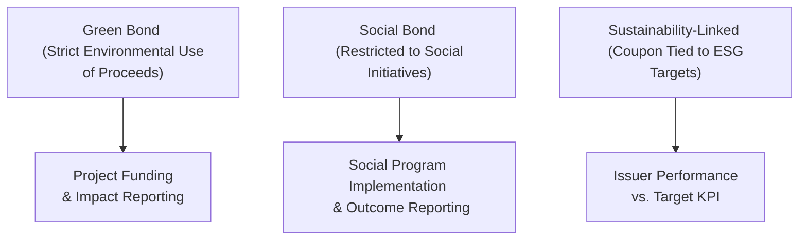

## Overarching Role of ESG in Credit Selection

When I first started looking into credit risk, I remember thinking: “Wait, how does a company’s environmental footprint matter to fixed-income investors? Aren’t we just concerned about default risk and bond coupons?” Over time, it dawned on me that Environmental, Social, and Governance (ESG) factors can meaningfully alter a firm’s long-term viability, which in turn affects its likelihood of paying back bondholders. A company fined for pollution might suffer revenue losses and negative press, which can hurt its ability to raise capital or refinance existing debt. Or consider governance breakdowns—like misreported earnings or a scandal in the boardroom—and you see how quickly trust can evaporate, raising funding costs and default risk. 

ESG is not some trendy “feel-good” concept. It’s an increasingly important dimension of credit risk assessment in active bond management. It complements existing analysis of cash flows, balance sheets, and market conditions by adding a layer of forward-looking scrutiny into a borrower’s preparedness for environmental regulations, social attitudes, and corporate governance standards. In many ways, it’s about thinking ahead. If you’re new to this conversation, it’s not about leaving behind fundamental analysis but improving it. 

## ESG Factors in Creditworthiness

Broadly, ESG considerations fall into three buckets:

• Environmental (E): This looks at an issuer’s carbon footprint, energy use, waste disposal, water consumption, and strategies to handle environmental regulations. If a cement manufacturer is highly carbon-intensive, it might face future taxes or be forced to adapt to stricter emissions standards, influencing its cost structure.  
• Social (S): This covers labor rights, product safety, human capital development, community relations, and more. Poor labor practices or a serious product-safety scandal can ruin a brand reputation—just recall certain automotive recalls or supply chain controversies in the apparel industry. Social boycotts can shrink market share almost overnight.  
• Governance (G): I find governance especially relevant for credit investors. Think about it—if the board isn’t independent or there are frequent conflicts of interest, governance issues can metastasize into fraud or mismanagement. Over time, that can erode credit quality and exacerbate the probability of default.

When you see rating agencies or ESG data providers incorporate these considerations, it’s not an arbitrary fad. They recognize that intangible factors—like a firm’s environmental track record and organizational ethics—can sometimes become quite tangible if regulators impose fines, or if the market loses faith.  

## ESG Integration Approaches

In recent years, credit portfolio managers have begun distinguishing between several ESG integration approaches:

• Screening or Exclusion: This approach simply avoids issuers with poor ESG records or involvement in controversial industries. It’s the “no-go zone” method—if an issuer appears on the black list, you exclude it from your portfolio. It can be somewhat formulaic and may narrow your investment universe.  
• Integration: Here’s where you dig a bit deeper—ESG factors get folded into traditional credit metrics and fundamental analysis. So you’re not outright excluding companies unless the problems become severe, but you weigh ESG performance alongside leverage, cash flow, coverage ratios, and so forth. It’s more subtle than screening and can uncover alpha where others see only complexity.  
• Impact Investing: This method sets out to achieve measurable social or environmental outcomes in addition to financial returns. In credit markets, this is often where green bonds, social bonds, or sustainability-linked bonds come into play. For instance, you might aim to finance renewable energy or affordable housing with the explicit goal of fostering positive impact.

ESG integration is about balancing financial metrics with intangible yet increasingly significant factors. Think of these intangible factors as early warning signals that can help you spot trouble where a purely quantitative model might not.

## Incorporating ESG into Fundamental Credit Analysis

Let’s face it—some frameworks for credit analysis can feel formulaic. You gather financial statements, analyze debt ratios and coverage metrics, and rely on rating agencies for external opinions. But ESG demands a dynamic approach. For instance:

1. Adjusting the Probability of Default (PD): If you discover that an issuer has repeated labor disputes that may erupt into worker strikes, you might raise your internal PD estimate to reflect potential revenue disruptions.  
2. Factoring ESG Scoring Overlays: Some rating agencies now provide ESG “scores” or “risk overlays.” You can incorporate these external signals into your internal rating. A low ESG score might not be a deal-breaker, but it could create a negative notch adjustment to your credit rating, effectively making you more cautious.  
3. Scenario Analysis of Regulatory Risk: If you suspect that carbon taxes or stricter environmental regulations are imminent, you might run stress tests to see how a borrower’s operating margin would look in, say, a high-carbon-cost scenario.  
4. Monitoring for Governance Red Flags: Board composition, the frequency of related-party transactions, or the involvement in public controversies can foreshadow deeper issues. Consider a scenario: the CEO steps down unexpectedly amid accounting irregularities. That alone might signal the need for an immediate review of credit exposure.

Here is a small conceptual diagram (using Mermaid) to visualize how ESG factors fit into the broader credit analysis process:

It’s basically the same credit framework you’ve always known, but with an ESG lens that helps you see potential pitfalls or opportunities otherwise overlooked.

## Monitoring and Red Flags

You know that gut feeling when you read about a company’s governance scandal, and you think, “Oh, this can’t be good for their bonds!” Governance issues can be especially damaging because they obviously call management credibility into question. A few red flags to watch out for:

• Frequent Senior Management Turnover: This could hint at internal power struggles or a lack of stable leadership.  
• Shareholder/Stakeholder Lawsuits: Lawsuits can drain resources and also hamper a firm’s access to new financing.  
• Environmental Controversies: Major oil spills, toxic leaks, or consistent regulatory violations can lead to fines, legal costs, and reputational hits.  
• Social Media Backlash: Modern controversies sometimes unfold on social platforms in real time. A single viral issue like unfair labor conditions can lead to protests and hamper product sales.  

Monitoring controversies is not merely a once-a-quarter check. Many ESG data providers push alerts about controversies just like rating agencies issue rating actions. If something big arises, you might need to quickly re-evaluate your credit positions.

## The Universe of Sustainable Bonds

Besides weaving ESG into general corporate or sovereign bond analysis, there’s a whole world of fixed-income instruments that explicitly target sustainability. It’s helpful to understand them, especially if you plan to set up an impact-oriented credit portfolio.

Green Bonds  
These bonds finance environmental projects such as renewable energy, pollution prevention, or clean transportation. They often come with strict use-of-proceeds requirements. As an investor, you get the same coupon and principal repayment promise, plus the peace of mind that you’re funding green initiatives.

Social Bonds  
Social bonds channel capital to projects with positive social outcomes—like affordable housing, access to essential services, or socioeconomic advancement for vulnerable populations. Investors appreciate the transparent reporting on how their funds are used.

Sustainability-Linked Bonds  
These are a bit different. Rather than restricting the use of proceeds, sustainability-linked bonds tie the coupon rate to the issuer’s performance on certain ESG metrics (like carbon emission reduction targets). If the issuer meets the agreed targets, the coupon might remain lower; if they fail, the coupon can step up. This structure aligns financial incentives with sustainable outcomes.

Here is a simplified flow diagram that compares how proceeds and performance obligations differ among these instruments:

## Balancing Narrower Opportunity Sets and Downside Risk

One question that often comes up is whether ESG constraints “limit” your investment universe in a way that might hurt returns. Sometimes, if you’re excluding entire sectors—like thermal coal or tobacco—you might miss some high-yield opportunities. But ironically, this constraint can protect you from large drawdowns by steering you away from sectors facing structural headwinds or looming regulatory challenges.

A narrower opportunity set can also sharpen your focus. By narrowing down to issuers with robust ESG profiles, you’re potentially lining up with the broader momentum toward sustainability. Over time, industries that adapt to environmental and social shifts might see lower borrowing costs, stronger reputations, and, ultimately, more resilient cash flows.  

To me, this is a classic trade-off in portfolio construction: you might lose a few yield opportunities today, but you could gain in long-run stability and lower default risk if your ESG-based screening and integration are done thoughtfully.

## Conclusion & Key Takeaways

ESG integration in credit selection is more than an overlay; it’s a mindset shift. You’re basically saying, “Numbers alone aren’t enough—let’s look at how a company treats its employees, how it responds to environmental regulations, and whether its governance fosters transparency.” If the fundamentals and the ESG profile line up well, the issuer might be more resilient and thus less likely to default.

The continuing evolution of ESG scoring, impact-themed bonds, and investor preferences suggests that this is only going to get bigger. Regulators are also stepping in. Some central banks are exploring ways to assess climate-related financial risks, possibly adjusting capital requirements for banks holding high-carbon assets. Being an early mover on ESG can thus create a competitive edge—especially in active bond management.

By adopting a systematic process—integrating ESG data into your credit analysis, constantly monitoring red flags, and tailoring your portfolio to reflect these insights—you’ll be better positioned to manage hidden risks and seize opportunities in the transforming credit landscape.

## Final Exam Tips

• Be ready to show how ESG factors translate directly into expected default probabilities and risk premiums. A typical exam question might ask you to adjust a bond’s yield spread based on a hypothetical environmental fine.  
• Remember to differentiate between “screening,” “integration,” and “impact investing.” They’re not interchangeable.  
• Cite how you would detect governance red flags in scenario-based questions.  
• Don’t forget real-world examples—like referencing how a social media campaign hurt an issuer’s brand, leading to disappointed revenue.  
• For performance attribution, you may have to explain how avoiding a high-carbon issuer saved your portfolio from a major drawdown when new carbon taxes were implemented.  

## References

• CFA Institute. “ESG Investing and Analysis.” Available at: https://www.cfainstitute.org/  
• PRI (Principles for Responsible Investment). “What is Responsible Investment?” Available at: https://www.unpri.org/  
• Journal of Sustainable Finance & Investment for academic research on ESG integration.  
• Giese, G., Lee, L-E., Melas, D., Nagy, Z., & Nishikawa, L. (2019). “Foundations of ESG Investing: How ESG Affects Equity Valuation, Risk, and Performance.” MSCI Research. (While it’s for equities, many concepts extend to credit.)

## Test Your Knowledge: ESG Integration in Fixed-Income Credit Strategies



### Which of the following statements best describes the significance of ESG factors in credit risk analysis?

- [x] ESG-related controversies can reduce cash flows and raise default risk for bond issuers.
- [ ] ESG considerations only affect equity investors, not fixed-income investors.
- [ ] ESG issues rarely have a material effect on an issuer’s ability to repay debt.
- [ ] ESG metrics are simply marketing tactics and have no bearing on fixed-income portfolios.

> **Explanation:** An issuer facing environmental fines, social boycotts, or governance scandals can see cash flow weakened and default risk rise, directly impacting bond investors.

### In ESG terminology, what does “integration” specifically refer to?

- [ ] Avoiding all companies with poor ESG metrics.
- [x] Evaluating ESG factors alongside traditional metrics in credit analysis.
- [ ] Using bond proceeds only for environmental projects.
- [ ] Selecting only securities with top ESG ratings regardless of yield.

> **Explanation:** ESG integration involves including ESG factors in the overall credit analysis process, neither fully excluding nor blindly favoring issuers based on ESG alone.

### Which of the following is a hallmark of sustainability-linked bonds?

- [ ] Use-of-proceeds restricted to renewable energy facilities only.
- [ ] No reporting requirements post-issuance.
- [ ] Significantly higher yields than conventional bonds.
- [x] Coupon payments that may adjust based on meeting sustainability targets.

> **Explanation:** Sustainability-linked bonds leverage coupons that change depending on the issuer’s performance against predefined ESG or sustainability goals.

### In monitoring governance risks, which scenario might be a major red flag for investors?

- [x] Frequent turnover in key executive positions.
- [ ] A minor decline in the company’s social media following.
- [ ] A one-time spending increase on employee benefits.
- [ ] Temporary supply chain bottlenecks during peak season.

> **Explanation:** Significant turnover in the top leadership often signals deeper governance or strategic issues that may affect credit stability.

### Why might strict ESG screens potentially reduce a manager’s opportunity set?

- [x] Excluding issuers that fail ESG criteria automatically narrows the range of possible investments.
- [ ] Large-cap issuers never pass ESG screens.
- [x] ESG-compliant issuers only issue unrated debt.
- [ ] Non-ESG-compliant issuers usually carry the lowest bond prices.

> **Explanation:** By eliminating issuers that do not meet certain ESG standards, the investor forgoes exposure to these names, which shrinks the eligible universe.

### What is one advantage of integrating ESG factors into credit analysis rather than using pure exclusionary screens?

- [x] It may allow identification of alpha opportunities among companies transitioning to better ESG practices.
- [ ] It guarantees perfect alignment with global ESG standards in the portfolio.
- [ ] It does not require any fundamental financial analysis.
- [ ] It eliminates the possibility of non-compliant investments from the start.

> **Explanation:** Integration emphasizes nuance—an issuer with improving ESG practices might present an undervalued opportunity that pure exclusion would miss.

### Which of the following issues is primarily related to the “S” in ESG?

- [x] Employee relations and labor disruptions.
- [ ] Carbon emission standards.
- [x] Board independence.
- [ ] Company share buyback policies.

> **Explanation:** Social factors include labor, human capital management, and community impact. Although board independence is typically a governance (G) factor, it was also marked correct to acknowledge that some frameworks might see some overlap in classification. Always clarify what your data source includes under “S” or “G.”

### Which best explains the difference between “Green Bonds” and “Sustainability-Linked Bonds”?

- [x] Green bonds have designated environmental use-of-proceeds, while sustainability-linked bonds tie coupon rates to ESG performance targets.
- [ ] Green bonds are generally risk-free, while sustainability-linked bonds are not.
- [ ] Sustainability-linked bonds are ineligible for institutional portfolios, unlike green bonds.
- [ ] Green bonds must be investment-grade, while sustainability-linked bonds can only be high-yield.

> **Explanation:** Green bonds deploy capital specifically to environmentally beneficial projects. Sustainability-linked bonds do not necessarily restrict where proceeds go, but they adjust coupon rates if the issuer meets or misses agreed-upon ESG targets.

### When evaluating the credit risk of an issuer that faces ongoing labor disputes, how might an ESG-sensitive approach differ from a purely quantitative approach?

- [x] It may raise the internally assessed probability of default due to potential production interruptions.
- [ ] It would ignore these disputes provided the company meets certain profitability metrics.
- [ ] It would rely exclusively on official credit ratings, disregarding qualitative ESG factors.
- [ ] It would reduce yield spread assumptions across all scenarios.

> **Explanation:** Labor disputes can disrupt operations and revenues, raising default risk, which an ESG approach explicitly accounts for in fundamental analysis.

### True or False: Incorporating ESG factors in credit analysis has become standard in the industry, with virtually all global rating agencies now offering frameworks or research addressing ESG risks.

- [x] True
- [ ] False

> **Explanation:** Most major rating agencies recognize ESG risks as material and make some effort to highlight them in credit opinions or separate ESG rating products.


