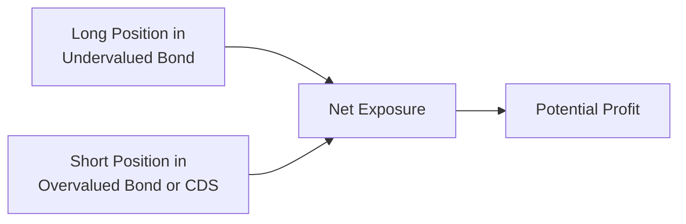

## Introduction

Long-short credit strategies can feel a bit wild at first glance, right? I still remember the first time I saw a hedge fund manager shorting a high-yield bond. My initial reaction was basically: “Wait, you can do that?” The premise of this strategy is fairly straightforward: the manager seeks to identify undervalued fixed-income securities to buy (go long) and overvalued or vulnerable ones to short. This approach is designed to generate positive returns in different market environments—especially if the manager’s credit views on each position turn out to be correct.

This short conversation will explore the fundamentals of long-short credit strategies, with a particular emphasis on hedge fund structures. We’ll walk through how managers source returns, utilize leverage, manage risk, and handle the complexities of performance fees and liquidity terms. Let’s get rolling.

## Defining a Long-Short Credit Strategy

A long-short credit strategy begins with the simple goal of profiting from relative differences in credit pricing. When managers believe a particular corporate bond or structured vehicle is undervalued, they buy (go long) that instrument. Conversely, when they think another credit instrument—possibly a bond from a competitor or a similar issuer higher up in the capital structure—is overpriced or about to suffer a price decline from worsening fundamentals, they short it.

But wait, you might wonder: how do you short a bond? In equities, shorting is somewhat straightforward: you borrow shares and then sell them, hoping the price falls so you can repurchase them at a lower cost. With bonds, the mechanics are a smidge more complex, as many bonds trade over-the-counter with fewer quick lending facilities than stocks. Often, managers rely on derivatives—like credit default swaps (CDS)—to replicate a short position. Alternatively, they enlist prime brokers to find the bonds to borrow. The big idea remains: capturing profit from price dislocations on both “good” and “bad” credit simultaneously.

### Sources of Return

Managers in these strategies look to generate alpha in a few key ways:

• Credit alpha: Skilled security selection is huge. If you can figure out which bonds are truly undervalued (or mispriced relative to their risk) and which bonds are, well, on shaky ground, you can make a killing on both ends.  
• Market timing alpha: Some managers try to read the broader credit cycle—maybe going more net-long when they sense the market is poised for a rally or scaling down and expanding shorts when they expect a major wave of defaults or credit spread widening.  
• Arbitrage: Wall Street is awash with spread differentials—like if a bond is mispriced relative to a swap, or if an issuer’s senior and subordinated bonds aren’t priced consistently. Long-short credit managers hunt for these inefficiencies and pounce on the opportunity for “pure alpha” by hedging away as much market risk as possible.

## Using Derivatives for Short Exposure

When shorting bonds directly is impractical or too expensive, managers turn to credit derivatives. Central among these is the credit default swap (CDS). A CDS allows the manager to pay a periodic “insurance-like” premium for protection on a specific bond issuer. If that issuer defaults (or experiences a “credit event”), the manager’s CDS position should rise in value, offsetting losses from the bond or capturing profit if the bond spread was overpriced. Alternatively, total return swaps (TRS), futures, and options can help short broad credit indices or replicate short exposures on customized baskets of securities.

Managers blend these tools to create carefully balanced portfolios. For instance, they might go long on a few cheap corporate bonds and then short an equivalent basket of CDS contracts on different issuers that appear more vulnerable. Or they might short a broad index of high-yield credit while selectively going long high-yield issuers that look relatively safer.

Below is a simple diagram illustrating how managers combine long and short positions to arrive at net exposure:

The manager’s total portfolio risk often depends on how these exposures net out, as well as how correlated the underlying credit instruments are.

## Risk Management and the Role of Leverage

Long-short strategies aren’t purely about picking winners and losers. They’re also about controlling risk. Many funds borrow capital (via loans or margin financing) to amplify returns—this is leverage. It’s like pumping your portfolio’s volume up to 11. Unfortunately, if the market moves against you, the losses are amplified too. We’ve all heard stories of big funds forced into margin calls or rushed liquidations. That’s typically the dark side of excessive leverage.

Effective managers typically set up robust risk limits, including (but not limited to):

• Monitoring value at risk (VaR) or other stress-testing approaches, ensuring potential losses remain within tolerance.  
• Carefully sizing positions (no single bet so large it threatens the entire fund).  
• Layering hedges, so that if one bet fails, it doesn’t drag down the entire portfolio.  
• Keeping enough liquidity on hand to meet margin calls, or at least to avoid forced sales in a down market.  

In advanced contexts, managers may also track “basis risk”—the mismatch between a long position and its hedge. If you think you’re hedged by a derivative but that derivative doesn’t move in lockstep with your asset, your hedge might not offset your losses. For instance, you might hold a long in a specific corporate bond but short a related index or a CDS referencing a basket of issuers. That mismatch between the bond’s actual price movement and the index/CDS could prove unexpectedly large.

## Prime Brokerage and Operational Considerations

Hedge funds taking on long-short credit strategies generally establish prime brokerage arrangements. Prime brokers facilitate the short-selling process by lending securities, providing margin financing, and clearing trades. They also offer additional services:

• Providing leverage: The prime broker may extend credit lines so the hedge fund can scale up positions.  
• Custody of assets: The fund typically holds securities or collateral at the prime broker.  
• Risk analytics: Some prime brokers even help with position reporting or daily profit-and-loss statements.  

It’s not all sunshine and roses, though. Prime brokerage relationships present counterparty risk—meaning if the prime broker experiences financial stress, the fund’s collateral or ability to trade could be compromised. Considering the meltdown of several prime brokers during previous financial crises, managers pay close attention to the creditworthiness, internal controls, and “diversification” of prime brokerage relationships.

## Hedge Fund Structures, Fees, and Liquidity Terms

Long-short credit strategies thrive in hedge fund structures, which generally offer more flexibility for leveraging and shorting than traditional mutual funds or other regulated investment vehicles. But that flexibility comes with some special terms:

• Lock-up periods: An investor might need to park their money for a certain timeframe (say, one year), during which they can’t redeem.  
• Gates: If the fund receives too many redemption requests at once, it can impose “gates”—limiting the percentage of investor capital that can be withdrawn in any redemption period.  
• Performance fees: The classic approach is “2 and 20” (2% management fee on assets plus a 20% performance fee on returns), but many variations exist.  
• High-water mark: If the fund suffers losses, the manager won’t collect performance fees again until making up those losses, ensuring no double-dipping in fees.  

These features allow managers to strategically implement potentially less liquid positions without being forced to liquidate abruptly if short-term volatility spikes. But it also raises complexities for professional clients who might need consistent liquidity or who bristle at paying performance fees for partial alpha or Beta exposures.

## Performance Attribution in Long-Short Credit

Measuring how a long-short credit fund truly generated its returns can be tricky. We have (at least) three layers:

1. Gross exposure vs. net exposure: If a manager is 150% long and 50% short, does that shape their real market sensitivity or “beta?”  
2. Security selection alpha: Is outperformance coming purely from picking better credit exposures compared to the benchmark?  
3. Hedging results: Did the short side actually offset losses, or was it a drag on performance?  

For instance, a manager might say they outperformed by 5% net of fees. Excellent news. However, if 3% came from the overall rise in the credit market (i.e., Beta) and 2% from alpha due to skillful picking, that’s a different picture than if the entire 5% were skill-based alpha. Understanding these distinctions is key for investor due diligence and for the manager to refine strategy.

Some managers use advanced factor models or scenario analyses to parse out how much of their returns were due to broad credit market moves versus idiosyncratic picks. Either way, rigorous performance attribution helps managers figure out what’s really working—and swiftly address what’s not.

## Practical Example: Capitalizing on Sector Dislocation

Picture a manager who sees dislocation in the telecommunications sector. A large telecom company, “Telecom A,” faces regulatory headwinds that could result in higher capital expenditures. Meanwhile, “Telecom B” is on stronger footing with a more stable balance sheet and growing subscriber base. The manager decides:

• Go long (100 basis points of net portfolio value) on Telecom B’s 10-year bond, which they judge to be relatively undervalued.  
• Simultaneously short (100 basis points of net portfolio value) Telecom A’s 10-year bond (or a CDS referencing Telecom A).  

If Telecom B’s fundamentals lead to improved credit spreads, the value of B’s bond should rise (or at least widen less than the market). If Telecom A’s regulatory problems mount, that bond’s spread could widen, leading to a profit on the short. Ideally, the strategy captures alpha without incurring much broad market risk, because both positions are in the same industry, maturity range, and credit rating. (In real life, there’s always some basis risk, but you get the gist.)

## Common Pitfalls and Best Practices

• Overleverage: It’s tempting to crank leverage when you’re convinced about your positions, but that can be catastrophic if the trade moves against you.  
• Poor hedging: Relying on a generic industry index to hedge a single-issuer bond can backfire if the bond doesn’t track the index well.  
• Concentration risk: Some managers fall in love with a particular bond or sector, accidentally building a huge position relative to the entire portfolio.  
• Liquidity mismatch: If you invest in less liquid bonds or structured credit products but promise your investors monthly or quarterly liquidity, you may be forced to sell illiquid positions at a disadvantage.  
• Performance illusions: A short-run lucky bet can appear to be “all skill.” A well-structured attribution process can filter luck from skill.

Best practices include thorough credit research, robust risk models, strong relationships with prime brokers (and possibly multiple prime brokers for diversification), and transparent performance reporting.

## A Quick Dive Into Math: Measuring Alpha

Portfolio alpha, in its simplest form, can be expressed as:


\alpha_{p} = R_{p} - \beta_{p} \times R_{m}


Where:  
• \\(R_{p}\\) is the portfolio’s return.  
• \\(\beta_{p}\\) is the portfolio’s sensitivity to the market (or relevant benchmark).  
• \\(R_{m}\\) is the market’s return.  

In a long-short credit setting, \\(\beta_{p}\\) might be measured relative to a broad credit index (e.g., U.S. Corporate Investment Grade or High-Yield Index). For a well-hedged portfolio, \\(\beta_{p}\\) might be significantly less than 1.0, reflecting minimal net market exposure. The leftover (positive or negative) typically arises from manager skill, otherwise known as alpha.

## Conclusion and Exam Tips

Long-short credit strategies, widely used by hedge fund managers, rest on a bedrock of solid credit analysis, precise execution, and rigorous risk management. The approach can be rewarding if executed prudently but demands skill in derivatives usage, prime brokerage relationships, and performance attribution. For the CFA Level III exam, you’ll want to understand:

• Why and how managers combine long and short positions in fixed income.  
• The special role of derivatives—especially CDS—for short exposures.  
• Risk factors, including leverage, basis risk, and counterparty risk with prime brokers.  
• The complexities of hedge fund structures (liquidity terms, fees, high-water marks).  
• Common pitfalls—like overconcentration and mismatched liquidity.  

In the constructed-response sections, exam items often revolve around evaluating how a manager’s net exposures compare to a benchmark or analyzing the sources of alpha. Be prepared to apply these frameworks to real-world scenarios. Sometimes, item sets might require you to interpret a table of hypothetical stats, recommending how to tweak the net exposure or measure risk. Keep referencing your formula for alpha and recall the structural constraints of hedge funds when thinking about liquidity management.

All in all, stay alert. These strategies can be quite profitable, but you should remain cognizant of margin calls, forced liquidations, and the potential mismatch between fund liquidity and portfolio content.

## Glossary

Long-Short Strategy: Buying securities expected to appreciate and shorting those expected to decline in relative terms.  
Prime Broker: A broker offering a suite of leveraged financing, securities lending, and clearing services essential for hedge funds.  
High-Water Mark: Ensures a manager only collects incentive fees on new net profits, preventing double-counting fees.  
Basis Risk: The risk that a hedge or offset does not perfectly track the price movements of the underlying security.

## References

• Lo, A.W. “Hedge Funds: An Analytic Perspective.”  
• CFA Institute, “Alternative Investments” (Hedge Fund Strategies).  
• Grant, J. “Foundations of Global Financial Markets and Institutions.”

--------------------------------------------------------------------------------

## Test Your Knowledge: Long-Short Credit Strategies



### Which of the following best describes a long-short credit strategy?

- [ ] Holding only investment-grade bonds and passively tracking a benchmark
- [x] Taking long positions in undervalued credit instruments and shorting overvalued or vulnerable ones
- [ ] Only shorting high-yield bonds while ignoring investment-grade bonds
- [ ] Buying structured instruments to replicate equity returns

> **Explanation:** Long-short credit managers seek to capture alpha by buying undervalued credits and shorting overvalued or weaker ones, aiming to benefit from both long and short positions.

### What is a primary reason managers use CDS to short credit?

- [ ] Derivatives are always cheaper than bonds
- [ ] Regulations forbid shorting credit securities outright
- [x] It is often easier and more liquid to short via CDS than to locate and borrow bonds
- [ ] CDS contracts have zero counterparty risk

> **Explanation:** Shorting bonds directly can be cumbersome or illiquid. Managers often prefer CDS because it can be more straightforward to gain short exposure without physically borrowing the bond.

### How might a manager in a long-short credit fund generate market timing alpha?

- [x] By adjusting net exposure in anticipation of credit spread tightening or widening
- [ ] By passively holding a fixed allocation to short-term bonds
- [ ] By constantly taking a neutral stance on all factors
- [ ] By holding only investment-grade securities during volatile periods

> **Explanation:** Market timing alpha occurs when a manager adjusts the portfolio’s net long or short exposure to take advantage of expected changes in the overall credit environment or risk sentiment.

### Which of the following distinguishes hedge funds from more traditional mutual funds?

- [x] Use of lock-up periods, performance fees, and flexible leverage
- [ ] Minimal risk disclosure requirements
- [ ] Higher turnover in equity holdings
- [ ] Required monthly redemption windows

> **Explanation:** Hedge funds commonly have lock-up periods that restrict liquidity, performance-based fee structures (such as 2 and 20), and the freedom to employ leverage well beyond what’s typical in a standard mutual fund.

### Why is basis risk a significant concern in long-short credit strategies?

- [ ] It is irrelevant for hedged portfolios
- [x] The hedge (often an index or CDS) may not move in exact correlation with the underlying long position
- [ ] It guarantees that all positions are perfectly offset
- [ ] It eliminates the need for fundamental research

> **Explanation:** Basis risk arises when the hedge instrument does not perfectly track the price movements of the specific security being hedged. This mismatch can result in unanticipated gains or losses.

### In practice, how is leverage most likely employed in this strategy?

- [x] Borrowing funds or using margin from a prime broker to increase the size of long and/or short positions
- [ ] Issuing new equity shares in the mutual fund
- [ ] Taking an offsetting derivative position that eliminates risk entirely
- [ ] Restricting net exposure to zero at all times

> **Explanation:** Hedge funds commonly use margin from prime brokers or credit lines to scale positions and amplify returns. This is a hallmark of hedge fund investing.

### Which feature of hedge fund fee structures ensures managers must recoup lost ground before earning new performance fees?

- [ ] The 2% management fee
- [ ] Monthly liquidity
- [x] The high-water mark
- [ ] The short rebate arrangement

> **Explanation:** High-water marks ensure the manager only collects an incentive fee after surpassing the previous peak net asset value, preventing them from earning performance fees on the same gains more than once.

### Imagine you’re an investor evaluating a credit hedge fund. Which question would best help you understand potential liquidity risks?

- [ ] “Does the board have enough independent directors?”
- [x] “What are the lock-up periods, redemption gates, and notice requirements?”
- [ ] “Has the fund performed better than the S&P 500?”
- [ ] “Do you only invest in short-duration bonds?”

> **Explanation:** Lock-up periods, gates, and notice windows directly affect your ability to redeem shares and thus highlight significant liquidity constraints.

### Which scenario best illustrates a strategy that might produce alpha from credit spread arbitrage?

- [x] Identifying a mismatch where an issuer’s subordinated bonds trade at a tighter spread than its senior bonds
- [ ] Holding only 10-year U.S. Treasury notes for the next decade
- [ ] Selling calls on equity to obtain premium income
- [ ] Investing exclusively in distressed debt without any offsetting position

> **Explanation:** Credit spread arbitrage involves finding mispriced spreads between closely related instruments, such as a senior vs. subordinated bond of the same issuer. Exploiting that difference can generate alpha.

### True or False: Prime brokers can assist hedge funds by providing the ability to short-sell bonds, finance leveraged positions, and clear trades.

- [x] True
- [ ] False

> **Explanation:** Prime brokers commonly facilitate short-selling and provide financing, custody, and operational support services to hedge funds engaging in long-short strategies.


