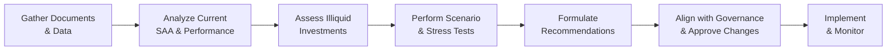

## Introduction
Sometimes, you hear “university endowment” and think: “Oh, that’s just some big pot of money used for scholarships.” But in reality, endowments (as well as foundations and sovereign wealth funds) must fund multiple objectives all at once—pending maintenance costs, scholarships, philanthropic endeavors, special research projects, and, above all, the long-term stability of the institution. In my early days as a consultant, I remember visiting a small university’s boardroom and seeing the tension between administrators excited about new campus projects and the investment committee insisting on preserving funds for future generations. That tension perfectly captures one of the biggest challenges in endowment management: balancing current spending needs against the requirement of long-term capital growth (often described as “intergenerational equity”).

This article explores the process of reviewing the strategic asset allocation (SAA) for a large institutional investor, specifically an endowment, although the concepts apply more broadly to foundations, sovereign wealth funds, and other institutions with long horizons. We’ll walk through everything from clarifying mission objectives and analyzing financial statements to running scenario analyses and making final recommendations—all while maintaining the endowment’s governance guidelines and compliance with the CFA Institute Code and Standards.

## Understanding the Unique Objectives
Large institutional investors typically share a few core objectives:

• Capital Preservation: If the endowment erodes over time due to excessive withdrawals or declining asset values, it cannot serve future generations.  
• Stable Income Stream: The endowment often funds scholarships, research, or charitable initiatives. Consistency in distribution amounts is crucial.  
• Long-Term Growth of Principal: To maintain purchasing power over decades—especially as inflation ebbs and flows—endowments must grow their principal in real terms.  
• Intergenerational Equity: This is the principle that the endowment’s benefits should span multiple generations, ensuring no single cohort depletes resources unfairly.

Institutional investors usually follow a spending policy—a rule that determines how much of the endowment’s assets can be spent on an annual basis. For many endowments, a spending policy might look like a 4–5% annual draw based on a multi-year average of the portfolio’s market value (e.g., a three-year rolling average). This encourages stable distributions while adjusting spending in line with market fluctuations.

## Preliminary Steps: Gathering and Analyzing Information
Before delving into the portfolio’s intricacies, it’s essential to gather and analyze key documents and data:

• Financial Statements and Spending Policies: These reveal annual spending needs, liquidity requirements, and the magnitude of the endowment’s commitments.  
• Funding Requirements and Liabilities: Some endowments have outstanding commitments to alternative investments or planned expenditures that might require liquid resources.  
• Governance Documents: Understanding how investment decisions are made—who votes, what committees exist, and how frequently they meet—ensures that any changes to SAA can be implemented smoothly and ethically.  
• Risk Tolerances: You’d be surprised how often committees say they’re “moderately risk-tolerant,” yet they panic when equity markets slump 15%. Clarifying the real tolerance for downside is critical.  

We also want to review capital market assumptions—forecasts of returns, volatilities, and correlations for each asset class. These are the underpinnings of any strategic asset allocation. Some institutions maintain in-house assumptions; others rely on reputable external research or a blend of both.

## Reviewing the Current Strategic Asset Allocation
The strategic asset allocation (SAA) is the backbone of the endowment’s investment plan, typically reflecting the institution’s acceptable level of market risk over a long horizon. A typical endowment might hold a combination of:

• Global Equities (developed and emerging)  
• Fixed Income (government and corporate bonds)  
• Alternatives (private equity, venture capital, real estate, hedge funds)  
• Real Assets (infrastructure, commodities, natural resources)  

### Historical Performance Assessment
Evaluating historical returns, volatility, and correlation among asset classes is crucial. At a very high level, we might start by asking:

1. Did the equity portion provide higher returns but result in significant drawdowns during recessions?  
2. Did the bond allocation offer stability but also limit upside potential in bull equity markets?  
3. Did alternative investments deliver diversification and alpha while imposing lock-up periods?  

This historical “report card” helps us understand how the portfolio has performed in various economic environments, but we should also consider forward-looking shifts as capital markets evolve.

### Comparing Actual Allocations to Policy Targets
Many endowments have policy targets within allowable ranges (e.g., a target of 40% global equities with an allowable range from 35% to 45%). Regular rebalancing ensures the portfolio remains aligned with these targets. If a certain asset class has drifted far from its target—maybe due to a market rally—adjustments might be required to maintain the desired risk/return profile.

If actual allocations have deviated too far, the portfolio might be taking on more (or less) risk than intended. For instance, if private equity valuations have soared and the endowment is now overweight in alternatives, the risk profile could be higher than originally envisioned in the SAA.

## Considering the Role of Illiquid Investments
For many endowments, alternative or illiquid investments are a significant portion of the portfolio. These can include:

• Private Equity or Venture Capital Funds  
• Real Estate (direct or through REITs)  
• Infrastructure Projects  
• Hedge Funds with various lock-up constraints  

### Illiquidity Premium and Lock-Up Periods
An endowment has a longer horizon compared to many individual investors, which theoretically makes it better positioned to harvest illiquidity premiums. However, there is a real trade-off: lock-up periods might extend for 5, 7, or 10 years, and early exits can be complicated or expensive. 

In one personal experience, I consulted with an endowment that had allocated significantly to real estate limited partnerships. When a critical building repair needed urgent funding, the investment team suddenly realized that much of its capital was locked up. They scrambled to find short-term financing, which ended up more expensive in the long run. So, while illiquid investments might offer superior returns, you must balance those opportunities against the need for immediate cash (especially for mandatory spending policies or unforeseen contingencies).

### Alignment with Time Horizon
Generally, the endowment’s time horizon extends far beyond a typical retail investor’s, but near-term spending requirements still lurk. If a large portion of the portfolio is illiquid, it might affect opportunistic rebalancing or hamper coverage of short-term cash needs for capital projects. The key is to determine an appropriate portion of the corpus that can be tied up in less liquid vehicles without jeopardizing the daily or annual operational budget.

## Scenario Analysis, Historical Simulations, and Capital Market Assumptions
After clarifying the current portfolio structure and constraints, we leverage scenario analysis and forecasts to test how the portfolio might behave under different market regimes.

### Scenario Analysis
Scenario analysis examines the portfolio’s performance under varied hypothetical scenarios—e.g., high inflation, stagflation, global recession, or robust economic growth. You might stress-test the portfolio for large equity drawdowns (like 2008–2009) or bond market disruptions (like a rapid interest rate spike).

### Historical Simulations
Historical simulations look back at prior market environments and apply those returns to the present portfolio. For instance, simulating the 2008 financial crisis or the dot-com crash can reveal potential losses. Of course, no historical environment will mirror the future perfectly, but it’s a helpful gauge to see how correlations and volatilities interplay.

### Forward-Looking Capital Market Assumptions
Capital market assumptions (a fancy phrase for expected returns, volatilities, and correlations) form the bedrock of the SAA analysis. Many investment committees rely on published data from large asset managers or influential academia (such as Antti Ilmanen’s “Expected Returns: An Investor’s Guide to Harvesting Market Rewards”). Integrating these assumptions with a multi-factor approach improves decision-making. For instance, you might separate equity risk factors from interest rate risk, credit risk, real asset exposure, and so on. This approach can help ensure that if one factor performs poorly, other parts of the portfolio might offset losses.

## Formulating Recommended Changes
Based on the analysis, you might recommend adjustments to the endowment’s SAA. For example:

• Increasing exposure to emerging markets if you believe growth prospects (and valuation discounts) are especially attractive.  
• Allocating marginal capital to real estate or infrastructure if the endowment can bear illiquidity risk and wants inflation-hedging assets.  
• Reducing or rebalancing private equity exposure if the current weight is higher than policy targets.  
• Diversifying fixed-income holdings, perhaps by adding inflation-linked bonds (e.g., TIPS) or short-duration instruments if you expect higher interest rate volatility.  

In all cases, consider the endowment’s spending policy and the stability of cash flows. A thorough presentation to the investment committee should include:

1. The rationale for each adjustment.  
2. A risk (volatility, drawdown) and return projection.  
3. Correlation implications.  
4. Timeline and process for rebalancing.  

### Example: Shifting Equities from Domestic to Global
Suppose your current portfolio is 60% equities with 80% of that in domestic markets. With capital market assumptions forecasting lower domestic equity returns relative to emerging markets, you might propose shifting 5–10% from domestic large-cap stocks into a diversified basket of emerging market equities. You’d show the potential increase in expected return, acknowledging the higher volatility, and demonstrate how it might improve the portfolio’s long-run Sharpe ratio.

## Aligning with Governance and Mission
Any changes to the SAA must be consistent with the institution’s mission, spending policy, and governance structures. Here are a few considerations:

• Investment Committee Preferences: If the committee is highly conservative, a big shift into emerging markets or private equity might be poorly received. Tailor your presentation to their comfort level and knowledge base.  
• Risk Tolerance and Fiduciary Duty: The committee and staff must act in the best interest of current and future beneficiaries, abiding by the CFA Institute Code and Standards. The duty of loyalty and prudence means not speculating beyond reason, even if short-term opportunities seem compelling.  
• Communication: Explain changes in plain language, especially to stakeholders who may not be finance experts. Show them how recommended alterations might affect the endowment’s ability to fund ongoing and future operations.

## Common Pitfalls and Best Practices

### Pitfalls
• Overallocating to Illiquid Assets: Endowments sometimes chase higher returns through alternatives, forgetting the possibility of near-term financial shocks or capital calls.  
• Inconsistent Rebalancing: Failing to rebalance when markets move means the portfolio can drift away from desired risk levels.  
• Misinterpretation of Risk Tolerance: Tension between board members who want maximum growth and those who can’t stomach short-term losses can result in a poorly defined risk approach.  
• Ignoring Operational and Governance Constraints: Big changes can fail if not aligned with the institution’s approval processes and board dynamics.

### Best Practices
• Formalize SAA Ranges: Define clear target allocations with permitted variability.  
• Integrate ESG Factors Mindfully: Growing emphasis on sustainable investing can align with the institutional mission.  
• Perform Periodic Reviews: An annual or biennial SAA review ensures that the portfolio aligns with evolving market conditions and the endowment’s own changing needs.  
• Conduct Ongoing Due Diligence: Especially for private market strategies, strong manager selection is essential—review track records, strategies, fees, and alignment of interests.  
• Promote Clear Documentation & Communication: Document every recommendation, analysis, and final decision thoroughly. This fosters transparency, accountability, and learning for future committees.

## Diagram: Asset Allocation Review Process
Below is a simple flowchart illustrating the key steps in an endowment’s asset allocation review:

## Conclusion
Reviewing and potentially restructuring the strategic asset allocation for a large institutional investor, such as an endowment, is not a trivial exercise. It requires a deep understanding of the institution’s objectives, regulatory constraints, and risk tolerance, along with robust forecasting and scenario planning. One must balance the pursuit of higher returns (through equities and alternatives) with the need for reliable income generation and stable capital preservation. Additionally, effective communication—both internally among committees and externally to stakeholders—ensures that your carefully fashioned strategy will be accepted and sustained.

Remember: an endowment’s success hinges on disciplined governance, patient capital, and thorough analysis of macroeconomic trends—even if you occasionally have to juggle urgent funding requests and boardroom debates. In essence, it’s about safeguarding the future while fulfilling your mission in the present.

## References and Further Reading
• Swensen, David F. “Pioneering Portfolio Management.” (Offers an in-depth look at endowment-style investing strategies.)  
• Ilmanen, Antti. “Expected Returns: An Investor’s Guide to Harvesting Market Rewards.” (Comprehensive overview of long-term returns across asset classes.)  
• “CFA Institute Research Foundation Publications” on asset allocation strategies (https://www.cfainstitute.org/research/foundation)  

## Glossary
• Strategic Asset Allocation (SAA): The long-term target allocation to different asset classes that reflects an investor’s risk/return objectives.  
• Spending Policy: The policy that determines how much of the endowment’s assets are spent each year to support the institution’s mission.  
• Intergenerational Equity: The principle that an endowment’s value is maintained for future generations as well as current beneficiaries.  
• Lock-Up Period: A timeframe during which investors cannot redeem or withdraw capital. Common in private equity or hedge funds.  
• Scenario Analysis: A technique that tests how a portfolio might behave under various future events.  
• Capital Market Assumptions: Forecasts of returns, volatilities, and correlations used in constructing and adjusting a strategic asset allocation.  

## Final Exam Tips
• Clearly connect your asset allocation recommendations to the endowment’s spending needs and liability structure.  
• Expect to analyze portfolio shortfalls under different market regimes on the exam—build your scenario analysis framework in a concise, methodical way.  
• Understand the rationale behind each recommended asset class change; exam questions frequently test your ability to justify each part of the portfolio.  
• Always keep the CFA Institute Code and Standards in mind, especially regarding duty of loyalty, prudence, and care.

---

## Test Your Knowledge: Asset Allocation Strategies for Endowments



### Which of the following is most likely a primary objective for a university endowment?  
- [ ] Achieving short-term gains to fund annual operations exclusively  
- [x] Sustaining intergenerational equity with stable spending capabilities  
- [ ] Maximizing speculative returns irrespective of risk  
- [ ] Eliminating all market exposure to ensure capital preservation  

> **Explanation:** Endowments must balance current and future spending, ensuring intergenerational equity. This means maintaining or growing the endowment’s real value over time.

### In the context of illiquid investments, what is the lock-up period?  
- [ ] The timeframe allocated for an investment manager to secure new capital  
- [x] The period during which investors cannot withdraw their funds  
- [ ] The time horizon for transferring assets between various funds  
- [ ] The phase when an endowment rebalances its portfolio to the SAA  

> **Explanation:** A lock-up period is a stipulated duration in which capital is illiquid, often found in hedge funds, private equity, or venture capital vehicles.

### When comparing policy targets to the actual portfolio allocations, which of the following is least likely to be a concern?  
- [ ] Market fluctuations causing overweight in one asset class  
- [ ] Misalignment with the committee’s stated risk tolerance  
- [x] Precisely matching every asset class to the target without any allowable range  
- [ ] Ambiguous rebalancing guidelines that lead to drift  

> **Explanation:** It is not typically a concern if the portfolio doesn’t match the target with absolute precision. Most institutions allow some range around targets to reduce unnecessary trading and transaction costs.

### Which approach best describes analyzing how an endowment’s portfolio might perform under a severe market downturn, using historical data from a previous crisis?  
- [ ] Forward-looking capital market assumption modeling  
- [x] Historical simulation or backtesting  
- [ ] Scenario analysis solely based on future hypothetical events  
- [ ] Real-time balanced scorecard analysis  

> **Explanation:** Historical simulation applies past market returns (e.g., from a known crisis) to the current portfolio, showing hypothetical loss or gain.

### An investor wants to reduce interest rate risk in the fixed-income portion of the endowment. Which of the following changes is most aligned with that goal?  
- [x] Shortening the overall duration of bond holdings  
- [ ] Increasing the allocation to long-term government bonds  
- [x] Adding inflation-linked bonds (where appropriate)  
- [ ] Moving entirely to equities  

> **Explanation:** Shortening duration directly lowers sensitivity to rate changes, and adding inflation-linked bonds can further mitigate interest rate and inflation pressures.

### Why might an endowment allocate a portion of its portfolio to private equity or venture capital?  
- [x] To capture potential illiquidity premiums over a long horizon  
- [ ] To achieve guaranteed levels of short-term liquidity  
- [ ] To avoid correlation with any other risk factors  
- [ ] To eliminate all forms of market risk  

> **Explanation:** Institutional investors often pursue illiquidity premiums, seeking higher returns over the long run. These investments, however, trade off liquidity for that potential gain.

### What is a key consideration when aligning an endowment’s strategic asset allocation with its spending policy?  
- [ ] Maximizing nominal returns at all costs  
- [x] Ensuring sufficient liquidity to meet annual distributions and unexpected needs  
- [x] Matching the time horizon of illiquid investments with the endowment’s long-term outlook  
- [ ] Selecting the largest list of active managers to diversify skill sets  

> **Explanation:** The endowment must ensure that it can meet near-term spending requirements and maintain enough liquidity to fund unexpected costs. This also involves matching investment horizons to the mission.

### A multi-factor approach to portfolio analysis can help an endowment do which of the following?  
- [x] Identify total exposure to common risk factors (e.g., equity risk, credit risk)  
- [ ] Guarantee zero correlation between asset classes  
- [ ] Eliminate the need for ongoing rebalancing  
- [ ] Ensure uniform returns across all market conditions  

> **Explanation:** A multi-factor approach helps dissect a portfolio’s sensitivity to different risk factors, providing a clearer understanding of overall risk exposure.

### Which of the following best explains intergenerational equity in the context of endowment management?  
- [x] Maintaining or growing the endowment’s purchasing power for future beneficiaries  
- [ ] Applying all capital gains directly to the current year’s budget  
- [ ] Prioritizing present-day capital projects over future investment returns  
- [ ] Minimizing volatility by shifting entirely to low-risk bonds  

> **Explanation:** Intergenerational equity is about balancing present spending with the needs of future generations, ensuring the endowment’s real value is sustained.

### True or False: Scenario analysis exclusively uses historical data to forecast future performance of an endowment’s portfolio.  
- [x] True  
- [ ] False  

> **Explanation:** This statement is actually tricky. Scenario analysis can use both historical and forward-looking assumptions. However, in many contexts, scenario analysis is thought of as a mix of hypothetical or forward projections. If we interpret “scenario analysis” in the broad sense (including purely hypothetical scenarios), then the statement would be false. But some practitioners primarily use historical data sets to frame scenarios, which can be a narrower approach. The key is recognizing that scenario analysis can incorporate both historical and hypothetical data.


