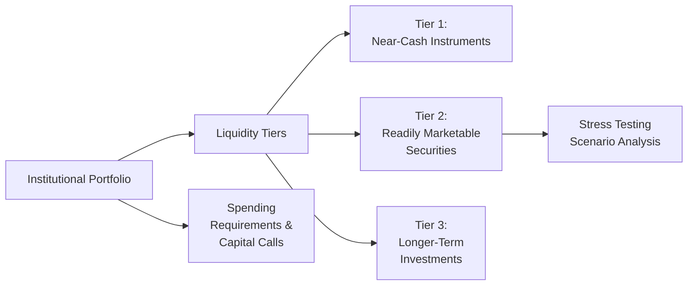

## Introduction

Let’s say you’re running an endowment. You’ve got scholarships to fund, capital improvement projects on the horizon, and maybe a surprise facility repair or two that pop up out of nowhere. You also invest in a bunch of assets—stocks, bonds, private equity, real estate—that may (or may not) be easy to convert to cash on short notice. So how do you juggle these obligations without being forced to sell long-term investments at the worst possible moment? That’s the core of liquidity risk measurement and management. And honestly, it can be a pretty wild ride.

This topic is crucial to keep your institution’s operations running smoothly and to prevent a fire sale of valuable assets during sudden cash shortfalls. This article will walk through the main points: figuring out your liquidity requirements, assessing the liquidity profiles of different asset classes, stress testing your portfolio, establishing liquidity tiers, utilizing lines of credit, setting up a liquidity dashboard, and continuously monitoring to ensure you’re in good shape. Let’s dig in.

## Defining Liquidity Needs

An essential first step is pinpointing why you need liquidity in the first place. Institutional investors—like endowments or pension funds—generally have ongoing spending obligations. These might include short-term operational expenses, scholarship payouts, or continuing capital additions. Beyond scheduled requirements, there are the unexpected:

• Capital calls. If you invest in private equity or venture capital, you’ll likely face requests to commit more capital (a “capital call”) at uncertain times.  
• Surprise operational demands. Unforeseen events—like a large facility repair—can demand quick cash.  
• Market emergencies. During times of stress, redemptions or forced sales may ramp up.  

The neat thing about liquidity management is that, at its heart, it’s a balancing act. You want enough liquidity to meet near-term cash needs but don’t want so much short-term investment that you sacrifice the higher returns typically available from long-term or less-liquid assets. The institution’s funding policy—how contributions arrive and how the portfolio is replenished—also shapes these considerations.

## Liquidity Profile of Portfolio Components

Once you know why you need liquidity (and how urgently you might need it), the next step is to line up everything in your portfolio—public equities, bonds, hedge funds, private equity, real estate, you name it—and categorize each by its liquidity. This might sometimes feel like sorting your closet into items you can wear tomorrow vs. items you haven’t touched in a decade. But let’s be systematic:

• Public Equities: Generally more liquid than most other asset classes. You can typically sell these within a day or two, barring severe market disruptions.  
• Bonds: Most investment-grade government bonds are quite liquid, but corporate bonds (especially high-yield) can be less so. Liquidity can dry up in market stress.  
• Hedge Funds: Vary widely. Some offer monthly or quarterly redemption with notice periods, some have lock-ups of a year or more.  
• Private Equity: Typically the least liquid. Funds can lock up capital for 7–10 years, with limited distribution windows.  
• Real Estate: Direct property investments can be quite illiquid—property can take months or years to sell—though REITs offer better liquidity.  

An institution often invests in these less-liquid vehicles precisely because of the higher return potential. But that illiquidity introduces the risk of being caught short on cash if real estate sales or private equity stakes can’t be sold quickly and at fair prices.

## Stress Testing Liquidity

We all like to think times will be rosy, but liquidity risk rarely appears when everything’s going great. It rears its head at the worst possible moments. So institutional portfolios routinely perform stress tests. This entails imagining doomsday-ish market scenarios (like a credit freeze, a major meltdown in equities, or both) and estimating how your liquidity might hold up under those conditions.

One common technique is to apply haircuts to the market value of less-liquid assets (those “we’ll-sell-them-when-we-need-to” securities). Another is to assume redemption gates—when hedge funds or private investments restrict or even temporarily freeze redemptions—could mean you actually can’t tap that capital quickly. On top of that, you consider how correlations might spike during a crisis, so all that “diversification” might not be as effective as you’d like.

Let’s do a hypothetical scenario:

• Equities drop 30%.  
• Corporate bonds widen in spread, losing 10% of value.  
• Hedge funds impose redemption gates (meaning partial or zero redemption for a quarter).  
• Private equity capital calls come in at the same time—asking for 5% of the total committed capital over 90 days.  

Then you see if your cash or near-cash positions, plus any lines of credit, are still enough to cover essential spending and obligations. If they aren’t, you update your policy or consider building bigger liquidity buffers.  
 
## Liquidity Tiering and Strategy

A helpful way for institutional investors to organize assets is tiering. Think of it as having different “buckets” of liquidity, each for a distinct purpose and time horizon:

• Tier 1: Near-cash instruments. Think T-bills, money market funds, or super-short-term bonds. This tier is to meet immediate spending needs or emergencies if capital calls pop up.  
• Tier 2: Readily marketable securities. This might include liquid equities or high-quality bonds you can typically sell quickly with minimal price impact.  
• Tier 3: Longer-term or illiquid assets. Private equity, real estate, hedge funds with redemption restrictions, or other locked-up structures.  

The nucleus of a tiering strategy is to match each tier with short- or long-term objectives. Tier 1 covers immediate outflows for, say, the next three to six months. Tier 2 might be tapped if Tier 1 runs low or to rebalance. Tier 3 hopefully never gets touched except under planned rebalancings or if a major liquidity crisis strikes—and even then, the lock-up periods might hamper your ability to sell.

Below is a simple diagram showing how these tiers might connect within an institutional portfolio:

## Lines of Credit and Other Mitigation Tools

Even a well-crafted liquidity tiering approach may not be enough if, let’s say, the institution invests heavily in illiquid alternatives. In that case, you know you need an extra cushion. One solution is setting up a line of credit or revolving credit facility with a bank. This arrangement lets you borrow on short notice in case of a liquidity crunch.

Why do so many institutional investors do this? Because forced selling at disadvantageous times can kill your returns. If you can ride out a market dip by borrowing short term rather than unloading high-quality assets, you’re often better off over the long haul. Other liquidity risk mitigators include:

• Contingent capital lines. Put in place well before you need them.  
• Partner commitments. Large donors or sponsors might provide short-term funding if you face a capital call at the wrong time.  
• Asset-based lending. For certain institutions with large, stable holdings, you might pledge some of those holdings as collateral to draw on.

## Liquidity Dashboard and Coverage Ratio

Many endowments and foundations measure something akin to a Liquidity Coverage Ratio (LCR). While each institution’s ratio might be tailored to their specific spending profile, the general idea is: “How much high-quality liquid assets do I have relative to my expected short-term net cash outflows?” A ratio greater than 1.0 (or 100%) means, at least on paper, you can survive a short-term liquidity crunch without having to sell too many less-liquid assets.

Over time, institutions sometimes build a liquidity dashboard—like a one-page or single-screen summary showing:

• Current distribution of assets by liquidity tier.  
• Anticipated short-term obligations and capital calls.  
• Stress-test results or how coverage changes under moderate and severe stress.  
• Policy targets and current level.  

If the coverage ratio is below a certain threshold, that might trigger a conversation about rebalancing, reducing illiquid exposures, or drawing on credit lines. If the ratio is well above the threshold, maybe you’re missing out on returns by being overly cautious and can safely invest in something less liquid.

## Monitoring and Rebalancing

Liquidity management isn’t a one-and-done task. The institution’s overall asset mix evolves over time, especially as new private equity opportunities come in, or certain hedge funds impose new redemption terms. The best practices include:

• Periodic reviews (monthly or quarterly) of the liquidity profile.  
• Rebalancing if the portfolio drifts outside acceptable liquidity bands.  
• Updating spending policies when big new commitments (like a large infrastructure project) loom on the horizon.  

It’s also useful to incorporate some aspects of liability-driven investing from fixed-income strategies—discussed in Chapter 4 of this text—to align maturity structures of bond holdings with forthcoming cash needs. If you actively employ derivatives or swap overlays to hedge interest rate or currency risk, that can also impact your demand for cash or collateral, tying back into liquidity.

## A Practical Example

Here’s a quick, somewhat realistic scenario. Suppose OurTown University Endowment:

• Has $500 million in total assets.  
• Devotes 20% ($100 million) to private equity.  
• Has $20 million in annual spending for operational support.  
• Typically receives about $8 million per year in new donations but that can fluctuate.  

It invests the rest ($400 million) in public equity, fixed income, and a small allocation to hedge funds. Now, let’s say the private equity funds call $15 million in capital over the next 60 days—just as the equity markets are swooning and the endowment has to free up $5 million for a building repair. Because of the market stress, the hedge fund invests in illiquid securities and activates redemption limitations. This leaves the endowment with fewer immediate cash resources on hand.

If they had set up a line of credit for $30 million, they could draw on it to handle the $15 million in capital calls plus the $5 million repair. That buys them time rather than unloading core equity holdings at depressed prices. Then, once the crisis passes, they can repay the line of credit if they want—hopefully when portfolio asset values have recovered.

## Best Practices

• Conduct thorough annual (or more frequent) liquidity assessments, ensuring your understanding of lock-ups, redemption windows, and capital call schedules.  
• Maintain a strong relationship with your investment managers. Sometimes they can project capital calls more precisely or warn you about upcoming redemption changes.  
• Diversify your liquidity sources. Avoid placing all near-term liquidity in a single bucket—like short-term corporate bonds—that might become illiquid in a stressed environment.  
• Maintain consistent communication with stakeholders, committees, or your board about liquidity constraints and the reasons behind them.

## Common Pitfalls

• Over-allocating to illiquid assets in the pursuit of yield without fully accounting for near-term obligations.  
• Relying on lines of credit you don’t actually have formalized. If it isn’t in writing and set up ahead of time, it might not be available in a crunch.  
• Failing to revisit liquidity policies. What worked two years ago might not work now, especially if market conditions shift or large new commitments arise.  
• Human overconfidence. “We’ll never sell at that price!” often leads to inaction, and before you know it, you’re forced to do just that.

## Final Exam Tips

From a CFA Level III lens, scenario-based questions on liquidity management often involve analyzing an institutional portfolio with specified spending needs, illiquid investments, and forced redemptions. Make sure you can:

• Calculate a Liquidity Coverage Ratio under normal and stressed conditions.  
• Recommend actions, like adding a line of credit, rebalancing, or adjusting the portfolio’s liquidity tiering strategy.  
• Incorporate the interplay with liability-driven constraints—like future obligations or regulatory capital requirements.  

In an exam context, time management is crucial. Don’t get bogged down in the details of each asset’s redemption terms. Instead, focus on the bigger liquidity picture: how quickly can you mobilize enough cash, and what are the risks if markets tank?

## References

• Khandani, Amir E., and Andrew W. Lo. “What Happened To The Quants In August 2007?” — Excellent discussion on how correlated market sell-offs can unexpectedly create liquidity crunches, even for sophisticated strategies.  
• CFA Institute. “Managing Investment Portfolios: A Dynamic Process.” — Great overview of systematic liquidity management and policy setting.  
• Tuckman, Bruce. “Fixed Income Securities: Tools for Today’s Markets.” — Provides insight into liquidity conditions and premiums in bond markets.

## Test Your Knowledge: Liquidity Risk Management Quiz



### Which of the following best describes the purpose of a liquidity tiering strategy?

- [x] To categorize investments based on how quickly they can be converted to cash  
- [ ] To ensure all assets are invested in private equity for higher returns  
- [ ] To avoid all long-term investing and keep everything in cash  
- [ ] To minimize portfolio volatility at all costs  

> **Explanation:** A liquidity tiering strategy involves sorting investments into "tiers" based on their liquidity profiles (Tier 1 for near-cash, Tier 2 for liquid assets, and so on). It is not meant to avoid long-term investing or chase high returns exclusively.

### When an institutional investor uses lines of credit to meet short-term funding needs, which key advantage is gained?

- [x] Avoiding forced liquidation of long-term assets during market downturns  
- [ ] Eliminating the possibility of future capital calls  
- [ ] Reducing the need to maintain any short-term liquidity  
- [ ] Guaranteeing the success of private equity investments  

> **Explanation:** Lines of credit help cover short-term obligations (e.g., capital calls) without resorting to the fire sale of illiquid assets. They do not eliminate capital calls or guarantee returns on PE funds.

### What is a typical assumption made in liquidity stress tests?

- [x] Asset correlations may increase during market crises  
- [ ] Illiquid assets become more liquid in a severe meltdown  
- [ ] Spending obligations can be postponed indefinitely  
- [ ] Hedge funds always allow immediate full redemption  

> **Explanation:** In a crisis, correlations among asset classes often rise, undermining diversification. Hedge funds may restrict redemptions when markets are turbulent, and it’s not realistic to assume obligations can just be delayed.

### Under which scenario might a hedge fund introduce redemption gates?

- [x] High market volatility or large outflows that threaten the fund’s liquidity  
- [ ] Because the fund just wants to attract more investors  
- [ ] As a regular practice every quarter regardless of market conditions  
- [ ] When the fund's returns exceed market benchmarks by a large margin  

> **Explanation:** Redemption gates are typically introduced to protect the fund and existing investors when large outflows could force asset fire sales.

### In forming a consistent liquidity policy for an institutional portfolio, which of the following is most important?

- [x] Aligning near-term obligations with a sufficient pool of cash and short-term instruments  
- [ ] Maximizing returns by allocating all assets to illiquid opportunities  
- [x] Ensuring there is a plan for unexpected capital calls  
- [ ] Completely avoiding use of stress tests and scenario analyses  

> **Explanation:** A robust liquidity policy must ensure alignment between near-term spending and stable liquidity sources, plus a plan for unexpected calls or market stresses. Stress tests are a vital tool, not something to avoid.

### Which is a benefit of maintaining a liquidity dashboard?

- [x] It provides a quick snapshot of liquidity across the portfolio  
- [ ] It replaces the need for any stress testing  
- [ ] It is only useful for small portfolios  
- [ ] It automatically eliminates all liquidity risk  

> **Explanation:** A dashboard offers transparency to stakeholders about liquidity, but it doesn’t remove liquidity risk or make stress testing obsolete.

### What is one potential downside associated with too high a Liquidity Coverage Ratio (LCR)?

- [x] Excess capital locked in low-yielding assets, reducing long-term returns  
- [ ] Complete avoidance of liquidity mismatches  
- [x] Greater chance of bankruptcy during downturns  
- [ ] More market volatility  

> **Explanation:** Holding excessively high LCR can decrease overall returns since you’re in lower-risk, lower-return instruments. It doesn’t reduce your chance of bankruptcy and doesn’t necessarily create more volatility.

### What is a consequence of failing to revisit liquidity policies regularly?

- [x] Possibly maintaining liquidity structures which are inappropriate for evolving market conditions  
- [ ] Always achieving higher returns  
- [ ] Complete immunity to capital calls  
- [ ] Having no need for lines of credit  

> **Explanation:** As market conditions or institutional spending needs change, liquidity policies may become outdated. Failing to update them could lead to misaligned liquidity allocation and greater risk.

### An institution invests heavily in real estate and private equity. Which practice most helps mitigate the risk of forced selling?

- [x] Establishing a revolving line of credit  
- [ ] Keeping everything in near-cash instruments  
- [ ] Allocating 100% to illiquid assets for higher returns  
- [ ] Using no leverage at all  

> **Explanation:** A revolving line of credit is a strong tool to avoid panic selling in times of short-term liquidity stress, especially when heavy illiquid allocations are present.

### True or False: When correlations spike during a crisis scenario, having a diversified portfolio in normal times will always guarantee sufficient liquidity.

- [x] True  
- [ ] False  

> **Explanation:** This one is tricky. It’s actually False that diversification “always” guarantees liquidity. Even well-diversified portfolios can see liquidity strain if correlations spike across asset classes, reducing the ability to liquidate at fair prices.  


