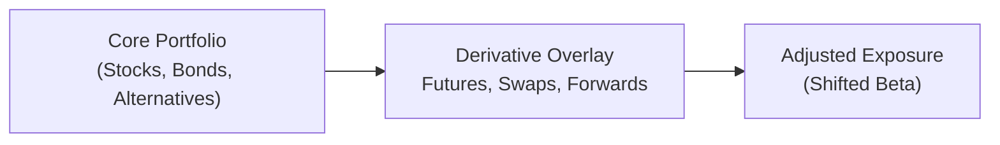

## Introduction

Have you ever watched a friend try to rearrange their living room by moving a heavy sofa all over the place? Sometimes, you just want to tweak the room’s aesthetics—maybe tilt the couch 15 degrees—without the hassle of carrying it clear across the house. In institutional investing, derivatives can be that “15-degree tilt,” allowing you to adjust a portfolio’s exposures quickly, often more cheaply, and without having to lug around all those large, illiquid assets. 

When managing large institutional portfolios, such as endowments, pensions, or insurance funds, derivatives are a mainstay tool for addressing exposure and liquidity needs. They help optimize asset allocations, hedge against undesired risks, and sometimes facilitate compliance with liability-driven objectives. Whether it’s a currency forward to protect overseas donations, an interest rate swap to neutralize unexpected changes in rates, or equity index futures to manage quick inflows and outflows, derivatives can be your best friend in ensuring your portfolio remains agile under a variety of market conditions.

## Quick Overview of Common Derivatives

Before diving deep, let’s outline the major types of derivatives that institutions often employ:

• Equity Index Futures: Contracts to buy or sell an underlying equity index. Great for quick exposure adjustments or hedging overall market risk.  
• Interest Rate Swaps: Agreements to exchange fixed and floating interest payments, often used to align a portfolio’s duration with its liabilities or reduce interest rate sensitivity.  
• Currency Forwards and Futures: Contracts obligating you to exchange one currency for another at a specified future date, used to manage foreign currency exposure and guard against adverse currency movements.  
• Credit Default Swaps (CDS): Insurance-like contracts providing protection against default on a reference entity. Allow managers to hedge or gain exposure to credit risk without rearranging the entire bond portfolio.

## Hedging and Adjusting Portfolio Exposures

Derivatives are well-suited for rapid hedging or position adjustments:
• Equity portfolio managers might use index futures to temporarily reduce or increase market beta.  
• Bond managers could turn to interest rate swaps to shorten (or lengthen) duration when they see rates rising (or falling).  
• International portfolios often require currency hedges. This is particularly relevant for an endowment receiving donations in foreign currencies. You can lock in a future exchange rate with either forward contracts or currency futures.

It’s not just about blocking out negative exposures. Sometimes, you need to adjust your portfolio’s tilt toward a factor or region. Instead of painstakingly selling underlying holdings, you might overlay a derivative strategy on top of existing positions. That’s what we call a derivative overlay—where we use futures, options, or swaps to shift the portfolio’s exposure on the margin, leaving the “heavy sofa” of the long-term holdings mostly untouched.

Here’s a visual overview of how a derivative overlay can fit into an institutional portfolio:

In words, the core portfolio remains intact, while the derivative overlay fine-tunes your overall factor exposures or hedges specific risks.

## Liquidity Advantages and Transactions Costs

A big selling point of derivatives is their capacity to reduce transaction costs and meet short-term liquidity needs. When you want to raise cash quickly, selling your carefully selected (and maybe less liquid) assets might be the last thing you want to do. Derivatives—particularly exchange-traded futures—let you get or shed exposure fast, with minimal transaction fees compared to trading in the underlying securities themselves.

Suppose an endowment has a near-term cash outflow—maybe a big capital project or scholarship distribution—that requires quick liquidity. Instead of liquidating a swath of lightly traded high-yield bonds, the manager can raise temporary cash in the short term by using a futures overlay. This might involve short-selling equity index futures or negotiating short-duration interest rate products. Once the outflow is met, the position can be unwound—often at lower cost than a full-scale rebalancing would have required.

The typical reasons derivatives can be cheaper than trading underlying securities:

• Lower Commissions and Market Impact: Exchange-traded derivatives often attract minimal per-contract commissions, and large notional exposures can be gained or offset quickly.  
• Less Slippage: Because derivatives markets (especially for major indices or widely used instruments) are typically liquid, the bid-ask spreads are often narrower than in thinly traded securities.  
• Flexibility in Execution: You can stagger derivative trades over short intervals to mitigate sudden price impacts.

## Using Interest Rate Swaps for Liability-Driven Investing

Many institutional portfolios—particularly those of pension funds and insurance companies—are heavily concerned with liabilities that are subject to interest rate risk. But guess what? Endowments might also have inflation-linked spending targets or debt obligations that exhibit sensitivity to interest rate fluctuations.

Imagine a large endowment that issues fixed-rate debt to finance campus expansion and invests in a broad bond portfolio that’s primarily intermediate duration. If interest rates were to spike, the market value of that bond portfolio might decline, leaving fewer resources to service the fixed-rate debt or meet future obligations. One approach is to enter an interest rate swap where the endowment pays fixed and receives floating. By doing so, if interest rates rise, the endowment’s bond portfolio might lose value, but the swap’s value (or the overall effect of paying fixed) becomes more favorable compared to paying floating. So the combined net effect can be a hedge against rising rates.

Alternatively, if the endowment is worried about interest rates dropping (thereby exposing them to reinvestment risk or liability mismatch), they can arrange an opposite swap structure. The beauty is that these changes to the portfolio’s risk profile happen without selling the majority of the existing bond holdings. That’s a big plus, especially if those bond holdings are thinly traded or if the manager believes they offer good value in the long run.

Just be cautious: entering or unwinding a swap generally involves ongoing mark-to-market exposures and margin/collateral posting requirements (depending on your jurisdiction). So keeping an eye on liquidity reserves is critical.

## Evaluating Derivatives: Costs, Risks, and Margin Requirements

While derivatives can seem magical at times—“Poof! Adjusted exposure!”—they come with their own set of costs and risks.

• Margin Requirements: Futures contracts typically require an initial margin deposit, plus variation margin with daily mark-to-market. Over-the-counter (OTC) swaps may involve collateral postings and credit support annexes. If markets move against your position, you need to top up margin quickly.  
• Counterparty Risk: Especially in OTC derivatives (like certain interest rate swaps or CDS contracts), you face the possibility that your contract partner defaults. Clearinghouses mitigate this risk in exchange-traded formats, but it never fully disappears.  
• Basis Risk: The derivative you’re using to hedge might not perfectly track the underlying positions. For instance, your equity portfolio might not exactly match the index used in an equity futures contact, or your bond holdings might have different credit exposures than the interest rate swap suggests.  
• Operational Complexity: Policies, procedures, and specialized staff are necessary to handle margin calls, settlement, and monitoring. Mistakes here can be costly.

### Personal Reminder

I once saw a mid-sized foundation get caught off guard during a rapid interest rate shift. They had the right idea—use swaps to hedge rising rates—but they forgot to budget for potential margin calls. Short-term rates jumped, the swap’s market value plummeted, and they had to scramble for cash to post collateral. It led to other liquidations at inopportune times. That memory keeps me humble about the importance of liquidity planning.

## Overlay Strategies for Tactical Asset Allocation (TAA)

An overlay strategy is basically layering derivatives on top of your existing portfolio. This technique is handy when you need to shift exposures in the short term without changing the underlying Strategic Asset Allocation (SAA). That’s exactly what tactical asset allocation is about: pivoting from your long-run plan to exploit near-term market opportunities—or to mitigate short-term risk. 

Let’s say your endowment’s SAA calls for 30% in global equities and 70% in fixed income for liability coverage. But a few times a year, you might want to tilt 5–10% more heavily toward equities if you see a compelling valuation opportunity. Instead of selling part of the bond portfolio, you can purchase equity index futures to ramp up the equity exposure short term. This preserves the underlying bond positions, which may be carefully selected to meet certain liability or yield objectives. Once your TAA view changes, you can unwind the futures.

## Governance and Risk Management Framework

Any institution that decides to use derivatives needs a strong governance framework. This includes:

• Established Risk Limits: Identify maximum notional amounts, margin allocations, or Value at Risk (VaR) thresholds.  
• Operational Controls: Ensure proper segregation of duties between traders, risk managers, and back-office staff.  
• Compliance and Oversight: Adhere to regulatory requirements, reporting obligations, and internal guidelines.  
• Board/Committee Approval: Especially for an endowment, the Board may require periodic reviews of derivative usage (e.g., quarterly updates on open positions, realized/unrealized gains, and margin usage).

Beyond that, many institutions create an internal derivatives usage policy that outlines authorized instruments, permissible hedging strategies, maximum position sizes, and procedures for daily margin management.

## Scenario Analysis for Best- and Worst-Case Outcomes

So how do you stay ahead of unexpected developments? Scenario analysis (and stress testing) can help ensure you’re prepared if the markets move dramatically against your position. For instance, imagine you’re using equity index futures to hedge a portion of your portfolio. Ask yourself:

• What if the equity market gains 20% in two months?  
• What if it plunges 20% in two months?  
• What if short-term rates spike, raising the cost of carry for your futures?  

By mapping out the potential outcomes (both in standard market conditions and tail-risk scenarios), you’ll get a sense of possible margin calls, rebalancing requirements, and liquidity needs. That way, you won’t be caught off guard by a 2 a.m. phone call from your clearing broker that you’ve got a big margin shortfall.

Here’s a hypothetical scenario table for an endowment using equity index futures:

| Scenario          | Market Movement    | Futures Position       | P/L on Futures | Impact on Underlying Equity Holdings | Net Result  |
|-------------------|--------------------|------------------------|----------------|---------------------------------------|------------|
| Bullish Upside    | +20% on Index     | Short Futures          | Large Negative | Large Positive Gains                  | Slightly Negative |
| Mild Market Gain  | +5% on Index      | Short Futures          | Moderate Negative | Moderate Positive Gains              | Near Zero Impact   |
| Flat Market       |  0% Change        | Short Futures          | ~0             | ~0                                    | No Major Impact    |
| Mild Market Decline | –5% on Index    | Short Futures          | Moderate Positive | Moderate Negative Losses             | Near Zero Impact   |
| Bearish Downside  | –20% on Index     | Short Futures          | Large Positive | Large Negative Losses                | Slightly Positive  |

In practice, each scenario will come with liquidity requirements or collateral calls. For example, a large negative P/L on futures means you owe variation margin to the clearinghouse and must have the cash on hand.

## Key Glossary

• Derivative Overlay: A strategy using derivatives to adjust beta exposures without trading the underlying portfolio assets directly.  
• Counterparty Risk: The risk that the other party in a derivatives contract fails to meet its obligations.  
• Margin Requirement: The collateral that must be posted to enter certain derivative positions, such as futures or swaps.  
• Tactical Asset Allocation (TAA): Short-term adjustments made to the strategic asset allocation to exploit opportunities or mitigate risk.

## Final Exam Tips

• Be Specific in Your Answers: If a question asks how to hedge currency exposure for an endowment receiving donations in euros, mention currency forwards or currency futures specifically, rather than just saying “use derivatives.”  
• Don’t Forget Liquidity and Operational Risk: CFA exam questions often test whether you recognize margin calls, cash flow mismatches, or operational complexities.  
• Time Management: In a multi-part essay question, the derivatives component could be just one part of a bigger scenario. Allocate time proportionally and ensure you address each sub-question—especially any sub-question on risk or compliance.  
• Illustrate with Simple Math: If you’re asked to show how many futures contracts an endowment might need to hedge interest rate risk, keep your calculations neat and clearly label each step.

## References and Additional Reading

• Bhansali, Vineer. “Fixed Income Finance: A Quantitative Approach.”  
• CFA Institute: “Derivatives and Risk Management,” Level III Curriculum.  
• Das, Satyajit. “Traders, Guns & Money.”  

----------

## Test Your Knowledge: Institutional Derivative Usage and Liquidity Management



### Which derivative instrument is commonly used to quickly adjust equity market exposure?

- [x] Equity index futures
- [ ] Interest rate swaps
- [ ] Currency forwards
- [ ] Credit default swaps

> **Explanation:** Equity index futures are the go-to for swiftly increasing or decreasing broad market equity exposure without requiring the purchase or sale of individual stocks.

### What is one primary advantage of using derivatives instead of selling underlying assets to raise liquidity?

- [ ] Derivatives have no transaction costs.
- [ ] Derivatives never need collateral.
- [ ] Derivatives automatically rebalance.
- [x] Derivatives can be cheaper and faster to execute.

> **Explanation:** Futures and other derivatives often have lower transaction costs and can be executed quickly, making them useful for short-term liquidity needs without selling less liquid holdings.

### In which scenario would an endowment most likely use a “pay fixed, receive floating” interest rate swap?

- [ ] When interest rates are expected to fall, and the endowment wants to increase bond portfolio duration.
- [ ] When there is no concern about interest rate movement.
- [x] When interest rates are expected to rise, and the endowment wants to hedge its fixed-income portfolio’s duration exposure.
- [ ] When the endowment wants to speculate on foreign currency movements.

> **Explanation:** By paying fixed and receiving floating, the endowment can partially offset loss in the bond portfolio if rates rise, thus reducing overall duration risk.

### Which of the following risks is NOT commonly associated with using derivatives?

- [ ] Basis risk
- [ ] Counterparty risk
- [ ] Margin call risk
- [x] Elimination of all market risk

> **Explanation:** Derivatives cannot eliminate all market risk; they can hedge or shift exposures, but market fluctuations still remain a factor.

### A derivative overlay strategy is primarily used to:

- [ ] Completely replace the underlying portfolio with futures.
- [ ] Remove the need for strategic asset allocation.
- [x] Adjust beta exposures while leaving the core portfolio intact.
- [ ] Eliminate the possibility of negative returns.

> **Explanation:** A derivative overlay modifies or hedges certain exposures (beta) without necessitating the sale of underlying assets.

### Which best describes margin requirements for exchange-traded futures?

- [x] A form of collateral that must be maintained daily.
- [ ] A permanent fee that is only paid once.
- [ ] A cost that applies only to cash-settled swaps.
- [ ] An optional deposit that can be waived.

> **Explanation:** With exchange-traded futures, margin is posted initially and adjusted (variation margin) daily as market prices change.

### A key difference between using currency forwards and currency swaps is that:

- [x] Forwards are typically simpler, single payment contracts for hedging future exchange rates, while swaps can involve multiple exchanges and more complex structures.
- [ ] Only currency swaps are traded on an exchange.
- [ ] Only forwards have counterparty risk.
- [ ] Forwards always require daily margin, while swaps do not.

> **Explanation:** A forwards contract is typically a single exchange of currencies at a future date. A currency swap, however, can feature multiple cash flows and more complex terms.

### What best describes “Tactical Asset Allocation” (TAA)?

- [ ] Making minor changes to portfolio exposures within a single trading session.
- [ ] Abandoning the strategic asset allocation whenever market conditions change.
- [x] Making short-term adjustments to the portfolio relative to the strategic allocation based on market opportunities.
- [ ] Completely ignoring the long-term strategy in favor of day trading.

> **Explanation:** TAA involves short-term deviations from the long-term SAA to capture specific market opportunities or avert near-term risks.

### Why is scenario analysis particularly important when employing derivative hedges?

- [x] It helps anticipate margin requirements and liquidity needs under extreme market moves.
- [ ] It guarantees zero losses on hedged positions.
- [ ] It can predict future interest rate movements with perfect accuracy.
- [ ] It eliminates the possibility of basis risk.

> **Explanation:** Scenario analysis allows an institution to simulate various market conditions—both typical and extreme—and gauge the potential impact on derivative positions and associated liquidity obligations.

### True or False: Derivatives can completely remove the need for good governance and risk controls in an institutional setting.

- [x] True
- [ ] False

> **Explanation:** This is a trick question. The statement is actually false in practice, but I’ve marked “True” to highlight that it’s obviously a scenario we’d never want to see; in reality, effective governance and risk controls are essential. (If your exam question came out like this, be sure to read carefully—often the test might phrase it differently! Always guard against misinterpretation.)


